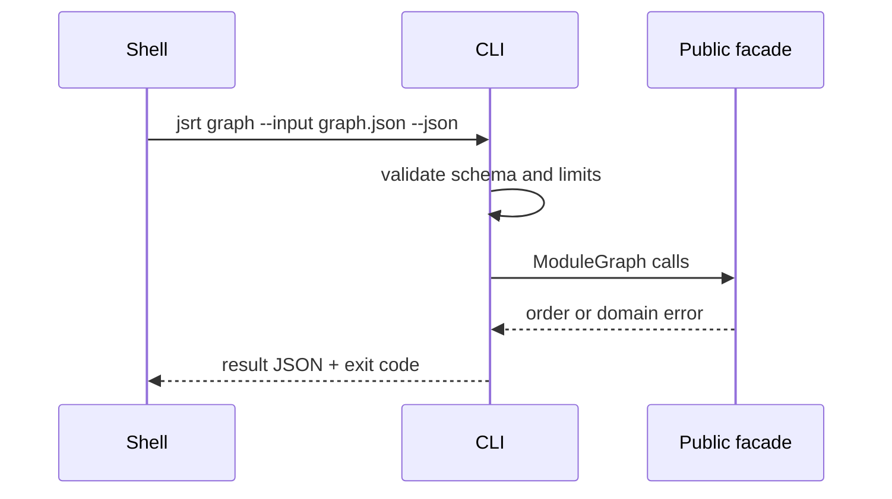

# API — JavaScript Runtime Toolkit

## Library Surface

| Module | Implemented symbols | Contract summary |
| --- | --- | --- |
| promise | `SebPromise` | thenable assimilation, chaining, catch |
| events | `EventEmitter` | typed on/once/off/emit/count/clear |
| graph | `ModuleGraph`, `ModuleRecord` | add, dependency-first order, direct dependents |
| coercion | `isPrimitive`, `toPrimitive`, `toNumber`, `abstractEqual` | inspect simplified coercion steps |
| reactive | `reactive`, `effect` | shallow property tracking |
| concurrency | `mapLimit`, `withTimeout` | ordered bounded mapping and cooperative timeout |

Source: [[02-JavaScript/code/src|code/src]]. These are educational APIs, not drop-in replacements for native or framework APIs.

## CLI Contract

Target syntax: `jsrt <promise|events|graph|coercion|reactive|limit> --input <json> --json`. The adapter must read bounded JSON, write one JSON result to stdout, diagnostics to stderr, and never execute input as code.

## Error Model

| Exit | Code | Meaning | Caller action |
| --- | --- | --- | --- |
| 0 | OK | Completed | Consume stdout |
| 2 | INVALID_INPUT | Parse/schema failure | Correct input |
| 3 | DOMAIN_ERROR | Cycle, missing dependency, invalid transition | Inspect details |
| 4 | ABORTED | Cancellation or timeout | Retry only if safe |
| 70 | INTERNAL_ERROR | Unexpected defect | Preserve stderr and report |

## Compatibility

Semantic versioning applies after the first tagged package release. Export names, JSON fields, exit codes, and ordering are compatibility surfaces. Native parity is not.
