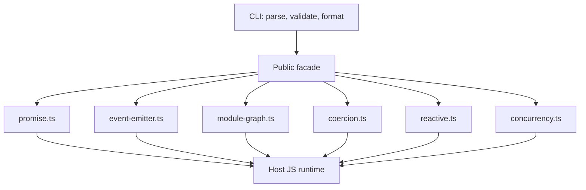
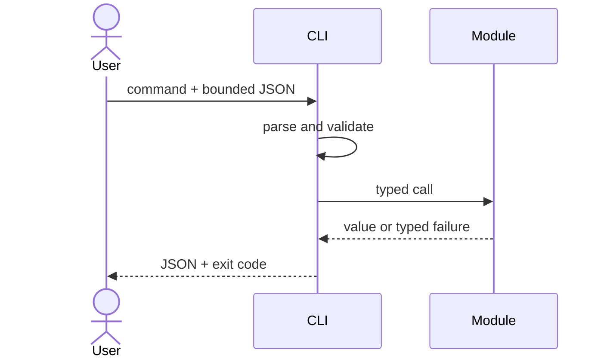

# Architecture — JavaScript Runtime Toolkit

## Summary

A modular monolith is the correct boundary: one package and CLI, six independent domain modules, no network services or persistent store. The CLI validates and serializes input; domain modules own behavior.

## Data Flow

## Key Components

| Component | Responsibility | Boundary |
| --- | --- | --- |
| Public facade | Stable exports and semantic versioning | No implementation policy |
| CLI adapter | Parsing, limits, JSON, exit codes | No domain logic |
| Six domain modules | Runtime-mechanism models | No I/O |
| Vitest suite | Behavioral and integration contracts | No private-state coupling |

## Quality Attributes

- Correctness: explicit ordering and settlement invariants; differential tests where native comparison is meaningful.
- Security: no `eval`, dynamic code execution, remote imports, or implicit filesystem access.
- Performance: O(V+E) graph traversal and bounded active async work; benchmarks gate only demonstrated regressions.
- Operability: structured stderr diagnostics; stdout remains machine-readable.

## Trade-offs

One package simplifies learning, versioning, and integration but couples releases. A thin CLI is less flexible than embedded APIs but provides reproducible demonstrations. Educational implementations maximize inspectability rather than conformance or peak performance.

## Decisions

- [[02-JavaScript/projects/JavaScript Runtime Toolkit/ADR/0001-package-boundary|ADR-0001: Package Boundary]]
- [[02-JavaScript/projects/JavaScript Runtime Toolkit/ADR/0002-async-contracts|ADR-0002: Async Contracts]]
