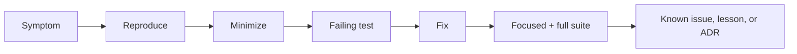

# Debug Diary — JavaScript Runtime Toolkit

## Investigation Index

| Date | Observation | Finding | Prevention | Status |
| --- | --- | --- | --- | --- |
| 2026-07-21 | Documentation requested a library/CLI while code currently exposes source modules | Integration boundary is not yet implemented; claiming runnable CLI would be false | Mark CLI as target, add package smoke and contract tests before claiming completion | tracked |

## Debug Protocol

Reproduce with the smallest input, capture Node/npm versions and exact command, classify contract versus implementation failure, add a failing test, then fix without weakening assertions. Preserve abort reasons, ordering traces, and graph fixtures when relevant.

Escalate release-impacting or repeated failures to [[02-JavaScript/projects/JavaScript Runtime Toolkit/Postmortem|Postmortem]].
