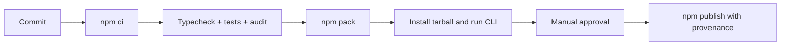

# Deployment — JavaScript Runtime Toolkit

## Environments

| Environment | Purpose | Promotion rule |
| --- | --- | --- |
| local | implementation and focused tests | clean install and suite pass |
| CI | reproducible multi-platform verification | required checks and package smoke test pass |
| npm release | immutable library/CLI artifact | reviewed tag, provenance, and manual approval |

## Release and Rollback

Build declarations, JavaScript, and source maps from [[02-JavaScript/code|02-JavaScript/code]]. Inspect tarball contents before publishing. Pin CI Node/npm versions and use least-privilege trusted publishing. npm versions are immutable: rollback means deprecating the bad version, restoring the last known-good recommendation, and publishing a corrected version.

## Checklist

- [ ] `npm ci` and `npm test` pass from a clean checkout.
- [ ] Typecheck and package smoke import pass on supported Node LTS platforms.
- [ ] Tarball excludes tests, journals, secrets, and local caches.
- [ ] Changelog, compatibility notes, integrity, and provenance are recorded.
