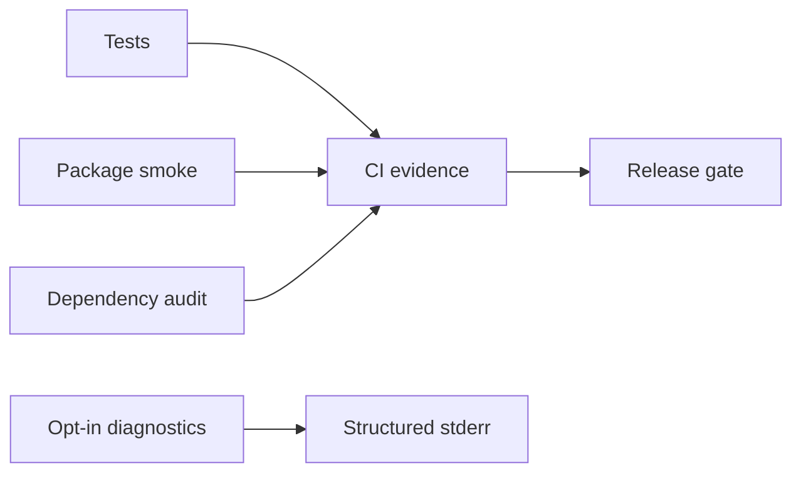

# Monitoring — JavaScript Runtime Toolkit

## Operability Model

This is a local library/CLI, not an always-on service; service availability SLOs would be misleading. Release health is measured through CI, package smoke tests, issue trends, and opt-in diagnostics.

| Signal | Target | Evidence |
| --- | --- | --- |
| Supported-platform verification | 100% required jobs pass | CI checks |
| Package smoke success | 100% before publish | tarball install/run |
| Deterministic CLI errors | 100% contract tests | exit-code suite |
| Critical dependency exposure | 0 unmitigated releasable findings | audit record |

## Diagnostics

Never emit telemetry by default. With an explicit debug flag, report command, duration bucket, input-size bucket, module, and stable error code; never report raw values, paths, environment variables, or stack traces to stdout.

## Triage

A reproducible wrong result or package import failure blocks release. Performance observations become regressions only against versioned benchmark fixtures. Link confirmed defects to [[02-JavaScript/projects/JavaScript Runtime Toolkit/Debug Diary|Debug Diary]] and [[02-JavaScript/projects/JavaScript Runtime Toolkit/Known Issues|Known Issues]].
