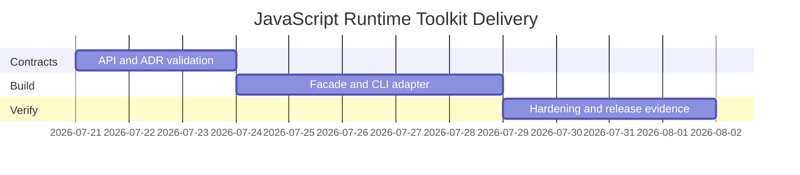

# Planning — JavaScript Runtime Toolkit

## Problem Statement

The existing labs are individually useful but lack a discoverable package surface, CLI workflow, compatibility contract, and release evidence suitable for a portfolio.

## Success Definition

Every capability is importable and demonstrable through stable contracts; a clean checkout installs and passes all tests; documentation states native gaps without implying engine conformance.

## Scope

In scope: package facade, CLI adapter, six modules, JSON contracts, tests, release artifact, security checks, and operational diagnostics. Out of scope: arbitrary code execution, framework rendering, remote modules, persistence, and engine internals.

## Milestones

| Milestone | Outcome | Exit criteria |
| --- | --- | --- |
| M1 Contracts | Public exports and CLI schemas fixed | ADRs accepted; contract tests fail for missing adapter |
| M2 Integration | Library and CLI vertical slice | Six commands pass positive and negative tests |
| M3 Hardening | Release-ready evidence | clean install, typecheck, tests, package audit, smoke test |

## Risks

| Risk | Impact | Mitigation |
| --- | --- | --- |
| Docs exceed implementation | Misleading portfolio | Mark current versus target contracts and test every claimed command |
| Native parity implied | Incorrect learning | Maintain explicit limitations and differential test boundaries |
| CLI accepts unsafe input | Resource exhaustion | Size, depth, item-count, and concurrency limits |

## Dependencies

Node.js with `queueMicrotask`, `Proxy`, and `AbortController`; npm; TypeScript; Vitest. See [[02-JavaScript/projects/JavaScript Runtime Toolkit/Roadmap|Roadmap]].
