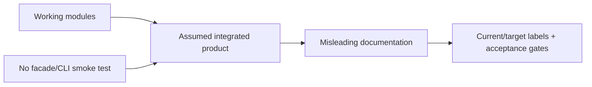

# Postmortem Index — JavaScript Runtime Toolkit

## Delivery Readiness Retrospective

| Date | Event | Severity | Status |
| --- | --- | --- | --- |
| 2026-07-21 | Portfolio scope exceeded the current package/CLI integration state | SEV-4 documentation risk | mitigated, follow-ups open |

## Impact

No released users were affected. The risk was portfolio documentation implying a runnable CLI and cohesive package that do not yet exist.

## Contributing Conditions

Core module tests made the implementation appear closer to distributable than it is; package exports, CLI contracts, clean-install checks, and artifact smoke tests are separate deliverables.

## Actions

- Require executable contract evidence before changing target wording to implemented.
- Gate releases on packed-artifact import and CLI smoke tests.
- Keep [[02-JavaScript/projects/JavaScript Runtime Toolkit/Known Issues|Known Issues]] visible from the README.

The review is blameless: the failure mode came from missing integration evidence, not individual action.
