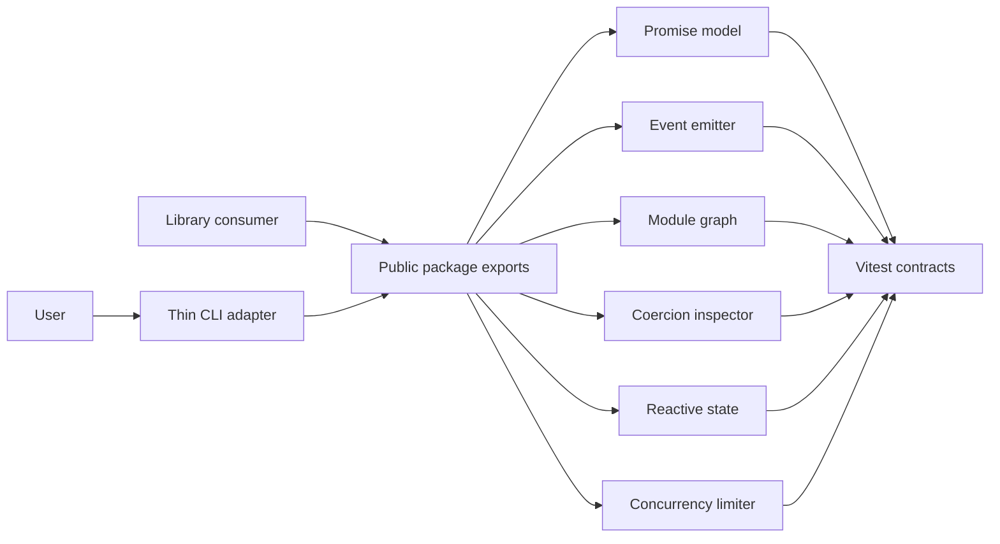

# JavaScript Runtime Toolkit

## One-Line Purpose

A tested TypeScript library and CLI learning surface that exposes selected JavaScript runtime mechanics: promise resolution, typed events, module graphs, coercion inspection, proxy reactivity, and bounded concurrency.

## Status

**Active.** Core modules and tests exist in [[02-JavaScript/code/src|02-JavaScript/code/src]] and [[02-JavaScript/code/tests/labs.test|labs.test.ts]]. Package-boundary and CLI integration are the active portfolio scope.

This toolkit is **not a JavaScript engine, ECMAScript implementation, bundler, production framework, or replacement for native platform APIs**. It is an inspectable educational model with explicit behavioral limits.

## Goals

- Present the six mechanisms through one versioned library boundary and a deterministic CLI.
- Preserve small modules that can be tested and reasoned about independently.
- Make errors, ordering, cancellation, and native-behavior gaps visible.
- Demonstrate production disciplines: contracts, security, tests, releases, and observability.

## Non-Goals

- Parsing or executing arbitrary JavaScript.
- Promises/A+, Node.js, browser, or ECMAScript conformance certification.
- Remote code loading, plugin execution, persistence, networking, or a UI framework.

## Architecture Snapshot



## Document Map

- [[02-JavaScript/projects/JavaScript Runtime Toolkit/Planning|Planning]] · [[02-JavaScript/projects/JavaScript Runtime Toolkit/Requirements|Requirements]] · [[02-JavaScript/projects/JavaScript Runtime Toolkit/Architecture|Architecture]]
- [[02-JavaScript/projects/JavaScript Runtime Toolkit/API|API]] · [[02-JavaScript/projects/JavaScript Runtime Toolkit/Testing|Testing]] · [[02-JavaScript/projects/JavaScript Runtime Toolkit/Security|Security]]
- [[02-JavaScript/projects/JavaScript Runtime Toolkit/Deployment|Deployment]] · [[02-JavaScript/projects/JavaScript Runtime Toolkit/Monitoring|Monitoring]] · [[02-JavaScript/projects/JavaScript Runtime Toolkit/Roadmap|Roadmap]]
- [[02-JavaScript/projects/JavaScript Runtime Toolkit/Engineering Journal|Engineering Journal]] · [[02-JavaScript/projects/JavaScript Runtime Toolkit/Debug Diary|Debug Diary]]
- [[02-JavaScript/projects/JavaScript Runtime Toolkit/Known Issues|Known Issues]] · [[02-JavaScript/projects/JavaScript Runtime Toolkit/Lessons Learned|Lessons Learned]]
- [[02-JavaScript/projects/JavaScript Runtime Toolkit/Ideas|Ideas]] · [[02-JavaScript/projects/JavaScript Runtime Toolkit/Postmortem|Postmortem]]
- [[02-JavaScript/projects/JavaScript Runtime Toolkit/ADR/0001-package-boundary|ADR-0001]] · [[02-JavaScript/projects/JavaScript Runtime Toolkit/ADR/0002-async-contracts|ADR-0002]]

## Run and Test

```bash
cd 02-JavaScript/code
npm install
npm test
```

The documented CLI target is `jsrt <command> --json`; until its adapter is added under `02-JavaScript/code`, use the imported TypeScript APIs described in [[02-JavaScript/projects/JavaScript Runtime Toolkit/API|API]].

## Portfolio Acceptance Checklist

- [ ] All six capabilities are exported from one documented package boundary.
- [ ] CLI output is deterministic JSON and errors use stable non-zero exit codes.
- [ ] Unit and integration tests cover happy paths, edge cases, ordering, and cancellation.
- [ ] Package contains source maps and declarations and excludes test fixtures.
- [ ] Security and monitoring checks pass before a tagged release.
