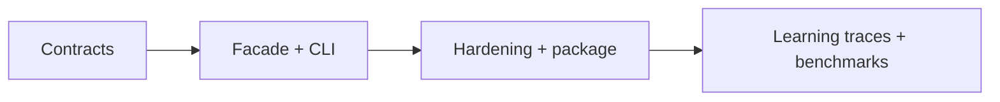

# Roadmap — JavaScript Runtime Toolkit

## Current Phase

P0 contract and integration design is active. Core educational modules exist; distributable product boundaries do not.

| Phase | Outcome | Exit criteria |
| --- | --- | --- |
| P0 | Truthful contracts and decisions | requirements, API, security, tests, ADRs reviewed |
| P1 | Integrated vertical slice | six exports and six CLI commands pass contracts |
| P2 | Release-ready artifact | CI matrix, audit, tarball smoke, docs match behavior |
| P3 | Evidence-led enhancements | trace/benchmark work justified by measured learning need |

## Now

Define facade exports, CLI JSON schemas, resource ceilings, error codes, and missing module tests.

## Next

Implement the adapter in `02-JavaScript/code`, then add clean-install and packed-artifact checks.

## Later

Evaluate trace mode, property-based testing, and visualization from [[02-JavaScript/projects/JavaScript Runtime Toolkit/Ideas|Ideas]]. Do not add engine or framework scope.
