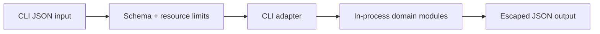

# Security — JavaScript Runtime Toolkit

## Trust Boundaries

## Threat Model

| Threat | Example | Control |
| --- | --- | --- |
| Code execution | input treated as JavaScript | parse JSON only; forbid `eval`, `Function`, VM |
| Resource exhaustion | huge graph or concurrency | byte, depth, node, edge, item, and concurrency caps |
| Prototype pollution | dangerous object keys | use validated records/Maps; reject unsafe keys where objects are built |
| Terminal injection | control characters in errors | JSON escaping and structured diagnostics |
| Supply-chain compromise | malicious dependency/update | lockfile, review, audit, provenance, minimal dependencies |

## Controls

The package needs no credentials, network access, filesystem writes, or authentication. Abort and timeout are cooperative controls, not isolation. The toolkit must never claim safe execution of arbitrary modules because it does not execute modules at all.

## Security Acceptance

- Negative tests cover malformed, oversized, deeply nested, cyclic, and aborted inputs.
- Dependency audit findings are triaged by exploitability, not blindly suppressed.
- Release token scope is publish-only and unavailable to pull-request jobs.
- Security limitations link to [[02-JavaScript/projects/JavaScript Runtime Toolkit/Known Issues|Known Issues]] and [[02-JavaScript/projects/JavaScript Runtime Toolkit/Postmortem|Postmortem]].
