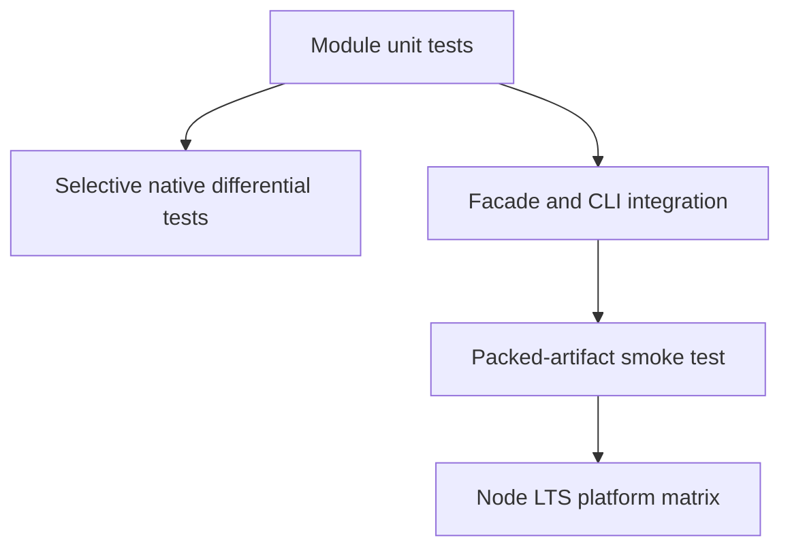

# Testing — JavaScript Runtime Toolkit

## Strategy



## Test Layers

| Layer | Coverage |
| --- | --- |
| Unit | state transitions, listener mutation, DFS errors, coercion hooks, tracking, worker bounds |
| Property/model | graph invariants, once-only settlement, output order |
| Differential | only overlapping native behavior; documented deviations remain explicit |
| Integration | exports, JSON schemas, stderr/stdout separation, exit codes |
| Package | install tarball, import ESM, invoke executable |

## Current Command

```bash
cd 02-JavaScript/code
npm install
npm test
```

Current executable coverage is [[02-JavaScript/code/tests/labs.test|labs.test.ts]]. Required additions include `withTimeout`, branch cleanup limitations, full graph error paths, hostile thenables, coercion symbols/bigints, and future CLI contracts.

## Definition of Done

Tests assert failure modes and observable ordering, use fake time where appropriate, clean listeners/timers, and pass repeatedly without network or wall-clock dependence. Coverage percentage cannot replace invariant-oriented cases.
