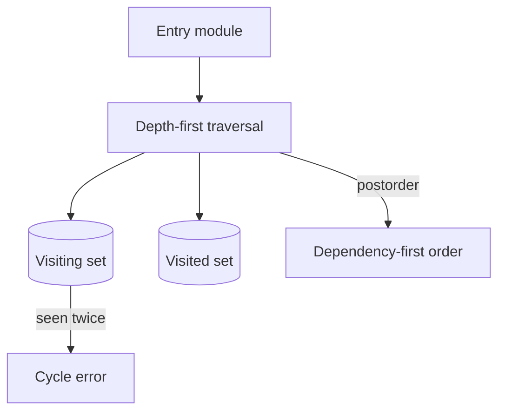

# Architecture — Module Loader Lab

## Summary

The lab isolates one runtime mechanism behind a small typed API. Source of truth: [[02-JavaScript/code/src/module-graph.ts|module-graph.ts]]. Tests call public behavior rather than private state.

## Component and Data Flow

## Invariants

- Duplicate module IDs are rejected.
- Dependencies appear before dependents in load order.
- Unknown entries and missing dependencies produce distinct errors.
- Cycles terminate with a useful module ID instead of recursing forever.

## Failure Model

Invalid input fails synchronously where validation is possible. Runtime failures propagate through the API's explicit error channel; no failure is silently logged or swallowed. Callers remain responsible for resource cleanup outside this in-memory component.

## Complexity and Ownership

The component owns only transient in-process state. It performs no file, network, process, or database I/O. Complexity should be assessed against input size and registered dependencies/listeners/tasks, then verified before production reuse.

## Trade-offs and Native Gaps

| Gap | Engineering consequence |
| --- | --- |
| 1 | This is a graph planner, not an ECMAScript parser, resolver, linker, evaluator, or cache. |
| 2 | It does not model live bindings, dynamic import, top-level await, package exports, or CommonJS. |
| 3 | Ordering among independent dependencies follows insertion order rather than a standardized loader algorithm. |

DFS postorder is compact and linear in vertices plus edges, but the first cycle error does not report the full strongly connected component.

## Evolution Rules

- Preserve current observable ordering unless a versioned contract documents a change.
- Add a failing test in [[02-JavaScript/code/tests/labs.test|labs.test.ts]] before fixing a discovered edge case.
- Do not claim standards compliance without running the relevant conformance suite.
- Keep production concerns such as telemetry, cancellation, and resource limits explicit.

## Related Documents

- [[02-JavaScript/projects/Module Loader Lab/README|Project README]]
- [[02-JavaScript/projects/JavaScript Runtime Toolkit/Architecture|Toolkit Architecture]]
- [[02-JavaScript/projects/JavaScript Runtime Toolkit/Testing|Toolkit Testing]]
