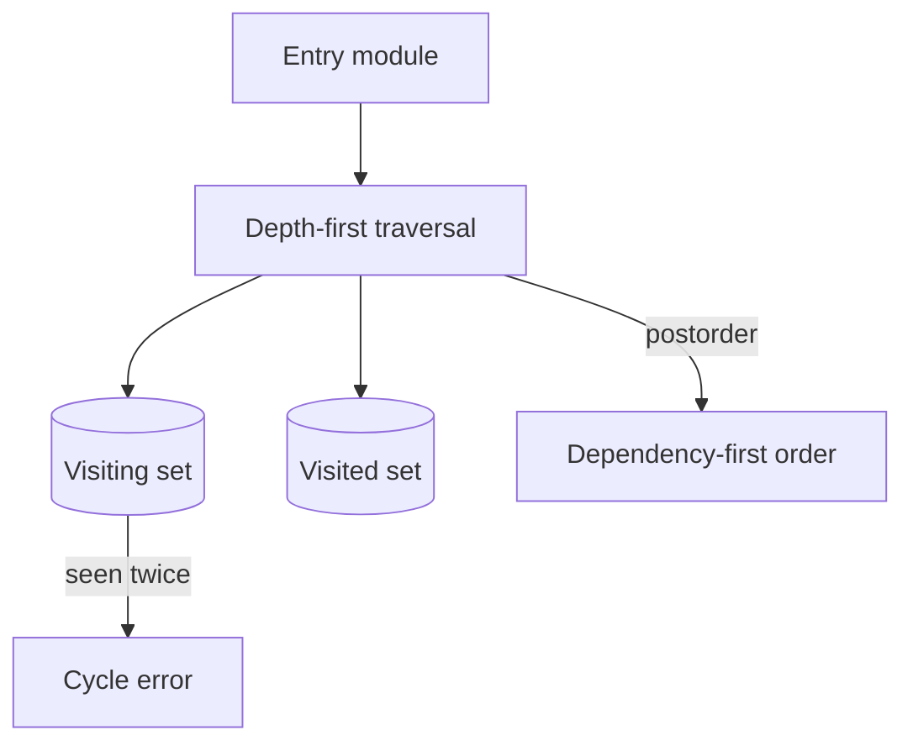

# Module Loader Lab

## One-Line Purpose

Model dependency registration and deterministic dependency-first ordering while making missing modules and cycles explicit.

## Status

**Active.** The implementation lives in [[02-JavaScript/code/src/module-graph.ts|module-graph.ts]] and its executable checks live in [[02-JavaScript/code/tests/labs.test|labs.test.ts]].

## Prerequisites

directed graphs, depth-first search, sets, and [[02-JavaScript/04-Engines-and-Memory/Parsing AST and Bytecode|Parsing, AST and Bytecode]].

## Architecture



The public learning surface is `ModuleGraph` and `ModuleRecord`. Read [[02-JavaScript/projects/Module Loader Lab/Architecture|Architecture]] before extending behavior.

## Acceptance Criteria

- [ ] Duplicate module IDs are rejected.
- [ ] Dependencies appear before dependents in load order.
- [ ] Unknown entries and missing dependencies produce distinct errors.
- [ ] Cycles terminate with a useful module ID instead of recursing forever.

## Run and Test

From the repository root:

```bash
cd 02-JavaScript/code
npm install
npm test -- tests/labs.test.ts -t "ModuleGraph"
```

Run the complete JavaScript lab suite with `npm test`. Keep experiments in `02-JavaScript/code`; this directory contains documentation, not a second implementation.

## Limitations Versus Native Behavior

- This is a graph planner, not an ECMAScript parser, resolver, linker, evaluator, or cache.
- It does not model live bindings, dynamic import, top-level await, package exports, or CommonJS.
- Ordering among independent dependencies follows insertion order rather than a standardized loader algorithm.

## Production Trade-off

DFS postorder is compact and linear in vertices plus edges, but the first cycle error does not report the full strongly connected component.

## Exercises and Reflection

1. Return the complete cycle path.
2. Add deterministic alphabetical ordering as an opt-in policy.
3. Implement transitive dependents for incremental rebuilds.

Reflect: identify one invariant the tests prove, one they do not prove, and one production failure mode hidden by the lab's small scale.

## Interview Questions

- Why are ES module bindings called live?
- How does top-level await change graph evaluation?

## Related Notes

- [[02-JavaScript/projects/Module Loader Lab/Architecture|Architecture]]
- [[02-JavaScript/projects/JavaScript Runtime Toolkit/README|JavaScript Runtime Toolkit]]
- [[02-JavaScript/code/tests/labs.test|JavaScript lab tests]]
