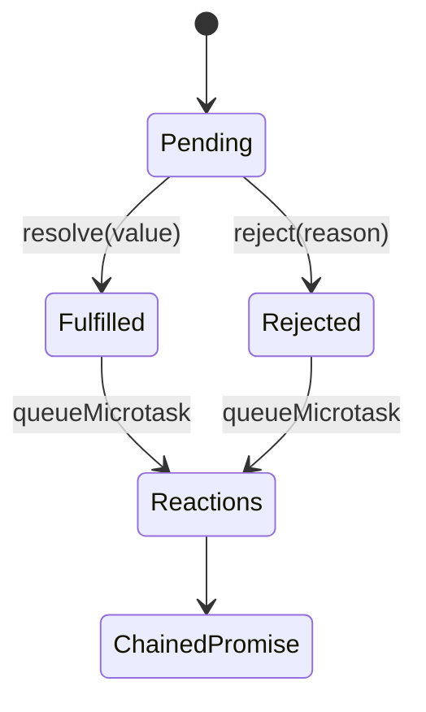

# Architecture — Promise From Scratch

## Summary

The lab isolates one runtime mechanism behind a small typed API. Source of truth: [[02-JavaScript/code/src/promise.ts|promise.ts]]. Tests call public behavior rather than private state.

## Component and Data Flow

## Invariants

- The executor runs synchronously and only its first resolve or reject call wins.
- Handlers run in a later microtask and `then` returns a distinct promise.
- Thenables are assimilated; self-resolution and throwing accessors reject.
- Missing handlers preserve fulfillment or rejection through a chain.

## Failure Model

Invalid input fails synchronously where validation is possible. Runtime failures propagate through the API's explicit error channel; no failure is silently logged or swallowed. Callers remain responsible for resource cleanup outside this in-memory component.

## Complexity and Ownership

The component owns only transient in-process state. It performs no file, network, process, or database I/O. Complexity should be assessed against input size and registered dependencies/listeners/tasks, then verified before production reuse.

## Trade-offs and Native Gaps

| Gap | Engineering consequence |
| --- | --- |
| 1 | No `finally`, `all`, `allSettled`, `any`, or `race` combinators. |
| 2 | Not validated by the official Promises/A+ compliance suite. |
| 3 | No host-level unhandled-rejection tracking or native species/subclass behavior. |

Using `queueMicrotask` closely models reaction ordering, but native promises integrate with engine job queues and rejection reporting in ways userland code cannot reproduce.

## Evolution Rules

- Preserve current observable ordering unless a versioned contract documents a change.
- Add a failing test in [[02-JavaScript/code/tests/labs.test|labs.test.ts]] before fixing a discovered edge case.
- Do not claim standards compliance without running the relevant conformance suite.
- Keep production concerns such as telemetry, cancellation, and resource limits explicit.

## Related Documents

- [[02-JavaScript/projects/Promise From Scratch/README|Project README]]
- [[02-JavaScript/projects/JavaScript Runtime Toolkit/Architecture|Toolkit Architecture]]
- [[02-JavaScript/projects/JavaScript Runtime Toolkit/Testing|Toolkit Testing]]
