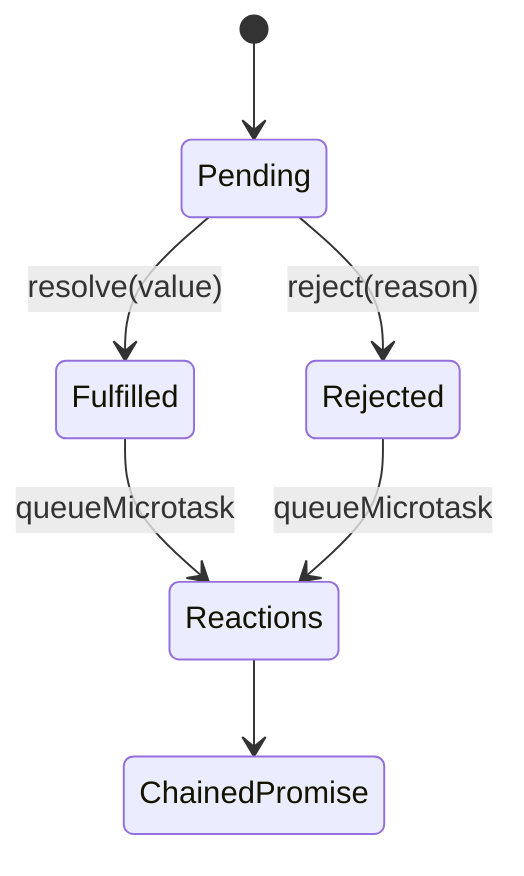

# Promise From Scratch

## One-Line Purpose

Implement a small Promises/A+-inspired state machine to understand settlement, thenable assimilation, microtask scheduling, chaining, and error propagation.

## Status

**Active.** The implementation lives in [[02-JavaScript/code/src/promise.ts|promise.ts]] and its executable checks live in [[02-JavaScript/code/tests/labs.test|labs.test.ts]].

## Prerequisites

[[02-JavaScript/03-Asynchronous-JavaScript/Promises|Promises]], the event loop, TypeScript generics, and error handling.

## Architecture



The public learning surface is `SebPromise`. Read [[02-JavaScript/projects/Promise From Scratch/Architecture|Architecture]] before extending behavior.

## Acceptance Criteria

- [ ] The executor runs synchronously and only its first resolve or reject call wins.
- [ ] Handlers run in a later microtask and `then` returns a distinct promise.
- [ ] Thenables are assimilated; self-resolution and throwing accessors reject.
- [ ] Missing handlers preserve fulfillment or rejection through a chain.

## Run and Test

From the repository root:

```bash
cd 02-JavaScript/code
npm install
npm test -- tests/labs.test.ts -t "SebPromise"
```

Run the complete JavaScript lab suite with `npm test`. Keep experiments in `02-JavaScript/code`; this directory contains documentation, not a second implementation.

## Limitations Versus Native Behavior

- No `finally`, `all`, `allSettled`, `any`, or `race` combinators.
- Not validated by the official Promises/A+ compliance suite.
- No host-level unhandled-rejection tracking or native species/subclass behavior.

## Production Trade-off

Using `queueMicrotask` closely models reaction ordering, but native promises integrate with engine job queues and rejection reporting in ways userland code cannot reproduce.

## Exercises and Reflection

1. Add `finally` without changing value propagation.
2. Implement `all` with stable result ordering and early rejection.
3. Design adversarial thenables and explain the once-only guard.

Reflect: identify one invariant the tests prove, one they do not prove, and one production failure mode hidden by the lab's small scale.

## Interview Questions

- Why must `then` return a new promise?
- What breaks if reactions execute synchronously?

## Related Notes

- [[02-JavaScript/projects/Promise From Scratch/Architecture|Architecture]]
- [[02-JavaScript/projects/JavaScript Runtime Toolkit/README|JavaScript Runtime Toolkit]]
- [[02-JavaScript/code/tests/labs.test|JavaScript lab tests]]
