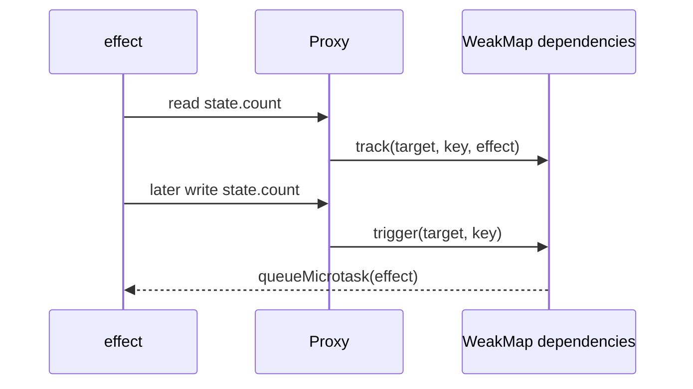

# Architecture — Reactive State with Proxy

## Summary

The lab isolates one runtime mechanism behind a small typed API. Source of truth: [[02-JavaScript/code/src/reactive.ts|reactive.ts]]. Tests call public behavior rather than private state.

## Component and Data Flow

## Invariants

- An effect runs immediately and records properties read through the proxy.
- Changing a tracked property schedules the effect asynchronously.
- Writing an `Object.is`-equal value does not rerun effects.
- Dependency storage does not strongly retain target objects.

## Failure Model

Invalid input fails synchronously where validation is possible. Runtime failures propagate through the API's explicit error channel; no failure is silently logged or swallowed. Callers remain responsible for resource cleanup outside this in-memory component.

## Complexity and Ownership

The component owns only transient in-process state. It performs no file, network, process, or database I/O. Complexity should be assessed against input size and registered dependencies/listeners/tasks, then verified before production reuse.

## Trade-offs and Native Gaps

| Gap | Engineering consequence |
| --- | --- |
| 1 | Tracking is shallow; nested objects are not automatically proxied. |
| 2 | Stale dependencies are not cleaned when an effect changes branches. |
| 3 | No batching, computed values, disposal, collection handlers, or infinite-loop protection. |
| 4 | Proxy invariants and framework rendering concerns remain the host's responsibility. |

Microtask scheduling avoids re-entrant writes, but repeated writes can queue duplicate runs because this lab intentionally has no scheduler-level deduplication.

## Evolution Rules

- Preserve current observable ordering unless a versioned contract documents a change.
- Add a failing test in [[02-JavaScript/code/tests/labs.test|labs.test.ts]] before fixing a discovered edge case.
- Do not claim standards compliance without running the relevant conformance suite.
- Keep production concerns such as telemetry, cancellation, and resource limits explicit.

## Related Documents

- [[02-JavaScript/projects/Reactive State with Proxy/README|Project README]]
- [[02-JavaScript/projects/JavaScript Runtime Toolkit/Architecture|Toolkit Architecture]]
- [[02-JavaScript/projects/JavaScript Runtime Toolkit/Testing|Toolkit Testing]]
