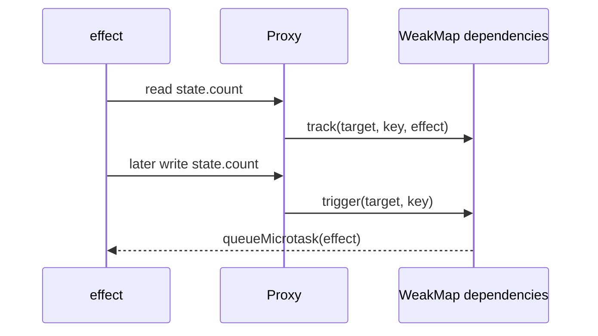

# Reactive State with Proxy

## One-Line Purpose

Implement property-level dependency tracking with `Proxy`, `Reflect`, `WeakMap`, and microtask-scheduled effects.

## Status

**Active.** The implementation lives in [[02-JavaScript/code/src/reactive.ts|reactive.ts]] and its executable checks live in [[02-JavaScript/code/tests/labs.test|labs.test.ts]].

## Prerequisites

closures, `Proxy`, `Reflect`, weak collections, microtasks, and object identity.

## Architecture



The public learning surface is `reactive` and `effect`. Read [[02-JavaScript/projects/Reactive State with Proxy/Architecture|Architecture]] before extending behavior.

## Acceptance Criteria

- [ ] An effect runs immediately and records properties read through the proxy.
- [ ] Changing a tracked property schedules the effect asynchronously.
- [ ] Writing an `Object.is`-equal value does not rerun effects.
- [ ] Dependency storage does not strongly retain target objects.

## Run and Test

From the repository root:

```bash
cd 02-JavaScript/code
npm install
npm test -- tests/labs.test.ts -t "reactivity"
```

Run the complete JavaScript lab suite with `npm test`. Keep experiments in `02-JavaScript/code`; this directory contains documentation, not a second implementation.

## Limitations Versus Native Behavior

- Tracking is shallow; nested objects are not automatically proxied.
- Stale dependencies are not cleaned when an effect changes branches.
- No batching, computed values, disposal, collection handlers, or infinite-loop protection.
- Proxy invariants and framework rendering concerns remain the host's responsibility.

## Production Trade-off

Microtask scheduling avoids re-entrant writes, but repeated writes can queue duplicate runs because this lab intentionally has no scheduler-level deduplication.

## Exercises and Reflection

1. Add effect disposal and dependency cleanup.
2. Cache nested proxies by target identity.
3. Implement a deduplicating scheduler and test write bursts.

Reflect: identify one invariant the tests prove, one they do not prove, and one production failure mode hidden by the lab's small scale.

## Interview Questions

- Why use a `WeakMap` for target keys?
- Which Proxy invariants can a set trap violate?

## Related Notes

- [[02-JavaScript/projects/Reactive State with Proxy/Architecture|Architecture]]
- [[02-JavaScript/projects/JavaScript Runtime Toolkit/README|JavaScript Runtime Toolkit]]
- [[02-JavaScript/code/tests/labs.test|JavaScript lab tests]]
