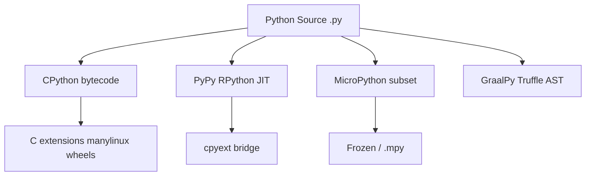
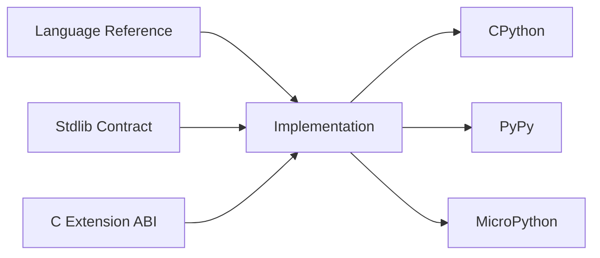
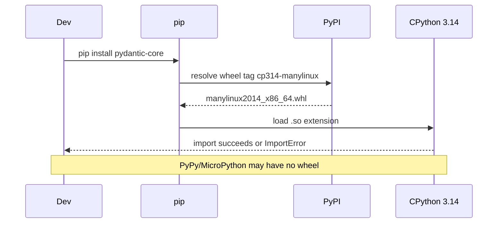

# CPython Alternatives and Portability

## Overview

**CPython** is the reference implementation of Python: C source, bytecode interpreter, C-API, and the runtime that defines de facto semantics for most libraries on PyPI. **Alternate implementations**—PyPy, MicroPython, GraalPy, Jython, IronPython, RustPython—target different constraints: JIT speed, embedded flash/RAM, JVM/.NET interop, or experimental language research.

Portable Python code depends on the **language reference** and documented stdlib behavior. Production code must additionally declare **which interpreter**, **which version (3.14+)**, **which platform ABI**, and **which extension modules** are supported—because `pip install numpy` on CPython does not imply availability on MicroPython.

This note maps the implementation landscape, compatibility layers (PEP 384 stable ABI, limited API), and failure modes when teams assume "Python is Python."

## Learning Objectives

- Name major Python implementations and their primary optimization targets
- Distinguish **language**, **stdlib subset**, **C-API extensions**, and **wheel tags**
- Explain why PyPy can be faster yet still lose to CPython on C-extension-heavy workloads
- Choose MicroPython vs CPython for embedded constraints
- Write compatibility notes for libraries targeting CPython 3.14+ with graceful degradation

## Prerequisites

- [[03-Python/00-Orientation/Why Python Exists|Why Python Exists]]
- [[01-Computer-Science/08-Languages-and-Computation/Compilers Interpreters and Virtual Machines|Compilers Interpreters and Virtual Machines]]

## Difficulty

`intermediate`

## Estimated Time

- Reading: 2–3 hours
- Exercises: 3 hours
- Mini project: 4 hours

## History

CPython shipped with Python 0.9.0 (1991). **Jython** (1997) and **IronPython** (2006) integrated with JVM and CLR. **PyPy** began as a Python interpreter written in Python, migrating to the **RPython** translation toolchain with tracing JIT (2007+). **MicroPython** (2013) brought a subset to microcontrollers. **GraalPy** (GraalVM, 2022+) compiles Python via Truffle for polyglot JVM deployments. CPython 3.13+ added optional **free-threaded** builds; PyPy and others track subsets of 3.x at varying pace.

## Problem It Solves

Teams hit portability cliffs:

- CI passes on CPython 3.14 but production uses an older corporate LTS
- `cryptography` wheel missing for exotic platform tag
- Library uses `ctypes`/`cffi` assumptions tied to CPython object layout
- Edge device runs MicroPython without `asyncio` or full `str` methods

Explicit implementation targeting prevents silent breakage and sets performance expectations.

## Internal Implementation

### CPython (baseline)

- Bytecode loop + adaptive specialization (3.11+)
- Reference counting + generational GC
- GIL in default builds; optional free-threaded (3.13+)
- Extension modules: full C-API, limited API, stable ABI (PEP 384)

### PyPy

- RPython-generated VM with **tracing JIT**
- **cpyext**: emulates C-API; overhead can negate speedups for heavy C extensions
- Different GC (no refcount on all objects internally in the same way)
- Often 2–10× faster on pure Python loops; may lose on NumPy/Pandas call-heavy paths unless using PyPy-compatible builds

### MicroPython

- Subset language + subset stdlib
- Custom object model sized for constrained RAM
- `uasyncio`, frozen modules, `.mpy` bytecode
- No full CPython C-API

### GraalPy

- Runs on GraalVM; interop with Java
- JIT + partial native image options (deployment-dependent)
- Extension compatibility evolving; not drop-in for all scientific stack



## Mermaid Diagrams

### Structure: portability layers



Pure Python libraries anchor on **Spec + Stdlib**. Scientific stack anchors on **CAPI + wheel tags**.

### Sequence: installing a native dependency



## Examples

### Minimal Example

Detect runtime without assuming CPython:

```python
import platform
import sys

def runtime_profile() -> dict[str, str]:
    impl = platform.python_implementation()  # CPython, PyPy, ...
    return {
        "implementation": impl,
        "version": sys.version.split()[0],
        "free_threaded": bool(getattr(sys, "_is_gil_enabled", lambda: True)() is False),
        "platform": sys.platform,
    }

print(runtime_profile())
# CPython 3.14+: check sys._is_gil_enabled() when documenting concurrency
```

### Production-Shaped Example

Library feature gate for optional native acceleration:

```python
from __future__ import annotations

import platform
from typing import Protocol

class Hasher(Protocol):
    def digest(self, data: bytes) -> bytes: ...


def _cpython_accelerated() -> Hasher | None:
    if platform.python_implementation() != "CPython":
        return None
    try:
        from mypkg import _native_hash  # C extension, cp314 tag
    except ImportError:
        return None
    return _native_hash.Hasher()


def hasher() -> Hasher:
    native = _cpython_accelerated()
    if native is not None:
        return native
    from mypkg._pure import PureHasher
    return PureHasher()


def hash_payload(payload: bytes) -> bytes:
    return hasher().digest(payload)
```

Document supported matrix in README: CPython 3.14+ x86_64/aarch64; pure fallback elsewhere.

See [[03-Python/code/README|Python code labs]] for implementation detection utilities.

## Trade-offs

| Dimension | CPython | PyPy | MicroPython | GraalPy |
| --- | --- | --- | --- | --- |
| Ecosystem | Full PyPI | Good; ext gaps | Tiny subset | Selective |
| Startup | Moderate | Higher JIT warm-up | Fast | JVM dependent |
| Throughput pure Python | Baseline | Often higher | Lower | JIT potential |
| C extensions | Native | cpyext cost | Limited | Varies |
| Use case | Default prod | CPU-bound pure code | MCU/IoT | JVM polyglot |

### When to Use

- **CPython 3.14+**: default for services, data, ML tooling, most libraries
- **PyPy**: long-running CPU-bound pure Python (simulations, parsers) after benchmarking
- **MicroPython**: sensors, actuators, hard RAM/flash caps
- **GraalPy**: Python embedded in existing GraalVM/Java org standards

### When Not to Use

- Do not assume PyPy speedup without profiling C-extension share
- Do not deploy MicroPython for full web frameworks expecting CPython stdlib
- Do not mix stable ABI extensions across major versions without testing

## Exercises

1. Print `sys.version`, `platform.python_implementation()`, and `sys.implementation` on your interpreter; explain each field.
2. Install the same pure-Python package on CPython and (if available) PyPy; compare import time and RSS.
3. Read a PyPI wheel filename (e.g., `cp314-cp314-manylinux_2_17_x86_64.whl`) and label each tag.
4. List five stdlib modules missing or different in MicroPython docs.
5. Write a `pyproject.toml` `requires-python = ">=3.14"` justification comment for your team.

## Mini Project

**Compatibility Matrix Generator**

CLI that imports your package, probes optional dependencies, detects implementation/version/platform, and emits a Markdown compatibility table for CI artifacts.

## Portfolio Project

Add an **Implementation Probe** panel to [[03-Python/projects/Python Runtime Toolkit/README|Python Runtime Toolkit]] showing GIL status, allocator stats (CPython-only), and extension module load paths.

## Interview Questions

1. What is the difference between Python the language and CPython?
2. Why can PyPy be faster than CPython yet slower on NumPy-heavy code?
3. What does `manylinux` mean on a wheel file?
4. When would you choose MicroPython over CPython?
5. What is PEP 384 stable ABI trying to solve?

### Stretch / Staff-Level

1. Design a CI matrix for a library with optional Rust extension + pure Python fallback.
2. Explain how free-threaded CPython affects extension authors vs PyPy's GIL model historically.

## Common Mistakes

- Testing only on developer laptops (macOS arm64) while prod is Linux x86_64
- Using `ctypes` structure layout assuming CPython memory representation
- Shipping `python_requires` loose but importing 3.14+ syntax unconditionally
- Ignoring `ImportError` for accelerators without tested fallback

## Best Practices

- Declare `requires-python` and classifiers in package metadata
- Publish wheels for target ABIs or document source-only builds
- Feature-detect; avoid version string parsing for behavior gates when possible
- Benchmark on **production-like** interpreter builds (free-threaded flag matters)
- Cross-link CS VM note: [[01-Computer-Science/08-Languages-and-Computation/Compilers Interpreters and Virtual Machines|Compilers Interpreters and Virtual Machines]]

## Summary

CPython is the default Python runtime for production, but the name "Python" spans multiple VMs with different stdlib subsets, extension ABIs, and performance profiles. Portable code honors the language reference; reliable operations honor **interpreter version, platform tags, and native dependencies**. PyPy, MicroPython, and GraalPy are valuable when their constraints match the problem—never as silent drop-in assumptions.

## Further Reading

- [[00-References/Python/README|Python References]]
- PyPy documentation — cpyext and performance FAQ
- MicroPython documentation — differences from CPython
- PEP 384 — Stable Application Binary Interface
- [[03-Python/05-CPython-Runtime-and-Memory/C API Extension Boundary and Stable ABI|C API Extension Boundary and Stable ABI]]

## Related Notes

- [[03-Python/00-Orientation/Why Python Exists|Why Python Exists]]
- [[03-Python/00-Orientation/Python Program Lifecycle|Python Program Lifecycle]]
- [[03-Python/05-CPython-Runtime-and-Memory/Reference Counting and Immortal Objects|Reference Counting and Immortal Objects]]
- [[03-Python/07-Async-Concurrency-and-Free-Threading/Free-Threaded CPython Trade-offs|Free-Threaded CPython Trade-offs]]
- [[03-Python/08-Modules-Packaging-and-Environments/pyproject Build Backends and Wheels|pyproject Build Backends and Wheels]]
- [[03-Python/README|Python Track]]

## Progress Checklist

- [ ] Explained from first principles
- [ ] Drew at least one Mermaid diagram
- [ ] Implemented a minimal version
- [ ] Documented trade-offs and non-goals
- [ ] Completed exercises
- [ ] Practiced interview questions aloud
- [ ] Linked prerequisites and dependents
