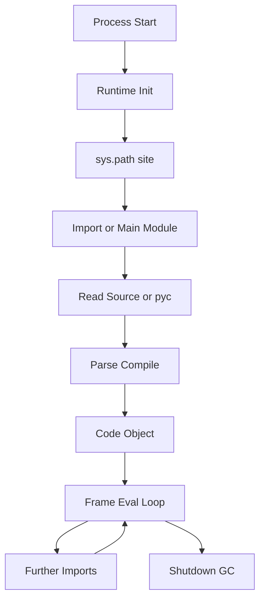
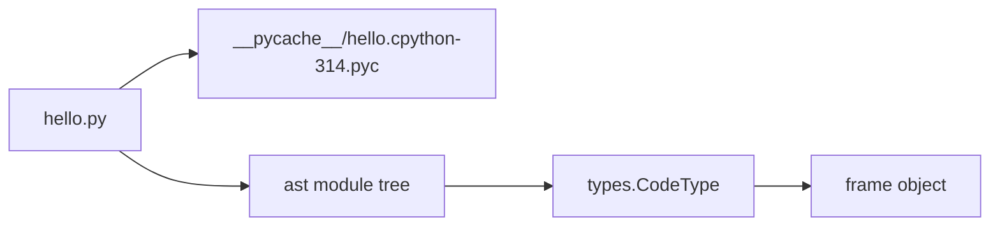
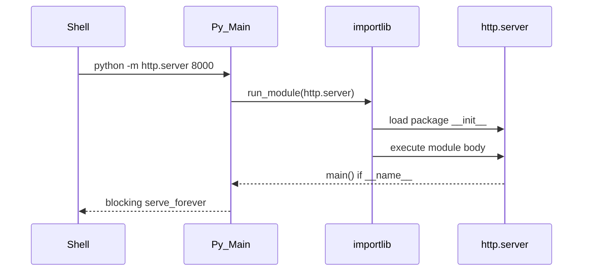

# Python Program Lifecycle

## Overview

A **Python program lifecycle** spans source text discovery, compilation to **code objects**, module initialization via the **import system**, execution in **interpreter frames**, and process teardown with refcount/GC cleanup. Unlike a classical ahead-of-time compiler producing a single binary, CPython typically **compiles at import or first execution**, caches bytecode in `__pycache__`, and executes on a stack-based virtual machine with runtime specialization.

Understanding lifecycle stages explains startup latency, import side effects, `if __name__ == "__main__"` semantics, `.pyc` invalidation, and why **import hooks** affect production plugin systems. This note connects orientation to [[03-Python/05-CPython-Runtime-and-Memory/Parsing AST and Compilation Pipeline|compilation pipeline]] and [[03-Python/08-Modules-Packaging-and-Environments/Import System and Module Objects|import system]] depth.

Target: **CPython 3.14+**; PyPy/MicroPython differ in caching and compilation timing (compatibility notes inline).

## Learning Objectives

- Trace a `.py` file from disk read to running bytecode in a frame
- Explain roles of tokenizer, parser, AST optimizer, compiler, and eval loop
- Describe module vs script execution and `__name__` / `__main__`
- Predict when bytecode is regenerated and how `-O`, `-B`, `PYTHONDONTWRITEBYTECODE` interact
- Relate process startup to container cold-start SLAs

## Prerequisites

- [[03-Python/00-Orientation/Why Python Exists|Why Python Exists]]
- [[01-Computer-Science/08-Languages-and-Computation/Compilers Interpreters and Virtual Machines|Compilers Interpreters and Virtual Machines]]
- [[01-Computer-Science/00-Orientation/How Computers Run Programs|How Computers Run Programs]]

## Difficulty

`intermediate`

## Estimated Time

- Reading: 3 hours
- Exercises: 3 hours
- Mini project: 5 hours

## History

Early CPython parsed and executed with simpler bytecode; major shifts include **PEP 339** (import semantics), unified **PEP 3115** AST (Python 3), **PEP 552** hash-based `.pyc` invalidation (3.7+), and **PEP 659** adaptive specializing interpreter (3.11+). **PEP 432**-era import system cleanup and **PEP 451** module spec objects modernized loading. **3.14+** continues deferred annotation evaluation defaults (PEP 649 ecosystem) affecting import-time work.

## Problem It Solves

Production incidents trace to lifecycle misunderstandings:

- Heavy work at **import time** slows every worker fork/gunicorn boot
- Circular imports half-initialize modules
- Stale `__pycache__` after deployment without version bump (rare with hash-based pyc, still possible with shared volumes)
- Running tests as scripts vs packages breaks relative imports

Mapping lifecycle stages localizes latency and side-effect bugs.

## Internal Implementation

### Phase 1: Interpreter bootstrap

1. OS exec's `python` → `Py_Main` / `pymain_main`
2. Initialize runtime: allocators, builtins, `sys`, `importlib`
3. `sys.path` constructed from env, `.pth` files, site-packages

### Phase 2: Source acquisition

- **Script**: path argument → `__main__` module
- **Module**: `-m pkg.mod` → importlib loads package first
- **REPL/stdin**: interactive driver compiles statements per cell

### Phase 3: Compilation pipeline

```
source bytes → tokenize → parse → AST → symtable → compile → code object
```

Code objects hold:

- `co_code` bytecode
- `co_consts`, `co_names`, `co_varnames`
- flags (generator, nested, etc.)
- source location table (3.11+ column info)

Bytecode cached as `.pyc` beside source (unless `-B`) with header magic + hash (PEP 552).

### Phase 4: Execution

- Frame pushed onto thread state stack
- Eval loop dispatches opcodes; 3.11+ **specializes** hot sites (LOAD_ATTR, CALL, etc.)
- Functions/classes create new code objects at **definition time** (decorators run at definition)

### Phase 5: Teardown

- `atexit` handlers
- Refcount drops; cycle GC may run finalizers (`__del__` discouraged—see [[03-Python/04-Iteration-Exceptions-and-Context/Resource Cleanup and Cancellation Semantics|Resource Cleanup]])
- Interpreter shutdown releases interned objects; **immortal** objects (3.12+) skip deallocation



## Mermaid Diagrams

### Structure: artifacts in the lifecycle



### Sequence: `python -m http.server`



## Examples

### Minimal Example

Inspect lifecycle artifacts:

```python
import dis
import py_compile
from pathlib import Path

source = Path("demo_mod.py")
source.write_text(
    "def answer():\n    return 42\n\nif __name__ == '__main__':\n    print(answer())\n",
    encoding="utf-8",
)

compiled = py_compile.compile(source, doraise=True)
print("pyc written under __pycache__")

code = compile(source.read_text(encoding="utf-8"), str(source), "exec")
dis.dis(code)
# LOAD_CONST, MAKE_FUNCTION, STORE_NAME, ...
```

Run as script vs module:

```bash
python demo_mod.py          # __name__ == "__main__"
python -m demo_mod            # requires package layout for real packages
```

### Production-Shaped Example

Defer expensive import-time work (WSGI/ASGI worker boot):

```python
from __future__ import annotations

import functools
from typing import Callable, TypeVar

T = TypeVar("T")


def lazy_import(factory: Callable[[], T]) -> Callable[[], T]:
    @functools.cache
    def load() -> T:
        return factory()

    return load


_get_heavy_client = lazy_import(lambda: __import__("heavy_sdk").Client())


def handle_request(payload: dict) -> dict:
    client = _get_heavy_client()
    return client.process(payload)
```

Measure cold start:

```python
import time

t0 = time.perf_counter()
import myservice.wsgi  # noqa: F401
print(f"import myservice.wsgi: {(time.perf_counter() - t0)*1000:.1f} ms")
```

Cross-link: [[01-Computer-Science/03-Memory-and-Addressing/Address Spaces|Address Spaces]] for process memory at boot.

Labs: [[03-Python/code/README|Python code labs]].

## Trade-offs

| Dimension | Upside | Downside | When it matters |
| --- | --- | --- | --- |
| Import-time compile | No separate build step for pure Python | Startup latency | Serverless, CLI |
| `.pyc` cache | Faster subsequent imports | Disk layout, RO mounts | Containers |
| `-O` / `-OO` | Smaller consts, no asserts | Loses debug aids | Embedded |
| Lazy imports | Faster boot | First-request latency spike | Autoscaling |
| `-X importtime` | Import profiling | Noise on huge apps | Performance triage |

### When to Use

- **Eager imports** for fail-fast CLI/tools (missing dep before work starts)
- **Lazy imports** for large optional subsystems in web workers
- **`python -m`** for package-relative execution and correct `sys.path[0]`

### When Not to Use

- Do not run substantial I/O at module top level in libraries
- Do not rely on import order for initialization—use explicit factories/registries
- Do not disable bytecode cache on persistent volumes without measuring RO filesystem constraints

## Exercises

1. Use `python -X importtime -c "import asyncio"` and identify top 5 slow imports.
2. Compare `dis.dis` output for `x = 1 + 2` vs `x = 1 + 2; y = x * 3`.
3. Explain hash-based `.pyc` invalidation (PEP 552) in your own words.
4. Create a circular import between two modules; fix using lazy import or restructuring.
5. Trace `__name__` values for `python app.py` vs `import app` from REPL.

## Mini Project

**Import Budget Linter**

AST visitor that flags module-level statements calling functions other than `__all__` / simple constants; CI fails if import-time call count exceeds threshold.

## Portfolio Project

Integrate **startup timeline** tracing (importtime + custom spans) into [[03-Python/projects/Python Runtime Toolkit/README|Python Runtime Toolkit]].

## Interview Questions

1. What happens when Python imports a module for the first time?
2. Difference between running a file as script vs `python -m package.module`?
3. Where is bytecode stored and when is it regenerated?
4. Why is import-time side effect dangerous in web workers?
5. What is a code object vs a function object?

### Stretch / Staff-Level

1. Explain adaptive specialization invalidation when a function's `__code__` is replaced dynamically.
2. Design a plugin system that loads entry points without importing all plugins at startup.

## Common Mistakes

- Using `from pkg import *` in production modules (namespace pollution, slower imports)
- Circular imports "fixed" with duplicated logic instead of dependency inversion
- Assuming `del sys.modules['x']` safely reloads stateful extensions
- Measuring performance only after all imports warmed a long-running REPL

## Best Practices

- Keep module bodies declarative; expose `create_app()` / `main()` factories
- Pin and log Python build flags in service metadata
- Use `if __name__ == "__main__":` only in entry modules
- Profile imports in CI with `-X importtime` budgets on critical services
- Read bytecode with [[03-Python/05-CPython-Runtime-and-Memory/Bytecode and dis|Bytecode and dis]] when optimizing hot paths

## Summary

Python programs come alive through interpreter bootstrap, import-driven compilation to code objects, frame-based evaluation, and refcount/GC teardown. CPython 3.14+ caches specialized execution paths after import; production engineering treats **import time as part of SLA** and **module initialization as a public contract**. Mastering lifecycle stages separates "the code runs" from "the service boots reliably at scale."

## Further Reading

- [[00-References/Python/README|Python References]]
- Python Language Reference — execution model, import system
- PEP 552 — Deterministic pycs
- PEP 659 — Specializing Adaptive Interpreter
- [[03-Python/05-CPython-Runtime-and-Memory/Parsing AST and Compilation Pipeline|Parsing AST and Compilation Pipeline]]

## Related Notes

- [[03-Python/00-Orientation/The REPL Debugger and Introspection Surface|The REPL Debugger and Introspection Surface]]
- [[03-Python/05-CPython-Runtime-and-Memory/Code Objects Frame Objects and Call Stack|Code Objects Frame Objects and Call Stack]]
- [[03-Python/08-Modules-Packaging-and-Environments/Import System and Module Objects|Import System and Module Objects]]
- [[01-Computer-Science/08-Languages-and-Computation/Compilers Interpreters and Virtual Machines|Compilers Interpreters and Virtual Machines]]
- [[03-Python/README|Python Track]]

## Progress Checklist

- [ ] Explained from first principles
- [ ] Drew at least one Mermaid diagram
- [ ] Implemented a minimal version
- [ ] Documented trade-offs and non-goals
- [ ] Completed exercises
- [ ] Practiced interview questions aloud
- [ ] Linked prerequisites and dependents
