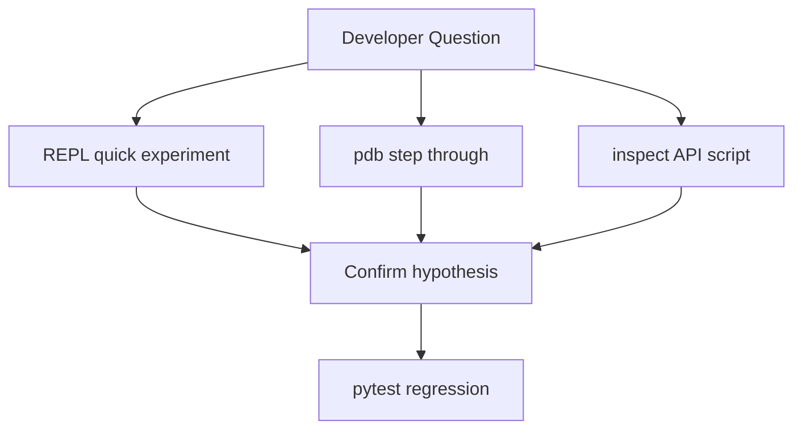
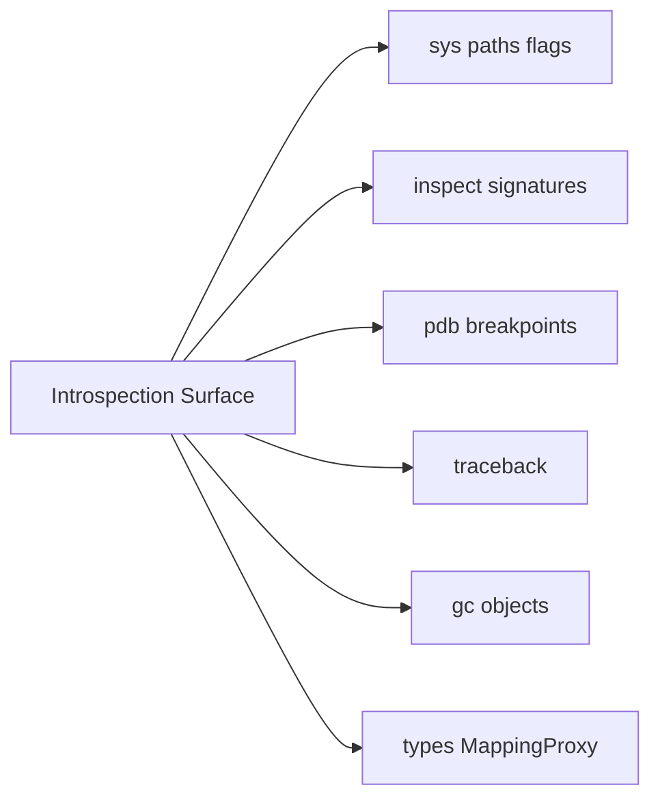
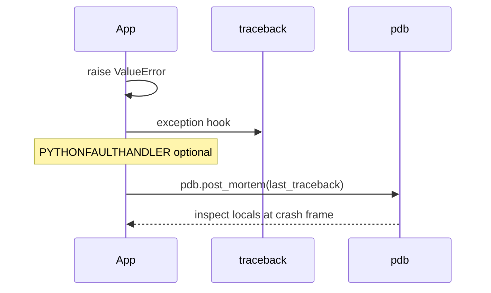

# The REPL Debugger and Introspection Surface

## Overview

Python ships a **read-eval-print loop (REPL)** for interactive evaluation, a **debugger (`pdb`)** for breakpoint-driven inspection, and a rich **introspection API** (`inspect`, `sys`, `traceback`, `gc`, `types`) for examining live objects without source access. Together they form the **operational surface** engineers use during development, incidents, and post-mortems.

The REPL is not a toy—it is how CPython validates hypotheses about the [[03-Python/01-Values-Types-and-Data-Model/Python Object Model and PyObject|object model]], descriptor behavior, and import graphs. Production systems still rely on the same introspection primitives in attach-debuggers, REPL consoles in staging, and structured logging of `repr()`/tracebacks.

This note covers CPython 3.14+ defaults; **IPython**, **bpython**, and **remote debuggers** extend the surface without changing core semantics.

## Learning Objectives

- Use the standard REPL for exploratory evaluation and `__dunder__` experiments
- Control execution with `pdb` (breakpoints, post-mortem, `PYTHONBREAKPOINT`)
- Navigate `inspect` for signatures, sources, frames, and coroutine state
- Choose safe introspection in production (read-only probes vs mutating live state)
- Integrate REPL-driven workflows with tests and type checkers

## Prerequisites

- [[03-Python/00-Orientation/Python Program Lifecycle|Python Program Lifecycle]]

## Difficulty

`beginner`

## Estimated Time

- Reading: 2 hours
- Exercises: 3 hours
- Mini project: 4 hours

## History

CPython's interactive prompt predates GUI debuggers. **`pdb`** (1990s) modeled gdb-style commands. **`inspect`** (Python 1.5+) formalized reflection beyond `dir()`. IPython (2001+) added tab completion, rich display, and `%timeit`. **PEP 553** (`breakpoint()`) standardized hooks in 3.7. **3.14+** continues improved tracebacks and monitoring APIs (PEP 669 sys.monitoring) for low-overhead tracing—see [[03-Python/09-Production-Python/Debugging pdb monitoring and Remote Attach|Debugging pdb monitoring and Remote Attach]].

## Problem It Solves

Without introspection:

- Engineers guess at **object identity**, **MRO**, and **closure cells**
- Incidents reproduce only in prod because local state differs
- "Print debugging" lacks stack context and structured object graphs

Python's batteries-included surface reduces time-to-root-cause when used with discipline.

## Internal Implementation

### REPL loop

1. Read statement/expression (`sys.ps1` / `sys.ps2` prompts)
2. `compile(..., "single")` or `exec` for blocks
3. Evaluate in `__main__` namespace (or IPython user_ns)
4. Print repr of non-`None` expression results (unless `_` suppressed)

**CPython 3.14+**: history via `readline` when available; **PyREPL** improvements continue for interactive editing.

### pdb

- Sets **trace function** (`sys.settrace`) or uses **monitoring API** paths
- Breakpoints map to line numbers / functions / conditions
- Frame stack mirrors [[03-Python/05-CPython-Runtime-and-Memory/Code Objects Frame Objects and Call Stack|call stack]] objects

### inspect

- Wraps C-API and Python-level metadata: `getsource`, `signature`, `stack`, `coroutine`
- Handles builtins, extension modules (source may be unavailable)



## Mermaid Diagrams

### Structure: introspection modules



### Sequence: post-mortem on uncaught exception



## Examples

### Minimal Example

REPL experiments for identity vs equality:

```python
>>> a = [1, 2, 3]
>>> b = [1, 2, 3]
>>> a == b
True
>>> a is b
False
>>> id(a), id(b)
(140234567890, 140234567999)
```

`breakpoint()` hook (defaults to pdb):

```python
def divide(a: float, b: float) -> float:
    breakpoint()  # PYTHONBREAKPOINT=pdb.set_trace
    return a / b
```

### Production-Shaped Example

Safe staging probe (read-only) for incident response:

```python
from __future__ import annotations

import inspect
import json
import sys
import traceback
from dataclasses import asdict, dataclass
from types import FrameType


@dataclass
class FrameSnapshot:
    function: str
    filename: str
    lineno: int
    locals_keys: list[str]


def snapshot_stack(limit: int = 10) -> list[FrameSnapshot]:
    frames = inspect.stack()[1 : limit + 1]
    out: list[FrameSnapshot] = []
    for frame_info in frames:
        out.append(
            FrameSnapshot(
                function=frame_info.function,
                filename=frame_info.filename,
                lineno=frame_info.lineno,
                locals_keys=sorted(frame_info.frame.f_locals.keys()),
            )
        )
    return out


def format_exception_json() -> str:
    exc_type, exc, tb = sys.exc_info()
    if exc_type is None:
        return json.dumps({"error": "no active exception"})
    return json.dumps(
        {
            "type": exc_type.__name__,
            "message": str(exc),
            "traceback": traceback.format_exception(exc_type, exc, tb),
        }
    )
```

Never expose raw `f_locals` in prod logs—they may contain secrets.

IPython optional: `%timeit`, `?obj` for docstrings.

Labs: [[03-Python/code/README|Python code labs]].

## Trade-offs

| Dimension | Upside | Downside | When it matters |
| --- | --- | --- | --- |
| REPL speed | Instant feedback | No version control | Exploratory only |
| pdb | Full local inspection | Stops process | Staging, dev |
| Remote attach | Live prod debugging | Safety, security | Break-glass policy |
| Rich logging | Audit trail | Volume, PII leak | Always |
| sys.settrace | Custom tooling | Overhead | Profilers |

### When to Use

- REPL for **language semantics** and small API spikes
- `pytest --pdb` on failing tests locally
- `inspect.signature` in framework code generating docs/CLI
- Structured exception JSON in services (with redaction)

### When Not to Use

- Do not `breakpoint()` in committed library code paths
- Do not paste production secrets into shared REPL history
- Do not mutate live prod objects via REPL without change control

## Exercises

1. Use `inspect.getmembers(list, inspect.isroutine)` and categorize methods by protocol.
2. Set conditional breakpoint: break only when `len(items) > 1000`.
3. Implement `whereami()` printing current frame function and line using `inspect.currentframe()`.
4. Compare `python -i script.py` vs starting REPL then `import script`.
5. Read PEP 553; configure `PYTHONBREAKPOINT=IPython.core.debugger.set_trace` if IPython installed.

## Mini Project

**Incident Snapshot CLI**

Given a running process (or simulated traceback file), emit JSON with exception chain, stack frames (no local values), Python version, and `sys.path`— suitable for attaching to tickets.

## Portfolio Project

Add **Introspection tab** to [[03-Python/projects/Python Runtime Toolkit/README|Python Runtime Toolkit]]: live object graph sampler (staging-only), gc counts, coroutine states.

## Interview Questions

1. Difference between `dir()`, `vars()`, and `inspect.getmembers()`?
2. How does `breakpoint()` choose the debugger backend?
3. What is stored in a frame object's `f_locals` vs `f_globals`?
4. Why might `inspect.getsource` fail on a built-in?
5. How do you debug a hang without pdb in production?

### Stretch / Staff-Level

1. Explain PEP 669 monitoring vs `sys.settrace` for low-overhead coverage tools.
2. Design a break-glass remote REPL with auth, command allowlist, and audit log.

## Common Mistakes

- Leaving `import pdb; pdb.set_trace()` in commits (use `breakpoint()` temporarily)
- Trusting REPL behavior for multithreaded code without synchronization
- Logging full tracebacks with user PII in `locals`
- Assuming tab completion exists in bare `python` on all platforms equally

## Best Practices

- Reproduce REPL findings as **pytest tests**
- Use `PYTHONFAULTHANDLER=1` for native extension crash dumps
- Redact secrets in exception formatters
- Prefer `inspect.signature` over brittle `func.__annotations__` parsing
- Link to [[03-Python/09-Production-Python/Observability Logging Tracing and Metrics|Observability]] for production paths

## Summary

The REPL, pdb, and inspect module expose Python's live object model for learning and debugging. CPython 3.14+ integrates these with modern traceback and monitoring hooks; production use demands **read-only probes**, **secret hygiene**, and **regression tests** that freeze REPL discoveries. Treat introspection as first-class engineering—not a crutch—for navigating [[03-Python/01-Values-Types-and-Data-Model/Special Methods and Data Model Hooks|data model hooks]] and runtime failures.

## Further Reading

- [[00-References/Python/README|Python References]]
- Python tutorial — Interactive Input Editing and History Substitution
- PEP 553 — Built-in breakpoint()
- PEP 669 — Low Impact Monitoring API
- [[03-Python/09-Production-Python/Debugging pdb monitoring and Remote Attach|Debugging pdb monitoring and Remote Attach]]

## Related Notes

- [[03-Python/00-Orientation/Python Program Lifecycle|Python Program Lifecycle]]
- [[03-Python/01-Values-Types-and-Data-Model/Python Object Model and PyObject|Python Object Model and PyObject]]
- [[03-Python/05-CPython-Runtime-and-Memory/Code Objects Frame Objects and Call Stack|Code Objects Frame Objects and Call Stack]]
- [[01-Computer-Science/00-Orientation/How Computers Run Programs|How Computers Run Programs]]
- [[03-Python/README|Python Track]]

## Progress Checklist

- [ ] Explained from first principles
- [ ] Drew at least one Mermaid diagram
- [ ] Implemented a minimal version
- [ ] Documented trade-offs and non-goals
- [ ] Completed exercises
- [ ] Practiced interview questions aloud
- [ ] Linked prerequisites and dependents
