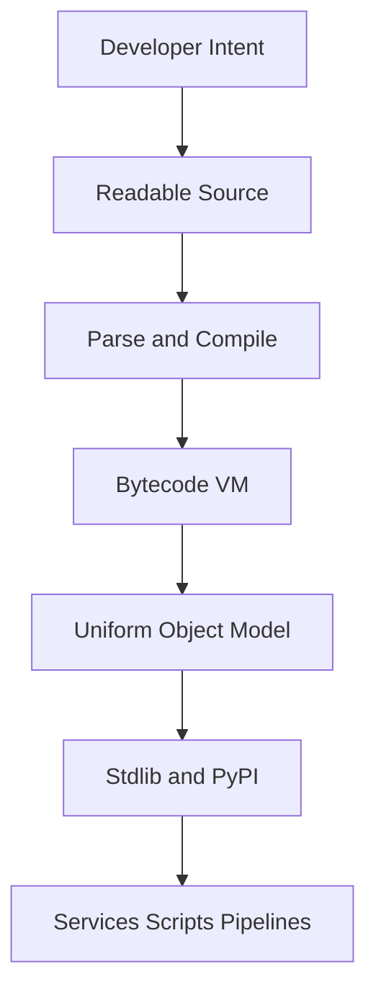
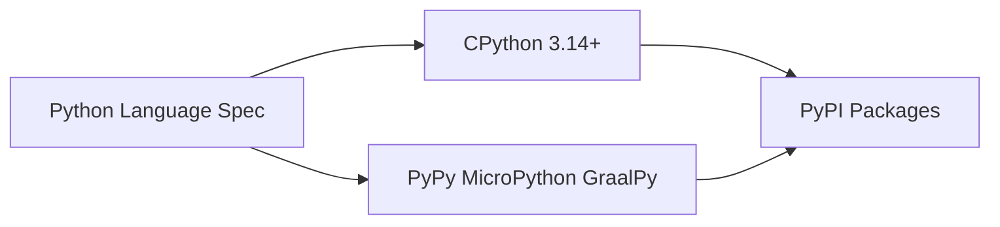
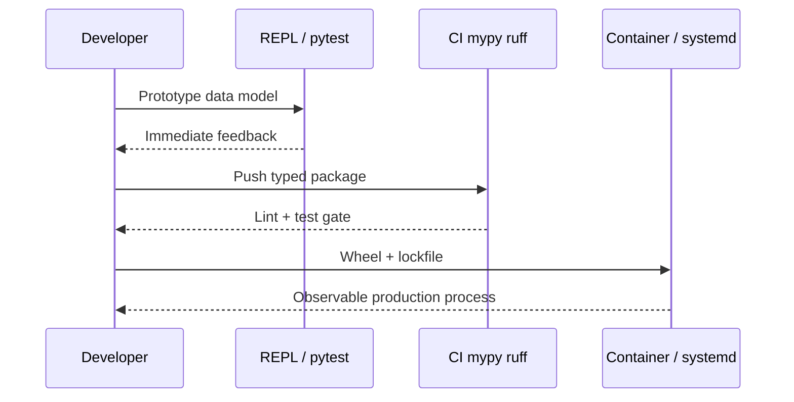

# Why Python Exists

## Overview

**Python** is a general-purpose programming language whose reference implementation is **CPython**, written in C and targeting a bytecode virtual machine. The language was designed in the late 1980s by Guido van Rossum to occupy a deliberate niche: **high programmer productivity** through readable syntax, a rich built-in type system, and a culture of explicit over clever.

Python is not "slow scripting glue" by accident—it is a **multi-paradigm language** (procedural, object-oriented, functional patterns) with a **unified object model** where functions, classes, modules, and integers are all first-class objects. Production systems use Python for web APIs, data pipelines, ML infrastructure, automation, and CLI tooling because the **time-to-correctness** curve favors teams that must iterate quickly while maintaining operability.

This note explains *why* Python exists as a distinct design point—not as a tutorial on syntax—and anchors later modules on the [[03-Python/01-Values-Types-and-Data-Model/Python Object Model and PyObject|object model]], [[03-Python/05-CPython-Runtime-and-Memory/Parsing AST and Compilation Pipeline|compilation pipeline]], and [[03-Python/09-Production-Python/Operational Readiness for CLIs and Services|production readiness]].

## Learning Objectives

- Place Python historically among scripting languages, systems languages, and VMs
- Articulate the Zen of Python and how it maps to language features
- Distinguish the **Python language specification** from **CPython 3.14+** implementation details
- Explain trade-offs that make Python strong for glue/orchestration and weaker for latency-critical inner loops
- Predict when Python is the wrong tool despite team familiarity

## Prerequisites

- [[01-Computer-Science/00-Orientation/How Computers Run Programs|How Computers Run Programs]]
- [[01-Computer-Science/08-Languages-and-Computation/Compilers Interpreters and Virtual Machines|Compilers Interpreters and Virtual Machines]]

## Difficulty

`beginner`

## Estimated Time

- Reading: 2 hours
- Exercises: 2 hours
- Mini project: 3 hours

## History

Guido van Rossum began **Python** in December 1989 as a successor to **ABC**, an educational language emphasizing readability. Named after *Monty Python*, Python 0.9.0 (1991) already had classes, exceptions, and modules. Python 1.0 (1994) added functional tools (`map`, `filter`, `lambda`). Python 2.0 (2000) introduced list comprehensions and garbage collection for cycles. Python 3.0 (2008) broke backward compatibility to fix Unicode (`str` vs `bytes`), integer unification, and iterator consistency—a painful but necessary migration completed when Python 2 reached end-of-life in 2020.

CPython remained the dominant implementation; **PyPy** (RPython JIT), **Jython** (JVM), **IronPython** (.NET), **MicroPython** (embedded), and **GraalPy** (GraalVM) explored alternate runtimes. Python 3.11+ introduced adaptive specialization; **3.13+** offers optional **free-threaded** builds (PEP 703) removing the GIL in supported configurations—relevant when reading [[03-Python/07-Async-Concurrency-and-Free-Threading/Free-Threaded CPython Trade-offs|free-threading trade-offs]].

## Problem It Solves

Before high-level dynamic languages, teams faced a false dichotomy:

| Approach | Failure mode |
| --- | --- |
| C/C++ everywhere | Slow iteration, memory bugs, long compile cycles |
| Shell + awk glue | Unmaintainable logic, no data structures, poor testability |
| Perl/Tcl one-liners | Dense syntax, inconsistent OO models |

Python targets **human time** as the scarce resource: readable code, batteries-included standard library, and a REPL for hypothesis testing. It accepts **CPU time** and **memory overhead** as costs moved to hardware scale or native extensions.

Concrete production wins:

- **Orchestration** of databases, queues, and cloud APIs
- **Data transformation** where clarity beats microsecond savings
- **Research-to-production** paths in ML (NumPy/PyTorch ecosystem)
- **Internal tools** with low activation energy

## Internal Implementation

Python's existence is inseparable from **CPython's architecture** (see [[03-Python/00-Orientation/Python Program Lifecycle|Python Program Lifecycle]]):

1. Source → parser → **AST**
2. AST → compiler → **code object** (bytecode + constants + metadata)
3. **Adaptive specializing interpreter** executes bytecode with inline caches
4. Every value is a **`PyObject*`** with reference counting + generational cycle GC

The language specification ([Python Language Reference](https://docs.python.org/3/reference/)) defines semantics; CPython is the de facto reference. Portable code relies on documented behavior; performance-sensitive code must know CPython-specific costs (attribute dict lookups, GIL, allocation patterns).



### Design pillars (first principles)

1. **Readability counts** — significant whitespace, English-like keywords, one obvious way (aspirationally)
2. **Everything is an object** — no primitive int on the stack in user-visible semantics
3. **Explicit is better than implicit** — e.g., `import this` reveals `import *` as discouraged
4. **Batteries included** — json, sqlite, asyncio, unittest in stdlib reduce fragmentation
5. **Gradual typing** (PEP 484+) — optional static analysis without changing runtime

## Mermaid Diagrams

### Structure: language vs implementation vs ecosystem



See [[03-Python/00-Orientation/CPython Alternatives and Portability|CPython Alternatives and Portability]].

### Sequence: from idea to running service



## Examples

### Minimal Example

The Zen of Python is executable documentation:

```python
import this  # Prints The Zen of Python by Tim Peters

# Explicit readability: no braces, clear naming
def total_prices(items: list[tuple[str, float]]) -> float:
    return sum(price for _, price in items)

assert total_prices([("widget", 9.99), ("gasket", 1.50)]) == 11.49
```

**CPython 3.14+**: behavior unchanged; `this` module is a rot-13 encoded string constant in `Lib/this.py`.

### Production-Shaped Example

A team chooses Python for an **ETL orchestrator** that reads S3, validates rows, and loads PostgreSQL:

```python
from __future__ import annotations

import json
import logging
from dataclasses import dataclass
from pathlib import Path
from typing import Iterator

log = logging.getLogger(__name__)


@dataclass(frozen=True, slots=True)
class Row:
    user_id: int
    event: str


def load_rows(path: Path) -> Iterator[Row]:
    with path.open(encoding="utf-8") as fh:
        for lineno, line in enumerate(fh, 1):
            try:
                payload = json.loads(line)
                yield Row(int(payload["user_id"]), str(payload["event"]))
            except (KeyError, ValueError, TypeError) as exc:
                log.warning("skip line %s: %s", lineno, exc)


def batch_insert(rows: Iterator[Row], *, batch_size: int = 500) -> int:
    batch: list[Row] = []
    count = 0
    for row in rows:
        batch.append(row)
        if len(batch) >= batch_size:
            # _flush_to_db(batch)  # native driver or COPY
            count += len(batch)
            batch.clear()
    if batch:
        count += len(batch)
    return count
```

Why Python here: JSON/CSV handling, logging, dataclasses, and rapid schema changes outweigh raw throughput—hot paths can move to Rust extensions or SQL `COPY`. Cross-link: [[01-Computer-Science/01-Information-and-Representation/Data Serialization Fundamentals|Data Serialization Fundamentals]].

Labs: [[03-Python/code/README|Python code labs]].

## Trade-offs

| Dimension | Upside | Downside | When it matters |
| --- | --- | --- | --- |
| Developer velocity | Fast iteration, rich ecosystem | Hidden complexity at scale | Startups, data teams |
| Runtime performance | Good enough with C extensions | Interpreter overhead, GIL (default build) | Hot loops, HFT |
| Deployment | Single interpreter, wheels | Native deps, ABI tags, supply chain | Containers, Lambda |
| Typing | Gradual, optional | Runtime ignores annotations | Large refactors |
| Memory | Productive object model | Higher baseline RSS vs Go/Rust | Sidecar workers |

### When to Use

- Glue services, CLIs, internal tools, ML pipelines
- Teams optimizing for **maintainability** and **time-to-ship**
- Prototyping before rewriting proven bottlenecks in native code

### When Not to Use

- Hard real-time or kernel-mode code
- Single-process CPU-bound parallelism on default GIL builds (prefer multiprocessing or free-threaded builds with eyes open)
- Ultra-low-memory embedded without MicroPython constraints analysis

## Exercises

1. Run `python -c "import this"` and map five Zen lines to concrete language features (e.g., "Explicit is better than implicit" → explicit `self`, no implicit variable declaration).
2. Compare Python's `list` vs C's array: allocation model, bounds checking, and growth strategy.
3. Time a tight numeric loop in pure Python vs `numpy`; document crossover point on your machine.
4. List three production services you use daily that likely include Python somewhere in the stack.
5. Read PEP 20 and PEP 8 summaries; write one team rule that prevents "clever" Python.

## Mini Project

**Language Comparison Memo**

Write a 2-page internal doc comparing Python vs Go for a hypothetical HTTP microservice: startup time, dependency management, typing, concurrency model, observability hooks. Include a decision matrix and a recommendation with non-goals.

## Portfolio Project

Extend [[03-Python/projects/Python Runtime Toolkit/README|Python Runtime Toolkit]] with a **"Why Python"** section documenting language choice rationale, SLAs, and escape hatches (C extension, subprocess to Rust binary).

## Interview Questions

1. Why did Python 3 break backward compatibility with Python 2?
2. What does "everything is an object" mean for the integer `42`?
3. How does Python's design differ from Java's "primitives vs objects"?
4. When would you *not* choose Python for a greenfield backend?
5. What is the difference between the Python language and CPython?

### Stretch / Staff-Level

1. Argue for or against Python as the default language for a 50-engineer platform team considering a 10-year horizon.
2. How does optional free-threading (PEP 703) change Python's historical concurrency story without altering the language spec?

## Common Mistakes

- Treating Python as a "prototype only" language without operational discipline
- Ignoring **virtual environment** and **lockfile** boundaries in production
- Assuming `pip install` on a laptop reproduces CI/prod (ABI, platform tags)
- Conflating **framework knowledge** (Django/FastAPI) with **language semantics**

## Best Practices

- Pin interpreter version (`3.14.x`) and document build flags (free-threaded or not)
- Invest early in [[03-Python/06-Typing/Gradual Typing Philosophy and Trade-offs|gradual typing]] for shared libraries
- Profile before rewriting; use [[03-Python/09-Production-Python/Measuring and Optimizing Performance|performance tooling]]
- Keep hot paths small; push bytes parsing to `bytes`/`memoryview` or native code
- Link runbooks to language/runtime version in observability tags

## Summary

Python exists to trade machine cycles for human clarity and delivery speed. Its unified object model, REPL-driven workflow, and ecosystem made it the default "second language" of modern engineering— alongside systems languages and SQL. CPython 3.14+ implements that spec with bytecode, refcounting, and evolving concurrency options; production success requires knowing where the design shines (orchestration, data, tooling) and where costs appear (interpreter overhead, GIL defaults, packaging). Understanding *why* Python exists prevents mis-applying it to problems that demand different first principles.

## Further Reading

- [[00-References/Python/README|Python References]]
- PEP 20 — The Zen of Python
- van Rossum — *Computer Programming for Everybody* (1999)
- [[01-Computer-Science/08-Languages-and-Computation/Programming Paradigms|Programming Paradigms]]

## Related Notes

- [[03-Python/00-Orientation/CPython Alternatives and Portability|CPython Alternatives and Portability]]
- [[03-Python/00-Orientation/Python Program Lifecycle|Python Program Lifecycle]]
- [[03-Python/00-Orientation/The REPL Debugger and Introspection Surface|The REPL Debugger and Introspection Surface]]
- [[03-Python/01-Values-Types-and-Data-Model/Python Object Model and PyObject|Python Object Model and PyObject]]
- [[03-Python/README|Python Track]]

## Progress Checklist

- [ ] Explained from first principles
- [ ] Drew at least one Mermaid diagram
- [ ] Implemented a minimal version
- [ ] Documented trade-offs and non-goals
- [ ] Completed exercises
- [ ] Practiced interview questions aloud
- [ ] Linked prerequisites and dependents
