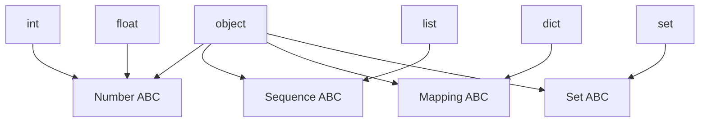
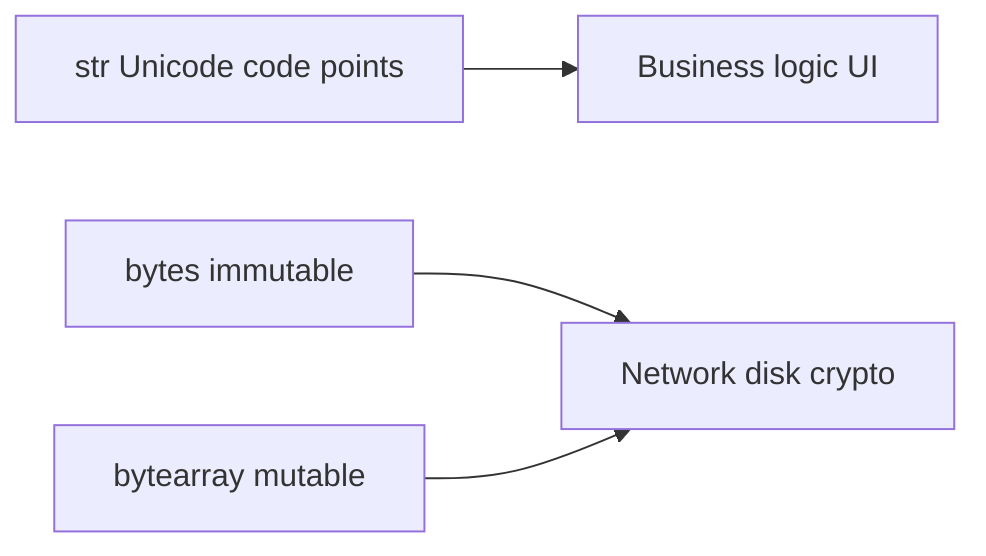
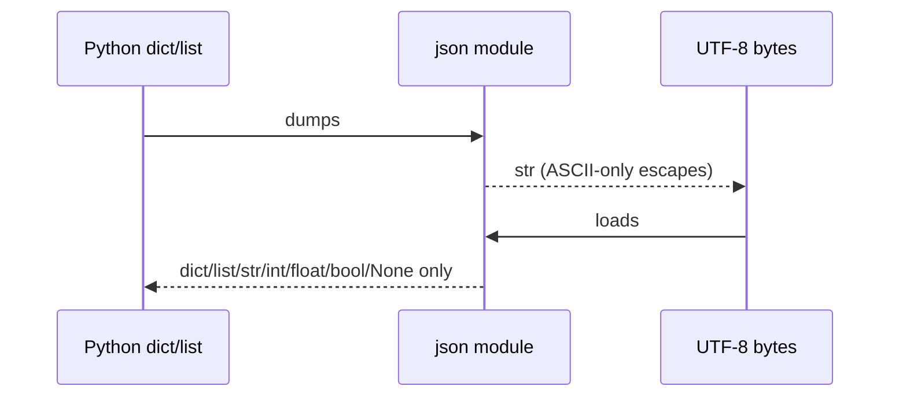

# Built-in Types Overview

## Overview

Python's **built-in types** are the runtime-provided classes in `builtins` (and `types` for some helpers): `NoneType`, `bool`, `int`, `float`, `complex`, `str`, `bytes`, `bytearray`, `list`, `tuple`, `dict`, `set`, `frozenset`, `range`, `memoryview`, and callables (`function`, `method`, `builtin_function_or_method`). They implement the **abstract protocols** in `collections.abc`—sequence, mapping, iterable, callable—without requiring user inheritance.

Types are **objects** (`type` is metaclass of itself). `isinstance` checks **structural protocol satisfaction** via MRO and ABC registration, not only exact class equality.

This map orients deep dives: [[03-Python/01-Values-Types-and-Data-Model/Numbers Integers Floats Decimal and Fractions|Numbers]], [[03-Python/01-Values-Types-and-Data-Model/Strings Bytes and Unicode|Strings and Bytes]], [[03-Python/01-Values-Types-and-Data-Model/Sequences Mappings and Sets as Protocols|Protocols]].

## Learning Objectives

- Navigate the built-in type taxonomy and mutual exclusions (e.g., `str` vs `bytes`)
- Predict mutability and hashability from type
- Use `isinstance` vs exact `type(x) is y` appropriately
- Choose container types for production APIs with clear contracts
- Relate built-ins to CS representations (ints, floats, Unicode)

## Prerequisites

- [[03-Python/01-Values-Types-and-Data-Model/Python Object Model and PyObject|Python Object Model and PyObject]]

## Difficulty

`beginner`

## Estimated Time

- Reading: 2 hours
- Exercises: 3 hours
- Mini project: 4 hours

## History

Python 2 had `unicode` vs `str`; Python 3 unified text as **`str`** (Unicode code points) and **`bytes`** for binary ([[01-Computer-Science/01-Information-and-Representation/Character Encoding|Character Encoding]]). `dict` insertion-ordered since 3.7 (language guarantee 3.8+). `bool` subclasses `int` (historical quirk). Recent additions: **`bool | None` typing**, **`typing.ReadOnly`**, pattern matching on built-in shapes (3.10+).

## Problem It Solves

Type confusion drives production bugs:

- Passing `str` where `bytes` required (crypto, wire formats)
- Using mutable lists as dict keys
- JSON boundaries blurring `null`/`None`, arrays/lists, objects/dicts
- Assuming `float` is decimal-safe for money

A systematic built-in map prevents category errors before frameworks enter the picture.

## Internal Implementation

### Scalar vs container

| Category | Types | Notes |
| --- | --- | --- |
| Singleton | `NoneType` | Single instance `None` |
| Numeric | `bool`, `int`, `float`, `complex` | `bool` is `int` subclass |
| Text/binary | `str`, `bytes`, `bytearray` | `bytearray` mutable |
| Sequences | `list`, `tuple`, `range` | `range` lazy |
| Mappings | `dict` | insertion ordered |
| Sets | `set`, `frozenset` | hashable frozenset |
| Callable | functions, methods, classes | see [[03-Python/01-Values-Types-and-Data-Model/Callables and the Call Protocol|Callables]] |

### Hashability rule of thumb

Hashable if immutable and defines consistent `__hash__` with `__eq__`. Mutable containers unhashable.

### `type` vs `isinstance`

```python
class MyDict(dict):
    pass

d = MyDict()
type(d) is MyDict          # True
isinstance(d, dict)        # True — API checks should prefer this
```



## Mermaid Diagrams

### Structure: text vs binary split (Python 3)



Encode/decode at boundaries: [[03-Python/01-Values-Types-and-Data-Model/Strings Bytes and Unicode|Strings Bytes and Unicode]].

### Sequence: JSON boundary typing



## Examples

### Minimal Example

```python
from collections.abc import Mapping, Sequence

def describe(value: object) -> str:
    if value is None:
        return "null singleton"
    if isinstance(value, bool):  # before int — bool subclasses int
        return "bool"
    if isinstance(value, int):
        return "int"
    if isinstance(value, (str, bytes)):
        return "text/binary scalar"
    if isinstance(value, Mapping):
        return f"mapping len={len(value)}"
    if isinstance(value, Sequence) and not isinstance(value, (str, bytes)):
        return f"sequence len={len(value)}"
    return type(value).__name__


assert describe({"a": 1}) == "mapping len=1"
assert describe([1, 2]) == "sequence len=2"
assert describe(True) == "bool"
```

### Production-Shaped Example

API input normalization at system boundary:

```python
from __future__ import annotations

from dataclasses import dataclass
from datetime import datetime
from typing import Any


@dataclass(frozen=True, slots=True)
class Event:
    user_id: int
    kind: str
    at: datetime


ALLOWED_KEYS = {"user_id", "kind", "at"}


def parse_event(raw: dict[str, Any]) -> Event:
    extra = set(raw) - ALLOWED_KEYS
    if extra:
        raise ValueError(f"unexpected fields: {sorted(extra)}")
    user_id = raw["user_id"]
    if not isinstance(user_id, int) or isinstance(user_id, bool):
        raise TypeError("user_id must be int")
    kind = raw["kind"]
    if not isinstance(kind, str):
        raise TypeError("kind must be str")
    at_raw = raw["at"]
    if not isinstance(at_raw, str):
        raise TypeError("at must be ISO8601 str")
    return Event(user_id=user_id, kind=kind, at=datetime.fromisoformat(at_raw))
```

Validate **built-in shapes** before domain logic; defer to pydantic/cattrs for scale.

Labs: [[03-Python/code/README|Python code labs]].

## Trade-offs

| Type | Strength | Pitfall | Prefer when |
| --- | --- | --- | --- |
| `list` | Ordered mutable | Aliasing bugs | Accumulation |
| `tuple` | Hashable records | Immutable updates awkward | Dict keys, returns |
| `dict` | Fast keyed lookup | Key must be hashable | Indexes, JSON-like |
| `set` | Membership O(1) avg | Unordered | Dedup |
| `str` | Unicode text | Not wire format | UI, logs |
| `bytes` | Exact octets | Not display text | HMAC, protobuf |

### When to Use

- **`dict[str, T]`** for JSON-like records at boundaries
- **`tuple`** for fixed-shape rows
- **`bytes`** for cryptographic and binary protocol work
- **`dataclass`/`TypedDict`** for schema clarity (later modules)

### When Not to Use

- Do not use `float` for currency ([[03-Python/01-Values-Types-and-Data-Model/Numbers Integers Floats Decimal and Fractions|Decimal]])
- Do not use `list` as default arg ([[03-Python/01-Values-Types-and-Data-Model/Mutability Sharing and Copying|Mutability]])
- Do not parse binary protocols as `str`

## Exercises

1. Which built-ins are hashable? Verify with `hash()`.
2. Why must `isinstance(True, int)` be True? Practical pitfall?
3. Serialize `{"t": (1, 2)}` vs `{"t": [1, 2]}` to JSON—any difference?
4. Build a table: `type(x)`, `x.__class__`, and MRO for `bool`.
5. Use `dis` on `range(10)` iteration vs `list(range(10))` memory.

## Mini Project

**Type Router**

Function `coerce_json_tree(obj)` validating only JSON types recursively; raise typed errors with paths (`$.items[3].id`).

## Portfolio Project

Built-in **compatibility matrix** panel in [[03-Python/projects/Python Runtime Toolkit/README|Python Runtime Toolkit]] comparing `getsizeof` and hashability across types.

## Interview Questions

1. Difference between `list` and `tuple` beyond mutability?
2. Why are dicts ordered in Python 3.7+?
3. Can `True + True` work? Why?
4. JSON types vs Python built-ins—what's lost in translation?
5. When is `type(x) is list` better than `isinstance(x, list)`?

### Stretch / Staff-Level

1. Explain how `collections.abc` registers virtual subclasses for built-ins.
2. Design API types for a webhook payload avoiding bool/int confusion.

## Common Mistakes

- Checking `if user_id:` when `0` is valid
- Using `str` to hold base64 without naming convention
- Deep-copying everything instead of knowing immutable scalars
- Treating `datetime` as built-in (it's stdlib, not builtin)

## Best Practices

- Check `bool` before `int` in validation chains
- Enforce `bytes`/`str` separation in function signatures
- Use `Mapping`/`Sequence` ABCs in public APIs for flexibility
- Document JSON schema alongside Python types
- Link CS notes: [[01-Computer-Science/01-Information-and-Representation/Number Systems|Number Systems]]

## Summary

Built-in types are the concrete classes implementing Python's scalar and container semantics, wired to abstract protocols and the unified object model. Correct engineering starts with knowing which type owns text vs bytes, which containers are hashable, and where JSON boundaries erase rich Python objects. The overview here routes to specialized notes without collapsing important representation details.

## Further Reading

- [[00-References/Python/README|Python References]]
- Python Library Reference — Built-in Types
- [[04-Data-Structures/README|Data Structures Track]] for algorithmic container choice
- [[03-Python/01-Values-Types-and-Data-Model/Sequences Mappings and Sets as Protocols|Sequences Mappings and Sets as Protocols]]

## Related Notes

- [[03-Python/01-Values-Types-and-Data-Model/Numbers Integers Floats Decimal and Fractions|Numbers Integers Floats Decimal and Fractions]]
- [[03-Python/01-Values-Types-and-Data-Model/Strings Bytes and Unicode|Strings Bytes and Unicode]]
- [[03-Python/01-Values-Types-and-Data-Model/Truthiness Equality and Identity|Truthiness Equality and Identity]]
- [[03-Python/01-Values-Types-and-Data-Model/Mutability Sharing and Copying|Mutability Sharing and Copying]]
- [[03-Python/README|Python Track]]

## Progress Checklist

- [ ] Explained from first principles
- [ ] Drew at least one Mermaid diagram
- [ ] Implemented a minimal version
- [ ] Documented trade-offs and non-goals
- [ ] Completed exercises
- [ ] Practiced interview questions aloud
- [ ] Linked prerequisites and dependents
