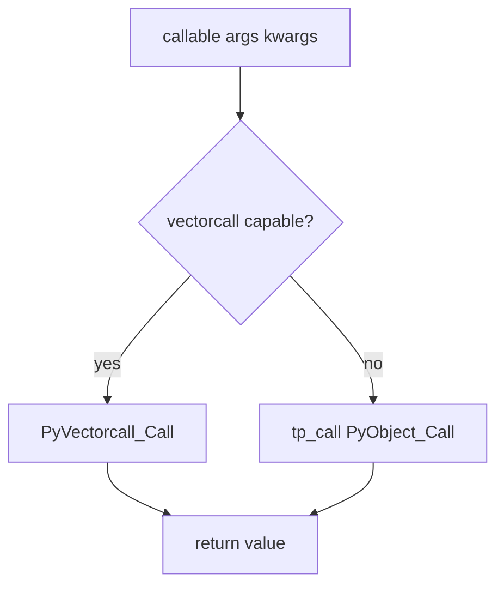
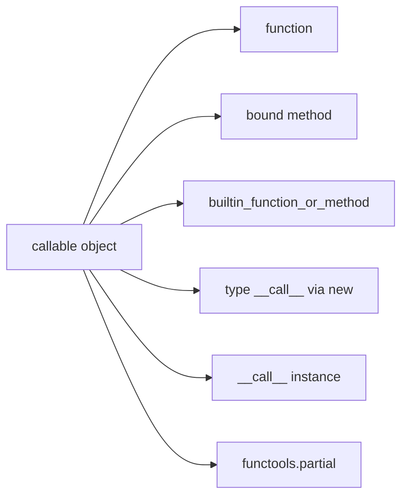
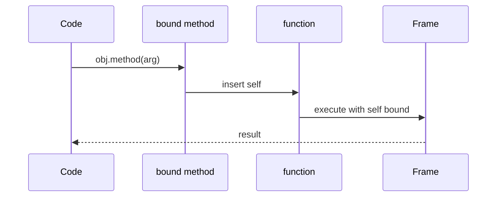

# Callables and the Call Protocol

## Overview

A **callable** is any object the runtime can invoke with `()`—functions, methods, classes (call constructs instance), instances with **`__call__`**, and builtins. CPython dispatches calls through **`tp_call`** or the optimized **vectorcall** protocol (3.8+) passing positional and keyword arguments efficiently.

Callables are first-class objects: assign to variables, store in collections, pass as arguments, return from factories. Higher-order patterns (decorators, callbacks, dependency injection) depend on understanding **bound vs unbound methods**, **partial application**, and **signature introspection**.

This note focuses on the **call protocol** at the data-model layer; [[03-Python/02-Execution-Namespaces-and-Functions/Argument Binding Unpacking and Keyword-Only Parameters|Argument Binding]] covers binding rules.

## Learning Objectives

- Identify callable kinds via `callable()` and `inspect.isroutine`
- Explain function vs method vs bound method object layout
- Implement callable instances with `__call__`
- Use `functools.partial` and `operator.call` in production pipelines
- Read vectorcall-related performance implications at high level (CPython 3.14+)

## Prerequisites

- [[03-Python/01-Values-Types-and-Data-Model/Python Object Model and PyObject|Python Object Model and PyObject]]
- [[03-Python/02-Execution-Namespaces-and-Functions/Functions as Objects|Functions as Objects]] (forward reference OK at read time)

## Difficulty

`intermediate`

## Estimated Time

- Reading: 2–3 hours
- Exercises: 3 hours
- Mini project: 4 hours

## History

Python 2 unified types/classes; functions became `function` type instances. **`functools.partial`** (2.5), **`inspect.signature`** (3.3). PEP 590 **vectorcall** (3.8+) optimized C-level calling; 3.11+ specialization includes `CALL` bytecode variants. Callable type hints (`Callable[[int], str]`) standardized typing of higher-order APIs.

## Problem It Solves

Misunderstanding callables causes:

- Decorators that break metadata (`__name__`, signatures)
- Passing unbound methods where function expected (`Type.method` missing `self`)
- Callable classes holding unintended state across requests
- Confusing `Class()` (constructor call) with `Class.__new__`/`__init__` split

Explicit call protocol knowledge stabilizes middleware and plugin architectures.

## Internal Implementation

### Dispatch path (conceptual)

1. Evaluate callable object
2. Build args/kwargs tuple/dict (unless vectorcall fast path)
3. `PyObject_Call` / vectorcall function pointer
4. For Python functions: new frame, bind locals, execute bytecode
5. For classes: `__new__` then `__init__` on success

### Function objects

`PyFunctionObject` holds:

- `__code__`, `__globals__`, `__defaults__`, `__kwdefaults__`, `__closure__`

### Method objects

- **Bound method**: `self` prepended, `__func__` reference underlying function
- **Unbound** (class access): function expecting explicit self (legacy terminology; in Py3 `function` from class dict)

### Callable instances

User class defines `__call__`; each invocation creates frame like function.



## Mermaid Diagrams

### Structure: callable taxonomy



### Sequence: bound method call



## Examples

### Minimal Example

```python
import functools
import inspect
from typing import Callable


def greet(name: str) -> str:
    return f"hello {name}"


class Greeter:
    def __init__(self, prefix: str) -> None:
        self.prefix = prefix

    def __call__(self, name: str) -> str:
        return f"{self.prefix} {name}"


assert callable(greet)
assert callable(Greeter("hi"))
assert callable(Greeter("hi"))

partial = functools.partial(greet, "world")  # wrong demo fix:
say_hi = functools.partial(greet)
assert say_hi("world") == "hello world"

sig = inspect.signature(greet)
assert list(sig.parameters) == ["name"]
```

### Production-Shaped Example

Retry wrapper preserving signature:

```python
from __future__ import annotations

import functools
import logging
import time
from collections.abc import Callable
from typing import ParamSpec, TypeVar

P = ParamSpec("P")
R = TypeVar("R")
log = logging.getLogger(__name__)


def retry(
    *, attempts: int = 3, backoff: float = 0.1
) -> Callable[[Callable[P, R]], Callable[P, R]]:
    if attempts < 1:
        raise ValueError("attempts must be >= 1")

    def decorator(fn: Callable[P, R]) -> Callable[P, R]:
        @functools.wraps(fn)
        def wrapper(*args: P.args, **kwargs: P.kwargs) -> R:
            delay = backoff
            for attempt in range(1, attempts + 1):
                try:
                    return fn(*args, **kwargs)
                except Exception:
                    if attempt == attempts:
                        raise
                    log.warning("retry %s/%s for %s", attempt, attempts, fn.__name__)
                    time.sleep(delay)
                    delay *= 2
            raise RuntimeError("unreachable")

        return wrapper

    return decorator


@retry(attempts=3, backoff=0.05)
def fetch_token(url: str) -> str:
    ...
```

Use **`functools.wraps`** to preserve callable metadata for introspection and observability.

Labs: [[03-Python/code/README|Python code labs]].

## Trade-offs

| Pattern | Upside | Downside | When |
| --- | --- | --- | --- |
| Plain function | Simple, fast | No per-call state | Stateless ops |
| Callable class | Configurable instance | Heavier object | Stateful handlers |
| partial | Lightweight currying | Harder to introspect | Fixed first args |
| lambda | Inline small | No statements, weak debug | sort keys |
| builtin C callable | Speed | Limited Python introspection | hot paths |

### When to Use

- **`Callable[[...], R]`** in typed callback parameters
- **Callable classes** for middleware with config
- **`functools.wraps`** on all decorators

### When Not to Use

- Do not create massive callables in tight loops (allocate once)
- Do not use mutable default callable registries without locks
- Avoid complex lambdas where named function improves stack traces

## Exercises

1. Compare `obj.method`, `Class.method`, `Class.method(obj)` behavior.
2. Implement `CountingCallable` invoking inner fn and tracking count via `__call__`.
3. Use `inspect.signature` on partial—what is missing?
4. `dis.dis` a call site with and without keyword args (CPython 3.14).
5. Explain why classes are callable but `__init__` returns None.

## Mini Project

**Callable Registry**

Mapping name → callable with signature validation at registration; invoke via uniform `run(name, **kwargs)` using `inspect.signature` binding.

## Portfolio Project

Middleware chain for [[03-Python/projects/Asyncio Scheduler From Scratch/README|Asyncio Scheduler From Scratch]] using callable protocol.

## Interview Questions

1. What makes an object callable?
2. Difference between function and bound method?
3. Purpose of `functools.wraps`?
4. How does `Class()` invoke `__new__` and `__init__`?
5. What is vectorcall at a high level?

### Stretch / Staff-Level

1. Design plugin entry point loader using `importlib.metadata` + callable signatures.
2. Explain why calling unbound function with wrong `self` type sometimes still "works."

## Common Mistakes

- Decorator forgetting wraps breaks observability tools
- Storing `list.append` bound method vs `append` function confusion on builtins
- Callable class with heavy `__init__` work per request instance
- Using `callable` check instead of try/except for duck typing public APIs

## Best Practices

- Type callbacks with `Protocol` or `Callable` + ParamSpec
- Prefer functions at module level for testability
- Log callable `__qualname__` in structured logs
- Benchmark before replacing functions with callable classes
- Read [[03-Python/02-Execution-Namespaces-and-Functions/Decorators Internals|Decorators Internals]]

## Summary

Callables unify functions, methods, builtins, classes, and user instances under one invocation protocol implemented efficiently via vectorcall in CPython 3.14+. Treating callables as objects enables decorators, injection, and composable middleware—patterns that dominate production Python frameworks when combined with correct binding and metadata preservation.

## Further Reading

- [[00-References/Python/README|Python References]]
- PEP 590 — Vectorcall protocol
- [[03-Python/02-Execution-Namespaces-and-Functions/Functions as Objects|Functions as Objects]]
- [[03-Python/02-Execution-Namespaces-and-Functions/Decorators Internals|Decorators Internals]]

## Related Notes

- [[03-Python/01-Values-Types-and-Data-Model/Special Methods and Data Model Hooks|Special Methods and Data Model Hooks]]
- [[03-Python/05-CPython-Runtime-and-Memory/Code Objects Frame Objects and Call Stack|Code Objects Frame Objects and Call Stack]]
- [[03-Python/06-Typing/Generics TypeVars ParamSpecs and TypeVarTuples|Generics TypeVars ParamSpecs and TypeVarTuples]]
- [[03-Python/README|Python Track]]

## Progress Checklist

- [ ] Explained from first principles
- [ ] Drew at least one Mermaid diagram
- [ ] Implemented a minimal version
- [ ] Documented trade-offs and non-goals
- [ ] Completed exercises
- [ ] Practiced interview questions aloud
- [ ] Linked prerequisites and dependents
