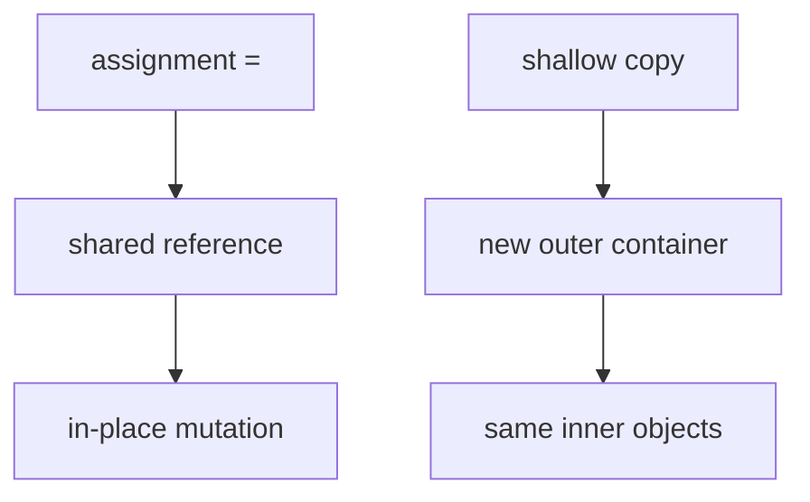
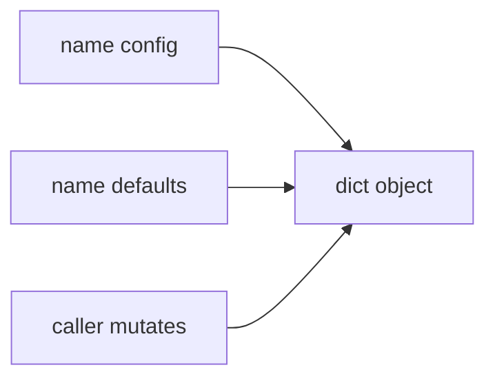
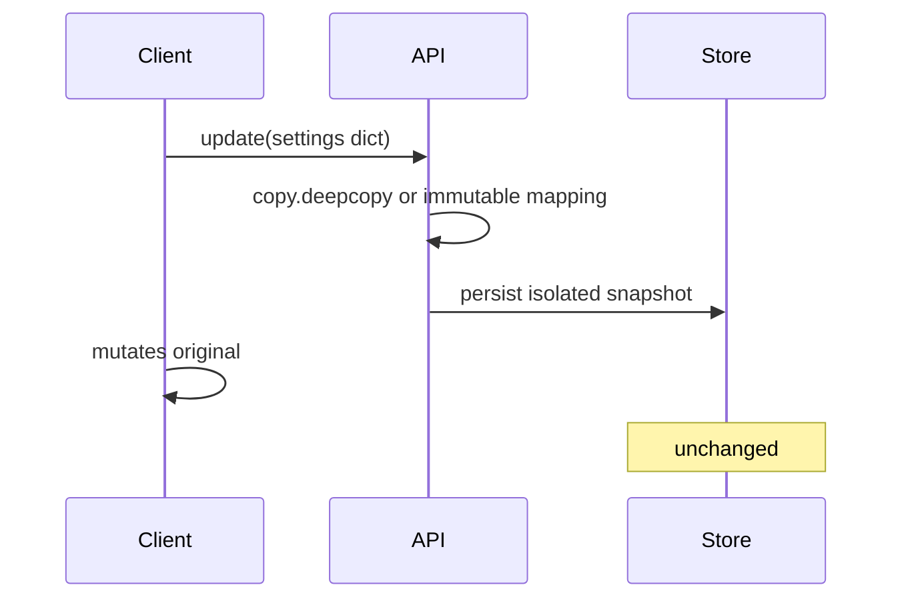

# Mutability Sharing and Copying

## Overview

**Mutability** means an object's value can change in-place after creation (`list.append`, `dict.update`, `bytearray[i]=`). **Immutable** objects (`int`, `str`, `tuple` of immutables, `frozenset`) cannot change; "modification" creates new objects. Python assignment **never copies**—it binds another name to the same object (**aliasing**).

Copying is explicit: **`copy.copy`** (shallow), **`copy.deepcopy`**, or domain-specific clones (`dataclasses.replace`, Pydantic `model_copy`). The infamous **mutable default argument** (`def f(x=[])`) shares one list across calls.

Production defects from aliasing: cached dicts mutated by callers, shared global registries, defensive copies missing at API boundaries.

## Learning Objectives

- Classify built-in types by mutability and hashability
- Predict aliasing behavior through assignment and nested structures
- Choose shallow vs deep copy with performance awareness
- Fix mutable default argument anti-pattern
- Design APIs that accept immutable views or copy-on-write

## Prerequisites

- [[03-Python/01-Values-Types-and-Data-Model/Truthiness Equality and Identity|Truthiness Equality and Identity]]
- [[03-Python/01-Values-Types-and-Data-Model/Python Object Model and PyObject|Python Object Model and PyObject]]

## Difficulty

`intermediate`

## Estimated Time

- Reading: 2–3 hours
- Exercises: 4 hours
- Mini project: 4 hours

## History

Mutable default argument gotcha documented for decades (Effective Python, Fluent Python). `copy` module since Python 2. `types.MappingProxyType` (3.3) exposes read-only dict views. **`dataclasses`** `frozen=True` encourages immutability. CPython 3.14+ continues list/dict optimizations without changing aliasing semantics.

## Problem It Solves

| Symptom | Root cause |
| --- | --- |
| Test order dependence | Shared mutable singleton |
| "Random" cache corruption | Caller mutates returned list |
| Memory spikes | Deepcopy of huge graph |
| Subtle state leaks | Class-level mutable attributes |

Understanding sharing is prerequisite for thread-safety ([[03-Python/07-Async-Concurrency-and-Free-Threading/threading and the GIL|threading and the GIL]]) and functional patterns.

## Internal Implementation

### Assignment vs mutation

```python
a = [1, 2]
b = a          # alias — same PyListObject
b.append(3)    # mutates shared object
assert a == [1, 2, 3]
```

Rebinding breaks alias:

```python
b = b + [4]    # new list object assigned to b
```

### Shallow copy

New container; **elements same objects** (`copy.copy`, `list.copy`, `dict.copy`).

### Deep copy

Recursively copies container graph; memo dict handles cycles (`copy.deepcopy`).

### Tuple immutability caveat

```python
t = ([1],)
t[0].append(2)  # legal — mutates inner list
```

Immutability is **shallow** for tuple contents.



## Mermaid Diagrams

### Structure: aliasing graph



### Sequence: defensive copy at API boundary



## Examples

### Minimal Example

```python
import copy

original = [[1], [2]]
shallow = copy.copy(original)
deep = copy.deepcopy(original)

original[0].append(99)
assert shallow[0] == [1, 99]   # shared inner list
assert deep[0] == [1]           # independent

def append_item(item, bucket=None):
    if bucket is None:
        bucket = []
    bucket.append(item)
    return bucket

assert append_item(1) is not append_item(2)
```

### Production-Shaped Example

Immutable config snapshot for workers:

```python
from __future__ import annotations

import copy
from dataclasses import dataclass, field
from types import MappingProxyType
from typing import Any, Mapping


@dataclass(frozen=True, slots=True)
class Settings:
    retries: int
    tags: tuple[str, ...] = field(default_factory=tuple)

    @classmethod
    def from_mapping(cls, raw: Mapping[str, Any]) -> Settings:
        retries = int(raw.get("retries", 3))
        tags_raw = raw.get("tags", ())
        if not isinstance(tags_raw, (list, tuple)):
            raise TypeError("tags must be sequence")
        tags = tuple(str(t) for t in tags_raw)
        return cls(retries=retries, tags=tags)


class SettingsRegistry:
    def __init__(self) -> None:
        self._current = Settings(retries=3)

    def load(self, raw: Mapping[str, Any]) -> None:
        isolated = copy.deepcopy(dict(raw))  # break caller aliases
        self._current = Settings.from_mapping(isolated)

    def view(self) -> Mapping[str, Any]:
        return MappingProxyType(
            {"retries": self._current.retries, "tags": self._current.tags}
        )
```

Labs: [[03-Python/code/README|Python code labs]].

## Trade-offs

| Strategy | Upside | Downside | When |
| --- | --- | --- | --- |
| Alias/share | Zero copy | Unintended mutation | Internal trusted code |
| Shallow copy | Cheap outer shell | Shared nested | Flat structures |
| Deep copy | Isolation | Slow, cycle complexity | Config snapshots |
| Immutable types | Safe hash/keys | Update via rebuild | Domain values |
| `MappingProxyType` | Read-only view | Underlying dict still mutable if exposed | Expose getters |

### When to Use

- **`None` sentinel** for mutable defaults
- **`tuple`/`frozen dataclass`** for records used as keys
- **Deep copy** at trust boundaries (plugin config, user JSON)

### When Not to Use

- Do not deepcopy huge object graphs in hot paths
- Do not copy immutable scalars unnecessarily
- Do not assume `list()` on nested structure deep copies

## Exercises

1. Demonstrate mutable class attribute shared across instances.
2. Build nested dict; shallow copy; mutate inner key; observe paths.
3. Create cyclic graph `a=[b]; b=[a]`; deepcopy successfully.
4. Refactor `def f(x=[])` to safe pattern with tests.
5. Use `dataclasses.replace` on frozen instance to "update" one field.

## Mini Project

**Copy-on-Write Mapping**

Implement `COWDict` that copies underlying dict only on first mutation after fork/share; measure vs always deepcopy.

## Portfolio Project

**Aliasing visualizer** in [[03-Python/projects/Python Runtime Toolkit/README|Python Runtime Toolkit]] tracing bindings across statements.

## Interview Questions

1. Difference between shallow and deep copy?
2. Why is `def f(a=[])` dangerous?
3. Are tuples always immutable?
4. When does `copy.copy` equal assignment?
5. How do frozen dataclasses help mutability bugs?

### Stretch / Staff-Level

1. Design thread-safe cache returning defensive copies vs internal locks.
2. Explain `copy.deepcopy` memo dict handling cycles.

## Common Mistakes

- Returning internal mutable list without documenting aliasing policy
- Using `list(set)` dedup on unhashable dicts
- Mutating `request.json` dict assumed fresh each call
- Deep copying objects holding sockets/DB connections

## Best Practices

- Type APIs with `Mapping`, `Sequence` and document mutability contract
- Prefer immutable return types (`tuple`, frozen dataclass)
- Use `**kwargs` merge into new dict instead of mutating input
- Add regression tests for default-arg and shared-state bugs
- Link [[01-Computer-Science/03-Memory-and-Addressing/Pointers References and Aliasing|Pointers References and Aliasing]]

## Summary

Python binds names to objects; mutating shared objects affects all aliases. Copying is opt-in and layered—shallow vs deep trade isolation for cost. Production APIs treat caller-provided mutable structures as hostile unless copied or proxied. Mastering mutability prevents cache poisoning, flaky tests, and concurrency races before they reach distributed systems.

## Further Reading

- [[00-References/Python/README|Python References]]
- Fluent Python — copies and mutability chapters
- [[03-Python/03-Classes-Descriptors-and-Metaprogramming/Dataclasses and Data-Oriented Classes|Dataclasses and Data-Oriented Classes]]

## Related Notes

- [[03-Python/01-Values-Types-and-Data-Model/Truthiness Equality and Identity|Truthiness Equality and Identity]]
- [[03-Python/01-Values-Types-and-Data-Model/Sequences Mappings and Sets as Protocols|Sequences Mappings and Sets as Protocols]]
- [[03-Python/07-Async-Concurrency-and-Free-Threading/threading and the GIL|threading and the GIL]]
- [[03-Python/README|Python Track]]

## Progress Checklist

- [ ] Explained from first principles
- [ ] Drew at least one Mermaid diagram
- [ ] Implemented a minimal version
- [ ] Documented trade-offs and non-goals
- [ ] Completed exercises
- [ ] Practiced interview questions aloud
- [ ] Linked prerequisites and dependents
