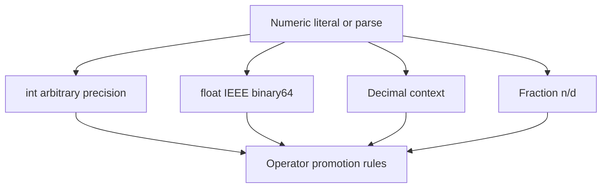
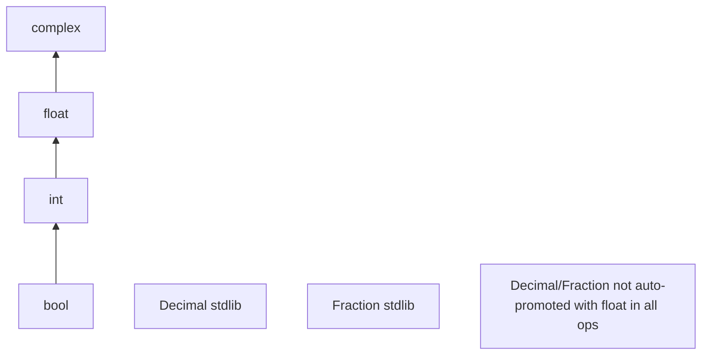
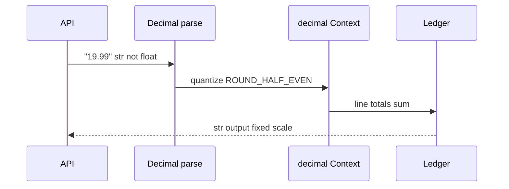

# Numbers Integers Floats Decimal and Fractions

## Overview

Python provides a **numeric tower**: `bool` ⊂ `int` ⊂ `numbers.Real` (via `float`) with `complex` parallel to reals; **`decimal.Decimal`** and **`fractions.Fraction`** in the standard library add exact decimal and rational arithmetic for domains that reject binary float rounding.

CPython **`int`** is arbitrary-precision signed integer (limbs/digits internally—see [[01-Computer-Science/01-Information-and-Representation/Integer Representation|Integer Representation]]). **`float`** wraps IEEE-754 binary64 (`double`). Operators promote types (`int` + `float` → `float`) following the numeric model in the Language Reference.

Production rule: **use the numeric type that matches the error budget**—counts and IDs as `int`, scientific computing as `float` + NumPy, money as `Decimal` with explicit context, rationals as `Fraction` when exact ratios matter.

## Learning Objectives

- Explain arbitrary-precision `int` behavior and performance cliffs
- Predict float rounding, `==` surprises, and `math.isclose` usage
- Configure `decimal` contexts for financial rounding modes
- Choose `Fraction` vs `Decimal` vs `float` with trade-off table
- Parse and serialize numbers safely at API boundaries

## Prerequisites

- [[03-Python/01-Values-Types-and-Data-Model/Built-in Types Overview|Built-in Types Overview]]
- [[01-Computer-Science/01-Information-and-Representation/Integer Representation|Integer Representation]]
- [[01-Computer-Science/01-Information-and-Representation/Floating Point|Floating Point]]

## Difficulty

`intermediate`

## Estimated Time

- Reading: 3 hours
- Exercises: 4 hours
- Mini project: 5 hours

## History

Python inherited C `double` floats from early versions; **`long`** was unbounded until unified with `int` in Python 3. **`decimal`** module (PEP 327, Python 2.4) implements General Decimal Arithmetic spec. **`fractions`** (2.6) added rationals. PEP 238 (true division) made `3/2 == 1.5`. Recent work improves int/str conversion performance and big-int algorithms in CPython 3.14+.

## Problem It Solves

Numeric bugs in production:

```python
>>> 0.1 + 0.2 == 0.3
False
>>> int(1e16) + 1 == int(1e16)
True  # float has only 53 bits of mantissa
```

Payment ledgers, tax lines, and inventory quantities fail when teams treat JSON floats as exact decimals. Integer overflow is rare in Python (no fixed-width wrap), but **silent float coercion** is common.

## Internal Implementation

### int (CPython)

- Sign-magnitude digit array in base `2**30` (platform-dependent `_PyLongDigit`)
- Small int cache [-5, 256] as singletons
- `int(" huge ", base=0)` uses specialized parsers; may allocate large objects

### float

- Binary64; `sys.float_info` exposes `epsilon`, `max`, `mant_dig`
- Hardware FP rules; `-0.0`, `inf`, `nan` per IEEE

### Decimal

- Software decimal floating point; precision and rounding via `Context`
- Often slower; not a drop-in for vectorized NumPy

### Fraction

- Numerator/denominator pair of ints, auto-reduced via `math.gcd`



## Mermaid Diagrams

### Structure: numeric tower promotion



### Sequence: money calculation pipeline



## Examples

### Minimal Example

```python
import math
from decimal import Decimal, localcontext, ROUND_HALF_EVEN
from fractions import Fraction

# Float surprise
assert math.isclose(0.1 + 0.2, 0.3)

# Exact rational
half = Fraction(1, 2)
third = Fraction(1, 3)
assert half + third == Fraction(5, 6)

# Decimal money
with localcontext() as ctx:
    ctx.rounding = ROUND_HALF_EVEN
    price = Decimal("19.99")
    tax = (price * Decimal("0.08875")).quantize(Decimal("0.01"))
    assert tax == Decimal("1.77")
```

### Production-Shaped Example

Billing service avoiding float at boundaries:

```python
from __future__ import annotations

from decimal import Decimal, InvalidOperation
from typing import Any


SCALE = Decimal("0.01")


def parse_money(value: Any) -> Decimal:
    if isinstance(value, bool):
        raise TypeError("bool is not a monetary amount")
    if isinstance(value, int):
        return Decimal(value).quantize(SCALE)
    if isinstance(value, str):
        try:
            d = Decimal(value.strip())
        except InvalidOperation as exc:
            raise ValueError(f"invalid money string: {value!r}") from exc
        if not d.is_finite():
            raise ValueError("non-finite amount")
        return d.quantize(SCALE)
    raise TypeError(f"unsupported money type: {type(value).__name__}")


def line_total(unit_price: str, quantity: int) -> str:
    total = parse_money(unit_price) * quantity
    return format(total.quantize(SCALE), "f")
```

JSON has no Decimal—transport as **string** or integer minor units (cents).

Cross-link: [[01-Computer-Science/01-Information-and-Representation/Fixed Point and Scaled Integers|Fixed Point and Scaled Integers]].

Labs: [[03-Python/code/README|Python code labs]].

## Trade-offs

| Type | Exactness | Speed | Interop | Use |
| --- | --- | --- | --- | --- |
| int | Exact integers | Fast until huge | JSON int | counts, IDs |
| float | Binary approx | Hardware fast | JSON number | science, ML |
| Decimal | Configurable decimal | Slower | stringify | money, tax |
| Fraction | Exact rationals | Can blow up | manual | ratios, teaching |

### When to Use

- **`int`**: quantities that must be exact integers (minor units as int cents)
- **`float`**: metrics, ML features, tolerances with `math.isclose`
- **`Decimal`**: currency with policy rounding
- **`Fraction`**: rational comparisons without float noise

### When Not to Use

- Do not use `float` for ledger balances
- Do not use huge `Fraction` denominators without normalization strategy
- Do not assume `int(json_number)` when JSON number may exceed IEEE exact range—use string

## Exercises

1. Explain `0.1 + 0.2` in binary scientific notation.
2. When does `float(n)` lose precision for large int `n`?
3. Implement `cents_to_dollars(cents: int) -> str` without float.
4. Compare `Decimal('1.0') / Decimal('3.0')` vs `1/3` float with 20 digits output.
5. Use `fractions.Fraction.from_float(0.1)`—what numerator/denominator appear?

## Mini Project

**Money DSL**

Small library: `Money` type wrapping `Decimal`, add/sub/mul with quantity, JSON schema as string decimal, property tests for associativity within quantize.

## Portfolio Project

Integrate float/decimal inspector into [[03-Python/projects/Python Runtime Toolkit/README|Python Runtime Toolkit]] tied to CS float note demos.

## Interview Questions

1. Why is `0.1 + 0.2 != 0.3` in Python?
2. How is Python `int` different from C `int32`?
3. When choose Decimal over float for e-commerce?
4. What does `math.isclose` compare that `==` does not?
5. Why is `bool` subclass of `int`?

### Stretch / Staff-Level

1. Design API accepting monetary values from JSON, CSV, and DB without float contamination.
2. Explain Karatsuba/multiplication strategies CPython uses for big ints at high level.

## Common Mistakes

- Using `round(2.675, 2)` expecting bankers rounding (float input already wrong)
- Parsing money with `float()` then `Decimal(float)`
- Dividing ints with `/` expecting floor (use `//`)
- Comparing floats with exact `==` in test assertions

## Best Practices

- Store money as integer minor units or decimal string in JSON
- Set explicit `decimal` context per request/thread for tax rules
- Use `math.isclose` with relative/absolute tolerances in tests
- Document numeric types in OpenAPI (`format: decimal` as string pattern)
- Profile hot numeric loops—consider NumPy on CPython 3.14+

## Summary

Python's numeric types trade exactness for performance and ergonomics across layers of the tower. Arbitrary-precision ints eliminate overflow surprises; floats inherit IEEE binary limitations; Decimal and Fraction address decimal and rational exactness at stdlib cost. Production systems declare numeric contracts at boundaries and never let JSON floats silently become money.

## Further Reading

- [[00-References/Python/README|Python References]]
- General Decimal Arithmetic specification
- [[01-Computer-Science/01-Information-and-Representation/Floating Point|Floating Point]]
- [[01-Computer-Science/01-Information-and-Representation/Integer Representation|Integer Representation]]

## Related Notes

- [[03-Python/01-Values-Types-and-Data-Model/Truthiness Equality and Identity|Truthiness Equality and Identity]]
- [[03-Python/01-Values-Types-and-Data-Model/Built-in Types Overview|Built-in Types Overview]]
- [[03-Python/06-Typing/Protocols TypedDict Literal and Narrowing|Protocols TypedDict Literal and Narrowing]]
- [[03-Python/README|Python Track]]

## Progress Checklist

- [ ] Explained from first principles
- [ ] Drew at least one Mermaid diagram
- [ ] Implemented a minimal version
- [ ] Documented trade-offs and non-goals
- [ ] Completed exercises
- [ ] Practiced interview questions aloud
- [ ] Linked prerequisites and dependents
