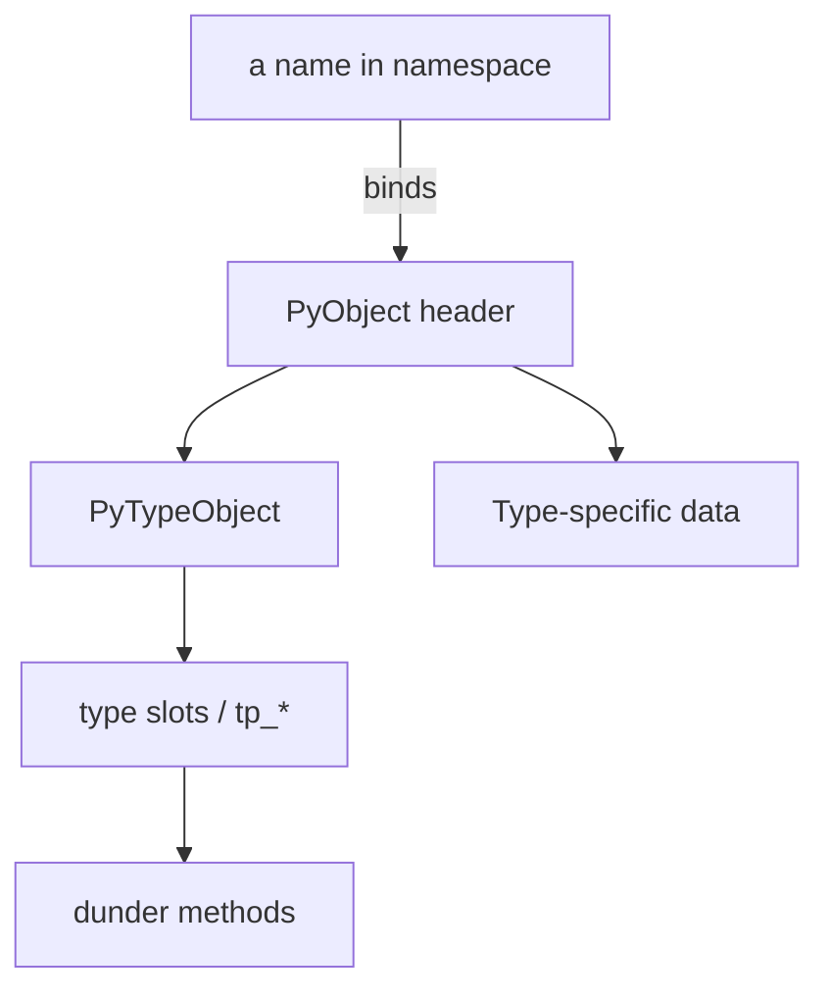
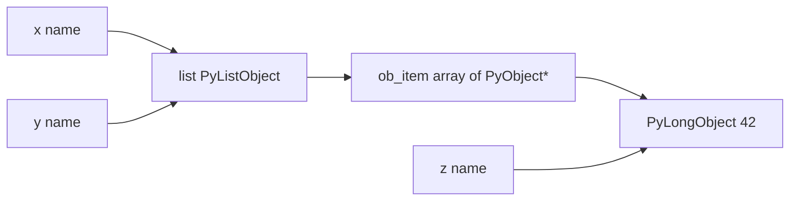
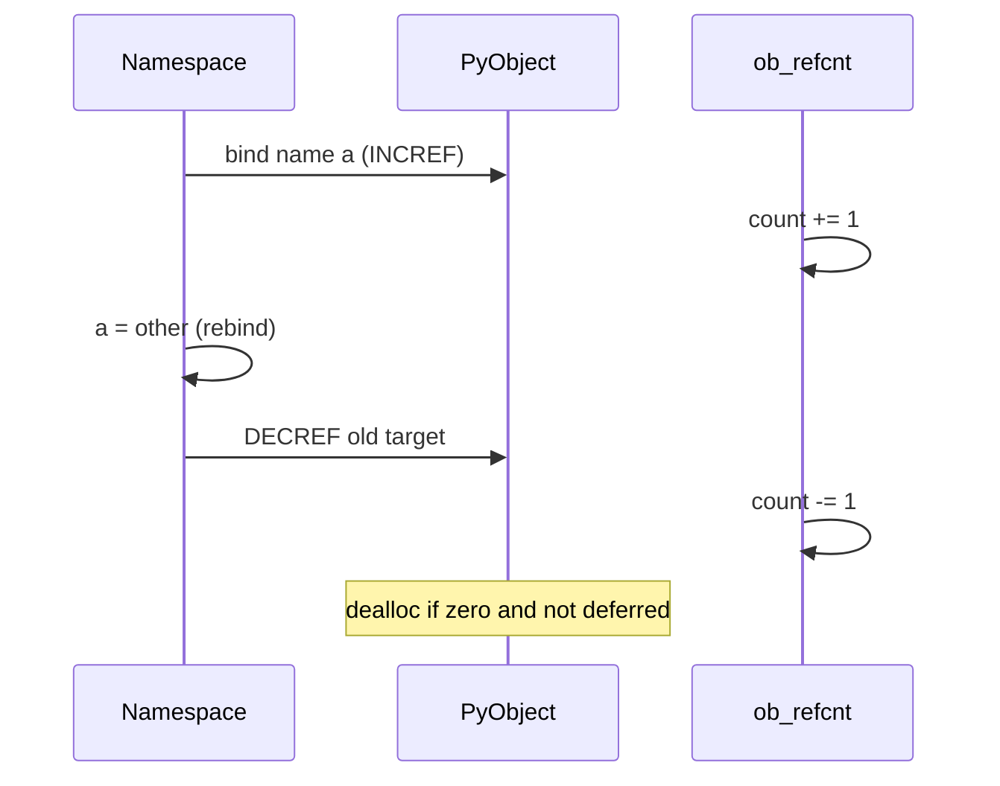

# Python Object Model and PyObject

## Overview

In Python semantics, **every value is an object**: integers, functions, modules, classes, `None`, and types themselves. CPython implements objects as C structures headed by **`PyObject`** (or type-specific extensions like `PyLongObject`), accessed through pointers at runtime. User code never sees `PyObject*` directly, but production debugging (memory leaks, reference cycles, C extensions) requires this model.

An object has:

- **Identity** — stable for lifetime (`id()`, `is`)
- **Type** — `type(obj)` determines **data model hooks** ([[03-Python/01-Values-Types-and-Data-Model/Special Methods and Data Model Hooks|Special Methods]])
- **Value** — state interpreted via type (`__eq__`, attributes, buffer protocol)

CPython 3.14+ adds **immortal objects**, **per-object mutex** fields in free-threaded builds, and ongoing layout optimizations—always label claims as implementation-specific.

## Learning Objectives

- Map Python values to `PyObject` layout at a conceptual level
- Explain reference counting interaction with the cycle collector
- Distinguish **object header** from **type-specific payload**
- Predict boxing costs for small integers and interned strings
- Read `sys.getsizeof` results with appropriate skepticism

## Prerequisites

- [[03-Python/00-Orientation/Why Python Exists|Why Python Exists]]
- [[01-Computer-Science/03-Memory-and-Addressing/Garbage Collection Models|Garbage Collection Models]]
- [[01-Computer-Science/01-Information-and-Representation/Bits Bytes and Information|Bits Bytes and Information]]

## Difficulty

`intermediate`

## Estimated Time

- Reading: 3 hours
- Exercises: 4 hours
- Mini project: 5 hours

## History

Python 1 unified `int` and `long` in Python 3 (PEP 237). **Unification of types and classes** (2.2) made `type` and `class` the same mechanism. **PEP 3137** prepared 3.0 object layout changes. Recent CPython work: **compact dict** (3.6+), **vectorcall** (3.8+), **immortal objects** (3.12+), **free-threading** object locks (3.13+). The **data model** is specified in the Language Reference; struct sizes vary by platform and build flags.

## Problem It Solves

Misunderstanding objects causes:

- Assuming assignment copies objects ([[03-Python/01-Values-Types-and-Data-Model/Mutability Sharing and Copying|Mutability]])
- Confusing `type(x)` with Java-style static types
- Memory leaks in C extensions (`Py_INCREF`/`Py_DECREF` imbalance)
- Surprises when `is` fails for small ints across interpreters (implementation detail)

First-principles object model predicts behavior before reading framework source.

## Internal Implementation

### PyObject header (conceptual)

All heap objects share:

```
ob_refcnt   — owned references (+ immortal flag bits in 3.12+)
ob_type     — pointer to PyTypeObject
```

Type-specific fields follow: `PyLongObject` digit array, `PyUnicodeObject` representation (compact ASCII/Latin-1/UTF-8/UCS-2/UCS-4), `PyDictObject` key/value table.

### Small integer cache

CPython caches integers **[-5, 256]** as singletons at startup. Outside range, new `PyLongObject` allocations (variable width arbitrary precision—see [[01-Computer-Science/01-Information-and-Representation/Integer Representation|Integer Representation]]).

### Names and references

Python variables are **names bound to objects**, not memory slots holding values. Assignment `a = obj` increments refcount (INCREF); rebinding decrements old (DECREF).

### Cycle GC

Refcount alone cannot collect cycles; generational GC traverses container objects. See [[03-Python/05-CPython-Runtime-and-Memory/Generational Cycle GC and gc Module|Generational Cycle GC]].



## Mermaid Diagrams

### Structure: object identity graph



Two names can share one list object; two names can bind the same int object if cached.

### Sequence: INCREF / DECREF on assignment



## Examples

### Minimal Example

```python
x = 256
y = 256
a = 257
b = 257

print(x is y)   # True — cached small int (CPython)
print(a is b)   # False — distinct objects

obj = object()
print(type(obj))       # <class 'object'>
print(type(type(obj))) # <class 'type'> — types are objects too
print(isinstance(obj, object))  # True
```

### Production-Shaped Example

Diagnose retention with `gc` and `weakref` (staging):

```python
from __future__ import annotations

import gc
import sys
import weakref
from typing import Any


class Resource:
    def __init__(self, name: str) -> None:
        self.name = name

    def __repr__(self) -> str:
        return f"Resource({self.name!r})"


def build_cache() -> dict[str, Resource]:
    cache: dict[str, Resource] = {}
    for i in range(10_000):
        r = Resource(f"item-{i}")
        cache[r.name] = r
        weakref.finalize(r, lambda n=r.name: print(f"finalized {n}"))
    return cache


def memory_snapshot(label: str, obj: Any) -> None:
    print(label, "getsizeof", sys.getsizeof(obj), "gc count", len(gc.get_objects()))


cache = build_cache()
memory_snapshot("after build", cache)
refs = weakref.WeakValueDictionary(cache)
del cache
gc.collect()
print("alive via weak refs:", len(refs))
```

`sys.getsizeof` excludes referenced objects—use tracemalloc for allocations.

Labs: [[03-Python/code/README|Python code labs]].

## Trade-offs

| Dimension | Upside | Downside | When it matters |
| --- | --- | --- | --- |
| Uniform object model | Consistent APIs, introspection | Per-object overhead | Millions of tiny objects |
| Refcount | Deterministic teardown | Cycle collector needed | C extensions |
| Arbitrary precision int | Correct math | Slower than fixed-width | Financial, crypto |
| Dynamic type | Flexibility | Harder static analysis | Large codebases |

### When to Use

- Lean on objects + protocols for extensibility (plugins, ORMs)
- Use `__slots__` when instance dict cost matters ([[03-Python/03-Classes-Descriptors-and-Metaprogramming/Slots Weakrefs and Object Layout|Slots Weakrefs and Object Layout]])

### When Not to Use

- Do not micro-optimize away clarity without profiling
- Do not rely on `is` for value comparison of integers outside cache range
- Do not assume `getsizeof` equals process RSS delta

## Exercises

1. Draw a diagram for `a = []; b = a; b.append(1)` showing shared object.
2. What is `type(None)`, `type(True)`, and `type(type)`?
3. Use `ctypes.pythonapi` (advanced) or documentation to explain why CPython small-int cache ends at 256.
4. Create a reference cycle; confirm `gc.collect()` frees it.
5. Compare `id(x)` to `x.__hash__()` for int vs list (why list unhashable?).

## Mini Project

**Refcount Simulator**

Implement a toy Python object graph in Python classes with explicit `inc_ref`/`dec_ref` and a mark-sweep cycle collector; demonstrate leak vs collected cycle.

## Portfolio Project

Extend [[03-Python/projects/Python Runtime Toolkit/README|Python Runtime Toolkit]] with object census: count by `type()`, top-N by `getsizeof` shallow sum.

## Interview Questions

1. Is everything in Python an object? Any exceptions at C level?
2. What lives in a `PyObject` header?
3. Difference between `type(x)` and `x.__class__` (edge cases)?
4. Why does CPython intern small integers?
5. How do immortal objects affect refcount semantics in 3.12+?

### Stretch / Staff-Level

1. Explain vectorcall calling convention vs `tp_call` for CPython 3.14+.
2. How does free-threaded CPython change object header locking without changing Python semantics?

## Common Mistakes

- Using `is` to compare strings that should use `==`
- Expecting `del x` to immediately free large object graphs (other references remain)
- Trusting `id()` persistence after object deallocation (IDs may be reused)
- Comparing object models directly to Java/C# without noting name binding

## Best Practices

- Model variables as **labels on objects**, especially mutable containers
- Use `weakref` for caches that should not prevent collection
- Instrument services with tracemalloc snapshots on memory regressions
- Document C extension ownership rules (`borrowed` vs `new` references)
- Cross-read [[01-Computer-Science/03-Memory-and-Addressing/Pointers References and Aliasing|Pointers References and Aliasing]]

## Summary

Python's object model unifies all values under dynamic types implemented by CPython as refcounted `PyObject` structures with type-specific payloads. Identity, type, and value semantics flow from this layout through dunder methods and protocols. Production engineering connects user-visible `is`/`type`/`getsizeof` to refcount, GC, and (in 3.14+) concurrency-aware headers—without requiring daily C coding, but requiring mental accuracy.

## Further Reading

- [[00-References/Python/README|Python References]]
- Python Language Reference — Data model
- CPython Internals — Objects chapter (3.14 docs)
- [[03-Python/05-CPython-Runtime-and-Memory/Reference Counting and Immortal Objects|Reference Counting and Immortal Objects]]

## Related Notes

- [[03-Python/01-Values-Types-and-Data-Model/Built-in Types Overview|Built-in Types Overview]]
- [[03-Python/01-Values-Types-and-Data-Model/Truthiness Equality and Identity|Truthiness Equality and Identity]]
- [[03-Python/01-Values-Types-and-Data-Model/Mutability Sharing and Copying|Mutability Sharing and Copying]]
- [[03-Python/01-Values-Types-and-Data-Model/Special Methods and Data Model Hooks|Special Methods and Data Model Hooks]]
- [[03-Python/README|Python Track]]

## Progress Checklist

- [ ] Explained from first principles
- [ ] Drew at least one Mermaid diagram
- [ ] Implemented a minimal version
- [ ] Documented trade-offs and non-goals
- [ ] Completed exercises
- [ ] Practiced interview questions aloud
- [ ] Linked prerequisites and dependents
