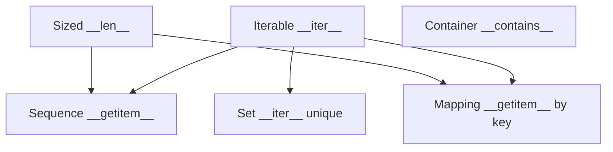
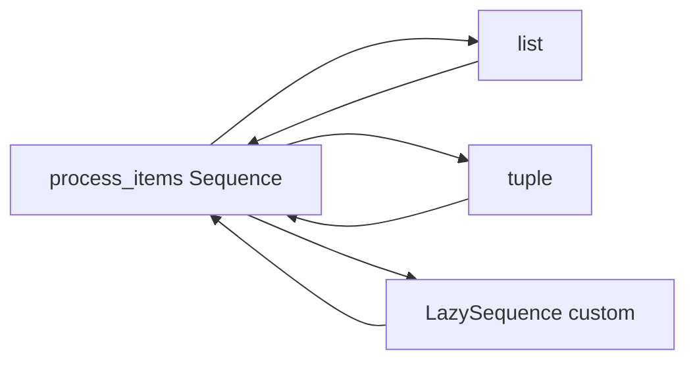
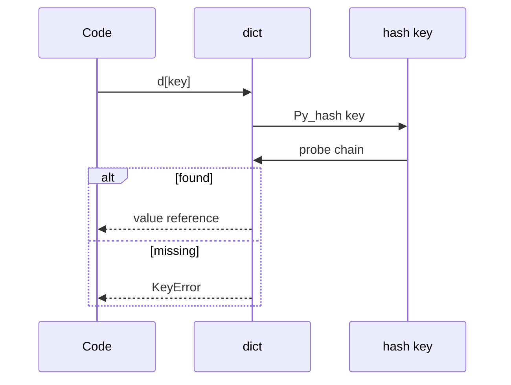

# Sequences Mappings and Sets as Protocols

## Overview

Python containers are defined by **protocols**—sets of methods and behaviors—rather than single inheritance trees. **`collections.abc`** formalizes **Sequence**, **Mapping**, **Set**, **Iterable**, **MutableMapping**, etc. Built-ins `list`, `dict`, and `set` register as virtual subclasses; user types can implement **`__getitem__`**, **`__len__`**, **`__iter__`**, **`__contains__`** to participate in generic algorithms.

Structural typing (`isinstance(x, Sequence)`) enables APIs that accept `list | tuple | memoryview` without overload explosion. This mirrors CS abstract data types ([[04-Data-Structures/README|Data Structures]]) while staying runtime-native.

Iteration often precedes full protocol compliance: **iterable** vs **iterator** distinction lives in [[03-Python/04-Iteration-Exceptions-and-Context/Iterator Protocol|Iterator Protocol]].

## Learning Objectives

- Map built-in containers to ABC protocols and required methods
- Implement minimal read-only Sequence for lazy views
- Choose Mapping vs Sequence vs Set for domain models
- Understand `keys()`/`items()` views and dict insertion order guarantees
- Write functions typed with `collections.abc` for flexibility

## Prerequisites

- [[03-Python/01-Values-Types-and-Data-Model/Built-in Types Overview|Built-in Types Overview]]
- [[03-Python/01-Values-Types-and-Data-Model/Mutability Sharing and Copying|Mutability Sharing and Copying]]

## Difficulty

`intermediate`

## Estimated Time

- Reading: 3 hours
- Exercises: 4 hours
- Mini project: 5 hours

## History

PEP 3119 (2008) introduced `collections.abc`. Dict insertion order implementation detail became language guarantee (3.7/3.8). **`typing`** generics (`Mapping[str, int]`) align with ABCs. 3.10+ **`issubclass` hooks** and pattern matching on mapping/sequence shapes increase protocol visibility.

## Problem It Solves

Framework code hardcoding `list`/`dict` rejects:

- `tuple` returns, `array.array`, third-party **ImmutableDict**
- NumPy arrays (sequence-like but not `Sequence` in strict sense—check carefully)
- Database rows exposing mapping interface

Protocol-oriented APIs reduce coupling and improve testability (fakes implement subset).

## Internal Implementation

### Sequence (conceptual requirements)

- `__getitem__(index)` (+ slice)
- `__len__`
- Often `__iter__` (default from getitem if missing in older patterns; `@Sequence.register` types implement fully)

`list` is **MutableSequence** with `append`, `extend`, `pop`.

### Mapping

- `__getitem__`, `__len__`, `__iter__` over keys
- `__contains__` optimizes membership
- `dict` uses compact hash table (open addressing); order preserved in combined table iteration

### Set

- `__contains__`, `__iter__`, `__len__`
- `set` hash table with dummy keys; `frozenset` immutable hashable



## Mermaid Diagrams

### Structure: API accepts protocols



### Sequence: dict lookup path



## Examples

### Minimal Example

```python
from collections.abc import Mapping, MutableMapping, Sequence

class LazyRange(Sequence):
    def __init__(self, start: int, stop: int) -> None:
        self._start = start
        self._stop = stop

    def __len__(self) -> int:
        return self._stop - self._start

    def __getitem__(self, index: int):
        if index < 0:
            index += len(self)
        if index < 0 or index >= len(self):
            raise IndexError(index)
        return self._start + index


def sum_sequence(items: Sequence[int]) -> int:
    return sum(items)

r = LazyRange(10, 13)
assert sum_sequence(r) == 33
assert isinstance(r, Sequence)
```

### Production-Shaped Example

Read-only config overlay (Mapping protocol):

```python
from __future__ import annotations

from collections.abc import Iterator, Mapping
from typing import Any


class ChainMap(Mapping[str, Any]):
    def __init__(self, *maps: Mapping[str, Any]) -> None:
        self._maps = maps

    def __getitem__(self, key: str) -> Any:
        for m in self._maps:
            if key in m:
                return m[key]
        raise KeyError(key)

    def __iter__(self) -> Iterator[str]:
        seen: set[str] = set()
        for m in self._maps:
            for k in m:
                if k not in seen:
                    seen.add(k)
                    yield k

    def __len__(self) -> int:
        return len(set(self))


defaults: Mapping[str, Any] = {"retries": 3, "timeout": 5.0}
overrides = {"timeout": 2.0}
cfg = ChainMap(overrides, defaults)
assert cfg["timeout"] == 2.0
assert cfg["retries"] == 3
```

Use stdlib `collections.ChainMap` in production unless custom precedence needed.

Cross-link: [[04-Data-Structures/00-Orientation-and-Contracts/Abstract Data Types vs Concrete Structures|Abstract Data Types vs Concrete Structures]]; for CPython `dict`/`set` internals see [[04-Data-Structures/04-Hash-Tables-and-Sets/Open Addressing|Open Addressing]] and [[04-Data-Structures/04-Hash-Tables-and-Sets/Sets Multisets and Map vs Set|Sets Multisets and Map vs Set]].

Labs: [[03-Python/code/README|Python code labs]].

## Trade-offs

| Protocol | Strength | Risk | Prefer |
| --- | --- | --- | --- |
| Sequence | Ordered index access | O(n) scan if misused | Rows, buffers |
| Mapping | Keyed lookup avg O(1) | Unhashable keys | Records, indexes |
| Set | Dedup/membership | Unordered | Tags, graph nodes |
| MutableMapping | In-place updates | Aliasing | Caches |
| Iterable only | Minimal contract | Multiple passes may exhaust | Generators |

### When to Use

- Type hints `Mapping[str, Any]` for JSON-like input
- Custom Sequence for lazy DB pagination views
- Set for deduplication before persistence

### When Not to Use

- Do not assume every Sequence supports mutation
- Do not iterate huge Mapping with repeated full scans—index externally
- Do not use `dict` when insertion-ordered traversal of huge data needs sort key

## Exercises

1. Implement read-only `Mapping` from two dicts with override precedence.
2. Verify `isinstance({}, Mapping)` and `isinstance([], Sequence)`.
3. Write function accepting `Iterable[int]` but rejecting str/bytes explicitly.
4. Benchmark `key in dict` vs list scan for 10⁵ keys.
5. Use `dict.fromkeys` to deduplicate preserving order—how does it work?

## Mini Project

**Protocol Validator**

Decorator verifying arguments implement required ABC methods at runtime (dev mode) with clear errors.

## Portfolio Project

Plugin registry using **Mapping** interface for [[03-Python/projects/Import Hook Plugin Loader/README|Import Hook Plugin Loader]] configuration.

## Interview Questions

1. Difference between Iterable and Iterator?
2. What methods define the Sequence protocol?
3. Are dicts ordered in Python 3?
4. Can you use a list as dict key? Why?
5. When prefer ABC `Sequence` over concrete `list` in API?

### Stretch / Staff-Level

1. Implement MutableMapping mixin using `__getitem__`/`__setitem__`/`__delitem__`/`__iter__` template.
2. Compare Python protocols to Go interfaces and Java interfaces.

## Common Mistakes

- Checking `type(x) is list` instead of sequence protocol
- Mutating dict while iterating keys
- Assuming `keys()` returns list (it's a view)
- Using `+=` on lists expecting extend on tuple (creates new tuple)

## Best Practices

- Annotate with `collections.abc` types in public APIs
- Document whether functions consume iterators once
- Return `MappingProxyType` or immutable snapshots when exposing internals
- Use `|` union of concrete types only at application leaf code
- Link [[03-Python/04-Iteration-Exceptions-and-Context/Iterator Protocol|Iterator Protocol]]

## Summary

Sequences, mappings, and sets in Python are behavioral protocols backed by efficient built-in implementations and ABC documentation. Generic functions over protocols survive new container types and simplify testing. Production design chooses the protocol matching access patterns—indexed, keyed, or unique membership—and respects mutability and iterator exhaustion rules.

## Further Reading

- [[00-References/Python/README|Python References]]
- Python docs — `collections.abc`
- PEP 3119 — Introducing Abstract Base Classes
- [[04-Data-Structures/README|Data Structures Track]]

## Related Notes

- [[03-Python/01-Values-Types-and-Data-Model/Built-in Types Overview|Built-in Types Overview]]
- [[03-Python/01-Values-Types-and-Data-Model/Special Methods and Data Model Hooks|Special Methods and Data Model Hooks]]
- [[03-Python/04-Iteration-Exceptions-and-Context/Iterator Protocol|Iterator Protocol]]
- [[03-Python/06-Typing/Protocols TypedDict Literal and Narrowing|Protocols TypedDict Literal and Narrowing]]
- [[04-Data-Structures/00-Orientation-and-Contracts/Abstract Data Types vs Concrete Structures|Abstract Data Types vs Concrete Structures]]
- [[04-Data-Structures/01-Contiguous-Sequences/Dynamic Arrays and Amortized Growth|Dynamic Arrays and Amortized Growth]]
- [[04-Data-Structures/04-Hash-Tables-and-Sets/Open Addressing|Open Addressing]]
- [[04-Data-Structures/04-Hash-Tables-and-Sets/Sets Multisets and Map vs Set|Sets Multisets and Map vs Set]]
- [[03-Python/README|Python Track]]

## Progress Checklist

- [ ] Explained from first principles
- [ ] Drew at least one Mermaid diagram
- [ ] Implemented a minimal version
- [ ] Documented trade-offs and non-goals
- [ ] Completed exercises
- [ ] Practiced interview questions aloud
- [ ] Linked prerequisites and dependents
