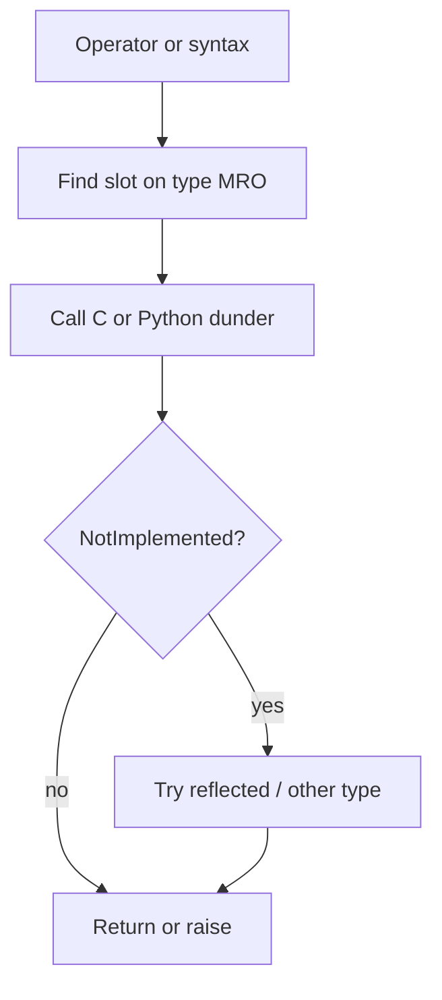
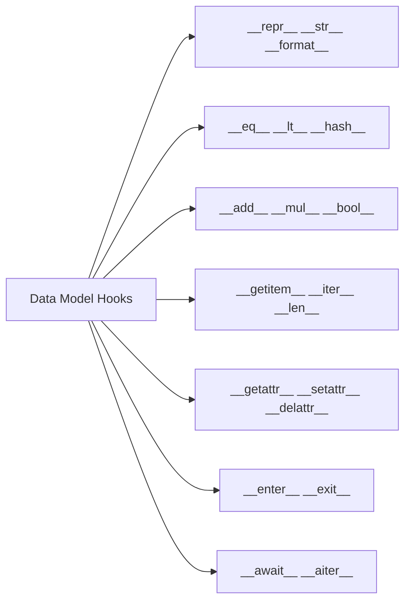
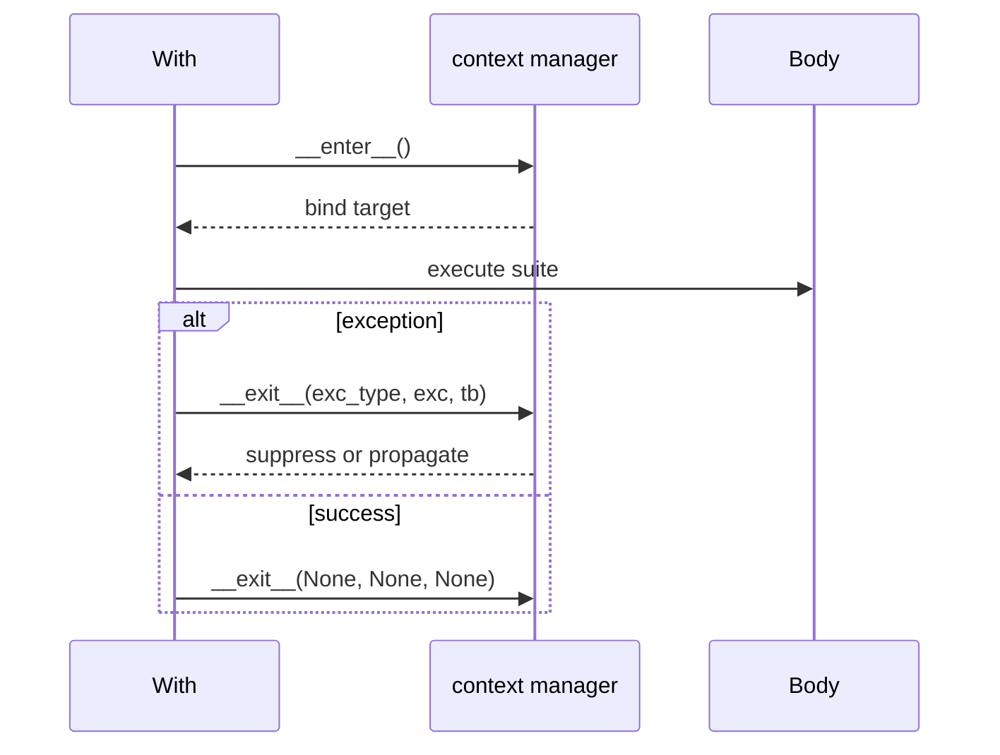

# Special Methods and Data Model Hooks

## Overview

**Special methods** (historically "dunder" for double underscore) are hooks the Python interpreter invokes during operations: `__add__` for `+`, `__getitem__` for `[]`, `__enter__` for `with`. They form the **data model**—the contract that lets user-defined classes behave like built-ins without syntax changes.

The Language Reference specifies **symmetric rules**: if `a.__add__(b)` returns `NotImplemented`, Python tries `b.__radd__(a)`. Incorrect hooks break **`==`/`hash` invariants**, context managers, and async protocols.

CPython 3.14+ may inline or specialize some dunder paths in bytecode, but semantics remain defined by the data model—not implementation shortcuts.

## Learning Objectives

- Categorize special methods: representation, comparison, numeric, container, attribute, context, async
- Implement minimal hooks for a domain type without overloading every operator
- Maintain `__eq__`/`__hash__` consistency for hashable types
- Avoid infinite recursion in `__getattr__`/`__setattr__` pairs
- Map dunder methods to protocols in [[03-Python/01-Values-Types-and-Data-Model/Sequences Mappings and Sets as Protocols|Sequences Mappings and Sets as Protocols]]

## Prerequisites

- [[03-Python/01-Values-Types-and-Data-Model/Python Object Model and PyObject|Python Object Model and PyObject]]
- [[03-Python/01-Values-Types-and-Data-Model/Sequences Mappings and Sets as Protocols|Sequences Mappings and Sets as Protocols]]
- [[03-Python/01-Values-Types-and-Data-Model/Callables and the Call Protocol|Callables and the Call Protocol]]

## Difficulty

`advanced`

## Estimated Time

- Reading: 4 hours
- Exercises: 5 hours
- Mini project: 6 hours

## History

Unified type/class model (2.2) made dunder methods the standard extension point. **`@functools.total_ordering`** (3.2) reduces comparison boilerplate. **`dataclasses`** auto-generate `__eq__`, optional `__hash__`. **`__slots__`** interacts with attribute hooks. Async methods (`__aiter__`, `__aenter__`) added with asyncio (3.5+). Pattern matching (3.10) uses `__match_args__` on dataclasses.

## Problem It Solves

Frameworks simulate language features via dunder methods:

- ORMs implement `__getattr__` for column access
- NumPy defines rich numeric hooks
- Context managers implement `__enter__`/`__exit__`
- Path-like objects implement `__fspath__`

Without data model literacy, debugging shows "impossible" operator behavior or swallowed exceptions in `__exit__`.

## Internal Implementation

### Hook invocation (example: addition)

```
a + b  →  type(a).__add__(a, b)  or  type(b).__radd__(b, a)
```

Bytecode `BINARY_OP` (3.11+) dispatches to slot functions when types known.

### Representation

- `__repr__` developer-facing, ideally unambiguous
- `__str__` user-facing; falls back to `__repr__`

### Hash/equality contract

If `a == b`, then `hash(a) == hash(b)`. Mutable objects should set `__hash__ = None`.

### Attribute access order (simplified)

For `obj.name`:

1. Data descriptor on type (`__get__` with priority)
2. Instance `__dict__` / slots
3. Non-data descriptor on type
4. Type `__dict__`
5. `__getattr__` if defined

Full rules: [[03-Python/03-Classes-Descriptors-and-Metaprogramming/Classes Instances and Attribute Lookup|Classes Instances and Attribute Lookup]].



## Mermaid Diagrams

### Structure: dunder categories



### Sequence: context manager protocol



## Examples

### Minimal Example

```python
from __future__ import annotations

from dataclasses import dataclass


@dataclass(frozen=True, slots=True)
class Vector2:
    x: float
    y: float

    def __add__(self, other: Vector2) -> Vector2:
        if not isinstance(other, Vector2):
            return NotImplemented
        return Vector2(self.x + other.x, self.y + other.y)

    def __repr__(self) -> str:
        return f"Vector2(x={self.x!r}, y={self.y!r})"


v = Vector2(1, 2) + Vector2(3, 4)
assert repr(v) == "Vector2(x=4, y=6)"
```

### Production-Shaped Example

Resource handle with context manager and explicit close:

```python
from __future__ import annotations

import socket
from types import TracebackType
from typing import Optional, Type


class TcpConnection:
    def __init__(self, host: str, port: int, timeout: float = 5.0) -> None:
        self._host = host
        self._port = port
        self._timeout = timeout
        self._sock: Optional[socket.socket] = None

    def __enter__(self) -> socket.socket:
        self._sock = socket.create_connection((self._host, self._port), self._timeout)
        return self._sock

    def __exit__(
        self,
        exc_type: Optional[Type[BaseException]],
        exc: Optional[BaseException],
        tb: Optional[TracebackType],
    ) -> bool:
        if self._sock is not None:
            try:
                self._sock.shutdown(socket.SHUT_RDWR)
            except OSError:
                pass
            self._sock.close()
            self._sock = None
        return False  # never suppress exceptions

    def __repr__(self) -> str:
        state = "open" if self._sock else "closed"
        return f"TcpConnection({self._host!r}, {self._port!r}, {state})"


with TcpConnection("example.com", 443) as sock:
    sock.sendall(b"GET / HTTP/1.0\r\n\r\n")
```

Prefer [[03-Python/04-Iteration-Exceptions-and-Context/Context Managers and contextlib|contextlib]] helpers for composition.

Labs: [[03-Python/code/README|Python code labs]].

## Trade-offs

| Hook surface | Upside | Downside | When |
| --- | --- | --- | --- |
| Rich numeric ops | Natural DSL | Large API surface | math libs |
| `__getattr__` lazy attrs | Ergonomic ORM | Harder static analysis | frameworks |
| `__slots__` | Memory | No arbitrary attrs | high volume |
| Custom `__eq__` | Domain semantics | Hash contract burden | value types |
| Async dunder | Native asyncio | Easy to misuse | I/O types |

### When to Use

- Implement **minimal** hook set matching how type is used
- `@dataclass(frozen=True)` for value objects instead of hand-written `__eq__`
- Context managers for acquire/release symmetry

### When Not to Use

- Do not override every operator "for completeness"
- Do not raise in `__bool__` unless truly exceptional
- Do not use `__getattribute__` unless you accept infinite recursion risk

## Exercises

1. Implement `Money` with `__add__`, `__eq__`, `__hash__` using integer cents internally.
2. Write class where `__eq__` True but hashes differ—explain violation.
3. Build context manager suppressing only `FileNotFoundError`.
4. Add `__match_args__` to dataclass for pattern matching demo (3.10+).
5. Use `dis` to find `BINARY_OP` or `CALL` invoking dunder on custom class.

## Mini Project

**Vector DSL**

Small 2D/3D vector type with selected operators, `__matmul__` for dot product, and Hypothesis tests for algebraic laws where applicable.

## Portfolio Project

Validated field descriptors using data model hooks in [[03-Python/projects/Descriptor Validated Fields/README|Descriptor Validated Fields]].

## Interview Questions

1. What is `NotImplemented` in dunder methods?
2. Difference between `__str__` and `__repr__`?
3. Why must hashable objects compare equal imply same hash?
4. Order of attribute lookup for `obj.attr`?
5. What does `__exit__` return value mean?

### Stretch / Staff-Level

1. Design ORM attribute access without overriding `__getattribute__` everywhere (descriptors).
2. Explain how `functools.total_ordering` fills missing comparison methods.

## Common Mistakes

- Returning `False` instead of `NotImplemented` from binary ops
- Defining `__eq__` on mutable class without disabling `__hash__`
- `__repr__` that cannot reconstruct object but looks like it can
- Swallowing exceptions in `__exit__` returning True accidentally

## Best Practices

- Follow **EAFP** with protocols; implement dunder when syntax sugar helps users
- Document which operators are supported
- Use `typing.SupportsRichComparison` etc. where relevant
- Test hook symmetry (`a+b` vs `b+a` for reflected ops)
- Defer descriptor depth to [[03-Python/03-Classes-Descriptors-and-Metaprogramming/Properties and the Descriptor Protocol|Descriptor Protocol]]

## Summary

Special methods are Python's official extension points connecting syntax to semantics. The data model specifies cooperation rules between types—reflection, containers, callables, context, and async. CPython 3.14+ optimizes dispatch, but correct user code targets documented hook contracts. Production types implement the smallest hook set that makes the abstraction feel native while preserving equality, hashing, and resource safety invariants.

## Further Reading

- [[00-References/Python/README|Python References]]
- Python Language Reference — Data model (full dunder table)
- Fluent Python — chapters on special methods
- [[03-Python/03-Classes-Descriptors-and-Metaprogramming/Properties and the Descriptor Protocol|Properties and the Descriptor Protocol]]

## Related Notes

- [[03-Python/01-Values-Types-and-Data-Model/Truthiness Equality and Identity|Truthiness Equality and Identity]]
- [[03-Python/03-Classes-Descriptors-and-Metaprogramming/Classes Instances and Attribute Lookup|Classes Instances and Attribute Lookup]]
- [[03-Python/04-Iteration-Exceptions-and-Context/Context Managers and contextlib|Context Managers and contextlib]]
- [[03-Python/04-Iteration-Exceptions-and-Context/Iterator Protocol|Iterator Protocol]]
- [[03-Python/README|Python Track]]

## Progress Checklist

- [ ] Explained from first principles
- [ ] Drew at least one Mermaid diagram
- [ ] Implemented a minimal version
- [ ] Documented trade-offs and non-goals
- [ ] Completed exercises
- [ ] Practiced interview questions aloud
- [ ] Linked prerequisites and dependents
