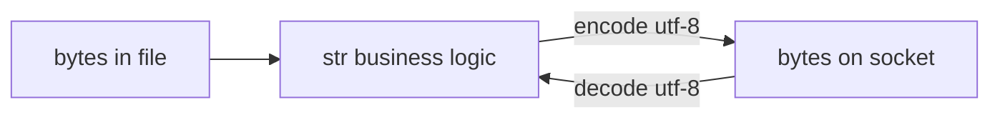
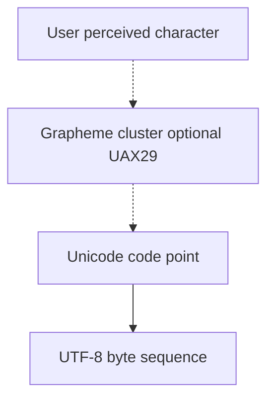
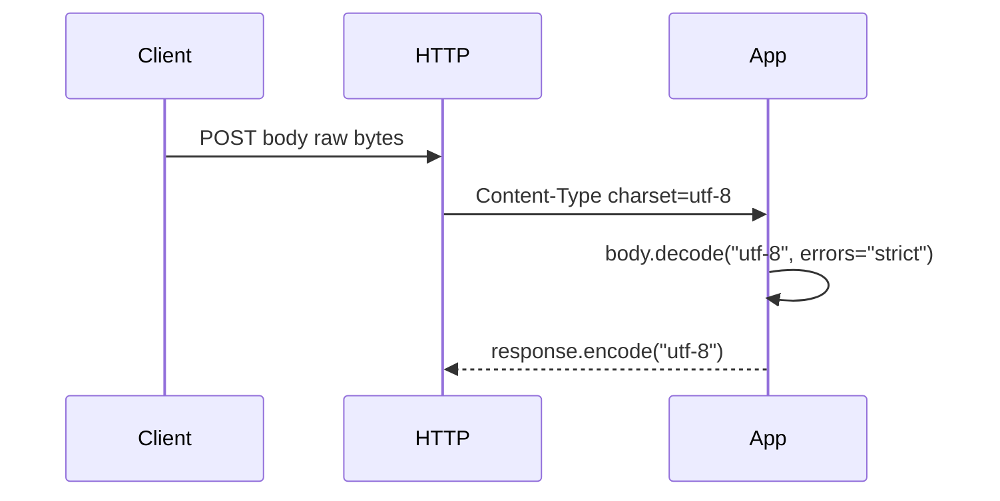

# Strings Bytes and Unicode

## Overview

Python 3 draws a hard line: **`str`** holds Unicode **code points** (abstract characters, not necessarily one glyph); **`bytes`** and **`bytearray`** hold **octets** (0–255) for wire formats, files, and crypto. Conversion happens only at explicit boundaries via **`encode()`** / **`decode()`** with a named **codec** (usually `utf-8`).

This design prevents silent corruption that plagued Python 2's dual string types. Production failures still occur when teams log binary as text, assume one code point equals one user-perceived character, or ignore **Unicode normalization** in identifiers and passwords.

CPython 3.14+ uses **compact string representations** (PEP 393 flexible internal storage: Latin-1, UCS-2, or UCS-4 depending on content) — implementation detail affecting memory, not semantics.

## Learning Objectives

- Distinguish code points, grapheme clusters, and UTF-8 byte sequences
- Encode/decode with error handlers (`strict`, `replace`, `surrogateescape`)
- Apply normalization (NFC/NFKD) for comparison and storage
- Use `bytes`/`memoryview` for binary protocols without copying
- Handle filesystem and subprocess encoding on Windows vs POSIX

## Prerequisites

- [[03-Python/01-Values-Types-and-Data-Model/Built-in Types Overview|Built-in Types Overview]]
- [[01-Computer-Science/01-Information-and-Representation/Character Encoding|Character Encoding]]
- [[01-Computer-Science/01-Information-and-Representation/Bits Bytes and Information|Bits Bytes and Information]]

## Difficulty

`intermediate`

## Estimated Time

- Reading: 3 hours
- Exercises: 4 hours
- Mini project: 5 hours

## History

PEP 3137/3100 drove Python 3 text model. PEP 393 (3.3) flexible string representation reduced memory for ASCII-heavy workloads. **`surrogateescape`** (PEP 383) helps Unix filenames with undecodable bytes. Ongoing: improved UTF-8 validation, `str.removeprefix`/`removesuffix` (3.9), enhanced f-string/formatting in 3.14+.

## Problem It Solves

| Failure | Cause |
| --- | --- |
| Mojibake in logs | Wrong codec assumed |
| Length mismatch UI vs DB | Counting code points vs graphemes vs bytes |
| Case-insensitive auth bypass | Unicode normalization differences |
| `TypeError` mixing str/bytes | Missing boundary encode |

Explicit text/binary separation aligns with [[01-Computer-Science/01-Information-and-Representation/Endianness and Binary Layout|binary layout]] discipline.

## Internal Implementation

### str (CPython compact)

- Stores max code point determines width (1/2/4 bytes per code point internal)
- **Interned** identifiers and some literals share memory
- `len(s)` is code point count, not UTF-8 byte length

### bytes

- Immutable `PyBytesObject` array; `b"\xff"` valid
- Concatenation allocates new buffer

### bytearray

- Mutable bytes; useful for zero-copy-ish building then freeze with `bytes(buf)`

### encode/decode pipeline

```
str --encode(codec)--> bytes --decode(codec)--> str
```

Errors must be policy: fail closed (`strict`) vs lossy logging (`replace`).



## Mermaid Diagrams

### Structure: Unicode layers



Python `str` indexes code points unless external libraries (e.g., `regex`, `grapheme`) used.

### Sequence: HTTP body handling



## Examples

### Minimal Example

```python
s = "café"
assert len(s) == 4  # code points
utf8 = s.encode("utf-8")
assert len(utf8) == 5  # é is two UTF-8 bytes

raw = b"\xc3\xa9"  # UTF-8 for é
assert raw.decode("utf-8") == "é"

# Never: "text" + b"bytes"  # TypeError
```

Normalization:

```python
import unicodedata

s1 = "é"           # single code point U+00E9
s2 = "e\u0301"     # e + combining acute
assert s1 == s2      # False
assert unicodedata.normalize("NFC", s2) == s1
```

### Production-Shaped Example

Safe filename storage on Unix with `surrogateescape`:

```python
from __future__ import annotations

import os
from pathlib import Path


def read_dir_names(path: Path) -> list[str]:
    names: list[str] = []
    for entry in os.scandir(path):
        # os.fsdecode uses surrogateescape on Unix for undecodable names
        names.append(os.fsdecode(os.fsencode(entry.name)))
    return names


def write_utf8_log(line: str, fh) -> None:
    data = (line.rstrip("\n") + "\n").encode("utf-8", errors="strict")
    fh.buffer.write(data)  # binary layer beneath TextIOWrapper
```

Password/username comparison:

```python
import unicodedata

def normalize_username(name: str) -> str:
    name = unicodedata.normalize("NFKC", name.strip())
    if len(name) == 0:
        raise ValueError("empty username")
    return name.casefold()
```

Labs: [[03-Python/code/README|Python code labs]].

## Trade-offs

| Approach | Upside | Downside | When |
| --- | --- | --- | --- |
| `str` everywhere internally | Correct text ops | Must encode at I/O | Apps |
| `bytes` on wire | Exact octets | Not human readable | Crypto, protobuf |
| `errors=replace` | Never crashes | Silent data loss | Debug only |
| `surrogateescape` | Round-trip filenames | Surrogate code points | Unix paths |
| grapheme libraries | User-visible length | Extra dependency | UI limits |

### When to Use

- **`utf-8`** default for HTTP, JSON, logs (with `\n` line endings documented)
- **`bytes`** for HMAC, hashes, image payloads
- **NFKC + casefold** for identifier comparison

### When Not to Use

- Do not use `str` to hold arbitrary binary (use `bytes`)
- Do not assume `len(str)` equals display width in terminal
- Do not decode untrusted bytes without size limits (DoS via huge strings)

## Exercises

1. Encode `"🐍"` to UTF-8; report code points and byte length.
2. Demonstrate mojibake: decode UTF-8 bytes as `latin-1`.
3. Compare `s.index("x")` vs byte search in `memoryview`.
4. Write round-trip test NFC/NFD for usernames.
5. Read `sys.getdefaultencoding()` and `locale.getpreferredencoding(False)`—when differ?

## Mini Project

**Encoding Diagnostic CLI**

Given a file, detect likely UTF-8 vs Latin-1 vs binary; report confidence, BOM, invalid sequences with offsets.

## Portfolio Project

Extend [[01-Computer-Science/projects/UTF-8 and Float Inspector/README|UTF-8 and Float Inspector]] with Python `str`/`bytes` toggles via [[03-Python/code/README|code labs]].

## Interview Questions

1. Difference between `str` and `bytes` in Python 3?
2. What does `len("👋")` return and why?
3. When use `errors="surrogateescape"`?
4. NFC vs NFD—why matter for passwords?
5. Is UTF-8 fixed-width?

### Stretch / Staff-Level

1. Design logging pipeline accepting arbitrary user text without encoding exceptions crashing process.
2. Explain PEP 393 compact string memory strategy at high level.

## Common Mistakes

- `open(path, "w")` without `encoding="utf-8"` on Windows
- Hashing strings without encoding agreement (`"café".encode()`)
- Using `str` bytes-like `%` formatting on mixed types
- Slicing UTF-8 bytes assuming character boundaries

## Best Practices

- Pass `encoding="utf-8"` explicitly in `open`, `subprocess`, HTTP clients
- Compare identifiers with normalization + casefold
- Bound input size before decode
- Use `memoryview` and `struct` for binary parsing
- Link [[01-Computer-Science/01-Information-and-Representation/Character Encoding|Character Encoding]]

## Summary

Python 3's `str`/`bytes` split enforces Unicode discipline: text in code points, octets on the wire, explicit codecs at boundaries. CPython optimizes string storage internally, but semantics follow the Unicode standard. Production systems encode early, decode late, normalize for comparison, and never treat financial or crypto bytes as text.

## Further Reading

- [[00-References/Python/README|Python References]]
- Unicode Standard — normalization, UTF-8
- PEP 393 — Flexible String Representation
- [[01-Computer-Science/01-Information-and-Representation/Character Encoding|Character Encoding]]

## Related Notes

- [[03-Python/01-Values-Types-and-Data-Model/Built-in Types Overview|Built-in Types Overview]]
- [[03-Python/01-Values-Types-and-Data-Model/Truthiness Equality and Identity|Truthiness Equality and Identity]]
- [[03-Python/09-Production-Python/Secure Python Practices|Secure Python Practices]]
- [[03-Python/README|Python Track]]

## Progress Checklist

- [ ] Explained from first principles
- [ ] Drew at least one Mermaid diagram
- [ ] Implemented a minimal version
- [ ] Documented trade-offs and non-goals
- [ ] Completed exercises
- [ ] Practiced interview questions aloud
- [ ] Linked prerequisites and dependents
