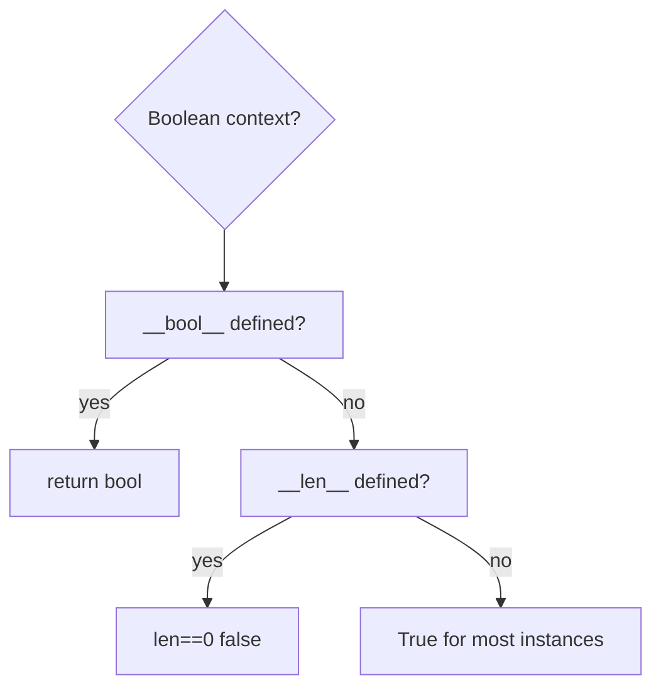
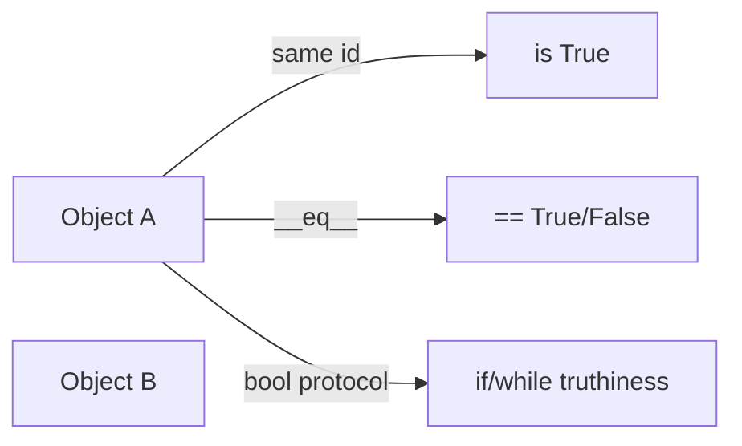
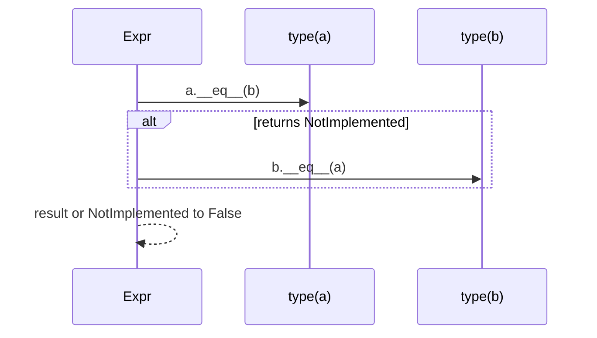

# Truthiness Equality and Identity

## Overview

Python separates three distinct questions about values:

1. **Identity** — Are these the same object? (`is`, `id`)
2. **Equality** — Do these values compare equal? (`==`, type-specific `__eq__`)
3. **Truthiness** — Does this value act as true/false in boolean context? (`bool(x)`, `if x:`)

Confusing them causes subtle bugs: `is` for small integers works accidentally due to caching; `==` on floats needs tolerances; empty containers are falsy but not `None`; custom classes default to identity-based `==` unless overridden.

This note formalizes the data model rules from the Language Reference and connects to hashing ([[03-Python/01-Values-Types-and-Data-Model/Mutability Sharing and Copying|Mutability]]) and special methods ([[03-Python/01-Values-Types-and-Data-Model/Special Methods and Data Model Hooks|Special Methods]]).

## Learning Objectives

- Apply `is` only for singletons (`None`, `True`, `False`) and intentional identity checks
- Predict default `__eq__`/`__hash__` behavior for user classes
- List built-in falsy values and exceptions (`CustomBool`, NumPy arrays)
- Implement equality consistent with hashing for dict keys
- Write tests comparing `==` vs `is` deliberately

## Prerequisites

- [[03-Python/01-Values-Types-and-Data-Model/Python Object Model and PyObject|Python Object Model and PyObject]]

## Difficulty

`beginner`

## Estimated Time

- Reading: 2 hours
- Exercises: 3 hours
- Mini project: 3 hours

## History

Python inherited `is` from identity semantics in CPython pointer equality. Rich comparisons (PEP 207) unified `<`, `==`, etc. **`__bool__`** and **`__len__`** truthiness rules documented in Language Reference. Dataclass-generated `__eq__` (3.7+) made value equality common. **`typing`** and linters now flag `is` misuse with literals.

## Problem It Solves

Production bug patterns:

```python
if user_id:        # rejects 0
if status is "done":  # may fail — string interning not guaranteed
if items == []:    # allocates new list each compare — use `not items`
```

Security: timing-safe comparison requires `hmac.compare_digest` for secrets, not `==`.

## Internal Implementation

### Identity

CPython `is` compares pointer addresses (after coercion none). `id(obj)` returns integer identity (unique among simultaneously live objects).

### Equality

`PyObject_RichCompare` dispatches `__eq__`; returns `NotImplemented` to try reverse/other type. **`==` never falls back to identity** unless `__eq__` absent (then identity default for user classes).

### Truthiness

`PyObject_IsTrue`:

1. If `__bool__` defined, use it (must return bool or raise)
2. Else if `__len__` defined, zero is false
3. Else true for user instances

Built-in falsy: `None`, `False`, `0`, `0.0`, `0j`, empty containers, `range(0)`, custom `__bool__` returning False.



## Mermaid Diagrams

### Structure: three relations



Identity implies equality for same object, but not conversely.

### Sequence: == dispatch



## Examples

### Minimal Example

```python
a = [1, 2]
b = [1, 2]
c = a

assert a == b
assert a is not b
assert a is c

assert None is None
assert (0 is False) is False  # different objects, 0 == False True

assert not []
assert not ""
assert not 0
```

### Production-Shaped Example

Value object with consistent `__eq__` and `__hash__`:

```python
from __future__ import annotations

from dataclasses import dataclass


@dataclass(frozen=True, slots=True)
class UserId:
    value: int

    def __post_init__(self) -> None:
        if isinstance(self.value, bool):
            raise TypeError("user id cannot be bool")
        if self.value < 0:
            raise ValueError("user id must be non-negative")


def authenticate(session_user: UserId | None, resource_owner: UserId) -> bool:
    if session_user is None:  # identity check for singleton None
        return False
    return session_user == resource_owner  # value equality


uid = UserId(42)
cache = {uid: "profile"}
assert cache[UserId(42)] == "profile"
```

Secrets comparison:

```python
import hmac

def safe_equal(a: bytes, b: bytes) -> bool:
    return hmac.compare_digest(a, b)
```

Labs: [[03-Python/code/README|Python code labs]].

## Trade-offs

| Check | Cost | Semantics | Use |
| --- | --- | --- | --- |
| `is` | Cheapest | Identity | None, sentinel objects |
| `==` | May invoke Python | Value | Business logic |
| `isinstance` | MRO walk | Type structure | Validation |
| truthiness | May call dunder | Boolean context | `if items` |

### When to Use

- `is None` / `is not None` exclusively for None checks (PEP 8)
- `==` for value comparison; override thoughtfully in domain types
- `not container` for empty tests

### When Not to Use

- Never `is` for `str`, `int` (except `-5..256` accidents), `float` literals
- Do not use truthiness on `0` or empty string when they are valid data
- Do not implement `__eq__` without considering `__hash__` if used as dict key

## Exercises

1. Explain why `True == 1` but `True is not 1`.
2. Implement class with `__eq__` but broken `__hash__`; observe dict key lookup failure.
3. List all built-in falsy values from docs; test each.
4. Write pytest cases for `safe_equal` timing (conceptual—why constant time matters).
5. When does `float('nan') == float('nan')` evaluate False?

## Mini Project

**Linter Rule**

Static checker (AST) flagging `is` comparisons to literals except `None`, `True`, `False` in test/production code.

## Portfolio Project

Add **Equality/Identity lab** to [[03-Python/projects/Python Runtime Toolkit/README|Python Runtime Toolkit]] visualizing `id` and `==` outcomes.

## Interview Questions

1. Difference between `==` and `is`?
2. Why use `if x is None` instead of `if not x`?
3. What makes an object hashable?
4. If `a == b`, must `hash(a) == hash(b)`?
5. Default truthiness of custom class instance?

### Stretch / Staff-Level

1. Explain `NotImplemented` vs raising in rich comparisons.
2. Design sentinel pattern distinct from None for "missing config" vs "explicit null".

## Compatibility Notes (CPython 3.14+)

- **`is` on interned literals**: CPython interns some strings at compile time in the same code object, but **never rely on `is` for string equality**—behavior differs across implementations and compilation units.
- **`bool` subclass of `int`**: Persists for historical reasons; always check `bool` before `int` in validation (`isinstance(x, bool)` then `isinstance(x, int)`).
- **NumPy / pandas**: Third-party scalars may define custom `__bool__` or raise on ambiguous truthiness—use `.any()`, `.empty`, or explicit `.size` checks instead of bare `if arr:` in production pipelines.
- **Free-threaded builds**: Identity (`id`, `is`) remains stable per object lifetime; equality hooks must remain thread-safe if they touch shared mutable state—prefer immutable value types for map keys in concurrent code.

## Common Mistakes

- `if flag:` when `flag` can be `0` or `""`
- Using `is` with interned-looking strings
- Mutating object used as dict key after insert (hash breaks)
- Defining `__eq__` on mutable classes without disabling `__hash__`

## Best Practices

- Use `@dataclass(frozen=True)` for value types in maps/sets
- Compare secrets with `hmac.compare_digest`
- Explicit comparisons in APIs (`is not None`) in type-narrowed code
- Document equality contract in public types
- Cross-link [[01-Computer-Science/01-Information-and-Representation/Checksums and Error Detection|Checksums]] for digest equality

## Summary

Identity, equality, and truthiness answer different questions in Python's object model. CPython implements identity as pointer equality and equality via rich comparison protocols; boolean context uses `__bool__` or `__len__`. Production code uses `is` sparingly, `==` with clear contracts, and truthiness only when falsy values are truly absent—not when zero or empty string are meaningful data.

## Further Reading

- [[00-References/Python/README|Python References]]
- Python Language Reference — Value comparisons, truth value testing
- PEP 207 — Rich Comparisons
- [[03-Python/01-Values-Types-and-Data-Model/Special Methods and Data Model Hooks|Special Methods and Data Model Hooks]]

## Related Notes

- [[03-Python/01-Values-Types-and-Data-Model/Mutability Sharing and Copying|Mutability Sharing and Copying]]
- [[03-Python/01-Values-Types-and-Data-Model/Python Object Model and PyObject|Python Object Model and PyObject]]
- [[03-Python/03-Classes-Descriptors-and-Metaprogramming/Dataclasses and Data-Oriented Classes|Dataclasses and Data-Oriented Classes]]
- [[03-Python/README|Python Track]]

## Progress Checklist

- [ ] Explained from first principles
- [ ] Drew at least one Mermaid diagram
- [ ] Implemented a minimal version
- [ ] Documented trade-offs and non-goals
- [ ] Completed exercises
- [ ] Practiced interview questions aloud
- [ ] Linked prerequisites and dependents
