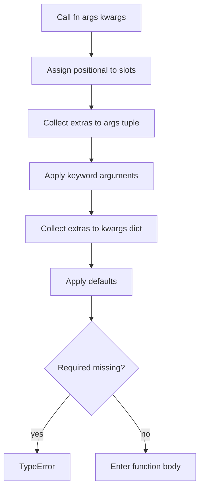
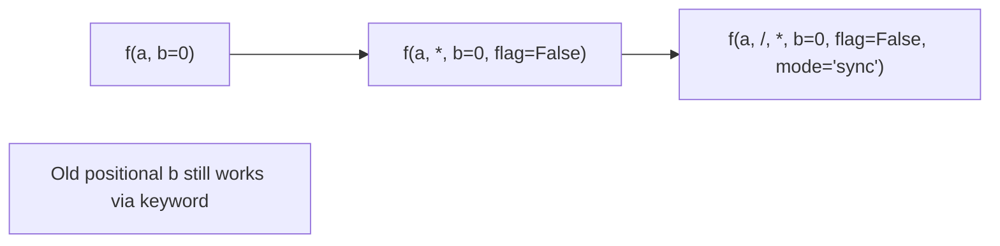
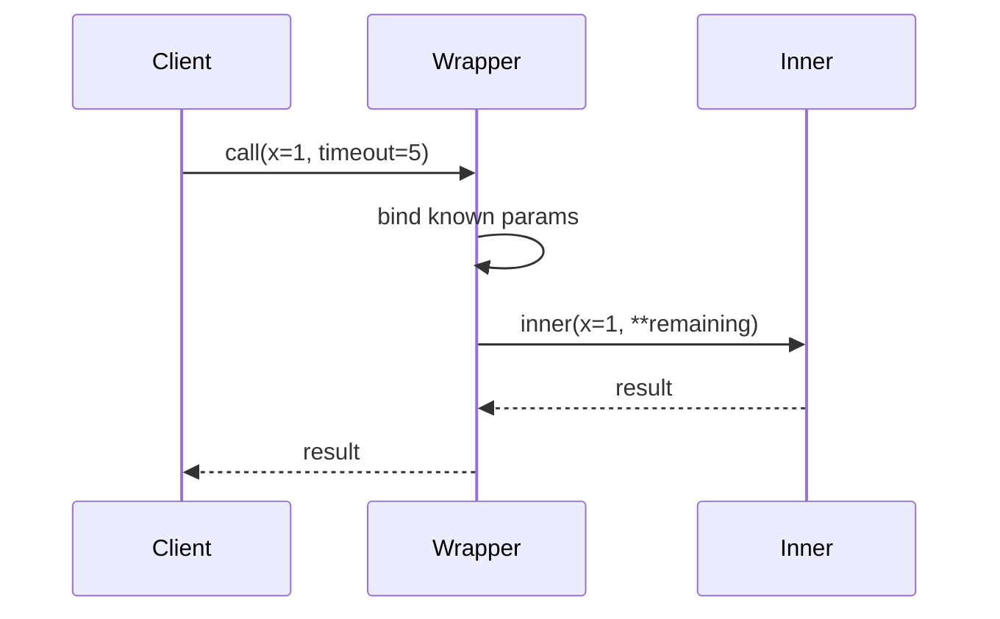

# Argument Binding Unpacking and Keyword-Only Parameters

## Overview

When Python calls a function, it **binds** positional and keyword arguments to parameters using a deterministic algorithm defined in the language reference. Parameters may be **positional-only** (`/` syntax, PEP 570), **positional-or-keyword**, **variadic** (`*args`), **keyword-only** (after bare `*` or `*name`), or **variadic keyword** (`**kwargs`).

**Unpacking** (`*iterable`, `**mapping`) expands call-site values into positional and keyword slots, with rules for ordering, duplicates, and exhaustion. Misunderstanding binding causes subtle API breaks—especially when adding parameters to widely used functions or wrapping calls with `inspect.signature().bind()`.

**CPython 3.14+** implements binding in the call path before frame setup; errors like `got multiple values for argument` are raised before user bytecode runs.

## Learning Objectives

- State the full parameter kind taxonomy and call-site matching order
- Predict outcomes for mixed positional, keyword, and unpacked arguments
- Use keyword-only parameters to stabilize public APIs when extending functions
- Apply `inspect.signature`, `bind`, `bind_partial` for adapters and RPC bridges
- Explain `**kwargs` forwarding patterns and failure modes (duplicate keys, ordering)

## Prerequisites

- [[03-Python/02-Execution-Namespaces-and-Functions/Functions as Objects|Functions as Objects]]

## Difficulty

`intermediate`

## Estimated Time

- Reading: 2 hours
- Exercises: 2–3 hours
- Mini project: 3 hours

## History

Python 3.0 cleaned Py3 call semantics. **PEP 3102** (3.0) keyword-only parameters. **PEP 570** (3.8) positional-only `/`. **PEP 692** (`TypedDict` for `**kwargs` typing, 3.12+) improves static checking of forwarded kwargs.

## Problem It Solves

Binding bugs appear in production as:

- Breaking changes when inserting a parameter before `*args`
- Silent mis-binding when callers pass dict as single positional arg
- Wrapper functions swallowing or duplicating kwargs
- JSON/RPC deserializers producing strings where ints expected—binding succeeds, logic fails later

Explicit binding rules make APIs **evolvable** and wrappers **correct**.

## Internal Implementation

### Parameter kinds (inspect)

| Kind | Syntax example | Call-site |
| --- | --- | --- |
| POSITIONAL_ONLY | `def f(a, /)` | Positional only |
| POSITIONAL_OR_KEYWORD | `def f(a)` | Positional or keyword |
| VAR_POSITIONAL | `*args` | Extra positional tuple |
| KEYWORD_ONLY | `*, b` or after `*args` | Keyword required |
| VAR_KEYWORD | `**kwargs` | Extra keyword dict |

### Binding algorithm (simplified)

1. Map positional args to positional-only and positional-or-keyword slots left-to-right
2. Remaining positional → `*args` if present, else error
3. Apply keyword args to unmatched positional-or-keyword and keyword-only names
4. Remaining keywords → `**kwargs` if present, else error
5. Fill defaults for missing parameters
6. Error if any required parameter unfilled



### Unpacking at call site

- `fn(*seq)` unpacks to positional; `fn(**mapping)` to keywords
- After Python 3.5, unpacked positional may follow keywords if no ambiguity (grammar rules)
- Duplicate parameter names from `**d` and explicit keyword → `TypeError`
- `**d` keys must be `str` (3.x)

### CPython 3.14+ notes

- Vectorcall merges binding with fast paths for small arity
- **`/` and `*` in builtins** (e.g., `print(*objects, sep=' ')` ) document intended usage—mirror in your APIs
- Static type checkers model binding; runtime still authoritative

**Compatibility**: Python 2 allowed `**kwargs` with non-string keys in some C API paths—invalid in 3.x.

## Mermaid Diagrams

### Structure: API evolution with keyword-only



### Sequence: wrapper forwards kwargs



## Examples

### Minimal Example

```python
def connect(host: str, /, port: int = 443, *, timeout: float = 30.0, tls: bool = True) -> str:
    return f"{host}:{port} tls={tls} t={timeout}"

connect("example.com")                          # OK
connect("example.com", 8080, timeout=1.0)       # OK
# connect(host="example.com")                   # TypeError: positional-only
# connect("example.com", host="x")              # TypeError: duplicate
```

Unpacking:

```python
params = {"port": 9000, "timeout": 2.5}
connect("svc.internal", **params)
```

### Production-Shaped Example

Thin adapter preserving signature for telemetry:

```python
import functools
import inspect
from typing import Any, Callable, TypeVar

F = TypeVar("F", bound=Callable[..., Any])

def with_timeout(default: float) -> Callable[[F], F]:
    def decorator(fn: F) -> F:
        sig = inspect.signature(fn)

        @functools.wraps(fn)
        def wrapper(*args: Any, **kwargs: Any) -> Any:
            bound = sig.bind_partial(*args, **kwargs)
            bound.apply_defaults()
            if "timeout" not in bound.arguments:
                bound.arguments["timeout"] = default
            return fn(*bound.args, **bound.kwargs)

        wrapper.__signature__ = sig  # type: ignore[attr-defined]
        return wrapper  # type: ignore[return-value]
    return decorator
```

Prefer explicit keyword-only `timeout` on `fn` for production—this shows binding machinery.

Labs: [[03-Python/code/README|Python code labs]].

## Trade-offs

| Dimension | Upside | Downside | When it matters |
| --- | --- | --- | --- |
| Keyword-only params | Safe API extension | Verbose call sites for many options | Public libraries |
| Positional-only `/` | Prevent name coupling | Unfamiliar to some users | C-accelerated APIs |
| `**kwargs` forwarding | Wrapper flexibility | Typos silently pass through | Middleware |
| `*args` | Variadic lists | No name discovery | printf-style logging |

### When to Use

- **`*, option`** for every new optional flag on stable functions
- **`/`** for parameters where name at call site would lie (e.g., `path` vs `paths`)
- **`bind` + validation** at HTTP/RPC boundaries

### When Not to Use

- Do not expose `**kwargs` in public APIs unless forwarding intentionally
- Avoid `*args` when a single `items: Sequence[T]` is clearer
- Do not rely on dict insertion order before 3.7 for `**` merge semantics in old codebases

## Exercises

1. Predict errors: `def f(a, b=1, *c, d): pass` called as `f(1, 2, 3, d=4)` and `f(1, d=4)`.
2. Write a function that accepts any signature and returns argument names and bound values as dict (use `inspect`).
3. Refactor `def send(url, retries=3)` to add keyword-only `backoff` without breaking callers.
4. Explain why `fn(**{'a': 1, 'a': 2})` is a syntax error at call site in source but possible via dict literal variable.
5. Implement `passthrough(fn, **fixed)` merging fixed kwargs with call-time kwargs (call-time wins).

## Mini Project

**OpenAPI → Python stub generator**

Given path/query/body schema, emit function signatures with `/`, keyword-only, and typed fields. Include tests binding sample JSON payloads via `inspect.signature().bind`.

## Portfolio Project

Add binding conformance tests to [[03-Python/projects/Python Runtime Toolkit/README|Python Runtime Toolkit]] verifying all public callables reject unknown kwargs when `strict=True` mode enabled.

## Interview Questions

1. Order of parameters in a Python 3 function definition with `/`, `*`, and `**`.
2. Difference between `*args` and bare `*` in a signature?
3. When does `got multiple values for argument` occur?
4. How do you forward kwargs through a decorator without losing required keyword-only args?
5. What is `inspect.Signature.bind_partial` used for?

### Stretch / Staff-Level

1. Explain how vectorcall passes arguments without building a tuple for small arities.
2. Design versioning policy for a library adding positional-only parameters to a 10-year-old function.

## Common Mistakes

- Adding parameter **before** optional positional without keyword-only barrier
- Mutating **`**kwargs`** dict that caller still references
- Using **`dict.get`** instead of binding—hides invalid keys
- **`functools.wraps`** without preserving **`__signature__`**

## Best Practices

- Put **evolving options** after bare `*` as keyword-only
- Document **forbidden** kwargs in docstring when forwarding
- Use **`typing.Unpack`** / **`TypedDict`** for structured `**kwargs` (3.12+)
- Test binding with **`inspect.signature` round-trip** in unit tests
- Mirror **stdlib style** (`/` in math functions, keyword-only in constructors)

## Summary

Python binds call-site arguments to parameters through a fixed algorithm honoring positional-only, keyword-only, and variadic slots. Unpacking integrates iterables and mappings at the call site with strict duplicate detection. Production APIs use keyword-only parameters and `/` to evolve safely; wrappers use `inspect.signature` to forward arguments without silent drops or collisions.

## Further Reading

- [[03-Python/06-Typing/Typed Library API Design|Typed Library API Design]]
- [[03-Python/_exercises/README|Python Exercises]]

## Related Notes

- [[03-Python/02-Execution-Namespaces-and-Functions/Functions as Objects|Functions as Objects]]
- [[03-Python/02-Execution-Namespaces-and-Functions/Decorators Internals|Decorators Internals]]
- [[03-Python/code/README|Python code labs]]
- [[03-Python/README|Python Track]]

## Progress Checklist

- [ ] Explained from first principles
- [ ] Drew at least one Mermaid diagram
- [ ] Implemented a minimal version
- [ ] Documented trade-offs and non-goals
- [ ] Completed exercises
- [ ] Practiced interview questions aloud
- [ ] Linked prerequisites and dependents
