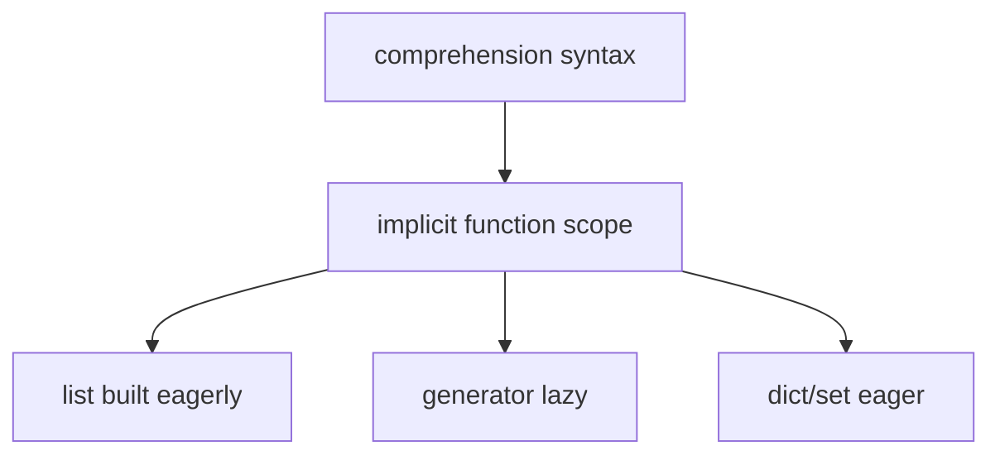
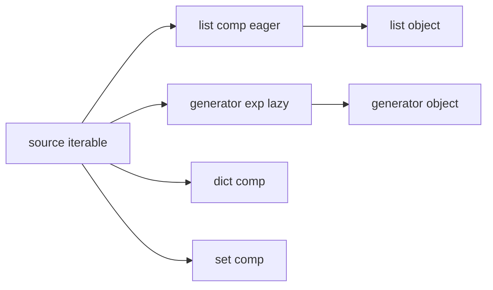
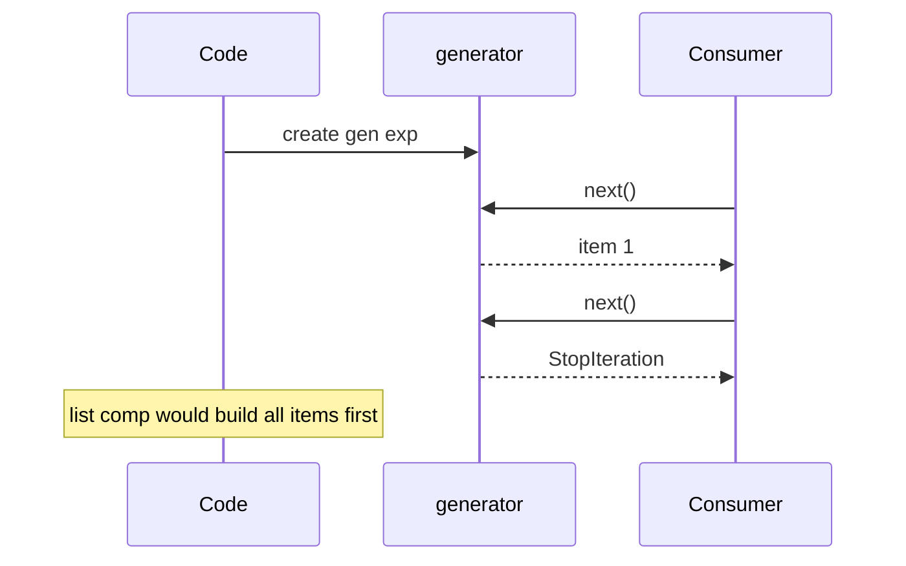

# Comprehensions and Assignment Expressions

## Overview

**Comprehensions** provide concise syntax to build **lists**, **dicts**, **sets**, or **generators** from iterables with optional `if` filters and nested `for` clauses. Each comprehension compiles to an **implicit nested function** (since Python 3) with its own scope—isolating loop variables from the enclosing namespace.

The **assignment expression** (`:=`, walrus operator, PEP 572) evaluates an expression and **binds** the result to a name in the enclosing scope (subject to scoping rules), enabling reuse within comprehensions, `while` loops, and conditionals without repeating expensive calls.

Both features sit at the intersection of syntax sugar and performance-sensitive data pipelines. Misuse obscures control flow; disciplined use replaces multi-line loops with clearer intent and fewer temporaries.

## Learning Objectives

- Translate comprehensions to equivalent `for` loops and identify implicit scopes
- Choose among list, dict, set, and generator comprehensions for memory and laziness
- Apply `:=` safely without violating readability or scoping rules
- Predict when short-circuiting and exception behavior differ from expanded loops
- Relate generator expressions to [[03-Python/04-Iteration-Exceptions-and-Context/Generators and Generator Internals|Generators and Generator Internals]]

## Prerequisites

- [[03-Python/02-Execution-Namespaces-and-Functions/Names Scopes LEGB and Closures|Names Scopes LEGB and Closures]]
- [[03-Python/04-Iteration-Exceptions-and-Context/Iterator Protocol|Iterator Protocol]]

## Difficulty

`intermediate`

## Estimated Time

- Reading: 2 hours
- Exercises: 2 hours
- Mini project: 3 hours

## History

List comprehensions from Python 2.0; dict/set comprehensions in 2.7/3.0. **PEP 572** (3.8) added `:=` after significant debate about scope leakage in comprehensions (compromise: walrus target scopes differ for inline vs nested comprehension parts—see language reference).

## Problem It Solves

Without comprehensions and walrus:

- Verbose accumulation loops obscure intent
- Repeated subexpressions in conditions (`match = pattern.search(line); if match:`)
- Accidental large intermediate lists when streaming would suffice
- Python 2 loop variable leakage into outer scope (fixed in Py3 comprehensions)

## Internal Implementation

### Compilation model

List comprehension (conceptually):

```python
result = []
for x in iterable:
    if cond:
        result.append(expr)
```

Actually compiled as:

```python
def _comp(iterable):
    result = []
    for x in iterable:
        if cond:
            result.append(expr)
    return result
result = _comp(iterable)
```

Generator expression returns a **generator object** without building the full list—O(1) memory until consumed.



### Walrus scoping nuance

In `[(y := f(x)) for x in data if y > 0]` (illustrative—actual rules require careful reading):

- Comprehension **iteration variables** remain local to implicit function
- Walrus targets in **different sub-expressions** may bind in enclosing scope per grammar position—**read the 3.8+ reference** before clever nesting
- Prefer walrus in **statement contexts** (`while (chunk := read()):`) for clarity

### CPython 3.14+ notes

- Specializing interpreter optimizes simple comprehension loops similarly to explicit `for`
- **Exception tracebacks** point through implicit frames—use explicit loops when debugging complex pipelines
- Async comprehensions (`async for` inside) compile to async implicit functions—require async def context

**Compatibility**: No walrus in `<3.8`; no dict comprehensions in 2.5.

## Mermaid Diagrams

### Structure: comprehension kinds



### Sequence: generator vs list



## Examples

### Minimal Example

```python
# Eager list
squares = [n * n for n in range(10) if n % 2 == 0]

# Lazy generator — use once
total = sum(n * n for n in range(1_000_000))

# Dict comprehension
index = {name: i for i, name in enumerate(["a", "b", "c"])}

# Walrus in while read loop
import pathlib

def line_count(path: pathlib.Path) -> int:
    total = 0
    with path.open(encoding="utf-8") as fh:
        while chunk := fh.read(8192):
            total += chunk.count("\n")
    return total
```

Replace `process` with real handler in labs.

### Production-Shaped Example

Parse log lines with walrus avoiding double regex:

```python
import re
from dataclasses import dataclass

PATTERN = re.compile(r"^(?P<ts>\S+)\s+(?P<level>\w+)\s+(?P<msg>.+)$")

@dataclass(frozen=True)
class LogEvent:
    ts: str
    level: str
    msg: str

def parse_lines(lines: list[str]) -> list[LogEvent]:
    events: list[LogEvent] = []
    for line in lines:
        if match := PATTERN.match(line):
            g = match.groupdict()
            events.append(LogEvent(g["ts"], g["level"], g["msg"]))
    return events

# Streaming variant — generator, not list comp, for backpressure
def stream_events(lines):
    for line in lines:
        if match := PATTERN.match(line):
            g = match.groupdict()
            yield LogEvent(g["ts"], g["level"], g["msg"])
```

Nested comprehension for adjacency (readable up to 2 clauses):

```python
pairs = [(a, b) for a in nodes for b in neighbors[a] if a != b]
```

See [[03-Python/code/README|Python code labs]].

## Trade-offs

| Dimension | Upside | Downside | When it matters |
| --- | --- | --- | --- |
| List comp | Fast, idiomatic | Holds full result in memory | ETL batches |
| Generator exp | Constant memory | Single pass; no len/index | Log streaming |
| Walrus | DRY in loops | Easy to write unreadable one-liners | Hot paths |
| Nested comps | Compact | Debugging harder than nested for | Graph algorithms |

### When to Use

- **Generator expressions** feeding `sum`, `any`, `max`, file iteration
- **Dict/set comp** for index building from unique keys
- **Walrus** in `while read` and `if (m := pat.search(s))` patterns

### When Not to Use

- Do not nest comprehensions **more than two levels** without `for` loops
- Do not use list comp for **side effects** (`[print(x) for x in xs]` antipattern)
- Avoid walrus in **function signatures** or **class fields** (invalid)

## Exercises

1. Rewrite a triple-nested list comprehension as nested loops; compare bytecode size with `dis`.
2. Show loop variable `x` after list comp ` [x for x in range(3)]` is not leaked in outer scope (Py3).
3. Build inverted index `{word: [doc_ids]}` from `(doc_id, text)` pairs using dict of set comps.
4. Use walrus to read JSON lines file skipping blanks and comments (`#`).
5. Explain memory difference between `list(genexp())` and `[...]` for 10M items (conceptual).

## Mini Project

**Log Pipeline**

Implement stdin→stdout filter: parse, filter by level, format TSV. Provide both list-materializing and generator streaming modes; benchmark memory with `tracemalloc`.

## Portfolio Project

Add comprehension complexity metrics to [[03-Python/projects/Python Runtime Toolkit/README|Python Runtime Toolkit]] (flag nested comps >2, side-effect comps).

## Interview Questions

1. Difference between list comprehension and generator expression?
2. Are comprehension loop variables visible outside (Python 3)?
3. What does `:=` return and where does it bind?
4. Is `[f(x) for x in it if cond]` equivalent to map/filter—when not?
5. Can you use `async for` inside a comprehension?

### Stretch / Staff-Level

1. Explain PEP 572 scoping decision for walrus inside comprehensions containing `if` filters.
2. When does eager list comprehension beat generator + `sum` in CPython 3.14 specializing interpreter?

## Common Mistakes

- **Side effects** inside comprehensions
- Materializing **`list(huge_gen)`** unnecessarily
- **Reusing** generator after partial consumption
- **Shadowing** outer names with walrus unintentionally

## Best Practices

- Prefer **generator** when result is consumed once sequentially
- Break complex logic into **helper functions** called from simple comps
- Limit walrus to **while/if** patterns with obvious intent
- Use **`any(...)` / `all(...)`** with generator args for short-circuit search
- Profile before micro-optimizing comp vs loop—readability first

## Summary

Comprehensions compile to scoped implicit functions that build collections or lazy generators from iterables. Assignment expressions bind intermediate values in controlled scopes, reducing duplication in loops and parsers. Production code chooses eager vs lazy forms based on memory and consumption patterns, and rejects clever one-liners that hide side effects or debugging paths.

## Further Reading

- [[03-Python/04-Iteration-Exceptions-and-Context/Generators and Generator Internals|Generators and Generator Internals]]
- [[03-Python/_exercises/README|Python Exercises]]

## Related Notes

- [[03-Python/02-Execution-Namespaces-and-Functions/Lexical Structure and Compilation Units|Lexical Structure and Compilation Units]]
- [[03-Python/04-Iteration-Exceptions-and-Context/Iterator Protocol|Iterator Protocol]]
- [[03-Python/code/README|Python code labs]]
- [[03-Python/README|Python Track]]

## Progress Checklist

- [ ] Explained from first principles
- [ ] Drew at least one Mermaid diagram
- [ ] Implemented a minimal version
- [ ] Documented trade-offs and non-goals
- [ ] Completed exercises
- [ ] Practiced interview questions aloud
- [ ] Linked prerequisites and dependents
