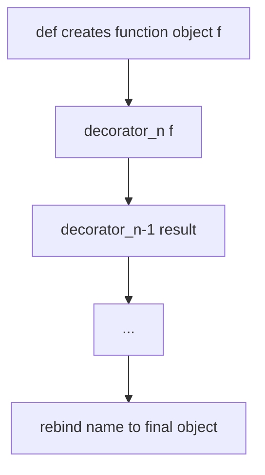
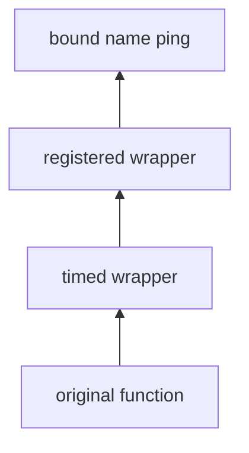
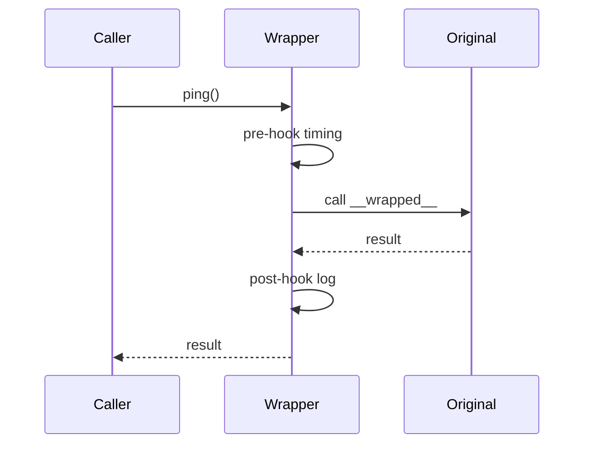

# Decorators Internals

## Overview

A **decorator** is syntactic sugar: `@decorator` above `def` or `class` applies `decorator(callable_or_class)` to the object created by the definition and **rebinds the name** to the return value. Decorators are **higher-order functions** (or callables) that run at **definition time**—import or class body execution—not per call unless the decorator returns a wrapper that runs each time.

Stacked decorators apply **bottom-up** (closest to `def` first). Decorators attach cross-cutting behavior: auth, caching, retries, registration, schema validation. Internally they manipulate function or class objects, often preserving metadata via `functools.wraps` and `__wrapped__` chains.

Understanding decorator internals prevents broken introspection, signature drift, and subtle import-order side effects—common in FastAPI, Flask, pytest, and dataclass-adjacent tooling.

## Learning Objectives

- Desugar `@dec1 @dec2 def f` into explicit nested calls
- Implement parameterized decorators (decorator factories) correctly
- Preserve `__name__`, `__doc__`, `__signature__`, and type hints through stacks
- Apply decorators to classes and understand interaction with metaclasses
- Debug decorator order and import-time registration races

## Prerequisites

- [[03-Python/02-Execution-Namespaces-and-Functions/Functions as Objects|Functions as Objects]]
- [[03-Python/02-Execution-Namespaces-and-Functions/Names Scopes LEGB and Closures|Names Scopes LEGB and Closures]]

## Difficulty

`advanced`

## Estimated Time

- Reading: 2–3 hours
- Exercises: 3 hours
- Mini project: 4 hours

## History

Decorators since Python 2.4 (`@`). **`functools.lru_cache`** (3.2) popularized stdlib decorators. Frameworks (Django, Flask, pytest) built registration decorators on import side effects. **PEP 557** dataclasses generate methods via decorator-like machinery distinct from `@` syntax.

## Problem It Solves

Decorator misuse causes:

- Double-wrapped routes in web frameworks (wrong order)
- `help()` and IDE tooltips showing wrapper docstrings
- Type checkers losing ParamSpec through poorly typed decorators
- Tests patching wrong object because `__wrapped__` chain ignored
- Class decorators mutating class before metaclass completes

## Internal Implementation

### Desugaring

```python
@registry.register("ping")
@timed
def ping():
    return "pong"
```

Equivalent to:

```python
def ping():
    return "pong"

ping = registry.register("ping")(timed(ping))
```

Steps:

1. Define function object `ping`
2. `timed(ping)` → wrapper function (typically)
3. `register("ping")(wrapper)` → registered wrapper or replacement



### Parameterized decorator factory

Three levels:

1. **Factory** — called with decorator args at def time
2. **Decorator** — receives function/class
3. **Wrapper** — optional; invoked each call

```python
def retry(times: int, *, exceptions: tuple[type[BaseException], ...] = (Exception,)):
    def decorator(fn):
        @functools.wraps(fn)
        def wrapper(*args, **kwargs):
            last: BaseException | None = None
            for _ in range(times):
                try:
                    return fn(*args, **kwargs)
                except exceptions as exc:
                    last = exc
            assert last is not None
            raise last
        return wrapper
    return decorator
```

### Class decorators

`@dataclass` and `@total_ordering` **return a new or mutated class object**. They run after the class body executes but **before** the name binds in the enclosing scope. Metaclass wins if both specified: `class C(metaclass=M)` uses `M`, then class decorators receive the class object from `M.__call__`.

### CPython 3.14+ notes

- Decorators execute synchronously during module exec—no lazy deferral
- **`annotationlib`** helps tools read hints through wrappers
- Async decorators must return awaitable-compatible wrappers (`async def wrapper`)

**Compatibility**: `classmethod`/`staticmethod` are descriptor decorators in the class body, not `@` on functions outside classes—different mechanism.

## Mermaid Diagrams

### Structure: decorator stack



### Sequence: per-call wrapper



## Examples

### Minimal Example

```python
import functools
import time
from typing import Callable, TypeVar

F = TypeVar("F", bound=Callable[..., object])

def timed(fn: F) -> F:
    @functools.wraps(fn)
    def wrapper(*args, **kwargs):
        start = time.perf_counter()
        try:
            return fn(*args, **kwargs)
        finally:
            elapsed = time.perf_counter() - start
            print(f"{fn.__qualname__} took {elapsed:.4f}s")
    return wrapper  # type: ignore[return-value]

@timed
def work(n: int) -> int:
    return sum(range(n))
```

### Production-Shaped Example

Idempotent route registration with signature enforcement:

```python
from __future__ import annotations

import functools
import inspect
from collections.abc import Callable
from typing import Any, ParamSpec, TypeVar

P = ParamSpec("P")
R = TypeVar("R")

class RouteTable:
    def __init__(self) -> None:
        self._routes: dict[str, Callable[..., Any]] = {}

    def route(self, path: str) -> Callable[[Callable[P, R]], Callable[P, R]]:
        def decorator(fn: Callable[P, R]) -> Callable[P, R]:
            if path in self._routes:
                raise ValueError(f"duplicate route: {path}")
            if not inspect.iscoroutinefunction(fn):
                @functools.wraps(fn)
                def sync_wrapper(*args: P.args, **kwargs: P.kwargs) -> R:
                    return fn(*args, **kwargs)
                self._routes[path] = sync_wrapper
                return sync_wrapper
            @functools.wraps(fn)
            async def async_wrapper(*args: P.args, **kwargs: P.kwargs) -> R:
                return await fn(*args, **kwargs)
            self._routes[path] = async_wrapper
            return async_wrapper  # type: ignore[return-value]
        return decorator
```

See [[03-Python/code/README|Python code labs]] for decorator unwrap utilities.

## Trade-offs

| Dimension | Upside | Downside | When it matters |
| --- | --- | --- | --- |
| `@` syntax | Declarative cross-cutting | Hidden control flow | Frameworks |
| Import-time registration | Simple discovery | Import order coupling | Plugin systems |
| Wrapper layers | Composable behavior | Stack depth, profiling noise | Middleware |
| Class decorators | Transform APIs | Hard to type-check | Dataclass-like tools |

### When to Use

- **Cross-cutting** concerns: metrics, auth, retries, caching
- **Registration** of handlers when import-time side effect is acceptable
- **`wraps` + `__wrapped__`** always for transparent tooling

### When Not to Use

- Do not decorate hot inner loops—inline or use context managers
- Avoid decorators that **silently swallow exceptions**
- Prefer **explicit composition** in libraries where users need minimal magic

## Exercises

1. Desugar three stacked decorators by hand; state final type of bound name if middle returns non-callable.
2. Write `@singleton` class decorator storing one instance per class.
3. Implement `unwrap(fn, depth=1)` following `__wrapped__`.
4. Show decorator that breaks `inspect.signature`; fix with `__signature__` assignment.
5. Explain difference between `@classmethod` on method inside class vs `@classmethod` decorating function at module level (invalid pattern).

## Mini Project

**Decorator Linter**

AST-walk a package; flag decorators on `async def` that return sync wrappers without awaiting, and flag missing `@wraps`. Output SARIF for CI.

## Portfolio Project

Build a **decorator-aware profiler** in [[03-Python/projects/Python Runtime Toolkit/README|Python Runtime Toolkit]] attributing time to innermost `__wrapped__` function.

## Interview Questions

1. When does a decorator run—at call time or definition time?
2. Order of application for `@a @b def f`?
3. How do parameterized decorators work (three function layers)?
4. Purpose of `functools.wraps` and `__wrapped__`?
5. Can you decorate a class? What does the decorator receive?

### Stretch / Staff-Level

1. Design a decorator preserving ParamSpec for mypy/pyright using `TypeVar`/`ParamSpec` correctly.
2. Compare class decorators vs metaclasses for API validation—trade-offs at import time vs class creation.

## Common Mistakes

- Forgetting **`return wrapper`** in decorator factory
- **Mutating** function globals via closure instead of per-call state
- Applying **`lru_cache`** to methods without understanding `self` in cache key
- **Stack order** reversed when combining auth + cache decorators

## Best Practices

- Always **`@functools.wraps`** on wrappers
- Expose **`__wrapped__`** for testing and mocking
- Keep decorators **idempotent** where possible (safe re-import)
- Document **import-order requirements** for registration decorators
- Use **`typing.overload`/`ParamSpec`** for typed decorator factories

## Summary

Decorators rebind names to the result of higher-order callables applied at function or class definition time. Stacks compose bottom-up; wrappers run at call time unless the decorator replaces the object entirely. Production decorators preserve metadata, respect async/sync boundaries, and avoid import-time surprises—internals that separate framework magic from maintainable application code.

## Further Reading

- [[03-Python/03-Classes-Descriptors-and-Metaprogramming/Metaclasses and Class Creation|Metaclasses and Class Creation]]
- [[03-Python/_exercises/README|Python Exercises]]

## Related Notes

- [[03-Python/02-Execution-Namespaces-and-Functions/Argument Binding Unpacking and Keyword-Only Parameters|Argument Binding Unpacking and Keyword-Only Parameters]]
- [[03-Python/03-Classes-Descriptors-and-Metaprogramming/Properties and the Descriptor Protocol|Properties and the Descriptor Protocol]]
- [[01-Computer-Science/08-Languages-and-Computation/Aspect-Oriented and Cross-Cutting Patterns|Aspect-Oriented and Cross-Cutting Patterns]]
- [[03-Python/code/README|Python code labs]]
- [[03-Python/README|Python Track]]

## Progress Checklist

- [ ] Explained from first principles
- [ ] Drew at least one Mermaid diagram
- [ ] Implemented a minimal version
- [ ] Documented trade-offs and non-goals
- [ ] Completed exercises
- [ ] Practiced interview questions aloud
- [ ] Linked prerequisites and dependents
