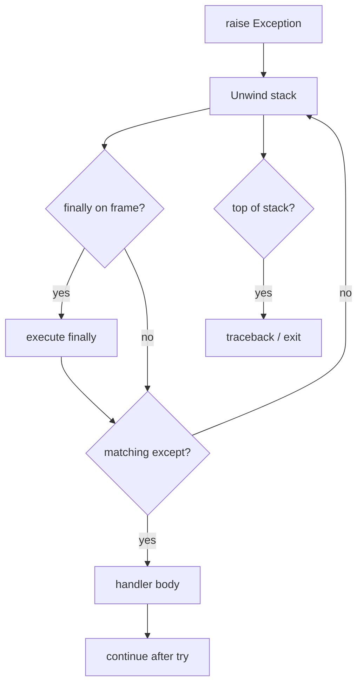
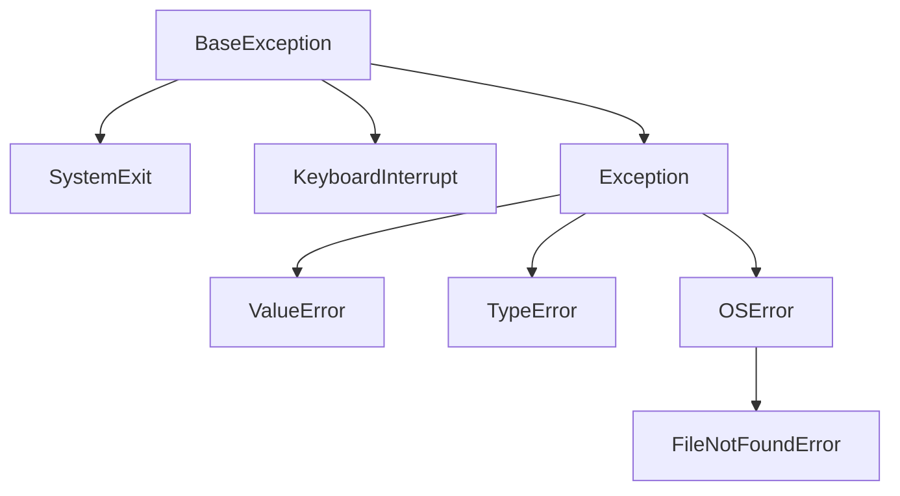
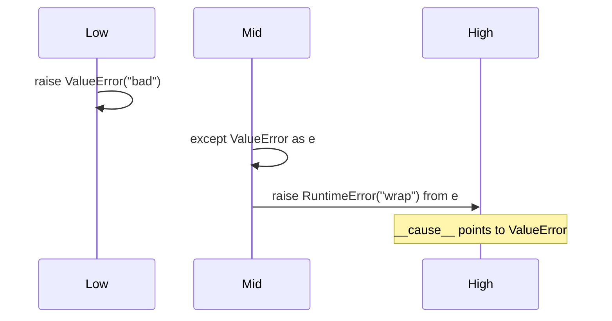

# Exceptions and Control Flow

## Overview

Python uses **exceptions** for non-local control flow: errors, signals, and structured unwinding through the call stack. `try` / `except` / `else` / `finally` compose **defensive regions** with guaranteed cleanup in `finally`. Unlike return codes, exceptions propagate until caught or they terminate the thread with a traceback.

**Control flow** also includes `return`, `break`, `continue`, and `raise` inside `try`—each interacts with `finally` (which runs before the transfer completes). **Exception chaining** (`raise New from orig`) preserves causality; **suppression** (`raise ... from None`) hides context deliberately.

**CPython 3.14+** adds **`except*`** and **`ExceptionGroup`** (PEP 654) for concurrent/async failure fan-in—see the dedicated note for deep coverage; this note focuses on core semantics and production error design.

## Learning Objectives

- Explain evaluation order of `try`, `except`, `else`, `finally` clauses
- Choose between catching specific exceptions vs `Exception` base
- Use `raise ... from` for API boundaries and `from None` sparingly
- Predict behavior when `return`/`break`/`continue` interact with `finally`
- Design exception types for libraries with stable public contracts

## Prerequisites

- [[03-Python/02-Execution-Namespaces-and-Functions/Functions as Objects|Functions as Objects]]
- [[03-Python/04-Iteration-Exceptions-and-Context/Exception Hierarchy ExceptionGroup and except star|Exception Hierarchy ExceptionGroup and except star]]

## Difficulty

`intermediate`

## Estimated Time

- Reading: 2–3 hours
- Exercises: 3 hours
- Mini project: 4 hours

## History

Python 1.4 unified string exceptions into class exceptions. **PEP 3134** (3.0) exception chaining. **PEP 352** hierarchy cleanup. **PEP 654** (3.11+) exception groups for `asyncio.TaskGroup` and structured concurrency.

## Problem It Solves

Poor exception discipline causes:

- Bare `except:` swallowing `KeyboardInterrupt` and `SystemExit`
- Lost root cause without `__cause__` / `__context__`
- `finally` blocks masking original exceptions via secondary failures
- Using exceptions for **normal control flow** (EAFP vs LBYL misuse)
- Leaking internal exception types across service boundaries

## Internal Implementation

### Unwinding model

1. Raise sets current exception in thread state
2. Stack unwinds, **`finally`** blocks run on each frame
3. Matching **`except`** handler runs; exception cleared if handled
4. If unhandled, traceback attached and process/thread exits (or loop reports)



### else clause

`else` runs **only if try completed without exception**—not if return/break/continue from try (those skip else). Useful when try body is expensive setup and except should not run on success path confusion.

### Exception object fields

- `args` — constructor tuple
- `__cause__` — explicit chaining (`raise X from Y`)
- `__context__` — implicit context while handling another exception
- `__traceback__` — linked traceback object (PEP 3134)

### CPython 3.14+ notes

- **`ExceptionGroup`** and **`except*`** split grouped failures
- Traceback objects hold **frame references**—can prolong GC retention
- **`sys.exception()`** (3.11+) preferred over deprecated thread APIs in handlers

**Compatibility**: Python 2 `except E, e:` syntax removed; old-style classes gone.

## Mermaid Diagrams

### Structure: exception hierarchy (partial)



### Sequence: raise from chain



## Examples

### Minimal Example

```python
def divide(a: float, b: float) -> float:
    try:
        result = a / b
    except ZeroDivisionError as exc:
        raise ValueError(f"invalid denominator: {b}") from exc
    else:
        return result
    finally:
        pass  # avoid heavy work here; runs even on return
```

`return` in `try` still runs `finally`:

```python
def f():
    try:
        return 1
    finally:
        return 2  # anti-pattern: suppresses try return

assert f() == 2
```

### Production-Shaped Example

Boundary translation for HTTP service layer:

```python
from __future__ import annotations

from dataclasses import dataclass
from typing import Callable, TypeVar

T = TypeVar("T")

@dataclass(frozen=True)
class AppError(Exception):
    code: str
    message: str
    retryable: bool = False

class NotFound(AppError):
    pass

class UpstreamTimeout(AppError):
    pass

def map_errors(fn: Callable[..., T]) -> Callable[..., T]:
    def wrapper(*args, **kwargs) -> T:
        try:
            return fn(*args, **kwargs)
        except TimeoutError as exc:
            raise UpstreamTimeout("timeout", str(exc), retryable=True) from exc
        except KeyError as exc:
            raise NotFound("missing", f"key {exc!r}") from exc
        except AppError:
            raise
        except Exception as exc:
            raise AppError("internal", "unexpected failure", retryable=False) from exc
    return wrapper
```

Pair with [[03-Python/09-Production-Python/Error Design Exception Safety and Failure Modes|Error Design Exception Safety and Failure Modes]].

Labs: [[03-Python/code/README|Python code labs]].

## Trade-offs

| Dimension | Upside | Downside | When it matters |
| --- | --- | --- | --- |
| EAFP (try first) | Race-free setup | Slower if exception common | dict key presence |
| LBYL (check first) | Predictable path | TOCTOU races | not for locks/files alone |
| Broad except | Fewer crashes | Hides bugs | only at process boundary |
| Custom hierarchy | Clear API | Proliferation of types | libraries |

### When to Use

- **Specific exceptions** at library boundaries with stable types
- **`finally`** for releasing locks, files, temporary dirs
- **`raise ... from`** when wrapping lower-level failures

### When Not to Use

- Do not use exceptions for **regular branching** in hot loops
- Do not **`except Exception: pass`** without re-raise or logging
- Do not perform **heavy I/O in finally** if try already failed critically

## Exercises

1. Trace execution order for try/except/else/finally with raise in each block (table).
2. Implement context manager using only try/finally (preview of contextlib).
3. Show implicit `__context__` when raising during except handler.
4. Write function that retries 3 times with exponential backoff on `OSError`.
5. Convert bare `except:` to tuple catching `Exception` and explain what's still not caught.

## Mini Project

**Error Envelope Library**

Define domain exceptions, JSON serialization for API responses, and decorator mapping internal errors to public codes. Include tests for chaining preservation.

## Portfolio Project

Integrate exception routing with **ExceptionGroup** in [[03-Python/projects/Bounded Worker Orchestrator/README|Bounded Worker Orchestrator]] for parallel task failures.

## Interview Questions

1. Execution order of try/except/else/finally when exception raised in try?
2. Difference between `raise X from Y` and bare `raise X` during handling?
3. What exceptions inherit from `BaseException` but not `Exception`?
4. Does `finally` run on `return` from try?
5. EAFP vs LBYL—when prefer each?

### Stretch / Staff-Level

1. Explain **exception notes** (PEP 678) and when libraries should attach them.
2. How can a `finally` block **mask** the active exception (Python 3 behavior)?

## Common Mistakes

- **`except Exception` before specific types** (unreachable handlers)
- Mutating **`traceback`** or re-raising wrong object
- Using **`assert` for production validation** (disabled with `-O`)
- **`else` misuse** when logic belongs in try body after checks

## Best Practices

- Catch **specific** exceptions; use `Exception` only at outer shell
- Always **log exception with stack** at boundary (`exc_info=True`)
- Define **`__all__` exception types** exported by libraries
- Use **`contextlib.suppress`** for intentional ignore vs empty except
- Document **retryable** vs **fatal** in exception docstrings or attrs

## Summary

Exceptions unwind the stack, running `finally` on each frame until a matching handler executes or the process fails. Else runs on success; chaining preserves causes across layers. Production Python treats exceptions as API contracts—typed, logged, translated at boundaries—not as generic goto replacements for ordinary control flow.

## Further Reading

- [[03-Python/09-Production-Python/Error Design Exception Safety and Failure Modes|Error Design Exception Safety and Failure Modes]]
- [[03-Python/_exercises/README|Python Exercises]]

## Related Notes

- [[03-Python/04-Iteration-Exceptions-and-Context/Context Managers and contextlib|Context Managers and contextlib]]
- [[01-Computer-Science/08-Languages-and-Computation/Error Models and Reliability|Error Models and Reliability]]
- [[03-Python/code/README|Python code labs]]
- [[03-Python/README|Python Track]]

## Progress Checklist

- [ ] Explained from first principles
- [ ] Drew at least one Mermaid diagram
- [ ] Implemented a minimal version
- [ ] Documented trade-offs and non-goals
- [ ] Completed exercises
- [ ] Practiced interview questions aloud
- [ ] Linked prerequisites and dependents
