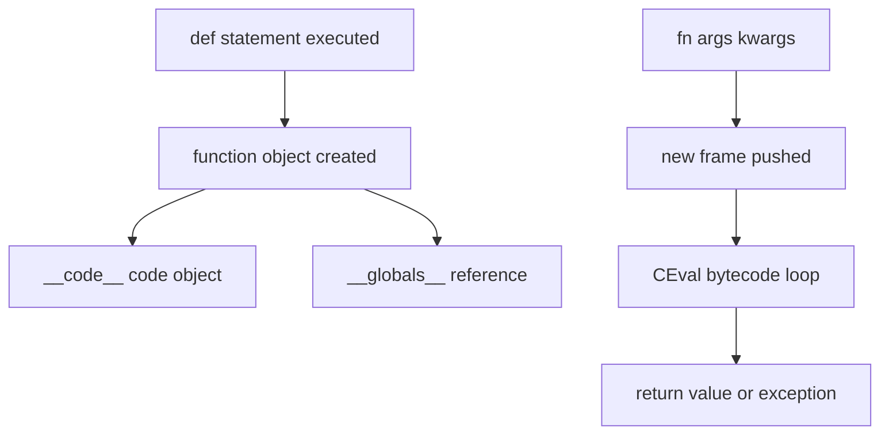
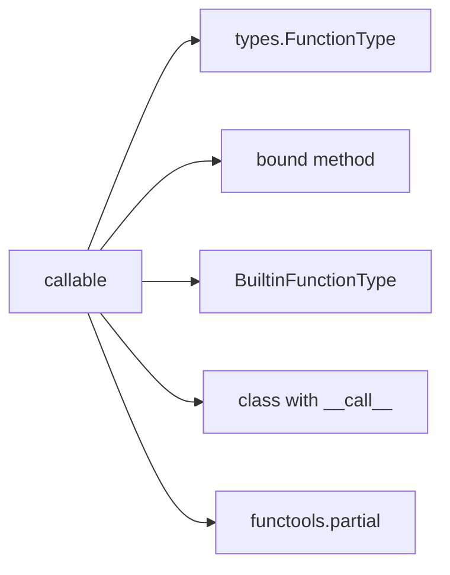
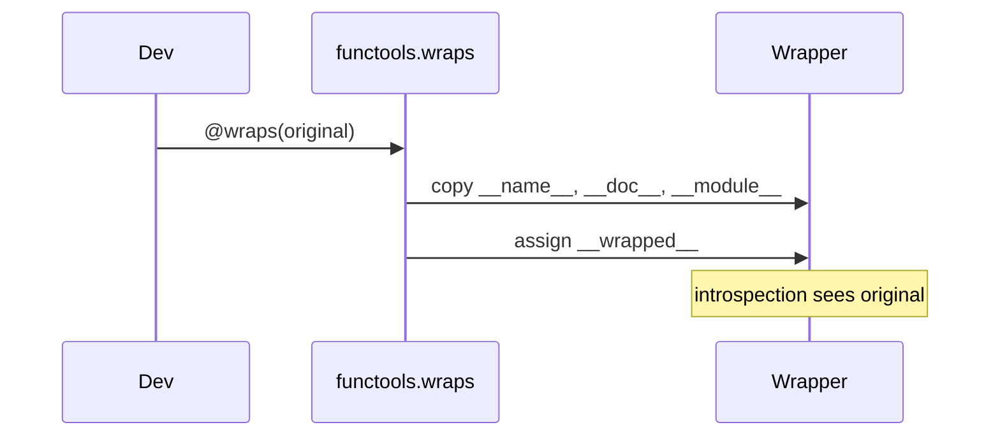

# Functions as Objects

## Overview

In Python, **functions are objects**—instances of `types.FunctionType` (or `BuiltinFunctionType` for C builtins). A function value has identity, type, attributes, and can be stored in data structures, passed as arguments, returned from other functions, and introspected at runtime. Calling a function invokes the **call protocol**: `obj(*args, **kwargs)` dispatches to `type(obj).__call__`, which for functions runs the bytecode in `__code__` with a new frame.

This first-class design underpins decorators, callbacks, strategy injection, and partial application. Production systems rely on function metadata—`__name__`, `__qualname__`, `__module__`, `__defaults__`, `__kwdefaults__`, `__annotations__`—for logging, OpenTelemetry spans, and schema generation.

**CPython 3.14+** continues to optimize call sites via inline cache specialization; function objects remain heap-allocated unless inlined by a JIT experiment (not stable public behavior).

## Learning Objectives

- List function object attributes and explain their lifecycle at definition vs call time
- Implement higher-order patterns: map/filter replacements, callbacks, registries
- Use `functools.wraps`, `partial`, and `update_wrapper` without breaking introspection
- Distinguish `function`, `method`, `classmethod`, `staticmethod`, and arbitrary `__call__` objects
- Read `dis.dis(function)` to connect object fields to bytecode execution

## Prerequisites

- [[03-Python/01-Values-Types-and-Data-Model/Callables and the Call Protocol|Callables and the Call Protocol]]
- [[03-Python/02-Execution-Namespaces-and-Functions/Names Scopes LEGB and Closures|Names Scopes LEGB and Closures]]

## Difficulty

`intermediate`

## Estimated Time

- Reading: 2 hours
- Exercises: 2–3 hours
- Mini project: 3 hours

## History

ABC and Lisp influenced Python's first-class functions. **`functools`** (Python 2.5) added `partial` and `wraps`. **PEP 3102** introduced keyword-only parameters; **PEP 570** positional-only (`/`). Annotations (PEP 3107, 484) attach metadata without enforcing types at runtime unless checked.

## Problem It Solves

Treating functions as opaque callables causes:

- Broken stack traces after decorators strip `__name__`/`__doc__`
- Incorrect routing in CLI/plugin systems keyed by `__qualname__`
- Signature mismatches when wrapping with `*args, **kwargs` only
- Memory leaks when registering bare lambdas with circular refs to frames

Explicit function object literacy fixes observability and API stability.

## Internal Implementation

### Function object layout (conceptual)

| Attribute | Set when | Purpose |
| --- | --- | --- |
| `__code__` | Function def compiled | Bytecode, consts, varnames, flags |
| `__globals__` | Function def | Module dict for global lookup |
| `__defaults__` | Def time | Tuple of default positional values |
| `__kwdefaults__` | Def time | Dict of keyword-only defaults |
| `__closure__` | Def time if nested | Cell tuple for free vars |
| `__annotations__` | Def time (eval policy varies) | Type hints dict |
| `__dict__` | Lazy | Arbitrary function attributes |

**Methods** are not function objects—they are `method` objects binding `self` via `__self__` and `__func__`.



### Call path

1. `PyObject_Call` / vectorcall fast path (CPython 3.8+)
2. Bind arguments per [[03-Python/02-Execution-Namespaces-and-Functions/Argument Binding Unpacking and Keyword-Only Parameters|Argument Binding]]
3. Execute `__code__` in frame linked to caller
4. Pop frame; propagate return or exception

### CPython 3.14+ notes

- **Vectorcall** calling convention reduces tuple/dict allocation for many calls
- **`__annotate__` protocol** (PEP 649) may defer annotation materialization—use `annotationlib` for introspection tools
- Free-threaded builds: function objects are immutable after creation; concurrent calls share `__code__` safely

**Compatibility**: PyPy uses the same semantics; MicroPython may omit `__annotations__` on some builds.

## Mermaid Diagrams

### Structure: callable taxonomy



### Sequence: decorator preserves metadata



## Examples

### Minimal Example

```python
import inspect
from functools import partial

def add(a: int, b: int) -> int:
    """Add two integers."""
    return a + b

assert callable(add)
assert add.__name__ == "add"
assert add.__code__.co_argcount == 2

plus_ten = partial(add, 10)
sig = inspect.signature(plus_ten)
assert str(sig) == "(b: int) -> int"
assert plus_ten(5) == 15
```

### Production-Shaped Example

Plugin registry with signature validation:

```python
from __future__ import annotations

import inspect
from dataclasses import dataclass
from typing import Any, Callable, TypeVar

F = TypeVar("F", bound=Callable[..., Any])

@dataclass(frozen=True)
class Handler:
    name: str
    fn: Callable[..., Any]
    params: tuple[inspect.Parameter, ...]

class HandlerRegistry:
    def __init__(self) -> None:
        self._handlers: dict[str, Handler] = {}

    def register(self, name: str) -> Callable[[F], F]:
        def decorator(fn: F) -> F:
            sig = inspect.signature(fn)
            if any(
                p.kind in (p.VAR_POSITIONAL, p.VAR_KEYWORD)
                for p in sig.parameters.values()
            ):
                raise TypeError(f"{name}: must not use *args/**kwargs in registry")
            self._handlers[name] = Handler(name, fn, tuple(sig.parameters.values()))
            return fn
        return decorator

    def dispatch(self, name: str, /, **kwargs: Any) -> Any:
        handler = self._handlers[name]
        bound = inspect.signature(handler.fn).bind(**kwargs)
        bound.apply_defaults()
        return handler.fn(*bound.args, **bound.kwargs)
```

This treats functions as **typed, introspectable assets**, not opaque pointers.

Lab companion: [[03-Python/code/README|Python code labs]].

## Trade-offs

| Dimension | Upside | Downside | When it matters |
| --- | --- | --- | --- |
| First-class functions | Flexible composition | Harder static analysis | Plugin architectures |
| Closures + partial | Less boilerplate | Hidden dependencies in captured vars | Middleware |
| Dynamic attributes on fn | Cheap metadata attachment | Namespace collisions | Metrics decorators |
| Lambdas | Concise expressions | No statements; poor stack traces | Sort keys only |

### When to Use

- **Higher-order functions** for small, stable strategy injection
- **`functools.wraps`** on every decorator layer
- **`inspect.signature`** for runtime validation in DSLs and RPC routers

### When Not to Use

- Do not use lambdas for non-trivial logic—use `def` for debuggability
- Do not attach mutable state on function objects in multi-threaded code without locks
- Prefer **classes or protocols** when state + many methods exceed one closure

## Exercises

1. List all attributes of a function you define; which are writable without undefined behavior?
2. Implement `trace_calls` decorator logging `__qualname__`, args, return value, and elapsed ms.
3. Show a decorator without `@wraps` breaking `help(fn)`; fix it.
4. Explain difference between `g.f` when `f` is function defined in class vs instance attribute assigned function.
5. Use `dis.dis` on `lambda x: x+1` vs equivalent `def`—compare bytecode.

## Mini Project

**Callable Catalog CLI**

Scan a package with `importlib` and `inspect`, emit CSV of all top-level functions: name, signature, docstring first line, file path. Filter callables that accept `**kwargs` for audit.

## Portfolio Project

Extend [[03-Python/projects/Import Hook Plugin Loader/README|Import Hook Plugin Loader]] to validate plugin entry points are functions with exact signatures declared in TOML manifest.

## Interview Questions

1. What is a first-class function? Give three Python-specific consequences.
2. Difference between function object and bound method?
3. What does `functools.partial` store internally?
4. Why should decorators use `@functools.wraps`?
5. Can you delete `fn.__defaults__`? What happens on next call?

### Stretch / Staff-Level

1. Explain vectorcall and when CPython avoids creating an args tuple.
2. How would you implement a decorator that preserves both signature and type hints for `mypy` (hint: `ParamSpec`)?

## Common Mistakes

- Decorators returning **bare callables** without metadata
- Using **`inspect.getargspec`** (removed) instead of `signature`
- Confusing **`__name__`** with **`__qualname__`** in nested classes
- Storing **large captured scope** in callbacks registered globally

## Best Practices

- Always **`@wraps`** unless deliberately mimicking another interface
- Expose **`__wrapped__`** chain for test unwrapping
- Prefer **`typing.Protocol`** for structural callable interfaces in libraries
- Document whether handlers are called **sync or async**—functions are not awaitable unless async def
- Use **`slots` or frozen dataclass** for registry entries, not function `__dict__` spam

## Summary

Functions in Python are heap objects participating fully in the data model: they carry bytecode, globals, defaults, closures, and annotations. Calls create frames and invoke the same protocol as any callable. Production engineering preserves metadata through decorator stacks, validates signatures at registration time, and chooses classes when function objects accumulate too much hidden state.

## Further Reading

- [[03-Python/01-Values-Types-and-Data-Model/Special Methods and Data Model Hooks|Special Methods and Data Model Hooks]]
- [[03-Python/02-Execution-Namespaces-and-Functions/Decorators Internals|Decorators Internals]]
- [[03-Python/_exercises/README|Python Exercises]]

## Related Notes

- [[03-Python/02-Execution-Namespaces-and-Functions/Argument Binding Unpacking and Keyword-Only Parameters|Argument Binding Unpacking and Keyword-Only Parameters]]
- [[01-Computer-Science/08-Languages-and-Computation/Functions Closures and Higher-Order Functions|Functions Closures and Higher-Order Functions]]
- [[03-Python/code/README|Python code labs]]
- [[03-Python/README|Python Track]]

## Progress Checklist

- [ ] Explained from first principles
- [ ] Drew at least one Mermaid diagram
- [ ] Implemented a minimal version
- [ ] Documented trade-offs and non-goals
- [ ] Completed exercises
- [ ] Practiced interview questions aloud
- [ ] Linked prerequisites and dependents
