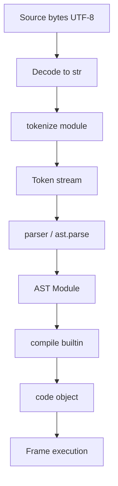
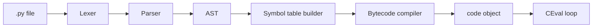
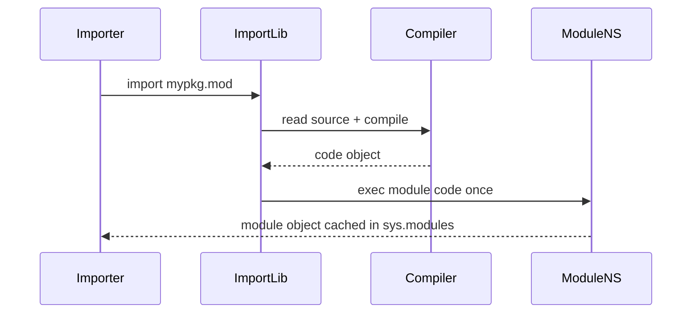

# Lexical Structure and Compilation Units

## Overview

Python source text is processed in **stages**: bytes → decoded text → **token stream** → **concrete syntax tree (CST)** → **abstract syntax tree (AST)** → **code object** → bytecode execution. The **lexical structure** defines how characters group into **tokens**—identifiers, keywords, literals, operators, and structural markers. **Compilation units** are the scopes at which Python compiles source: a **module**, a **class body**, or a **function body** (including lambdas and comprehensions in modern Python).

Unlike languages that use braces, Python uses **indentation** as a lexical/significant-whitespace rule: the tokenizer emits `INDENT` and `DEDENT` tokens derived from leading whitespace. This is not cosmetic formatting—it is **syntax**.

Understanding lexical structure lets you predict why `from __future__ import annotations` must appear early, why `\` line continuation is fragile, and how **CPython 3.14+** compiles nested scopes into distinct code objects with distinct constants and name tables.

## Learning Objectives

- Read Python source as a token stream using `tokenize` and relate tokens to grammar rules
- Distinguish compilation units and explain what gets compiled when (`exec`, `import`, function definition)
- Explain indentation, `INDENT`/`DEDENT`, and the `tab` vs space interaction
- Predict which constructs are **statements** vs **expressions** at parse time
- Connect lexical rules to bytecode boundaries in [[03-Python/05-CPython-Runtime-and-Memory/Parsing AST and Compilation Pipeline|Parsing AST and Compilation Pipeline]]

## Prerequisites

- [[03-Python/00-Orientation/Python Program Lifecycle|Python Program Lifecycle]]
- [[01-Computer-Science/08-Languages-and-Computation/Compilers Interpreters and Virtual Machines|Compilers Interpreters and Virtual Machines]]

## Difficulty

`intermediate`

## Estimated Time

- Reading: 2 hours
- Exercises: 2 hours
- Mini project: 3 hours

## History

Python 1.x inherited indentation from ABC (1980s). The **tokenizer** (`Parser/tokenizer.c` in CPython) has grown support for f-strings (PEP 498), assignment expressions (PEP 572), and pattern matching (PEP 634). **PEP 263** (2000) added source encoding declarations; **PEP 3120** (2007) made UTF-8 the default for Python 3 source on compliant platforms.

## Problem It Solves

Lexical ambiguity causes production incidents:

- Mixed tabs/spaces producing valid tokens but surprising control flow
- `exec`/`eval` of untrusted strings bypassing static analysis
- Import-time side effects when module-level code runs at compile+execute boundary
- Tools (formatters, linters, type checkers) disagreeing because they parse differently

Precise lexical knowledge separates "syntax error" from "valid but dangerous."

## Internal Implementation

### Token categories

| Category | Examples | Notes |
| --- | --- | --- |
| Identifiers | `snake_case`, `π`, `_private` | NFKC normalization not applied; Unicode XID rules |
| Keywords | `async`, `match`, `yield` | Contextual in some grammars (`match` as pattern) |
| Literals | `42`, `3.14`, `"hi"`, `b"bytes"`, `f"{x}"` | Adjacent string literal concatenation at parse time |
| Operators | `//`, `:=`, `@`, `**=` | `@` for decorators and matrix multiply |
| Delimiters | `(`, `[`, `{`, `:`, `->` | `->` is two tokens or one depending on grammar version |

### Indentation algorithm (conceptual)

CPython tracks a **stack of indentation levels** (column counts). On each logical line:

1. Measure leading whitespace (spaces and tabs; tabs expand per `tabsize`, default 8 in tokenizer)
2. Compare to stack top → emit `INDENT`, `DEDENT`, or continue
3. At EOF, emit `DEDENT` until stack empty



### Compilation units

Each **code object** (`types.CodeType`) corresponds to one compilation unit:

- **Module**: top-level of `.py` file or `exec` string
- **Function**: `def`, `async def`, lambda (expression body)
- **Class**: class body executes in a temporary namespace; class statement creates the class object
- **Comprehension**: since 3.x, implicit function scope (see [[03-Python/02-Execution-Namespaces-and-Functions/Comprehensions and Assignment Expressions|Comprehensions and Assignment Expressions]])

Module-level code runs **once** on first import; function/class bodies compile at **definition time** but execute at **call/instantiation time**.

### CPython 3.14+ notes

- **Adaptive specializing interpreter** optimizes hot bytecode after compilation; lexical form affects which specializations apply (e.g., constant folding of literals)
- **Deferred annotation evaluation** (PEP 649, stabilized across 3.11–3.14) changes when annotation expressions compile relative to `from __future__ import annotations`
- **Free-threaded builds**: compilation is unchanged; concurrent imports rely on import locks—lexical correctness does not imply thread-safe module init

**Compatibility**: Python 2 `print` statement, `<>` operator, and implicit ASCII source are gone. PyPy/MicroPython tokenizers match CPython for common syntax but may differ on edge-case error messages.

## Mermaid Diagrams

### Structure: compilation pipeline



### Sequence: import compiles once



## Examples

### Minimal Example

Inspect tokens for a tiny module:

```python
import tokenize
import io

source = '''\
def greet(name: str) -> str:
    message = f"hello, {name}"
    return message
'''

tokens = list(tokenize.generate_tokens(io.StringIO(source).readline))
for tok in tokens:
    if tok.type not in (tokenize.NL, tokenize.NEWLINE, tokenize.ENCODING):
        print(tokenize.tok_name[tok.type], repr(tok.string))
```

Output includes `NAME 'def'`, `INDENT`, `FSTRING_START`, `RETURN`, `DEDENT`.

### Production-Shaped Example

A configuration loader must never `exec` arbitrary user text. Lexical validation + AST whitelist:

```python
import ast
from typing import Any

ALLOWED_NODES = (
    ast.Expression,
    ast.Constant,
    ast.Dict,
    ast.List,
    ast.Tuple,
    ast.UnaryOp,
    ast.BinOp,
)

def safe_literal_eval(source: str) -> Any:
    tree = ast.parse(source, mode="eval")
    for node in ast.walk(tree):
        if not isinstance(node, ALLOWED_NODES):
            raise ValueError(f"disallowed syntax: {type(node).__name__}")
    return eval(compile(tree, "<config>", "eval"), {"__builtins__": {}}, {})
```

This respects **compilation unit** boundaries: `mode="eval"` rejects statements at parse time, before bytecode exists.

Compare with [[03-Python/code/README|Python code labs]] for a full tokenizer dump utility.

## Trade-offs

| Dimension | Upside | Downside | When it matters |
| --- | --- | --- | --- |
| Significant indentation | Enforces readable structure; no brace style wars | Copy/paste from web breaks blocks | Onboarding, code review |
| Implicit string concat | Convenient splitting of long strings | Accidental adjacency merges literals | SQL/query builders |
| Single encoding default (UTF-8) | International identifiers and strings | Legacy Latin-1 sources need PEP 263 cookie | Monorepos with old files |
| Compile-at-import | Fast repeated calls; immutable code objects | Import-time side effects hard to test | Service startup, CLI cold start |

### When to Use

- **`ast.parse` + walkers** for static refactors and policy linting
- **`compile(..., dont_inherit=True)`** for isolated eval sandboxes with explicit globals
- **Explicit encoding** cookies when ingesting third-party `.py` files

### When Not to Use

- Do not rely on `\` line continuation in generated code—use parentheses
- Do not mix tabs and spaces in shared modules (enforce with `python -tt` or ruff)
- Do not `exec` configuration that could be JSON/TOML/YAML

## Exercises

1. Use `tokenize` to count how many `INDENT` tokens appear in a nested class with three methods.
2. Explain why `from __future__ import annotations` must be before other statements (hint: future statements are a distinct grammar production).
3. Write a script that fails with `TabError` and fix it without changing logic.
4. Compare `ast.parse("x = 1")` vs `ast.parse("x = 1", mode="exec")`—what differs in the root node?
5. Given a `.py` file, list all string literal types (plain, bytes, f-string, raw) found by walking the AST.

## Mini Project

**Token Highlight REPL**

Build a terminal tool that reads a `.py` file and prints each token with type, line/column, and a color per category. Add a `--stats` flag summarizing keyword frequency and maximum indentation depth. Validate against `tokenize` on the standard library's `tokenize.py` itself.

## Portfolio Project

Integrate a **lexical diff** panel into [[03-Python/projects/Python Runtime Toolkit/README|Python Runtime Toolkit]] showing token-level changes between two versions of a function—useful for reviewing macro-generated code.

## Interview Questions

1. What is the difference between a statement and an expression in Python? Give three examples of each.
2. How does Python represent block structure without braces?
3. When is a module's code object created vs when is it executed?
4. What happens if you mix tabs and spaces in the same block?
5. Why is `eval("user_input")` dangerous even if you pass empty globals?

### Stretch / Staff-Level

1. Explain how f-string parsing interleaves `FSTRING_*` tokens with embedded expressions and why nested quotes are restricted.
2. Compare CPython's `compile()` flags (`optimize`, `dont_inherit`, `ast.PyCF_ONLY_AST`) and when you'd use each in a build pipeline.

## Common Mistakes

- Assuming **UTF-8 BOM** is ignored everywhere (some editors add BOM; Python 3 handles PEP 3120)
- Treating **docstrings** as directives—they are runtime string constants, not parse pragmas
- Using **`exec` at module level** in frameworks, breaking import tracing and static analysis
- Forgetting that **class body** is a separate namespace executed synchronously at class creation

## Best Practices

- Enforce **spaces-only** indentation (PEP 8) via formatter/linter in CI
- Prefer **`pathlib` + `compile(source, path, "exec")`** for dynamic loading with accurate tracebacks
- Use **`ast` module** for transforms; never regex-replace Python source in production tooling
- Pin **`python_version`** in packaging metadata when using 3.14+ syntax features
- Log **file path and mtime** when hot-reloading plugins so compilation units stay identifiable

## Summary

Python programs begin as text governed by lexical rules—tokens, significant indentation, and explicit encoding—that feed a parser producing ASTs compiled into code objects. Modules, functions, and classes are distinct compilation units with distinct scopes and lifetimes. Production engineers treat lexing and parsing as security and operability boundaries: validate before compile, compile before exec, and never confuse readable syntax with safe syntax.

## Further Reading

- [[00-References/Python/README|Python References]]
- Python Language Reference — Lexical analysis
- [[03-Python/05-CPython-Runtime-and-Memory/Parsing AST and Compilation Pipeline|Parsing AST and Compilation Pipeline]]
- [[03-Python/_exercises/README|Python Exercises]]

## Related Notes

- [[03-Python/02-Execution-Namespaces-and-Functions/Names Scopes LEGB and Closures|Names Scopes LEGB and Closures]]
- [[03-Python/08-Modules-Packaging-and-Environments/Import System and Module Objects|Import System and Module Objects]]
- [[01-Computer-Science/08-Languages-and-Computation/Parsing and ASTs|Parsing and ASTs]]
- [[03-Python/code/README|Python code labs]]
- [[03-Python/README|Python Track]]

## Progress Checklist

- [ ] Explained from first principles
- [ ] Drew at least one Mermaid diagram
- [ ] Implemented a minimal version
- [ ] Documented trade-offs and non-goals
- [ ] Completed exercises
- [ ] Practiced interview questions aloud
- [ ] Linked prerequisites and dependents
