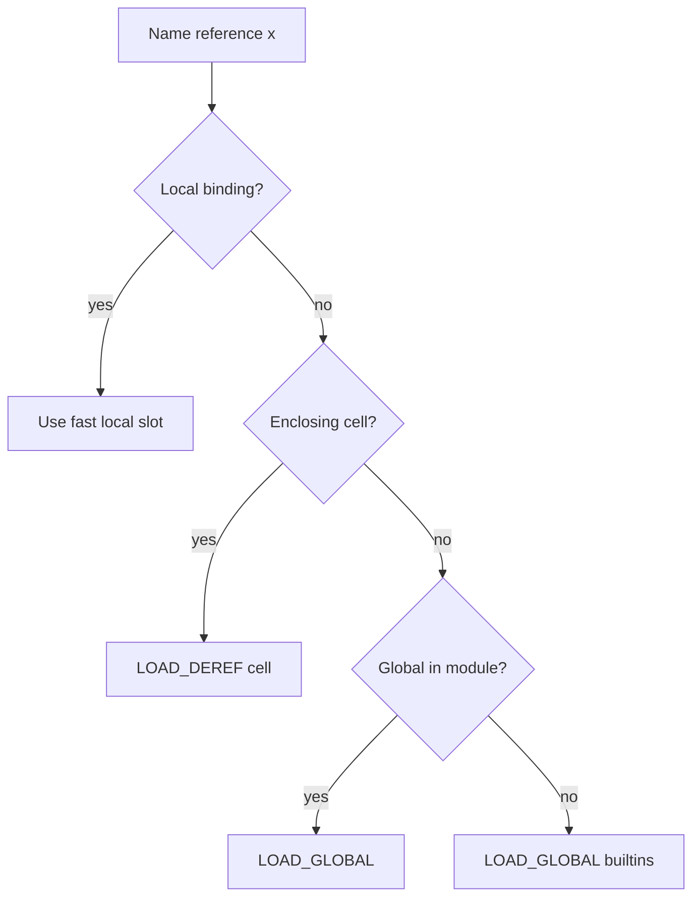
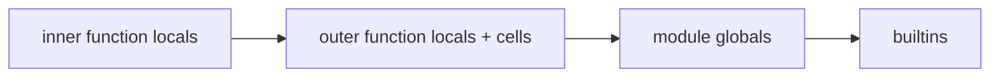
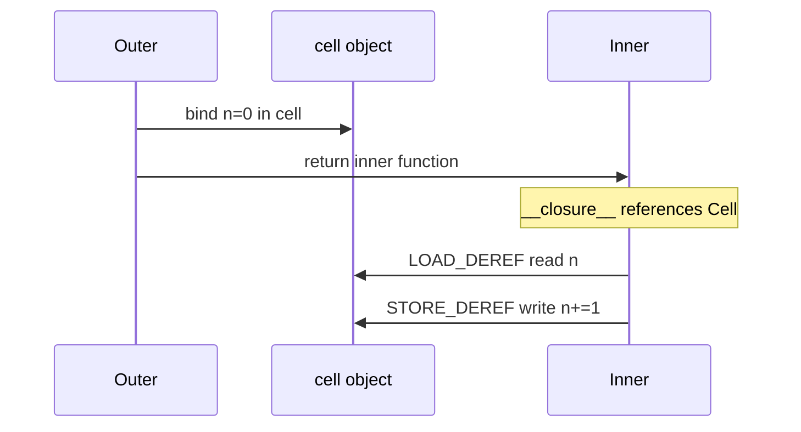

# Names Scopes LEGB and Closures

## Overview

A **name** in Python binds to an object in a **namespace**—a mapping from identifier to value. **Scope** is the textual region where a name binding is visible. CPython resolves names using the **LEGB** rule at runtime:

1. **L**ocal — innermost function/lambda/comprehension scope
2. **E**nclosing — any surrounding function scopes
3. **G**lobal — module-level namespace
4. **B**uilt-in — `builtins` module (or `__builtins__` dict in a module)

A **closure** is a function object that captures **free variables** from enclosing scopes via **cell objects** (`__closure__`). Closures enable factories, decorators, and callbacks—but mutable captured variables are a common source of shared-state bugs.

**CPython 3.14+** compiles scopes into `LOAD_FAST`, `LOAD_DEREF`, `LOAD_GLOBAL` (and specializing variants) based on symbol table analysis at compile time, not runtime string lookup.

## Learning Objectives

- Apply LEGB to predict name resolution in nested functions and comprehensions
- Distinguish **assignment** (binds locally unless `global`/`nonlocal`) from **mutation** of shared objects
- Inspect `__closure__`, `__code__.co_freevars`, and `cell_contents` for debugging
- Explain late-binding closures and the loop-variable capture pitfall
- Relate scopes to frames in [[01-Computer-Science/03-Memory-and-Addressing/Stack Frames and Call Conventions|Stack Frames and Call Conventions]]

## Prerequisites

- [[03-Python/02-Execution-Namespaces-and-Functions/Lexical Structure and Compilation Units|Lexical Structure and Compilation Units]]
- [[03-Python/01-Values-Types-and-Data-Model/Mutability Sharing and Copying|Mutability Sharing and Copying]]

## Difficulty

`intermediate`

## Estimated Time

- Reading: 2–3 hours
- Exercises: 3 hours
- Mini project: 4 hours

## History

Python 2 allowed `print` as a statement and had slightly different comprehension scoping (leaking loop variables in Python 2 list comprehensions). **PEP 227** introduced static nested scopes (Python 2.1, enabled by default in 2.2). Python 3 comprehensions and generator expressions have **implicit function scopes** (PEP 372 / 3.x behavior).

## Problem It Solves

Scope errors manifest as:

- `UnboundLocalError` when a name is assigned later in the same function
- Shared mutable defaults (`def f(a=[]): ...`)
- Loop-closure bugs (`lambda: i` in a for-loop)
- Accidental shadowing of builtins (`list = ...`)
- `global`/`nonlocal` misuse breaking test isolation

Understanding LEGB and closures is prerequisite for [[03-Python/02-Execution-Namespaces-and-Functions/Decorators Internals|Decorators Internals]] and descriptor-backed instance state.

## Internal Implementation

### Namespace objects

| Scope | Runtime structure | Typical access |
| --- | --- | --- |
| Local | `frame.f_locals` dict (optimized fast locals for simple functions) | `LOAD_FAST` |
| Enclosing | Cells referenced by `__closure__` | `LOAD_DEREF` |
| Global | `frame.f_globals` | `LOAD_GLOBAL` |
| Built-in | `frame.f_builtins` | `LOAD_GLOBAL` with builtin index (3.11+) |

At **compile time**, the compiler marks names as local, cell, or global. This is why `dis.dis` shows different opcodes for the same identifier in different functions.

### Closure creation

When a nested function references an enclosing variable that is not global:

1. Outer function allocates **cells** for those names
2. Inner function's `__closure__` tuple holds cell objects
3. Each cell's `cell_contents` updates when outer assigns (if `nonlocal`) or binds initially



### Assignment rules

- **Simple assignment** (`x = 1`) creates/rebinds in the **innermost enclosing scope that declares x as local**, else **local** to current function
- **`global x`** declares x resolves to module globals in this compilation unit
- **`nonlocal x`** declares x resolves to enclosing function scope (not global)

Without `nonlocal`, `counter = counter + 1` in a nested function creates a **new local** `counter` → `UnboundLocalError`.

### CPython 3.14+ notes

- **Specializing interpreter** may cache global/builtin lookups at quickened bytecode sites until dict mutation invalidates
- **Free-threaded CPython**: concurrent updates to shared globals or captured mutable objects require explicit synchronization—closures do not provide isolation
- **`sys._getframe()`** still inspects live scopes; avoid in production except diagnostics

**Compatibility**: PyPy follows LEGB semantics; MicroPython may omit full closure support on some ports.

## Mermaid Diagrams

### Structure: nested scopes



### Sequence: closure call



## Examples

### Minimal Example

```python
def make_counter(start: int = 0):
    n = start  # cell variable

    def inc(step: int = 1) -> int:
        nonlocal n
        n += step
        return n

    return inc

counter = make_counter(10)
assert counter() == 11
assert counter(5) == 16
assert counter.__closure__[0].cell_contents == 16
```

Classic loop pitfall:

```python
# Bug: late binding — all lambdas see final i
funcs_bad = [lambda: i for i in range(3)]
# Fix: default arg binds i at definition time
funcs_ok = [lambda i=i: i for i in range(3)]
assert [f() for f in funcs_ok] == [0, 1, 2]
```

### Production-Shaped Example

Thread-local-style context without `contextvars` (legacy pattern)—prefer [[03-Python/04-Iteration-Exceptions-and-Context/Context Variables|Context Variables]] in new code:

```python
from typing import Callable, TypeVar

T = TypeVar("T")

def with_request_id(rid: str) -> Callable[[Callable[..., T]], Callable[..., T]]:
    def decorator(fn: Callable[..., T]) -> Callable[..., T]:
        def wrapper(*args, **kwargs) -> T:
            prev = getattr(wrapper, "_request_id", None)
            wrapper._request_id = rid  # function attribute, not true dynamic scope
            try:
                return fn(*args, **kwargs)
            finally:
                wrapper._request_id = prev
        return wrapper
    return decorator
```

Demonstrates why **explicit context propagation** beats implicit closure hacks at scale.

See [[03-Python/code/README|Python code labs]] for a `scope_tracer` using `dis` and `inspect`.

## Trade-offs

| Dimension | Upside | Downside | When it matters |
| --- | --- | --- | --- |
| Lexical scoping | Predictable from source | Harder for dynamic plugin injection | Large codebases |
| Closures | Lightweight factories | Mutable capture → hidden coupling | Event handlers, decorators |
| `global` | Escape hatch for scripts | Breaks testability | Single-file utilities only |
| Comprehension scopes | No loop variable leak (Py3) | Surprises readers migrating from Py2 | Legacy tutorials |

### When to Use

- **Closures** for small factories with immutable or carefully managed state
- **`nonlocal`** for generator-like state machines before reaching for classes
- **`contextvars`** instead of closure hacks for request-scoped data in async services

### When Not to Use

- Do not use mutable default arguments to hold per-call state
- Do not use `global` in library code
- Do not capture large objects in closures held for process lifetime (memory retention)

## Exercises

1. Explain why `x = x + 1` at the start of a function raises `UnboundLocalError` if `x` is assigned later in the same function.
2. Implement `make_accumulator(initial)` returning a function supporting `add(n)`, `value()`, and `reset()`.
3. Predict output of nested `def` with same name at three levels; verify with `print` and `dis`.
4. Write a comprehension that shadows an outer variable—show it does not leak in Python 3.
5. Use `inspect.getclosurevars` on a decorator from the standard library.

## Mini Project

**Scope Visualizer**

Given a `.py` file and function name, parse AST, identify free/global names, and print a LEGB resolution table. Optional: emit Graphviz for nested definitions. Compare against runtime `__closure__` via import.

## Portfolio Project

Add a **closure retention analyzer** to [[03-Python/projects/Python Runtime Toolkit/README|Python Runtime Toolkit]] flagging long-lived callbacks capturing large frames (common in ORM session factories).

## Interview Questions

1. What does LEGB stand for? Walk through an example with three nesting levels.
2. Difference between `global` and `nonlocal`?
3. Why `[lambda: i for i in range(3)][0]()` returns `2`?
4. What is stored in `fn.__closure__`?
5. Does assigning to `obj.attr` require `nonlocal` if `obj` is captured from outer scope?

### Stretch / Staff-Level

1. How does CPython's `LOAD_FAST_CHECK` (3.13+) interact with unbound locals and specialization?
2. Compare closure implementation costs vs class with `__slots__` for a stateful counter at 1M instances.

## Common Mistakes

- **Mutable default args** shared across calls
- Forgetting **`nonlocal`** when rebinding enclosing integers/strings
- Assuming **comprehension loop variables** leak (Python 3 they do not)
- Shadowing **builtins** (`id`, `list`, `type`) in module scope

## Best Practices

- Prefer **explicit parameters** over implicit closure state for public APIs
- Use **`functools.partial`** when only fixing arguments, not capturing mutable state
- Document **factory functions** that return closures with thread-safety expectations
- In async code, use **`contextvars`** for per-task state
- Run **`ruff`/`pylint`** rules for `global` and redefined builtins

## Summary

Python resolves names lexically through nested namespaces searched Local → Enclosing → Global → Built-in. Assignment creates bindings in the innermost applicable scope unless redirected by `global` or `nonlocal`. Closures capture enclosing bindings via cells, enabling powerful patterns but risking shared mutable state. Production code treats scope as an API design constraint: prefer explicit context, avoid globals, and inspect closures when debugging memory or concurrency.

## Further Reading

- [[03-Python/05-CPython-Runtime-and-Memory/Code Objects Frame Objects and Call Stack|Code Objects Frame Objects and Call Stack]]
- [[01-Computer-Science/03-Memory-and-Addressing/Stack Frames and Call Conventions|Stack Frames and Call Conventions]]
- [[03-Python/_exercises/README|Python Exercises]]

## Related Notes

- [[03-Python/02-Execution-Namespaces-and-Functions/Functions as Objects|Functions as Objects]]
- [[03-Python/02-Execution-Namespaces-and-Functions/Decorators Internals|Decorators Internals]]
- [[03-Python/04-Iteration-Exceptions-and-Context/Context Variables|Context Variables]]
- [[03-Python/code/README|Python code labs]]
- [[03-Python/README|Python Track]]

## Progress Checklist

- [ ] Explained from first principles
- [ ] Drew at least one Mermaid diagram
- [ ] Implemented a minimal version
- [ ] Documented trade-offs and non-goals
- [ ] Completed exercises
- [ ] Practiced interview questions aloud
- [ ] Linked prerequisites and dependents
