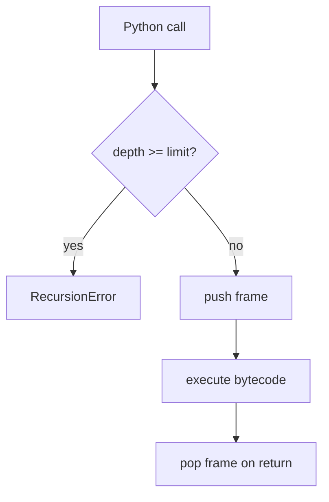
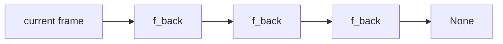
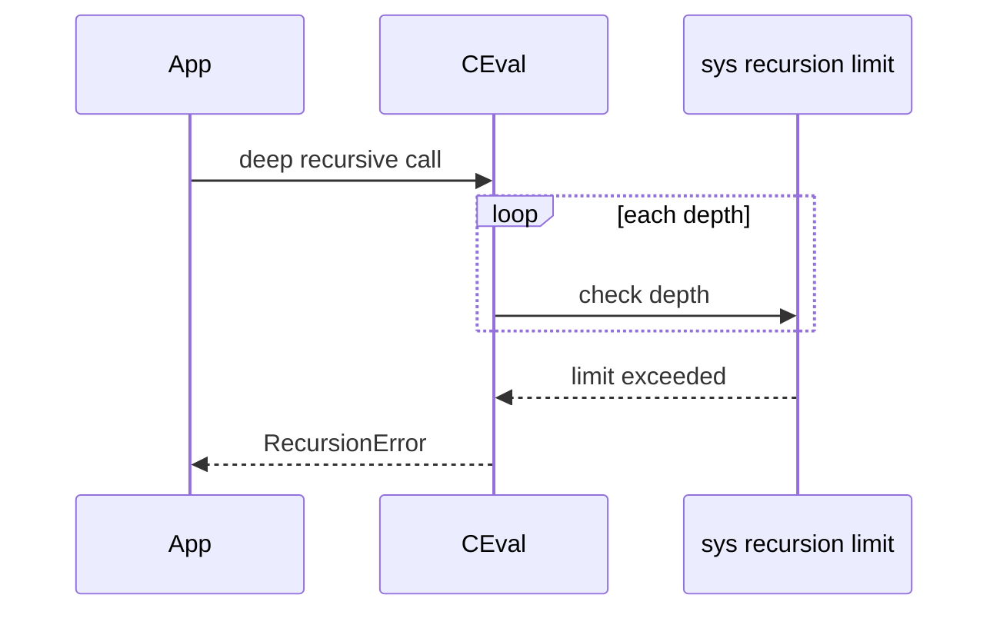

# Recursion Stack Limits and Frame Depth

## Overview

Each Python function call pushes a **frame** onto the interpreter **call stack**, backed by C stack memory in CPython. **Recursion** repeats calls on the same thread until a base case stops or **`RecursionError`** fires when depth exceeds **`sys.getrecursionlimit()`** (default commonly 1000 on many platforms, not a language guarantee).

Python **does not** perform tail-call optimization (TCO)—a recursive tail call still consumes a new frame. Deep recursion must be rewritten as **iteration**, **explicit stacks**, or **trampolines**; or limits raised cautiously with awareness of C stack overflow risk (segfault beyond Python's check).

Frame depth also affects profiling, traceback size, and debuggers. Understanding limits separates algorithmic recursion from production-safe execution on CPython 3.14+.

## Learning Objectives

- Relate Python frames to C stack and `sys.getrecursionlimit()`
- Predict when `RecursionError` vs platform stack overflow occurs
- Convert simple recursive algorithms to iterative form with explicit deque stack
- Use `sys.setrecursionlimit` safely and alternatives (trampolines, generators)
- Inspect frame chains with `traceback` and `inspect` during incidents

## Prerequisites

- [[03-Python/05-CPython-Runtime-and-Memory/Code Objects Frame Objects and Call Stack|Code Objects Frame Objects and Call Stack]]
- [[01-Computer-Science/03-Memory-and-Addressing/Stack Frames and Call Conventions|Stack Frames and Call Conventions]]

## Difficulty

`advanced`

## Estimated Time

- Reading: 2 hours
- Exercises: 3 hours
- Mini project: 4 hours

## History

CPython always used C stack for frames. **`sys.setrecursionlimit`** exists since early Python. PyPy may handle deep recursion differently (software stack). **PEP 615** (zoneinfo) and deep JSON parsers periodically remind teams about default limits.

## Problem It Solves

Unbounded recursion causes:

- **`RecursionError`** in XML/JSON tree walks on adversarial input
- **Process crash** if limit raised beyond C stack capacity
- **Huge tracebacks** masking root cause in logging systems
- False assumption that **tail-recursive** style helps on CPython

## Internal Implementation

### Frame push (conceptual)

1. Caller invokes callable via vectorcall
2. CPython allocates **`PyFrameObject`** (or inline frame struct in 3.11+ optimizations)
3. Frame links `f_back` to caller; locals/globals/builtins wired
4. Depth counter compared to recursion limit before continuing
5. On return, frame popped; depth decremented



### Recursion limit vs C stack

`sys.setrecursionlimit(n)` adjusts Python's **counter threshold**, not OS stack size. Excessive `n` may allow Python to recurse until **native stack overflow** (undefined behavior crash). Rule of thumb: measure deepest need; prefer algorithm change over 10× limit bumps.

### No TCO in CPython

```python
def countdown(n: int) -> None:
    if n <= 0:
        return
    countdown(n - 1)  # still allocates frame each step
```

Languages with TCO reuse stack; Python keeps frames for tracebacks and introspection.

### CPython 3.14+ notes

- **Inline frame objects** reduce per-frame overhead but not depth count
- **Free-threaded** builds: recursion limit is **per-thread**
- Deep **`async` await chains** consume frames differently—async stack is not the same as sync recursion depth alone

**Compatibility**: PyPy supports much deeper recursion in many programs; do not rely on that portably.

## Mermaid Diagrams

### Structure: frame linked list



### Sequence: RecursionError before C overflow



## Examples

### Minimal Example

```python
import sys

def recurse(n: int) -> int:
    if n <= 0:
        return 0
    return 1 + recurse(n - 1)

try:
    recurse(10_000)
except RecursionError as exc:
    print("failed at default limit:", exc)

print("limit:", sys.getrecursionlimit())
```

### Production-Shaped Example

Iterative tree walk for JSON-like nested dicts (no recursion):

```python
from collections import deque
from typing import Any, Iterator

def walk_paths(node: Any, prefix: str = "") -> Iterator[tuple[str, Any]]:
    stack: deque[tuple[Any, str]] = deque([(node, prefix)])
    while stack:
        current, path = stack.pop()
        if isinstance(current, dict):
            for key, value in current.items():
                child_path = f"{path}.{key}" if path else str(key)
                stack.append((value, child_path))
        else:
            yield path, current

def max_depth(node: Any) -> int:
    stack: deque[tuple[Any, int]] = deque([(node, 1)])
    best = 0
    while stack:
        current, depth = stack.pop()
        best = max(best, depth)
        if isinstance(current, dict):
            for value in current.values():
                stack.append((value, depth + 1))
    return best
```

Trampoline pattern for mutually recursive parsers (sketch):

```python
from collections import deque
from typing import Callable

Thunk = Callable[[], object]

def trampoline(first: Thunk) -> object:
    stack: deque[Thunk] = deque([first])
    result = None
    while stack:
        step = stack.pop()
        outcome = step()
        if callable(outcome):
            stack.append(outcome)
        else:
            result = outcome
    return result
```

See [[03-Python/code/README|Python code labs]] for depth benchmarks.

## Trade-offs

| Dimension | Upside | Downside | When it matters |
| --- | --- | --- | --- |
| Recursive code | Matches inductive spec | Depth bounded | AST, math |
| Iterative + stack | Controlled depth | More boilerplate | Untrusted input |
| Higher recursion limit | Quick fix | Crash risk | legacy only |
| Generators | Lazy traversal | Not always simpler | streaming trees |

### When to Use

- **Recursion** when max depth provably small (balanced tree height log n)
- **Explicit deque stack** for user-controlled structures (JSON, XML)
- **Generators** for depth-first yield without path accumulation on stack

### When Not to Use

- Do not raise recursion limit in **web request handlers** parsing user input
- Do not assume **tail recursion** optimization
- Do not recurse into ** cyclic graphs** without visited set

## Exercises

1. Implement factorial recursive and iterative; measure depth at which `RecursionError` occurs.
2. Rewrite simple DFS on binary tree to iterative post-order.
3. Use `traceback.extract_stack()` to print frame depth during recursion.
4. Explain why mutual recursion `def a: b()` / `def b: a()` exhausts faster than single-function recursion.
5. Compare `max_depth` on nested dict 1000 levels: recursive vs iterative timing.

## Mini Project

**Safe JSON Depth Validator**

Parse JSON with `json.loads` then verify max nesting depth ≤ N before business logic. Add optional iterative pretty-printer without recursion.

## Portfolio Project

Add stack depth metrics to [[03-Python/projects/Python Runtime Toolkit/README|Python Runtime Toolkit]] sampling `len(traceback.extract_stack())` at QPS thresholds.

## Interview Questions

1. Default recursion behavior in CPython—does tail-call optimization exist?
2. Difference between `RecursionError` and C stack overflow?
3. What does `sys.setrecursionlimit` actually change?
4. How convert DFS to iterative form?
5. Are async await chains limited by recursion limit the same way?

### Stretch / Staff-Level

1. Explain frame object layout changes in CPython 3.11+ and impact on deep call stacks.
2. Design adversarial input tests for recursive parsers in a public API.

## Common Mistakes

- Parsing **user JSON/XML** with recursive functions
- **`sys.setrecursionlimit(100000)`** as first fix
- Forgetting **visited** set in graph recursion → infinite loop before RecursionError
- Confusing **generator recursion** (`yield from`) depth with call stack in some patterns

## Best Practices

- Cap **input depth** at API boundary (bytes + nesting)
- Use **iterative algorithms** for untrusted data
- Log **`RecursionError`** with input size fingerprint, not full payload
- Benchmark **PyPy vs CPython** if recursion is core algorithm (portability caveat)
- Document **max depth** in API contracts

## Summary

CPython implements calls as frames on the C stack with a configurable recursion depth counter. Recursive solutions are readable but bounded; tail calls are not optimized. Production systems enforce depth limits on external data, prefer explicit stacks for traversal, and treat `sys.setrecursionlimit` as a last-resort diagnostic tool—not a scalability knob.

## Further Reading

- [[03-Python/05-CPython-Runtime-and-Memory/Code Objects Frame Objects and Call Stack|Code Objects Frame Objects and Call Stack]]
- [[05-Algorithms/README|Algorithms Track]] — recursive vs iterative complexity
- [[03-Python/_exercises/README|Python Exercises]]

## Related Notes

- [[03-Python/02-Execution-Namespaces-and-Functions/Exceptions and Control Flow|Exceptions and Control Flow]]
- [[01-Computer-Science/03-Memory-and-Addressing/Stack Frames and Call Conventions|Stack Frames and Call Conventions]]
- [[03-Python/code/README|Python code labs]]
- [[03-Python/README|Python Track]]

## Progress Checklist

- [ ] Explained from first principles
- [ ] Drew at least one Mermaid diagram
- [ ] Implemented a minimal version
- [ ] Documented trade-offs and non-goals
- [ ] Completed exercises
- [ ] Practiced interview questions aloud
- [ ] Linked prerequisites and dependents
