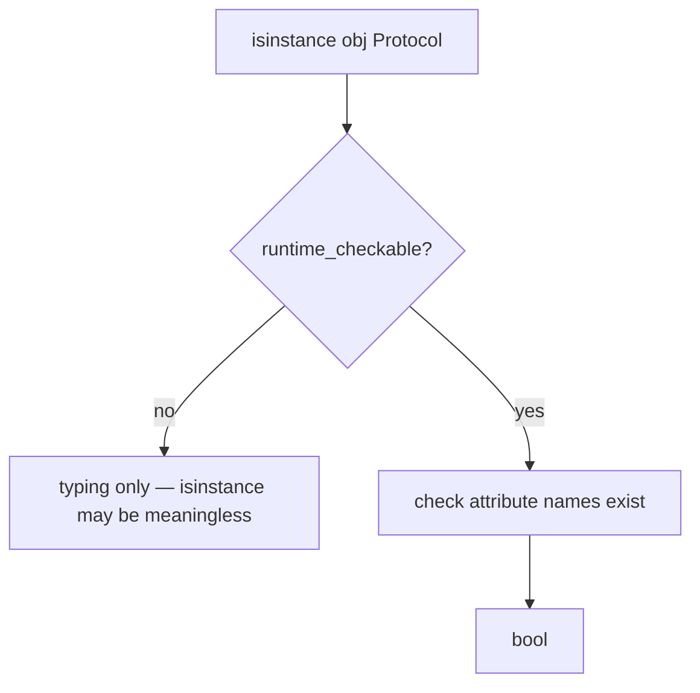
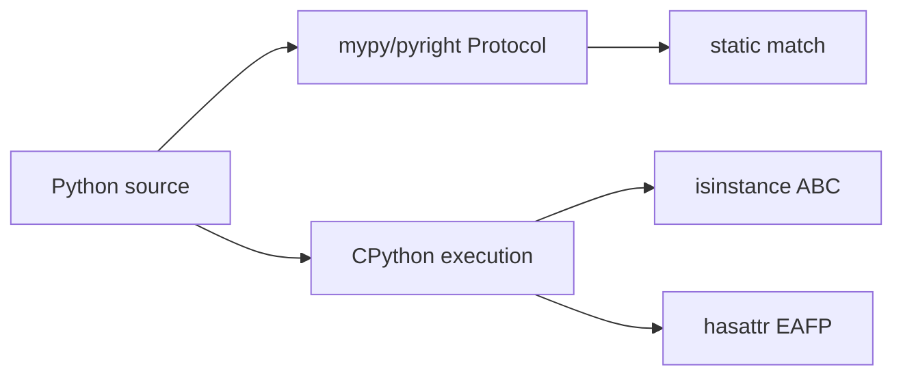
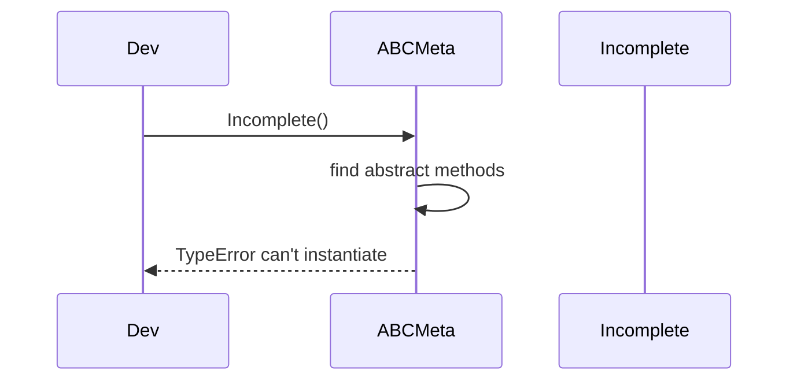

# ABCs Protocols and Runtime Structural Subtyping

## Overview

Python supports **nominal subtyping** via inheritance (`class D(B)`) and **abstract base classes (ABCs)** via `abc.ABC` that enforce required methods at **instantiation** time. **Structural subtyping** (static) is modeled with **`typing.Protocol`**: a type is compatible if it has the required methods/attributes, without inheriting—checked by **type checkers**, not runtime by default.

**Runtime duck typing** (`hasattr`, EAFP) predates typing. **`@runtime_checkable`** Protocols allow **`isinstance`** checks against a minimal method set—use carefully (signature not verified). **Collections ABCs** (`Sequence`, `Mapping`) document expected interfaces and support `isinstance` via **virtual subclass registration**.

Production design combines ABCs for **framework extension points**, Protocols for **static API contracts**, and concrete tests for behavior.

## Learning Objectives

- Define ABCs with `@abstractmethod` and understand instantiation rules
- Write `Protocol` classes for structural interfaces and optional `@runtime_checkable`
- Register virtual subclasses with `Register()` and `__subclasshook__`
- Choose ABC vs Protocol vs concrete duck typing for library boundaries
- Integrate with static checkers (mypy/pyright) without assuming runtime enforcement

## Prerequisites

- [[03-Python/03-Classes-Descriptors-and-Metaprogramming/Classes Instances and Attribute Lookup|Classes Instances and Attribute Lookup]]
- [[03-Python/06-Typing/Gradual Typing Philosophy and Trade-offs|Gradual Typing Philosophy and Trade-offs]]

## Difficulty

`advanced`

## Estimated Time

- Reading: 3 hours
- Exercises: 3 hours
- Mini project: 5 hours

## History

**PEP 3119** ABCs. **PEP 544** Protocols (3.8+). **`typing.runtime_checkable`** (3.8). **PEP 692** TypedDict kwargs. Collections ABCs moved toward `collections.abc`.

## Problem It Solves

Interface chaos causes:

- **Undocumented** expected methods on plugin objects
- **`isinstance(x, list)`** too strict for sequence-like third-party types
- Type checkers passing but **runtime AttributeError** on missing method
- ABC **metaclass cost** and inheritance rigidity for test doubles
- **`@runtime_checkable`** false confidence (no arg validation)

## Internal Implementation

### ABCMeta instantiation check

On `Concrete()`:

1. `ABCMeta.__call__`
2. If abstract methods remain on class → **`TypeError`**
3. Else create instance normally

Abstract methods stored as `__isabstractmethod__` on function objects.

### Protocol (static)

```python
from typing import Protocol

class SupportsClose(Protocol):
    def close(self) -> None: ...
```

Mypy: object with `close` matches. Runtime: **no** automatic check unless `@runtime_checkable`.

### runtime_checkable isinstance

Uses **`inspect.getattr_static`** for listed protocol members—**presence only**, not callable signature match.



### Virtual subclass registration

```python
from collections.abc import MutableMapping

class MyMap:
    ...
MutableMapping.register(MyMap)
assert isinstance(MyMap(), MutableMapping)
```

Registration does not inject methods—**honor protocol** is developer responsibility.

### CPython 3.14+ notes

- **`typing.Protocol`** supports **`@override`** integration in subclasses (typing)
- **`isinstance`** checks remain structural for registered ABCs
- Free-threaded: ABC checks unchanged; virtual subclass tables process-global

**Compatibility**: Protocols require 3.8+; `@runtime_checkable` limitations unchanged across 3.x.

## Mermaid Diagrams

### Structure: typing vs runtime layers



### Sequence: ABC fails at instantiate



## Examples

### Minimal Example

```python
from abc import ABC, abstractmethod

class Repository(ABC):
    @abstractmethod
    def get(self, id: str) -> dict:
        raise NotImplementedError

class MemoryRepo(Repository):
    def __init__(self) -> None:
        self._store: dict[str, dict] = {}

    def get(self, id: str) -> dict:
        return self._store[id]

# class Broken(Repository): pass  # TypeError
```

Protocol:

```python
from typing import Protocol, runtime_checkable

@runtime_checkable
class Closable(Protocol):
    def close(self) -> None: ...

class FileLike:
    def close(self) -> None:
        print("closed")

assert isinstance(FileLike(), Closable)
```

### Production-Shaped Example

Plugin loader accepting structural protocol statically, ABC at runtime boundary:

```python
from __future__ import annotations

from typing import Protocol, runtime_checkable

@runtime_checkable
class Exporter(Protocol):
    name: str
    def export(self, rows: list[dict]) -> bytes: ...

class CsvExporter:
    name = "csv"

    def export(self, rows: list[dict]) -> bytes:
        lines = [",".join(r.keys()), *[",".join(map(str, r.values())) for r in rows]]
        return "\n".join(lines).encode()

def load_exporter(obj: object) -> Exporter:
    if not isinstance(obj, Exporter):
        raise TypeError("exporter must provide name and export()")
    return obj  # static checker treats as Exporter after narrow
```

Pair with [[03-Python/06-Typing/Runtime Checking vs Static Checking|Runtime Checking vs Static Checking]].

Labs: [[03-Python/code/README|Python code labs]].

## Trade-offs

| Dimension | Upside | Downside | When it matters |
| --- | --- | --- | --- |
| ABC | Runtime enforce on instantiate | Inheritance required | frameworks |
| Protocol | Flexible test doubles | Runtime silent without checks | typing-first APIs |
| runtime_checkable | Quick guards | Shallow isinstance | plugin entry |
| Duck typing | Pythonic simplicity | Undocumented contracts | scripts |

### When to Use

- **ABC** for extension points users must subclass (`Repository`)
- **Protocol** for function parameters accepting structural types
- **`register()`** when third-party type already implements interface
- **EAFP** in hot paths after boundary validation

### When Not to Use

- Do not trust **`@runtime_checkable`** for security boundaries
- Do not ABC-wrap **every** internal helper
- Avoid **`isinstance(x, list)`** when **`Sequence`** suffices

## Exercises

1. Create ABC with `@classmethod @abstractmethod`; implement in subclass.
2. Write Protocol for `read(size: int) -> bytes`; verify mypy accepts custom class.
3. Register virtual subclass; test `isinstance` true without inheritance.
4. Show `@runtime_checkable` passing object with wrong callable signature.
5. Implement `__subclasshook__` on ABC for structural check.

## Mini Project

**Plugin Typing Kit**

Define Protocol for plugins, runtime loader with `isinstance`, mypy stub test suite, and docs on nominal vs structural choice.

## Portfolio Project

Typed plugin registry in [[03-Python/projects/Import Hook Plugin Loader/README|Import Hook Plugin Loader]] using Protocol + optional ABC base.

## Interview Questions

1. ABC vs Protocol—when use each?
2. What does `@abstractmethod` prevent?
3. What does `@runtime_checkable` add to Protocol?
4. How does `MutableMapping.register` work?
5. Is duck typing opposed to typing?

### Stretch / Staff-Level

1. Design HTTP client interface: Protocol for static typing, ABC for default impl sharing—justify split.
2. Explain `__subclasshook__` vs `register()` trade-offs for third-party types.

## Common Mistakes

- Assuming **mypy Protocol** enforced at runtime
- **`@runtime_checkable`** on Protocol with non-method members (limited support)
- Forgetting **`@abstractmethod`** on overridden method in subclass → still abstract
- **`isinstance`** on **`TypedDict`** (always false—TypedDict is not a class)

## Best Practices

- Validate at **system boundaries**; trust types internally after gate
- Document **required methods** in Protocol docstrings
- Use **`collections.abc`** types in public APIs not concrete `list`/`dict`
- Combine **Protocol static + unit tests** rather than shallow isinstance only
- Export **ABCs** from library `__all__` for extension authors

## Summary

ABCs enforce nominal interfaces at instantiation through ABCMeta and abstract methods. Protocols express structural contracts for static checkers, with optional runtime_checkable isinstance as a shallow guard. Production Python uses Protocols for flexible typing, ABCs for framework subclass hooks, and behavioral tests—never isinstance alone—for correctness.

## Further Reading

- [[03-Python/06-Typing/Protocols TypedDict Literal and Narrowing|Protocols TypedDict Literal and Narrowing]]
- [[01-Computer-Science/08-Languages-and-Computation/Type Systems and Soundness|Type Systems and Soundness]]
- [[03-Python/_exercises/README|Python Exercises]]

## Related Notes

- [[03-Python/03-Classes-Descriptors-and-Metaprogramming/Metaclasses and Class Creation|Metaclasses and Class Creation]]
- [[03-Python/01-Values-Types-and-Data-Model/Sequences Mappings and Sets as Protocols|Sequences Mappings and Sets as Protocols]]
- [[03-Python/code/README|Python code labs]]
- [[03-Python/README|Python Track]]

## Progress Checklist

- [ ] Explained from first principles
- [ ] Drew at least one Mermaid diagram
- [ ] Implemented a minimal version
- [ ] Documented trade-offs and non-goals
- [ ] Completed exercises
- [ ] Practiced interview questions aloud
- [ ] Linked prerequisites and dependents
