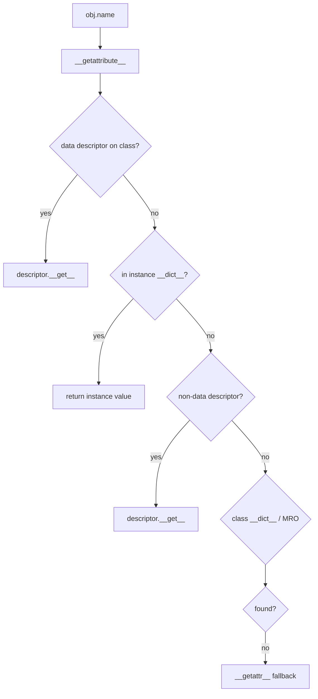
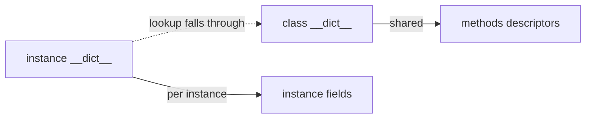
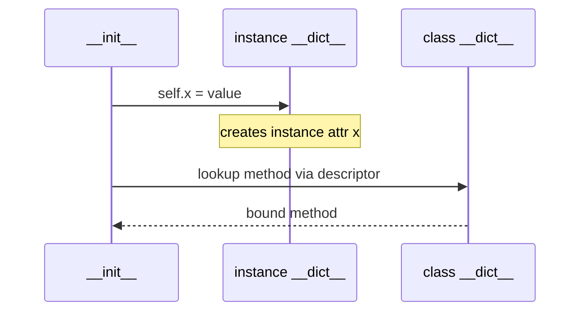

# Classes Instances and Attribute Lookup

## Overview

A **class** is an object (typically instance of `type` or a metaclass) that acts as a **factory** for **instances**. Attribute access `obj.name` invokes the **descriptor protocol** and a ordered lookup algorithm on the instance, class, and base classes—ultimately consulting `__dict__` mappings, data descriptors, non-data descriptors, and `__getattr__` fallbacks.

**Instance attributes** usually live in `instance.__dict__` unless `__slots__` restrict layout. **Class attributes** live in `class.__dict__` and are shared across instances until shadowed by instance assignment. Methods are **functions** stored on the class, bound to instances via the **method descriptor** (`__get__` on function objects).

Mastering lookup order prevents ORM-style surprises, explains why `self.x = x` in `__init__` creates instance fields, and connects to [[03-Python/03-Classes-Descriptors-and-Metaprogramming/Properties and the Descriptor Protocol|Properties and the Descriptor Protocol]].

## Learning Objectives

- Distinguish class object, instance object, and method object
- State the attribute lookup order for `type`, instance, and inheritance chain
- Predict effects of assignment vs mutation on class vs instance namespaces
- Use `vars()`, `dir()`, and `object.__getattribute__` for debugging
- Explain how `__slots__` and descriptors override plain dict lookup

## Prerequisites

- [[03-Python/01-Values-Types-and-Data-Model/Python Object Model and PyObject|Python Object Model and PyObject]]
- [[03-Python/02-Execution-Namespaces-and-Functions/Names Scopes LEGB and Closures|Names Scopes LEGB and Closures]]

## Difficulty

`advanced`

## Estimated Time

- Reading: 3 hours
- Exercises: 3 hours
- Mini project: 4 hours

## History

New-style classes unified in Python 2.2; Python 3 dropped old-style. **PEP 252** descriptors; **PEP 3115** metaclass syntax `class C(metaclass=M)`. Data model documented in Python Reference "Customizing class creation."

## Problem It Solves

Attribute bugs in production:

- Mutating **class-level mutable** defaults shared by instances
- Reading **property** before setter runs validation
- **`__getattr__` infinite recursion** calling missing attributes inside itself
- Shadowing **methods** on instance breaking polymorphism
- Assuming **`hasattr`** is safe—it calls `__getattr__` and swallows exceptions

## Internal Implementation

### Class creation (high level)

1. Gather namespace from class body (executed in temporary dict)
2. Resolve metaclass (explicit or inferred from bases)
3. Metaclass `__call__` / `__new__` / `__init__` produces class object
4. Class `__dict__` holds methods, descriptors, class variables

See [[03-Python/03-Classes-Descriptors-and-Metaprogramming/Metaclasses and Class Creation|Metaclasses and Class Creation]] for depth.

### Instance attribute lookup (simplified)

For `obj.name`:

1. `type(obj).__getattribute__(obj, name)` (default in `object`)
2. On class `type(obj)`, find **data descriptor** (`__set__` or `__delete__`) → call `__get__`
3. Else instance `__dict__` if present
4. Else non-data descriptor on class → `__get__`
5. Else class `__dict__`
6. Else repeat on MRO bases
7. Else `__getattr__` if defined



### Method binding

Function `f` in class `C`: `C.f` is function; `C().f` is bound method with `__self__` and `__func__`.

### CPython 3.14+ notes

- **Specializing interpreter** optimizes `LOAD_ATTR` for common slot/dict layouts
- **Managed dict** and **inline values** (3.11+ internals) change memory layout but not semantics
- Free-threaded: concurrent `__dict__` mutation on same instance requires care—use locks or immutable patterns

**Compatibility**: `__getattribute__` override changes all lookups; `__slots__` breaks arbitrary `__dict__` unless `'__dict__'` in slots.

## Mermaid Diagrams

### Structure: class vs instance namespaces



### Sequence: first attribute assignment in __init__



## Examples

### Minimal Example

```python
class Counter:
    total = 0  # class variable

    def __init__(self) -> None:
        self.count = 0  # instance variable

    def inc(self) -> None:
        self.count += 1
        Counter.total += 1

a = Counter()
b = Counter()
a.inc()
assert a.count == 1 and b.count == 0
assert Counter.total == 1
```

Class mutable pitfall:

```python
class Bag:
    items = []  # shared!

    def add(self, x):
        self.items.append(x)

# Fix: use __init__ self.items = []
```

### Production-Shaped Example

Defensive `__getattribute__` logging (use sparingly):

```python
import logging
from typing import Any

log = logging.getLogger(__name__)

class AuditedModel:
    def __getattribute__(self, name: str) -> Any:
        if name.startswith("_audit_"):
            return object.__getattribute__(self, name)
        log.debug("access %s.%s", type(self).__name__, name)
        return object.__getattribute__(self, name)
```

Prefer explicit instrumentation over overriding `__getattribute__` in hot paths.

Resolver lab: [[03-Python/code/README|Python code labs]].

## Trade-offs

| Dimension | Upside | Downside | When it matters |
| --- | --- | --- | --- |
| Instance __dict__ | Flexible attributes | Memory per key | Dynamic ORMs |
| Class attributes | Shared constants | Mutable sharing bugs | config defaults |
| __getattr__ lazy | Saves memory | Hidden failures | plugin attrs |
| __slots__ | Memory + speed | Less dynamic | high-volume objects |

### When to Use

- **Instance attrs** for per-object state
- **Class attrs** for immutables and constants
- **Descriptors/properties** for validated fields

### When Not to Use

- Do not store **mutable class-level lists** without copy in `__init__`
- Do not override **`__getattribute__`** without delegating to `object` for internals
- Do not use **`hasattr` for EAFP** on objects with heavy `__getattr__`

## Exercises

1. Draw lookup path for `obj.m` when `m` is method, instance attr shadowing method, and property.
2. Implement minimal `SimpleNamespace`-like class without dataclass.
3. Show `__dict__` contents after `self.x = 1` vs `Class.x = 1` assignment styles.
4. Explain why `obj.__class__ is type` relationship holds for new-style classes.
5. Use `inspect.getmembers` vs `dir` — when do they differ?

## Mini Project

**Attribute Lookup Tracer**

Monkeypatch or subclass to log each lookup step (descriptor hit, dict hit, MRO base). Feed into pytest for teaching examples.

## Portfolio Project

Implement subset of **attribute resolver** in [[03-Python/projects/Descriptor Validated Fields/README|Descriptor Validated Fields]] before adding validation descriptors.

## Interview Questions

1. Where are instance vs class attributes stored?
2. Full lookup order including data vs non-data descriptors?
3. What is a bound method object?
4. Difference between `__getattr__` and `__getattribute__`?
5. Why `Bag.items` class list pitfall happens?

### Stretch / Staff-Level

1. Walk through CPython `LOAD_ATTR` specialization cases (dict vs slot vs descriptor).
2. How does `__slots__` alter step 3 in lookup algorithm?

## Common Mistakes

- **Class mutable defaults**
- **`self.attr` assignment** creating shadow when property expected on class
- **`hasattr(o, 'x')`** triggering expensive or failing `__getattr__`
- Confusing **`type(obj)`** with **`obj.__class__`** (usually same, proxy edge cases)

## Best Practices

- Initialize **all instance state in `__init__`**
- Use **properties or descriptors** for validated fields
- Document **class-level constants** as uppercase immutables
- Prefer **`dataclasses.field(default_factory=list)`** over shared mutables
- Test **attribute access** under inheritance with explicit MRO cases

## Summary

Classes are objects whose `__dict__` holds methods and descriptors; instances carry per-object state in their own namespaces unless constrained by slots. Attribute lookup follows a strict descriptor-aware order through the MRO. Production code avoids shared mutable class state, overrides lookup only deliberately, and routes validation through descriptors or properties—not ad hoc `__getattr__` chains.

## Further Reading

- [[03-Python/03-Classes-Descriptors-and-Metaprogramming/Inheritance MRO and super|Inheritance MRO and super]]
- [[03-Python/_exercises/README|Python Exercises]]

## Related Notes

- [[03-Python/03-Classes-Descriptors-and-Metaprogramming/Properties and the Descriptor Protocol|Properties and the Descriptor Protocol]]
- [[03-Python/01-Values-Types-and-Data-Model/Mutability Sharing and Copying|Mutability Sharing and Copying]]
- [[01-Computer-Science/08-Languages-and-Computation/Object Models and Message Passing|Object Models and Message Passing]]
- [[03-Python/code/README|Python code labs]]
- [[03-Python/README|Python Track]]

## Progress Checklist

- [ ] Explained from first principles
- [ ] Drew at least one Mermaid diagram
- [ ] Implemented a minimal version
- [ ] Documented trade-offs and non-goals
- [ ] Completed exercises
- [ ] Practiced interview questions aloud
- [ ] Linked prerequisites and dependents
