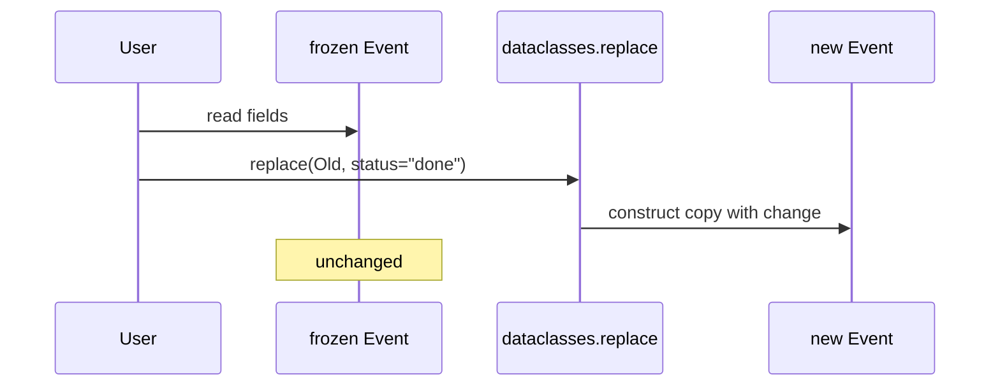

# Dataclasses and Data-Oriented Classes

## Overview

**Dataclasses** (stdlib `dataclasses`, PEP 557) generate boilerplate—`__init__`, `__repr__`, `__eq__`, optional ordering and hashing—from **annotated class attributes**. They target **data-oriented** types: records, DTOs, config snapshots, event payloads—not rich behavior hierarchies.

The `@dataclass` decorator transforms a class at definition time (class decorator, not metaclass). Options include **`frozen=True`** (immutable), **`slots=True`** (memory layout, 3.10+), **`kw_only=True`** (3.10+), and **`order=True`**. **`field()`** supplies defaults, `default_factory`, and per-field flags (`init`, `repr`, `compare`, `hash`).

Compare with **attrs** (third-party, richer validators) and plain **`NamedTuple`** / **`TypedDict`** for lighter-weight shapes.

## Learning Objectives

- Configure `@dataclass` for immutability, ordering, hashing, and slots
- Use `field(default_factory=...)` safely for mutable defaults
- Implement post-init validation with `__post_init__`
- Choose among dataclass, NamedTuple, TypedDict, and Pydantic models
- Understand generated methods and interaction with inheritance

## Prerequisites

- [[03-Python/03-Classes-Descriptors-and-Metaprogramming/Classes Instances and Attribute Lookup|Classes Instances and Attribute Lookup]]
- [[03-Python/03-Classes-Descriptors-and-Metaprogramming/Slots Weakrefs and Object Layout|Slots Weakrefs and Object Layout]]

## Difficulty

`intermediate`

## Estimated Time

- Reading: 2 hours
- Exercises: 2–3 hours
- Mini project: 4 hours

## History

**PEP 557** (3.7) dataclasses. **`slots=True`** (3.10). **`kw_only=True`** (3.10). **`match_args`** (3.10) for pattern matching. Ecosystem: **attrs** predates and influences stdlib; **Pydantic v2** for validated parsing layers.

## Problem It Solves

Hand-written DTOs duplicate:

- **`__init__`** parameter ordering and defaults bugs
- **`__eq__`** inconsistent with field sets
- **Mutable class defaults** (`tags=[]`)
- Missing **`repr`** in logs during incidents
- **Unhashable** dict keys when immutability needed

Dataclasses automate correct patterns with opt-in strictness.

## Internal Implementation

### Generated __init__ (conceptual)

Fields collected in definition order (respecting kw_only sections). For each field with `init=True`:

- Parameter in signature with default or `MISSING`
- Body assigns `self.name = name`

```mermaid
flowchart TD
    Ann[class annotations] --> DC[@dataclass decorator]
    DC --> GenInit[generate __init__]
    DC --> GenRepr[generate __repr__]
    DC --> GenEq[generate __eq__]
    DC --> Opt[optional __hash__ order]
```

### Frozen instances

`frozen=True` replaces `__setattr__` and `__delattr__` to raise `FrozenInstanceError`. Mutations require `dataclasses.replace()` producing new instance.

### slots=True

Generates `__slots__` from field names—see [[03-Python/03-Classes-Descriptors-and-Metaprogramming/Slots Weakrefs and Object Layout|Slots Weakrefs and Object Layout]]. Incompatible with certain inherited dict layouts unless coordinated.

### CPython 3.14+ notes

- **`KW_ONLY` sentinel** for field ordering in 3.10+ style signatures
- Works with **PEP 563/649** annotation policies—types in annotations may be strings or lazy
- **`match` statement** uses `match_args` tuple when enabled

**Compatibility**: `@dataclass` on 3.7 lacks `slots=`; backport via attrs or manual slots.

## Mermaid Diagrams

### Structure: dataclass vs alternatives

```mermaid
flowchart LR
    Need[need structured data]
    Need --> DC[@dataclass]
    Need --> NT[NamedTuple immutable tuple]
    Need --> TD[TypedDict JSON-shaped dict]
    Need --> PY[Pydantic validated model]
    DC --> Records[mutable records + methods]
    NT --> Light[lightweight immutable]
    TD --> Schema[external JSON schema]
    PY --> Parse[parse validate at boundary]
```

### Sequence: frozen update via replace



## Examples

### Minimal Example

```python
from dataclasses import dataclass, field

@dataclass(slots=True, frozen=True, kw_only=True)
class Point:
    x: float
    y: float
    label: str = "origin"

@dataclass
class Batch:
    items: list[str] = field(default_factory=list)

    def __post_init__(self) -> None:
        if not self.items:
            raise ValueError("batch must not be empty")
```

### Production-Shaped Example

Domain event with hash for dedup set:

```python
from __future__ import annotations

import hashlib
from dataclasses import dataclass, field
from datetime import datetime, timezone

@dataclass(frozen=True, slots=True)
class DomainEvent:
    aggregate_id: str
    name: str
    occurred_at: datetime = field(default_factory=lambda: datetime.now(timezone.utc))
    payload: bytes = b""

    def __post_init__(self) -> None:
        if not self.aggregate_id:
            raise ValueError("aggregate_id required")

    @property
    def dedup_key(self) -> str:
        digest = hashlib.sha256(self.payload).hexdigest()[:16]
        return f"{self.aggregate_id}:{self.name}:{digest}"

events: set[DomainEvent] = set()
e1 = DomainEvent("ord-1", "Created", payload=b"{}")
events.add(e1)
```

Serialization boundary—pair with JSON schema or msgspec at API layer.

See [[03-Python/code/README|Python code labs]].

## Trade-offs

| Dimension | Upside | Downside | When it matters |
| --- | --- | --- | --- |
| @dataclass | Stdlib, fast codegen | Limited validation | internal DTOs |
| frozen=True | Hashable, thread-safe fields | Update via replace | event sourcing |
| slots=True | Memory | Inheritance constraints | high volume |
| attrs/Pydantic | Validators, converters | Dependency | public APIs |

### When to Use

- **Internal records** with repr/eq and optional immutability
- **Event/cfg snapshots** logged and compared
- **`slots=True`** on millions of homogeneous rows

### When Not to Use

- Do not use dataclass for **ORM entities** with lazy DB loads unless thin wrapper
- Do not **`frozen=False`** with fields containing **shared mutable** objects expecting value semantics
- Use **Pydantic** at HTTP boundary for coercion/validation

## Exercises

1. Implement same DTO manually then with `@dataclass`; diff generated methods with `inspect`.
2. Show mutable default bug with `tags: list = []` without factory; fix.
3. Create ordered dataclass; sort list of instances.
4. Subclass dataclass adding field—what happens to generated `__init__`?
5. Use `dataclasses.asdict` and `is_dataclass` in JSON encoder.

## Mini Project

**Event Log Core**

Append-only log of frozen dataclass events with dedup set, JSON lines export, and `replace`-based state projection rebuild.

## Portfolio Project

Use dataclass events in [[03-Python/projects/Python Runtime Toolkit/README|Python Runtime Toolkit]] tracing subsystem.

## Interview Questions

1. How do dataclasses avoid mutable default argument bug?
2. What does `frozen=True` change at runtime?
3. Difference between dataclass and NamedTuple?
4. When is `__hash__` generated automatically?
5. Purpose of `__post_init__`?

### Stretch / Staff-Level

1. Compare dataclass(slots=True) memory to attrs with slotted on 1M instances.
2. How do dataclasses interact with multiple inheritance and field ordering?

## Common Mistakes

- **`field(default=[])`** instead of `default_factory=list`
- Expecting **deep immutability** with frozen but mutable field types (list inside)
- **`eq=False`** forgotten when custom `__eq__` exists → generated conflict
- **`slots=True`** with subclass adding `__dict__` requirement without planning

## Best Practices

- Use **`default_factory`** for any mutable or per-instance default
- Prefer **`frozen=True`** for value objects crossing threads
- Add **`__post_init__`** validation for invariants stdlib cannot express
- Keep **behavior methods** thin; heavy logic in services
- Serialize with **explicit schema** at boundaries—not blind `asdict` for datetime/bytes

## Summary

Dataclasses generate init, repr, eq, and optional ordering/hash from annotated fields—eliminating repetitive DTO bugs. Frozen and slotted options align with production needs for immutability and memory. They complement, not replace, validation libraries at system edges and ORM layers for persistent entities.

## Further Reading

- [[03-Python/06-Typing/Protocols TypedDict Literal and Narrowing|Protocols TypedDict Literal and Narrowing]]
- [[03-Python/06-Typing/Annotations Deferred Evaluation and annotationlib|Annotations Deferred Evaluation and annotationlib]]
- [[03-Python/_exercises/README|Python Exercises]]
- Python docs — `dataclasses` module reference (3.14)

## Related Notes

- [[03-Python/03-Classes-Descriptors-and-Metaprogramming/Properties and the Descriptor Protocol|Properties and the Descriptor Protocol]]
- [[03-Python/03-Classes-Descriptors-and-Metaprogramming/Enums and Singletons|Enums and Singletons]]
- [[03-Python/code/README|Python code labs]]
- [[03-Python/README|Python Track]]

## Progress Checklist

- [ ] Explained from first principles
- [ ] Drew at least one Mermaid diagram
- [ ] Implemented a minimal version
- [ ] Documented trade-offs and non-goals
- [ ] Completed exercises
- [ ] Practiced interview questions aloud
- [ ] Linked prerequisites and dependents
