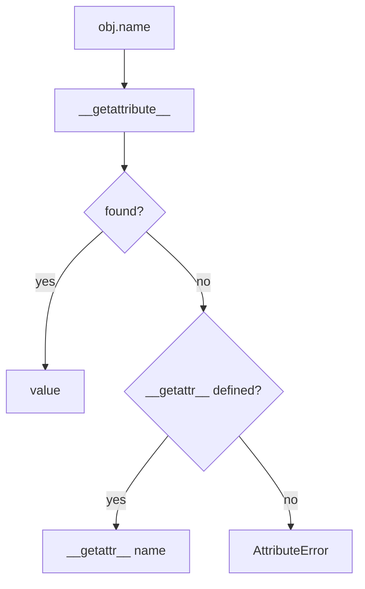
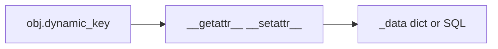
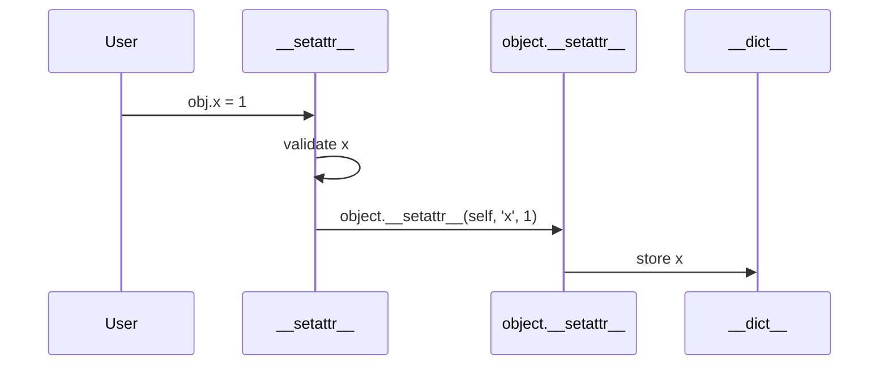

# Dynamic Attributes getattr setattr and dict

## Overview

Python attribute access normally follows descriptor-aware lookup in `__getattribute__`. **Dynamic attributes** extend or override this with:

- **`__getattr__(name)`** — called only when normal lookup fails
- **`__setattr__(name, value)`** — intercept every assignment
- **`__delattr__(name)`** — intercept deletion
- **`__dict__`** — per-instance namespace (unless slots or custom layout)

Module-level **`getattr`**, **`setattr`**, **`hasattr`**, and **`delattr`** builtins dispatch to these hooks. Dynamic patterns power ORMs (`user.email` lazy load), **`SimpleNamespace`**, **`types.MappingProxyType`**, and plugin objects exposing arbitrary APIs— but overlap with **descriptors** and **`__slots__`** must be designed deliberately to avoid infinite recursion and bypass bugs.

## Learning Objectives

- Implement `__getattr__` / `__setattr__` without recursion traps
- Route dynamic keys through internal storage vs user-facing attributes
- Use `object.__getattribute__` and `object.__setattr__` for bypass paths
- Compare dynamic hooks vs descriptors vs `__dict__` direct access
- Apply `getattr(obj, name, default)` and `vars(obj)` safely in production introspection

## Prerequisites

- [[03-Python/03-Classes-Descriptors-and-Metaprogramming/Classes Instances and Attribute Lookup|Classes Instances and Attribute Lookup]]
- [[03-Python/03-Classes-Descriptors-and-Metaprogramming/Properties and the Descriptor Protocol|Properties and the Descriptor Protocol]]

## Difficulty

`advanced`

## Estimated Time

- Reading: 2–3 hours
- Exercises: 3 hours
- Mini project: 4 hours

## History

Classic ORMs (Django) combine instance `__dict__` with class descriptors. **`__getattr__`** fallback popularized lazy attributes. **`dataclasses`** and **`__slots__`** reduce need for open-ended `__dict__` in DTOs—dynamic hooks remain for plugin/proxy objects.

## Problem It Solves

Dynamic attribute bugs:

- **`__getattr__` calling `self.x`** → infinite recursion
- **`__setattr__` assigning self.name`** without bypass → recursion
- **`hasattr(o, 'x')`** swallowing exceptions from `@property` getter
- **Validation bypass** via `obj.__dict__['field'] = bad`
- **`pickle`/`copy`** missing dynamic attrs not in `__dict__`

## Internal Implementation

### Lookup vs getattr hook

| Mechanism | When runs |
| --- | --- |
| `__getattribute__` | Every attribute access (default on object) |
| `__getattr__` | After `__getattribute__` raises AttributeError |
| `getattr(obj, 'a', default)` | Same as `obj.a` except catches AttributeError → default |

Override **`__getattribute__`** only when necessary—performance cost on all lookups.



### setattr path

Default `object.__setattr__` creates/updates instance `__dict__` entry (or slot). Custom `__setattr__` must eventually call `object.__setattr__` for storage fields.

### __dict__ views

- **`vars(obj)`** → `obj.__dict__` if defined
- **`obj.__dict__`** direct mutation bypasses descriptors/properties
- **`MappingProxyType`** for read-only exposure of namespace

### CPython 3.14+ notes

- **`LOAD_ATTR`** specialization assumes common patterns—heavy `__getattribute__` overrides disable opts
- **`__slots__`** without `__dict__` — dynamic unknown attrs fail unless `__getattr__` synthesizes
- Free-threaded: custom `__setattr__` must synchronize shared backing stores

**Compatibility**: Old-style `__getattr__` only; no `__getattribute__` on classic classes (Py2)—irrelevant in Py3.

## Mermaid Diagrams

### Structure: storage vs facade



### Sequence: safe setattr pattern



## Examples

### Minimal Example

```python
class Bag:
    def __init__(self) -> None:
        object.__setattr__(self, "_data", {})

    def __getattr__(self, name: str):
        try:
            return self._data[name]
        except KeyError as exc:
            raise AttributeError(name) from exc

    def __setattr__(self, name: str, value) -> None:
        if name == "_data":
            object.__setattr__(self, name, value)
            return
        self._data[name] = value

b = Bag()
b.color = "red"
assert b.color == "red"
assert vars(b) == {"_data": {"color": "red"}}
```

### Production-Shaped Example

Lazy resource handle with cache invalidation:

```python
from __future__ import annotations

from typing import Any, Callable

class LazyResource:
    def __init__(self, factory: Callable[[], Any]) -> None:
        object.__setattr__(self, "_factory", factory)
        object.__setattr__(self, "_cache", {})

    def __getattr__(self, name: str) -> Any:
        cache = object.__getattribute__(self, "_cache")
        if name in cache:
            return cache[name]
        factory = object.__getattribute__(self, "_factory")
        value = factory(name)
        cache[name] = value
        return value

    def invalidate(self, name: str) -> None:
        object.__getattribute__(self, "_cache").pop(name, None)

resource = LazyResource(lambda key: f"loaded-{key}")
assert resource.connection == "loaded-connection"
resource.invalidate("connection")
```

ORM-style field access belongs in [[03-Python/projects/Descriptor Validated Fields/README|Descriptor Validated Fields]]—prefer descriptors when validation required.

```python
# Introspection at boundary
def export_public(obj: object) -> dict[str, Any]:
    d = vars(obj) if hasattr(obj, "__dict__") else {}
    return {k: v for k, v in d.items() if not k.startswith("_")}
```

Labs: [[03-Python/code/README|Python code labs]].

## Trade-offs

| Dimension | Upside | Downside | When it matters |
| --- | --- | --- | --- |
| __getattr__ lazy | Load on demand | Hidden I/O errors | ORM |
| __setattr__ validate | Centralized rules | Easy recursion | invariants |
| __dict__ open | Flexible | Memory | plugins |
| Descriptors | Precise per-field | Boilerplate | validated models |

### When to Use

- **`__getattr__`** for missing key fallback (proxy, lazy)
- **`__setattr__`** for cross-field validation on simple objects
- **`getattr(..., default)`** for optional plugin hooks

### When Not to Use

- Do not override **`__getattribute__`** for whole ORM—use descriptors
- Do not use **`hasattr`** for control flow on objects with expensive properties
- Avoid exposing mutable **`__dict__`** on security-sensitive objects

## Exercises

1. Fix recursive `__getattr__` that references undefined attributes incorrectly.
2. Implement read-only object: `__setattr__` raises after init except private `_`.
3. Show property validation bypass via `__dict__`; fix with descriptor.
4. Write `MappingProxyType` wrapper exposing read-only config.
5. Use `getattr(module, 'optional_hook', lambda: None)` in plugin loader.

## Mini Project

**Attribute Sandbox**

Object with whitelisted dynamic keys, audit log on set/get, and tests proving descriptor cannot be bypassed when enforced.

## Portfolio Project

Dynamic plugin surface for [[03-Python/projects/Import Hook Plugin Loader/README|Import Hook Plugin Loader]] using `__getattr__` module lazy exports (PEP 562 style).

## Interview Questions

1. Difference between `__getattr__` and `__getattribute__`?
2. Why must `__setattr__` call `object.__setattr__` sometimes?
3. Does `hasattr(x, 'a')` call `__getattr__`?
4. How can assignment bypass a `@property` setter?
5. What does `vars(obj)` return for slotted instance?

### Stretch / Staff-Level

1. Design hybrid: descriptors for declared fields, `__getattr__` for extension keys only.
2. Explain PEP 562 `module.__getattr__` for lazy submodule loading vs class hooks.

## Common Mistakes

- **Infinite recursion** in hooks
- Using **`hasattr`** before EAFP on expensive attrs
- **`__getattr__` raising wrong type** (must raise AttributeError for missing)
- Forgetting **`__slots__`** objects may lack `__dict__`

## Best Practices

- Delegate storage to **`object.__setattr__`** or dedicated `_data` dict early in `__init__`
- Prefer **descriptors** when each field has schema/validation
- Use **`__getattr__` only for unknown names**—defined attrs use normal path
- Log dynamic access in **debug mode only**—not production hot paths
- Document **bypass risks** (`__dict__` mutation) in security reviews

## Summary

Dynamic attributes customize Python's lookup and assignment through `__getattr__`, `__setattr__`, and the instance `__dict__`. Builtins `getattr`/`setattr` invoke the same protocol. Production code uses lazy `__getattr__` sparingly, validates via descriptors when invariants matter, and calls `object.__setattr__` to avoid recursion—treating open-ended namespaces as explicit design choices, not defaults.

## Further Reading

- [[03-Python/03-Classes-Descriptors-and-Metaprogramming/Properties and the Descriptor Protocol|Properties and the Descriptor Protocol]]
- [[03-Python/08-Modules-Packaging-and-Environments/Import System and Module Objects|Import System and Module Objects]]
- [[03-Python/_exercises/README|Python Exercises]]

## Related Notes

- [[03-Python/03-Classes-Descriptors-and-Metaprogramming/Slots Weakrefs and Object Layout|Slots Weakrefs and Object Layout]]
- [[03-Python/03-Classes-Descriptors-and-Metaprogramming/Classes Instances and Attribute Lookup|Classes Instances and Attribute Lookup]]
- [[03-Python/code/README|Python code labs]]
- [[03-Python/README|Python Track]]

## Progress Checklist

- [ ] Explained from first principles
- [ ] Drew at least one Mermaid diagram
- [ ] Implemented a minimal version
- [ ] Documented trade-offs and non-goals
- [ ] Completed exercises
- [ ] Practiced interview questions aloud
- [ ] Linked prerequisites and dependents
