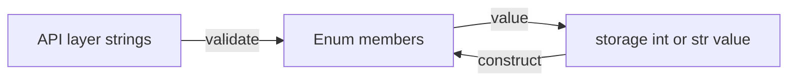
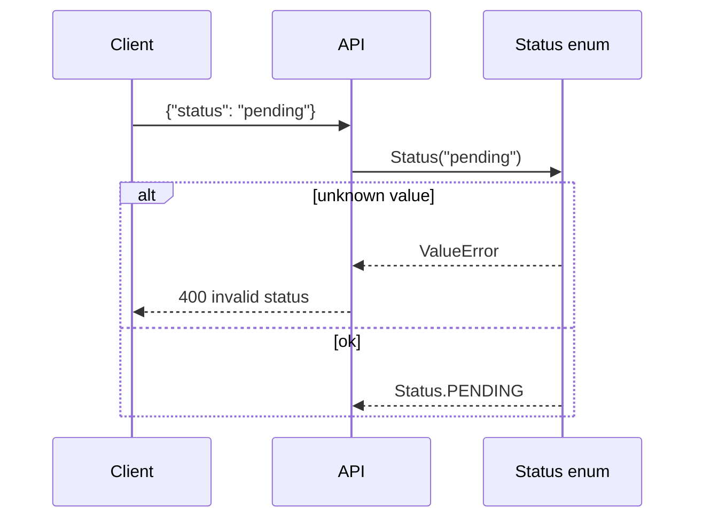

# Enums and Singletons

## Overview

The **`enum`** module (PEP 435) provides **Enumerations**—sets of named constants with **identity semantics**. Each member is a **singleton instance** of the enum class; comparison is by identity (`is`), with value backing for serialization. Variants include **`IntEnum`**, **`Flag`**, **`StrEnum`** (3.11+), and **`auto()`** for generated values.

**Singleton pattern** in Python is often a **module-level object** or **enum member**, not a metaclass `__call__` override—because import semantics already guarantee one module instance per process. Metaclass singletons remain teachable but fragile under multiprocessing and testing.

Enums replace stringly-typed constants (`status = "pending"`) with **validated, discoverable** members for state machines, HTTP codes, feature flags, and config enums.

## Learning Objectives

- Define `Enum`, `IntEnum`, `Flag`, and `StrEnum` with appropriate use cases
- Explain enum member identity, hashing, and pickling behavior
- Serialize/deserialize enums safely in JSON/APIs
- Implement singletons via module pattern vs enum vs metaclass—compare trade-offs
- Use `@unique` and custom `_generate_next_value_` for value assignment

## Prerequisites

- [[03-Python/03-Classes-Descriptors-and-Metaprogramming/Classes Instances and Attribute Lookup|Classes Instances and Attribute Lookup]]
- [[03-Python/03-Classes-Descriptors-and-Metaprogramming/Metaclasses and Class Creation|Metaclasses and Class Creation]]

## Difficulty

`intermediate`

## Estimated Time

- Reading: 2 hours
- Exercises: 2 hours
- Mini project: 3 hours

## History

**PEP 435** (3.4) enums. **`Flag`** (3.6). **`StrEnum`** (3.11). **`enum.verify`** decorators and **`ReprEnum`** refinements in 3.11+. Prior art: many hand-rolled constant classes.

## Problem It Solves

String constants cause:

- **Typos** `"pendng"` uncaught until runtime far away
- **Unbounded** string sets in APIs
- **JSON** round-trip ambiguity (case, unknown values)
- **Singleton metaclass** breaking tests and pickling
- **Bitflag** errors without `Flag` operators

Enums centralize valid values and introspection (`list(Status)`).

## Internal Implementation

### EnumMeta class creation

Enum uses **`EnumType`** metaclass:

1. Members defined in class body become **singleton instances**
2. Names cannot be reused; aliases create **different names same member**
3. `__members__` ordered dict name → member

```mermaid
flowchart TD
    ClassBody[class Color RED GREEN] --> Meta[EnumMeta]
    Meta --> Members[Color.RED Color.GREEN singletons]
    Members --> Lookup[Color['RED'] Color(1)]
```

### Identity and equality

`Color.RED is Color.RED` always True. `Color.RED == Color.RED` True. **`is` preferred** for enum compare in application code.

### Flag and bitwise ops

`Flag` members support `|`, `&`, `^`, `~` with normalization rules—useful for permissions masks.

### Singleton via module (idiomatic)

```python
# connection_pool.py
class _Pool:
    ...

pool = _Pool()  # process-wide singleton by convention
```

Import `pool` everywhere—reload tests must `importlib.reload` carefully.

### CPython 3.14+ notes

- **`StrEnum`** values are strings—subclass str + Enum
- **`enum.property`** for member methods (3.11+)
- Pickle by name/value stable across versions if enum definition stable

**Compatibility**: Do not mix incompatible `Enum` inheritance; `IntEnum` is not a replacement for every int context (still not `int` subclass in all APIs in older code).

## Mermaid Diagrams

### Structure: enum vs raw strings



### Sequence: JSON deserialization guard



## Examples

### Minimal Example

```python
from enum import Enum, auto, unique

@unique
class Status(Enum):
    PENDING = auto()
    RUNNING = auto()
    DONE = auto()
    FAILED = auto()

def advance(s: Status) -> Status:
    order = list(Status)
    idx = order.index(s)
    return order[min(idx + 1, len(order) - 1)]

assert Status.PENDING.name == "PENDING"
assert Status("PENDING") is Status.PENDING
```

Flag permissions:

```python
from enum import Flag, auto

class Perm(Flag):
    READ = auto()
    WRITE = auto()
    EXEC = auto()

combined = Perm.READ | Perm.WRITE
assert combined & Perm.READ
```

### Production-Shaped Example

API-safe enum JSON codec:

```python
from __future__ import annotations

import json
from enum import StrEnum

class OrderState(StrEnum):
    CREATED = "created"
    PAID = "paid"
    SHIPPED = "shipped"
    CANCELLED = "cancelled"

def encode_state(state: OrderState) -> str:
    return state.value

def decode_state(raw: str) -> OrderState:
    try:
        return OrderState(raw)
    except ValueError as exc:
        raise ValueError(f"invalid order state: {raw!r}") from exc

payload = json.dumps({"state": encode_state(OrderState.PAID)})
data = json.loads(payload)
state = decode_state(data["state"])
```

Module singleton for settings (preferred over metaclass):

```python
from dataclasses import dataclass

@dataclass(frozen=True)
class Settings:
    env: str = "prod"
    debug: bool = False

settings = Settings()  # import settings everywhere
```

Labs: [[03-Python/code/README|Python code labs]].

## Trade-offs

| Dimension | Upside | Downside | When it matters |
| --- | --- | --- | --- |
| Enum | Validated constants | Learning curve for JSON | state machines |
| StrEnum | str-compatible | Value must be unique str | APIs |
| Flag | Bitmasks | Complexity | permissions |
| Module singleton | Simple | Hidden global state | config |

### When to Use

- **Enum/StrEnum** for finite closed sets in domain model
- **Flag** for composable permission bits
- **Module singleton** for process-wide config/service holder

### When Not to Use

- Do not enum-wrap **unbounded** user strings
- Avoid **metaclass singleton** for services—use explicit DI
- Do not compare enums to **raw strings** without conversion policy

## Exercises

1. Add alias member in Enum; inspect `__members__` and `Color.RED is Color.CRIMSON` if aliased.
2. Serialize enum to JSON and back; handle unknown value with 400-style error.
3. Implement `@unique` violation example.
4. Build `Flag` mask for UNIX-like chmod subset.
5. Compare `is` vs `==` for IntEnum and int (document surprises).

## Mini Project

**State Machine DSL**

Define transitions table keyed by Enum states/events; validate illegal transitions; export Graphviz diagram from enum members.

## Portfolio Project

Use StrEnum states in [[03-Python/projects/Bounded Worker Orchestrator/README|Bounded Worker Orchestrator]] job lifecycle.

## Interview Questions

1. Are Enum members singletons? How does `is` compare to `==`?
2. Difference between Enum and IntEnum?
3. Idiomatic singleton in Python without metaclass?
4. How deserialize unknown enum value safely at API boundary?
5. What does `@unique` decorator do?

### Stretch / Staff-Level

1. Explain Enum member ordering and Python 3.11 `enum.verify` usage.
2. When would `EnumType` customization be justified vs plain Enum subclass?

## Common Mistakes

- **`Status("PENDING")` vs `Status.PENDING`** confusion on input validation
- Storing **enum name** in DB but comparing to **value**
- **`IntEnum` used where bool/int confusion** breaks APIs expecting bool
- Pickling enums across **different code versions** after member renames

## Best Practices

- Store **stable value** (str/int) in DB; map to Enum at repository boundary
- Use **`StrEnum`** for JSON-native string enums (3.11+)
- Document **unknown member policy** (reject vs migrate)
- Prefer **module singleton** or DI container over metaclass singleton
- List allowed values via **`list(Enum)`** in OpenAPI/schema generation

## Summary

Enums provide named constant singletons with strong identity and introspection—replacing error-prone string constants. Flags handle bitmask domains. Python singletons are best achieved as module-level objects or enum members, not metaclass tricks. Production code validates external strings into enums at boundaries and persists stable values, not arbitrary user text.

## Further Reading

- [[03-Python/03-Classes-Descriptors-and-Metaprogramming/Dataclasses and Data-Oriented Classes|Dataclasses and Data-Oriented Classes]]
- [[03-Python/_exercises/README|Python Exercises]]

## Related Notes

- [[03-Python/03-Classes-Descriptors-and-Metaprogramming/Metaclasses and Class Creation|Metaclasses and Class Creation]]
- [[03-Python/09-Production-Python/API Design Defensive Programming and Compatibility|API Design Defensive Programming and Compatibility]]
- [[03-Python/code/README|Python code labs]]
- [[03-Python/README|Python Track]]

## Progress Checklist

- [ ] Explained from first principles
- [ ] Drew at least one Mermaid diagram
- [ ] Implemented a minimal version
- [ ] Documented trade-offs and non-goals
- [ ] Completed exercises
- [ ] Practiced interview questions aloud
- [ ] Linked prerequisites and dependents
