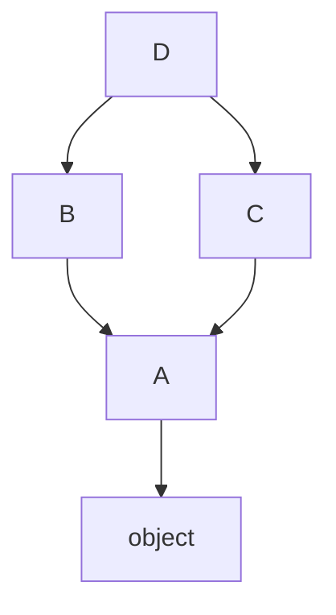
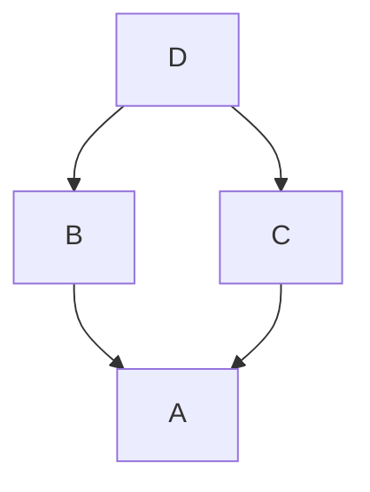
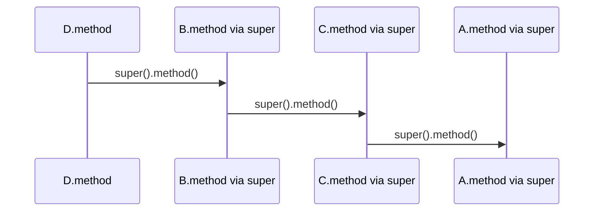

# Inheritance MRO and super

## Overview

**Inheritance** lets a class reuse and extend behavior from **base classes**. Python resolves attributes and methods using the **Method Resolution Order (MRO)**—a linearization of the inheritance DAG computed by the **C3 algorithm** (since Python 2.3). `cls.__mro__` or `cls.mro()` exposes that tuple.

**`super()`** returns a proxy that delegates attribute lookup to the **next class in the MRO** relative to a given class and instance (or class for classmethods). It is not merely "call parent"—it enables **cooperative multiple inheritance** where each mixin calls `super()` and the MRO chains implementations without hard-coded parent names.

Misunderstanding MRO/`super` breaks mixin stacks (Django CBVs, logging mixins, cooperative `__init__`).

## Learning Objectives

- Compute and read C3 MRO for diamond and mixin hierarchies
- Explain `super()` binding with `__class__` in methods and zero-arg form (3.0+)
- Design cooperative methods that accept `**kwargs` for extensibility
- Detect MRO failures (`TypeError: Cannot create a consistent method resolution order`)
- Relate MRO to attribute lookup in [[03-Python/03-Classes-Descriptors-and-Metaprogramming/Classes Instances and Attribute Lookup|Classes Instances and Attribute Lookup]]

## Prerequisites

- [[03-Python/03-Classes-Descriptors-and-Metaprogramming/Classes Instances and Attribute Lookup|Classes Instances and Attribute Lookup]]

## Difficulty

`advanced`

## Estimated Time

- Reading: 2–3 hours
- Exercises: 3 hours
- Mini project: 4 hours

## History

**C3 linearization** replaced old MRO for new-style classes. Python 3 **`super()`** without arguments uses `__class__` cell and first parameter (PEP 3135 / 3.0+ stackless form).

## Problem It Solves

MRO/`super` errors cause:

- Wrong method invoked in **diamond inheritance**
- **`super()` pointing to unexpected class** when called from classmethod vs instance method
- Mixins that **forget `super()`** and skip sibling implementations
- Hard-coded **`BaseClass.method(self)`** breaking when MRO changes

## Internal Implementation

### C3 linearization (intuition)

For class `C(B1, B2, ...)`:

1. Take head of first parent list + merge respecting tails
2. Preserve local precedence order of bases and monotonicity
3. Fail if inconsistent (no valid linearization)

```python
class A: pass
class B(A): pass
class C(A): pass
class D(B, C): pass

assert D.__mro__ == (D, B, C, A, object)
```



MRO list: `D, B, C, A, object` — **not** depth-first pre-order.

### super proxy mechanics

`super(D, self).method(*args)` searches `method` starting **after** `D` in `type(self).__mro__`.

Inside `D.method`:

```python
super().method(*args)  # equivalent to super(D, self).method(*args) in Py3
```

The proxy skips `D` and finds next provider—often `B`, not necessarily direct base named in source.

### Cooperative __init__

```python
class Base:
    def __init__(self, **kwargs):
        super().__init__(**kwargs)

class LoggingMixin:
    def __init__(self, *, log=None, **kwargs):
        self.log = log
        super().__init__(**kwargs)
```

Each layer strips its kwargs and forwards rest.

### CPython 3.14+ notes

- MRO computed at **class creation**; cached on type object
- **`__class_getitem__`** on generics does not alter MRO
- Metaclass conflicts still raise at class definition time

**Compatibility**: Old-style classes had different MRO—irrelevant in Python 3.

## Mermaid Diagrams

### Structure: diamond inheritance



### Sequence: super chain call



## Examples

### Minimal Example

```python
class Root:
    def ping(self) -> list[str]:
        return ["Root"]

class Left(Root):
    def ping(self) -> list[str]:
        return ["Left"] + super().ping()

class Right(Root):
    def ping(self) -> list[str]:
        return ["Right"] + super().ping()

class Diamond(Left, Right):
    pass

assert Diamond().ping() == ["Left", "Right", "Root"]
```

### Production-Shaped Example

HTTP middleware-style mixin stack:

```python
from __future__ import annotations

from typing import Any, Callable

Handler = Callable[[dict[str, Any]], dict[str, Any]]

class Middleware:
    def __init__(self, nxt: Handler | None = None) -> None:
        self._next = nxt

    def handle(self, ctx: dict[str, Any]) -> dict[str, Any]:
        if self._next:
            return self._next(ctx)
        return ctx

class Auth(Middleware):
    def handle(self, ctx: dict[str, Any]) -> dict[str, Any]:
        token = ctx.get("token")
        if not token:
            raise PermissionError("missing token")
        ctx["user"] = f"user-from-{token}"
        return super().handle(ctx)

class RateLimit(Middleware):
    def __init__(self, nxt: Handler | None = None, *, limit: int = 100) -> None:
        super().__init__(nxt)
        self.limit = limit

    def handle(self, ctx: dict[str, Any]) -> dict[str, Any]:
        ctx.setdefault("calls", 0)
        ctx["calls"] += 1
        if ctx["calls"] > self.limit:
            raise RuntimeError("rate limit")
        return super().handle(ctx)

def build_stack() -> Handler:
    base: Handler = lambda ctx: ctx
    return Auth(RateLimit(base, limit=5).handle).handle
```

Class-based MRO differs from this composition pattern—compare trade-offs in services.

Labs: [[03-Python/code/README|Python code labs]].

## Trade-offs

| Dimension | Upside | Downside | When it matters |
| --- | --- | --- | --- |
| Multiple inheritance | Mixins reuse | MRO mental load | Frameworks |
| super() cooperative | Extensible chains | Requires kwargs discipline | __init__ trees |
| Composition | Explicit wiring | More boilerplate | microservices |
| Single inheritance | Simple | Duplication | small apps |

### When to Use

- **Mixins** with cooperative `super()` for cross-cutting class features
- **`super()`** when MRO must decide next implementer
- **Composition** when inheritance graph would be ambiguous

### When Not to Use

- Do not inherit for **code reuse only**—prefer composition
- Do not call **`Parent.method(self)`** in deep hierarchies—breaks MRO
- Avoid multiple inheritance from **concrete** classes with conflicting state

## Exercises

1. Compute MRO by hand for `class E(C, D)` with given simple bases; verify with `E.mro()`.
2. Create inconsistent base order raising C3 `TypeError`.
3. Implement three mixins each adding field via cooperative `__init__`.
4. Show `super(Child, cls)` used in classmethod context.
5. Explain output of `class X(A, A): pass` — valid or not?

## Mini Project

**MRO Visualizer**

Given class names and bases as text, parse and print MRO using `type()` dynamic construction or graph algorithm implementation matching C3.

## Portfolio Project

Refactor [[03-Python/projects/Descriptor Validated Fields/README|Descriptor Validated Fields]] mixins to cooperative `super()` initialization.

## Interview Questions

1. What algorithm does Python use for MRO?
2. What does `super()` actually return and how does lookup proceed?
3. Diamond problem — which `A.method` runs in `class D(B,C)`?
4. Why cooperative `__init__` uses `**kwargs`?
5. Difference between `super().f()` and `Base.f(self)`?

### Stretch / Staff-Level

1. Prove C3 monotonicity property in plain language with example.
2. How do metaclasses interact with MRO when bases use different metaclasses?

## Common Mistakes

- **`Parent.method(self)`** bypassing MRO
- Mixins not calling **`super()`**
- **`super()` in staticmethod** without explicit two-arg form
- Multiple concrete bases with **same method names** without plan

## Best Practices

- Prefer **mixins** as abstract interfaces + cooperative methods
- Document **required super() calls** in mixin docstrings
- Keep **`__init__` kwargs** forwarding convention across hierarchy
- Favor **composition** for service wiring; inheritance for is-a relationships
- Print **`Class.mro()`** in tests when designing mixin stacks

## Summary

Python linearizes inheritance with C3 MRO, producing a predictable method search order. `super()` delegates to the next class in that order—not a syntactic parent reference—enabling cooperative multiple inheritance. Production designs choose composition when graphs grow complex, and use disciplined `super()` chains when mixins must stack cleanly.

## Further Reading

- [[03-Python/03-Classes-Descriptors-and-Metaprogramming/Metaclasses and Class Creation|Metaclasses and Class Creation]]
- [[03-Python/_exercises/README|Python Exercises]]

## Related Notes

- [[03-Python/03-Classes-Descriptors-and-Metaprogramming/Classes Instances and Attribute Lookup|Classes Instances and Attribute Lookup]]
- [[01-Computer-Science/08-Languages-and-Computation/Inheritance and Subtyping Models|Inheritance and Subtyping Models]]
- [[03-Python/code/README|Python code labs]]
- [[03-Python/README|Python Track]]

## Progress Checklist

- [ ] Explained from first principles
- [ ] Drew at least one Mermaid diagram
- [ ] Implemented a minimal version
- [ ] Documented trade-offs and non-goals
- [ ] Completed exercises
- [ ] Practiced interview questions aloud
- [ ] Linked prerequisites and dependents
