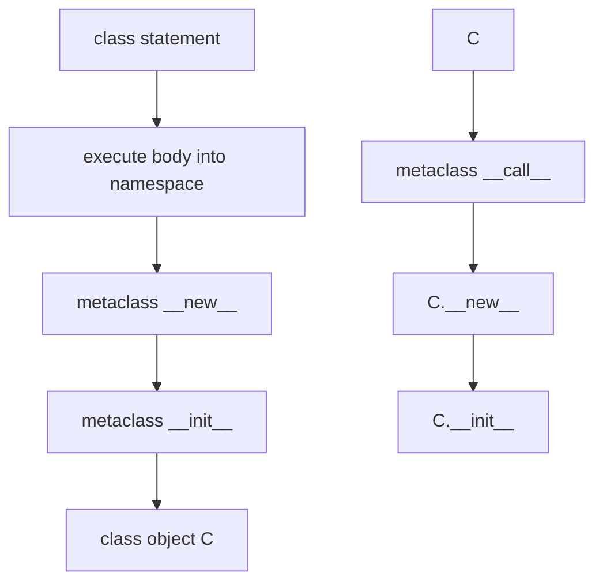
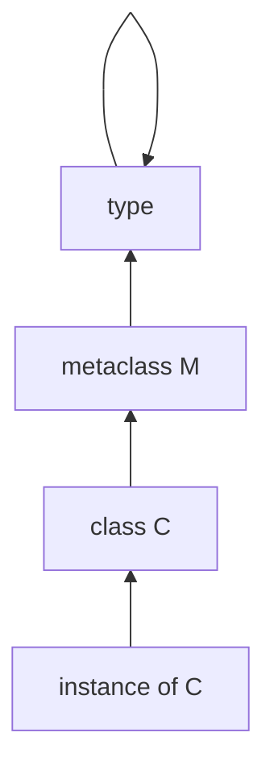
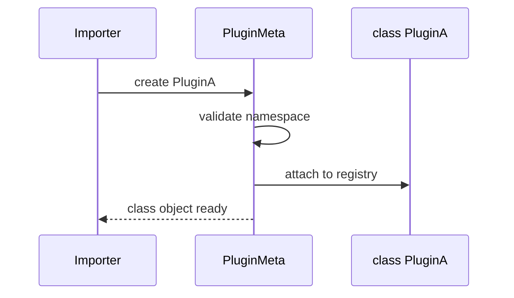

# Metaclasses and Class Creation

## Overview

In Python, **classes are objects**, and the **`type` of a class is its metaclass** (default `type`). Class creation is not magic syntax—it is a call to the metaclass with `(name, bases, namespace)` returning a class object. Metaclasses customize that call via **`__new__`** (build class object) and **`__init__`** (initialize class dict), and **`__call__`** (instance creation: `Cls()`).

**Metaclasses** power ORMs, enum generation, API registries, and interface enforcement. They run at **class definition time** (import), making them powerful and easy to abuse. Prefer **class decorators** or **`__init_subclass__`** when sufficient—metaclasses when you must intercept creation before the class object exists or coordinate multiple inheritance of metaclass itself.

## Learning Objectives

- Trace `class C:` to metaclass `__new__` / `__init__` / `__call__`
- Implement metaclass enforcing methods, attributes, or registration
- Choose among metaclass, class decorator, and `__init_subclass__`
- Resolve metaclass conflicts in multiple inheritance
- Connect metaclass namespace dict to descriptors and MRO finalization

## Prerequisites

- [[03-Python/03-Classes-Descriptors-and-Metaprogramming/Classes Instances and Attribute Lookup|Classes Instances and Attribute Lookup]]
- [[03-Python/03-Classes-Descriptors-and-Metaprogramming/Properties and the Descriptor Protocol|Properties and the Descriptor Protocol]]

## Difficulty

`expert`

## Estimated Time

- Reading: 3–4 hours
- Exercises: 4 hours
- Mini project: 6 hours

## History

**PEP 3115** (`class C(metaclass=M)`) replaced `__metaclass__` assignment in Python 3. **`abc.ABCMeta`** is a widely used metaclass. Frameworks (Django models, SQLAlchemy declarative) historically leaned on metaclasses; modern patterns often use **`__init_subclass__`** (PEP 487).

## Problem It Solves

Metaclasses address:

- **Auto-registration** of plugins at import time
- **Injecting methods** based on class body declarations
- **Preventing invalid class definitions** (missing abstract methods)
- **Customizing instance creation** (`__call__` singleton patterns—prefer explicit)

Misuse causes import-order cycles, opaque stack traces, and fights with static type checkers.

## Internal Implementation

### Class statement desugaring

```python
class C(A, metaclass=M):
    x = 1
    def f(self): pass
```

Roughly:

```python
namespace = {"x": 1, "f": <function>}
C = M("C", (A,), namespace)
```

Steps inside `type.__new__`:

1. Choose metaclass from explicit `metaclass=` or from bases
2. Prepare namespace (often plain dict; `type` uses dict)
3. Call `metaclass.__new__(metaclass, name, bases, namespace, **kwds)`
4. Call `metaclass.__init__(cls, name, bases, namespace, **kwds)`
5. Return class object `C`

Instance creation `C()` invokes `type.__call__` → `C.__new__` → `C.__init__`.



### __init_subclass__ alternative (PEP 487)

```python
class Base:
    def __init_subclass__(cls, **kwargs):
        super().__init_subclass__(**kwargs)
        cls.registry = getattr(cls, "registry", []) + [cls]
```

Runs when subclass is created—no custom metaclass required.

### CPython 3.14+ notes

- Metaclass **`__prepare__`** (PEP 3115) returns namespace mapping (often `dict`)
- Static analysis tools may not execute metaclass logic—document runtime requirements
- Free-threaded: class creation still under import lock; mutable class state after creation needs synchronization

**Compatibility**: Metaclass must subclass `type` (unless using non-standard C extensions).

## Mermaid Diagrams

### Structure: type hierarchy



### Sequence: registration metaclass



## Examples

### Minimal Example

```python
class Meta(type):
    def __new__(mcls, name, bases, namespace, **kwargs):
        namespace["greeting"] = f"Hello from {name}"
        return super().__new__(mcls, name, bases, namespace)

class A(metaclass=Meta):
    pass

assert A.greeting == "Hello from A"
```

### Production-Shaped Example

Interface enforcement with helpful errors:

```python
from __future__ import annotations

import abc
from typing import Any

class EnforceMethods(abc.ABCMeta):
    def __new__(mcls, name, bases, namespace, /, **kwargs: Any):
        cls = super().__new__(mcls, name, bases, namespace, **kwargs)
        if bases:  # skip during ABC setup edge cases
            required = getattr(cls, "_required_methods", ())
            for meth in required:
                if getattr(cls, meth, None) is None:
                    raise TypeError(f"{name} must define {meth}()")
        return cls

class ServiceBase(metaclass=EnforceMethods):
    _required_methods = ("execute",)

    def execute(self) -> None:
        raise NotImplementedError

class GoodService(ServiceBase):
    def execute(self) -> None:
        print("ok")

# class Bad(ServiceBase): pass  # TypeError at class creation
```

Registration via `__init_subclass__` (preferred when possible):

```python
class PluginBase:
    plugins: dict[str, type] = {}

    def __init_subclass__(cls, *, name: str | None = None, **kwargs):
        super().__init_subclass__(**kwargs)
        if name:
            PluginBase.plugins[name] = cls

class EmailPlugin(PluginBase, name="email"):
    pass
```

Labs: [[03-Python/code/README|Python code labs]].

## Trade-offs

| Dimension | Upside | Downside | When it matters |
| --- | --- | --- | --- |
| Metaclass | Deep control at class birth | Hard to debug | ORMs |
| Class decorator | Simpler mental model | Runs after class exists | dataclass-like |
| __init_subclass__ | Explicit hook | Less power | plugin registries |
| __call__ override | Custom instance creation | Conflicts with singleton antipatterns | factories |

### When to Use

- **Metaclass** when namespace must be transformed before class object exists
- **`__init_subclass__`** for registration and configuration kwargs
- **Class decorators** for post-processing (add methods, wrap)

### When Not to Use

- Do not use metaclass for **logging or trivial validation**—use linting
- Avoid metaclass ** solely for singletons**—use module-level instance
- Do not combine **multiple custom metaclasses** without C3-aware design

## Exercises

1. Implement metaclass rejecting method names not in `snake_case`.
2. Rewrite registration metaclass using `__init_subclass__` only.
3. Explain metaclass conflict when bases have different metaclasses.
4. Show `type("Dynamic", (object,), {"x": 1})` equivalent to class statement.
5. Trace `ABCMeta` preventing instantiation of incomplete subclass.

## Mini Project

**Declarative API Compiler**

Parse class body annotations into generated `__init__`, `to_dict`, and validation using metaclass or class decorator—compare both implementations.

## Portfolio Project

Extend [[03-Python/projects/Import Hook Plugin Loader/README|Import Hook Plugin Loader]] with metaclass or `__init_subclass__` registry validated at import.

## Interview Questions

1. What is a metaclass in Python?
2. Order of `__new__` and `__init__` for class vs instance?
3. Difference between metaclass and class decorator?
4. What is `__init_subclass__` and when prefer it?
5. What is `type` and its relation to classes?

### Stretch / Staff-Level

1. Explain `__prepare__` returning custom mapping (e.g., ordered attrs) in framework design.
2. How would you make metaclass-generated classes play nicely with mypy (hint: `__init_subclass__` + typed stubs)?

## Common Mistakes

- **Metaclass for everything**
- Modifying **`namespace` after class created** expecting retroactive effect
- Forgetting **`super()` in metaclass `__new__`** when extending `type`
- **Import cycles** from registry side effects at class definition

## Best Practices

- Prefer **`__init_subclass__`** until metaclass required
- Keep metaclass logic **idempotent** and **import-safe**
- Document **metaclass requirements** in public base classes
- Provide **clear TypeError messages** at class creation
- Test class creation failures with **`pytest.raises(TypeError)`** at import simulation

## Summary

Metaclasses are the classes of classes—they control how class objects are constructed from name, bases, and namespace. Instance creation goes through the same metaclass `__call__`. Production Python reaches for metaclasses sparingly, favoring `__init_subclass__` and class decorators unless namespace interception is essential—ORMs and ABC enforcement remain the canonical justified uses.

## Further Reading

- [[03-Python/03-Classes-Descriptors-and-Metaprogramming/ABCs Protocols and Runtime Structural Subtyping|ABCs Protocols and Runtime Structural Subtyping]]
- [[03-Python/_exercises/README|Python Exercises]]

## Related Notes

- [[03-Python/03-Classes-Descriptors-and-Metaprogramming/Inheritance MRO and super|Inheritance MRO and super]]
- [[03-Python/02-Execution-Namespaces-and-Functions/Decorators Internals|Decorators Internals]]
- [[01-Computer-Science/08-Languages-and-Computation/Reflection and Metaprogramming|Reflection and Metaprogramming]]
- [[03-Python/code/README|Python code labs]]
- [[03-Python/README|Python Track]]

## Progress Checklist

- [ ] Explained from first principles
- [ ] Drew at least one Mermaid diagram
- [ ] Implemented a minimal version
- [ ] Documented trade-offs and non-goals
- [ ] Completed exercises
- [ ] Practiced interview questions aloud
- [ ] Linked prerequisites and dependents
