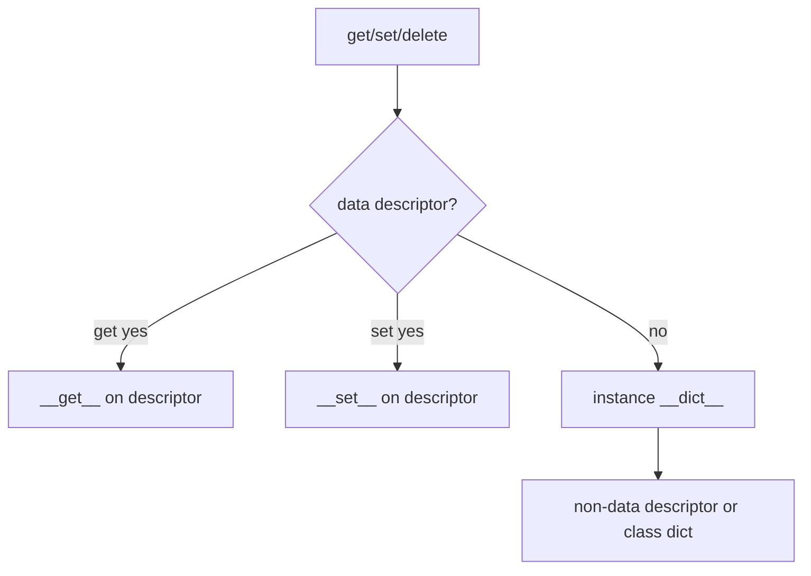
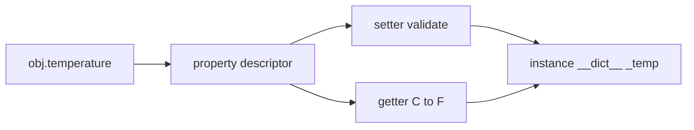
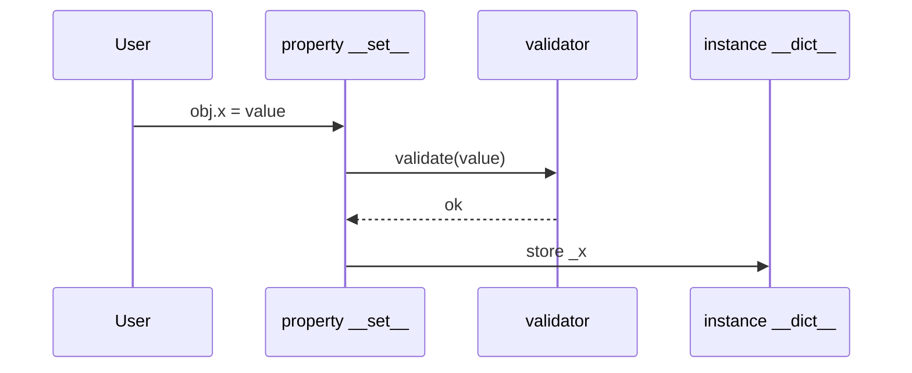

# Properties and the Descriptor Protocol

## Overview

The **descriptor protocol** defines how attribute access delegates to objects with **`__get__`**, **`__set__`**, and/or **`__delete__`**. A **data descriptor** defines any of `__set__` or `__delete__`; it **takes precedence** over instance `__dict__` entries. A **non-data descriptor** (typically methods, `staticmethod`, `classmethod`) yields to instance dict.

**`property`** is a built-in descriptor factory binding getter, setter, deleter, and docstring. Properties implement computed fields, validation, and lazy loading—the most common descriptor in application code. Frameworks (Django ORM fields, SQLAlchemy columns) extend the same protocol.

Understanding descriptors unifies methods, properties, slots, and super() behavior under one lookup rule.

## Learning Objectives

- Implement data and non-data descriptors from scratch
- Build validated fields with `property` and with custom descriptor classes
- Explain why methods bind via `__get__` on function objects
- Order descriptor precedence vs instance/class dict during lookup
- Design reusable field descriptors for libraries (default factories, validators)

## Prerequisites

- [[03-Python/03-Classes-Descriptors-and-Metaprogramming/Classes Instances and Attribute Lookup|Classes Instances and Attribute Lookup]]

## Difficulty

`advanced`

## Estimated Time

- Reading: 3 hours
- Exercises: 4 hours
- Mini project: 5 hours

## History

**PEP 252** descriptors for new-style classes. **`property`** upgraded in 2.2+ as descriptor. **`functools.cached_property`** (3.8) adds lazy non-data descriptor pattern.

## Problem It Solves

Descriptor ignorance causes:

- **Validation bypass** via direct `__dict__` assignment
- **Infinite recursion** in property getters calling themselves
- **Shared mutable** state on descriptor instances across classes
- ORM **stale value** when setting via SQL bypassing descriptor
- **`classmethod`/`staticmethod`** confusion vs instance methods

## Internal Implementation

### Descriptor methods

```python
class Desc:
    def __get__(self, obj, owner=None):
        ...
    def __set__(self, obj, value):
        ...
    def __delete__(self, obj):
        ...
```

- `obj is None` → access on **class** (`Cls.attr`)
- `owner` is the class (or subclass) defining the descriptor

### Lookup precedence (recap)

**Data descriptor on class** beats **instance dict**. Instance dict beats **non-data descriptor**.



### property internals (conceptual)

`property(fget, fset=None, fdel=None, doc=None)` stores callables; all three are descriptors methods delegating to stored functions.

### Function as non-data descriptor

`function.__get__(obj, cls)` returns bound method when `obj` is not None.

### CPython 3.14+ notes

- **`LOAD_ATTR`** specialization fast-paths common descriptor + slot combinations
- **`cached_property`** stores computed value in instance `__dict__`, becoming instance attr shadowing future access
- Free-threaded: descriptor `__set__` must be thread-safe if mutating shared class state (anti-pattern)

**Compatibility**: `property` setter optional; delete optional; without setter, assignment raises `AttributeError`.

## Mermaid Diagrams

### Structure: property stack



### Sequence: validated set



## Examples

### Minimal Example

```python
class Temperature:
    def __init__(self, celsius: float) -> None:
        self._celsius = celsius

    @property
    def celsius(self) -> float:
        return self._celsius

    @celsius.setter
    def celsius(self, value: float) -> None:
        if value < -273.15:
            raise ValueError("below absolute zero")
        self._celsius = value

    @property
    def fahrenheit(self) -> float:
        return self._celsius * 9 / 5 + 32
```

Custom descriptor:

```python
class PositiveFloat:
    def __set_name__(self, owner, name: str) -> None:
        self.name = name
        self.storage = f"_{name}"

    def __get__(self, obj, owner=None):
        if obj is None:
            return self
        return getattr(obj, self.storage)

    def __set__(self, obj, value: float) -> None:
        if value <= 0:
            raise ValueError(f"{self.name} must be positive")
        setattr(obj, self.storage, float(value))
```

### Production-Shaped Example

Typed validated field with default factory (descriptor class pattern):

```python
from __future__ import annotations

from typing import Callable, Generic, TypeVar

T = TypeVar("T")

class Field(Generic[T]):
    def __init__(
        self,
        *,
        default: T | None = None,
        factory: Callable[[], T] | None = None,
        validator: Callable[[T], None] | None = None,
    ) -> None:
        if default is not None and factory is not None:
            raise ValueError("specify default or factory, not both")
        self.default = default
        self.factory = factory
        self.validator = validator
        self.name: str = ""
        self.storage: str = ""

    def __set_name__(self, owner: type, name: str) -> None:
        self.name = name
        self.storage = f"_field_{name}"

    def __get__(self, obj, owner=None) -> T:
        if obj is None:
            return self  # type: ignore[return-value]
        if not hasattr(obj, self.storage):
            value = self.factory() if self.factory else self.default
            setattr(obj, self.storage, value)
        return getattr(obj, self.storage)

    def __set__(self, obj, value: T) -> None:
        if self.validator:
            self.validator(value)
        setattr(obj, self.storage, value)
```

See [[03-Python/projects/Descriptor Validated Fields/README|Descriptor Validated Fields]] and [[03-Python/code/README|Python code labs]].

## Trade-offs

| Dimension | Upside | Downside | When it matters |
| --- | --- | --- | --- |
| property | Simple validated attrs | Hard to reuse across classes | DTOs |
| Custom descriptor | Reusable field logic | Boilerplate | frameworks |
| Plain __dict__ | Fastest write | No validation | internal structs |
| cached_property | Lazy expensive compute | First access not thread-safe alone | read-heavy |

### When to Use

- **property** for one-off computed/validated attributes
- **Descriptor classes** for repeated field patterns
- **`__set_name__`** (3.6+) for auto wiring private storage names

### When Not to Use

- Do not descriptor-wrap **hot inner-loop** fields without measurement
- Avoid property **getter calling self.same_name** (recursion)
- Do not store **per-instance state on descriptor object**—use instance dict/slots

## Exercises

1. Implement read-only property without `@property` using descriptor class.
2. Show instance dict assignment bypassing property until you delete instance attr.
3. Write `LoggedAccess` descriptor counting gets/sets for testing.
4. Explain why methods are descriptors—trace `type(C.f.__get__)` .
5. Implement `cached_property` behavior manually with dict shadowing.

## Mini Project

**Validated Record Framework**

Build `@dataclass`-like decorator using descriptors + `__set_name__`, supporting validators and `repr`. Unit test bypass attempts via `__dict__`.

## Portfolio Project

Complete [[03-Python/projects/Descriptor Validated Fields/README|Descriptor Validated Fields]] with serialization and JSON schema export.

## Interview Questions

1. Data vs non-data descriptor—lookup precedence?
2. What arguments does `__get__(self, obj, owner)` receive for `Cls.attr` vs `obj.attr`?
3. How does `@property` implement validation on set?
4. Why must descriptor state for each instance live on instance, not descriptor?
5. Difference between `property` and `cached_property` storage?

### Stretch / Staff-Level

1. Design thread-safe lazy property for free-threaded CPython.
2. Compare descriptors to `__getattr__` for ORM field access—performance and semantics.

## Common Mistakes

- **Recursion** in property getter
- **Shared mutable** on descriptor instance (`self.value = []`)
- Bypass via **`obj.__dict__['x'] =`** in tests mirroring production bugs
- Forgetting **`__set_name__`** when descriptor name matters

## Best Practices

- Use **`__set_name__`** for storage key derivation
- Keep validators **pure** and fast; I/O in explicit methods
- Document **whether field is part of public API** vs internal storage `_x`
- Prefer **`dataclasses`** until validation requires descriptors
- Test **setattr**, descriptor set, and dict bypass paths

## Summary

Descriptors implement the `__get__`/`__set__`/`__delete__` protocol controlling attribute access. Data descriptors override instance dict; properties are the standard validated-field tool. Production libraries encapsulate field logic in reusable descriptor classes with per-instance storage on the object, not on the descriptor—matching how CPython binds methods and enforces invariants at scale.

## Further Reading

- [[03-Python/03-Classes-Descriptors-and-Metaprogramming/Dynamic Attributes getattr setattr and dict|Dynamic Attributes getattr setattr and dict]]
- [[03-Python/_exercises/README|Python Exercises]]

## Related Notes

- [[03-Python/03-Classes-Descriptors-and-Metaprogramming/Metaclasses and Class Creation|Metaclasses and Class Creation]]
- [[03-Python/02-Execution-Namespaces-and-Functions/Decorators Internals|Decorators Internals]]
- [[03-Python/code/README|Python code labs]]
- [[03-Python/README|Python Track]]

## Progress Checklist

- [ ] Explained from first principles
- [ ] Drew at least one Mermaid diagram
- [ ] Implemented a minimal version
- [ ] Documented trade-offs and non-goals
- [ ] Completed exercises
- [ ] Practiced interview questions aloud
- [ ] Linked prerequisites and dependents
