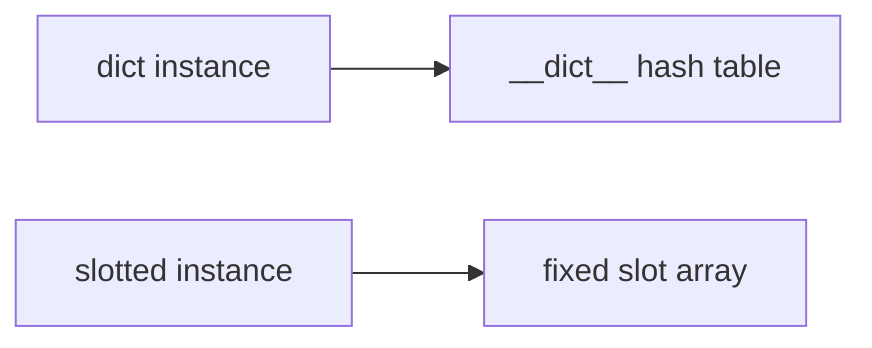
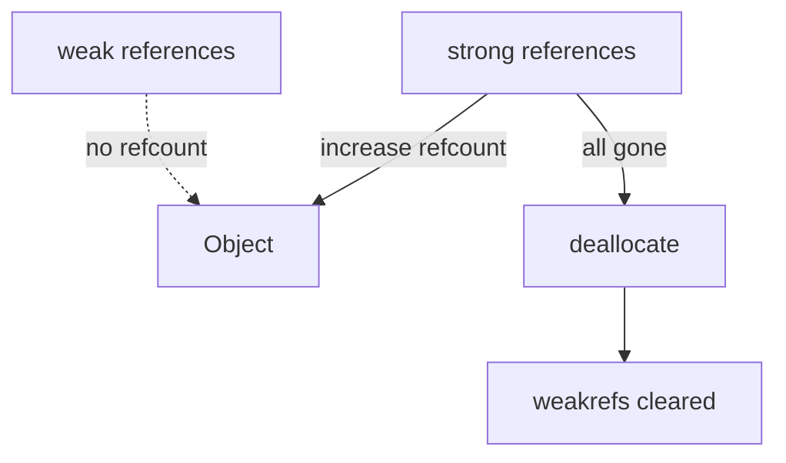
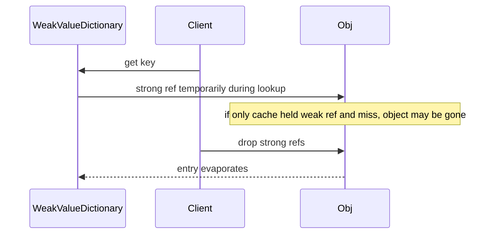

# Slots Weakrefs and Object Layout

## Overview

By default, instances store attributes in a **`__dict__`** (hash table). **`__slots__`** declares a fixed set of attribute names, allowing CPython to store values in a **compact array** (slot descriptors) instead of per-instance dict—reducing memory and improving cache locality at the cost of flexibility.

**Weak references** (`weakref` module) track objects without incrementing reference count, enabling **caches and observers** that do not prevent garbage collection. `weakref.ref(obj)` and `WeakValueDictionary` are common patterns; **`__weakref__` slot** is required for weakref support on slotted classes.

**Object layout** in CPython 3.14+ continues evolving (managed dict, inline values, immortal objects)—semantics remain: know when your instances are dict-backed vs slot-backed vs frozen.

## Learning Objectives

- Declare `__slots__` correctly including inheritance and `__weakref__`
- Estimate memory impact of dict vs slots for high-volume instances
- Use weak references and weak collections without resurrection bugs
- Explain interaction of slots with pickling, dataclasses, and multiple inheritance
- Connect layout to GC reachability in [[01-Computer-Science/03-Memory-and-Addressing/Garbage Collection Models|Garbage Collection Models]]

## Prerequisites

- [[03-Python/03-Classes-Descriptors-and-Metaprogramming/Classes Instances and Attribute Lookup|Classes Instances and Attribute Lookup]]
- [[03-Python/05-CPython-Runtime-and-Memory/Reference Counting and Immortal Objects|Reference Counting and Immortal Objects]]

## Difficulty

`advanced`

## Estimated Time

- Reading: 2–3 hours
- Exercises: 3 hours
- Mini project: 4 hours

## History

**PEP 252** introduced slots for new-style classes. **Weakrefs** added early 2.x. CPython 3.11+ **object optimizations** (PEP 699 adjacent work, managed dict) blur strict dict-always model—inspect with `sys.getsizeof` cautiously (includes allocator overhead estimates only).

## Problem It Solves

Without slots/weakrefs discipline:

- **Memory blow-up** with millions of small ORM/DTO objects each carrying dict
- **Caches** keeping dead objects alive → memory leaks
- **Weakref.ref** failing on slotted classes missing `__weakref__`
- **Pickle/copy** breaking on slot-only instances
- **Multiple inheritance** with conflicting slot layouts → TypeError

## Internal Implementation

### Default instance layout (conceptual)

```
PyObject head (refcount, type pointer)
  → __dict__ pointer (hash table of attr name → value)
  → (optional) weakref list head
```

### Slotted instance

`__slots__ = ("x", "y")` creates **member descriptors** on class; instance stores values in fixed C array—no `__dict__` unless `'__dict__'` listed in slots.



### Weak reference lifecycle

1. `weakref.ref(obj)` creates proxy with callback optional
2. Refcount of `obj` unchanged by weakref
3. When strong refs drop to zero, object deallocated; weakref **clears** (`()` returns `None`)
4. Callback runs—must not resurrect `obj` carelessly during GC

### CPython 3.14+ notes

- **Immortal objects** (some singletons) never deallocate—weakrefs rare on those
- **`sys.getsizeof`** on slotted instance smaller than dict instance in benchmarks
- Free-threaded builds: weakref callback timing differs—avoid heavy work in callback

**Compatibility**: `__dict__` in slots restores dynamic attrs; multiple inheritance: only one slotted base without dict may combine if layout compatible—read error messages carefully.

## Mermaid Diagrams

### Structure: strong vs weak refs



### Sequence: cache with WeakValueDictionary



## Examples

### Minimal Example

```python
import weakref

class Point:
    __slots__ = ("x", "y")

    def __init__(self, x: float, y: float) -> None:
        self.x = x
        self.y = y

p = Point(1.0, 2.0)
# p.z = 3  # AttributeError

class Node:
    __slots__ = ("value", "weakref")

    def __init__(self, value: int) -> None:
        self.value = value

n = Node(42)
r = weakref.ref(n)
assert r() is n
del n
assert r() is None
```

Fix weakref slot name: use **`'__weakref__'`** not `'weakref'`:

```python
class Node:
    __slots__ = ("value", "__weakref__")
```

### Production-Shaped Example

Bounded intern cache for immutable keys:

```python
import weakref
from typing import Generic, TypeVar

K = TypeVar("K")
V = TypeVar("V")

class WeakIdentityMap(Generic[K, V]):
    def __init__(self) -> None:
        self._store: weakref.WeakValueDictionary = weakref.WeakValueDictionary()

    def get_or_create(self, key: K, factory) -> V:
        obj = self._store.get(id(key))
        if obj is None:
            obj = factory(key)
            self._store[id(key)] = obj
        return obj
```

Slotted event record at scale:

```python
from dataclasses import dataclass

@dataclass(slots=True, frozen=True)
class Event:
    ts: float
    kind: str
    payload: bytes
```

See [[03-Python/code/README|Python code labs]] for sizeof benchmarks.

## Trade-offs

| Dimension | Upside | Downside | When it matters |
| --- | --- | --- | --- |
| __slots__ | Lower RAM, faster attr access | No arbitrary attrs | millions of rows |
| __dict__ | Dynamic fields | Higher overhead | user plugins |
| weakref cache | Auto eviction | Non-deterministic lifetime | intern pools |
| frozen slotted | Hashable safe | Update patterns need replace | dict keys |

### When to Use

- **`__slots__` / dataclass(slots=True)** for massive homogeneous records
- **WeakValueDictionary** for derived artifact caches
- **`__weakref__` slot** when observers needed on slotted types

### When Not to Use

- Do not slot **ORM models** needing arbitrary column lazy loads unless designed
- Do not weakref **singletons** you never want collected
- Do not rely on **`getsizeof`** alone for capacity planning

## Exercises

1. Compare `sys.getsizeof` dict vs slotted instance (same fields); document caveats.
2. Create slotted subclass of dict-backed parent—what breaks?
3. Implement observer list with weakrefs + callback cleanup.
4. Pickle slotted instance—what extra steps if custom?
5. Add `'__dict__'` to slots—measure memory halfway between?

## Mini Project

**Object Memory Benchmark**

Generate 1M instances: plain class, slotted, `dataclass(slots=True)`. Report RSS, creation time, attribute access loop time.

## Portfolio Project

Use slotted frozen events in [[03-Python/projects/Python Runtime Toolkit/README|Python Runtime Toolkit]] trace buffer with weakref index to parent spans.

## Interview Questions

1. What does `__slots__` do at CPython level?
2. Why might `weakref.ref(obj)` fail at creation?
3. Difference between WeakValueDictionary and LRU dict?
4. Can slotted class inherit from non-slotted and vice versa?
5. Does `__slots__` affect class attributes vs instance?

### Stretch / Staff-Level

1. Explain managed dict / inline values (3.11+) impact on "always use slots" advice.
2. Design cache that avoids thundering herd when weak entries expire simultaneously.

## Common Mistakes

- Forgetting **`__weakref__`** in slots
- Expecting **`__dict__`** on slotted instances without declaring it
- **Callbacks** in weakref holding strong ref to dying object graph
- **`__slots__` typo** silently creating class attr instead of slot (string must be iterable of names)

## Best Practices

- Use **`dataclass(slots=True)`** for structured records (3.10+)
- Document **fixed field set** in API when using slots
- Prefer **`WeakValueDictionary`** over manual id maps + periodic sweeps
- Keep **weakref callbacks** minimal and lock-free
- Test **pickle/copy/deepcopy** if objects cross process boundaries

## Summary

Instances normally store attributes in per-object dicts; `__slots__` fixes attribute names for compact layout. Weak references observe objects without keeping them alive—essential for caches and graphs. CPython 3.14+ memory optimizations change constants but not the trade-off: slots and weakrefs are production tools for scale and lifecycle control, not default micro-optimizations.

## Further Reading

- [[03-Python/05-CPython-Runtime-and-Memory/Memory Allocators Arenas and Tracing|Memory Allocators Arenas and Tracing]]
- [[03-Python/_exercises/README|Python Exercises]]

## Related Notes

- [[03-Python/03-Classes-Descriptors-and-Metaprogramming/Dataclasses and Data-Oriented Classes|Dataclasses and Data-Oriented Classes]]
- [[03-Python/03-Classes-Descriptors-and-Metaprogramming/Classes Instances and Attribute Lookup|Classes Instances and Attribute Lookup]]
- [[03-Python/code/README|Python code labs]]
- [[03-Python/README|Python Track]]

## Progress Checklist

- [ ] Explained from first principles
- [ ] Drew at least one Mermaid diagram
- [ ] Implemented a minimal version
- [ ] Documented trade-offs and non-goals
- [ ] Completed exercises
- [ ] Practiced interview questions aloud
- [ ] Linked prerequisites and dependents
