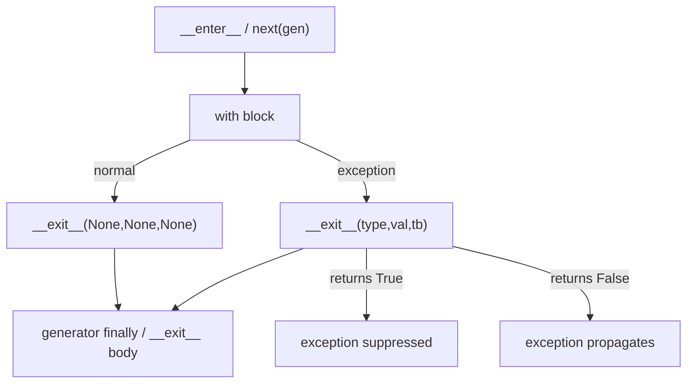
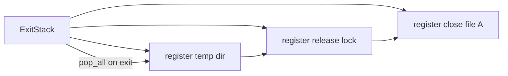
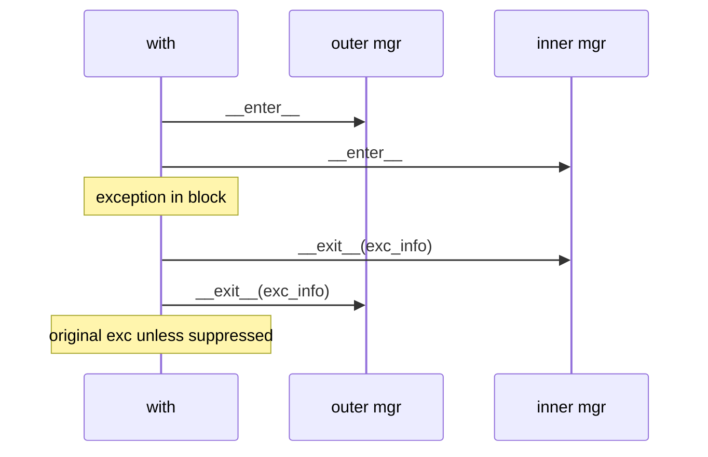

# Context Managers and contextlib

## Overview

The **`with` statement** binds setup and teardown to a lexical scope via the **context manager protocol**: `__enter__()` runs on entry; `__exit__(exc_type, exc_val, exc_tb)` runs on normal or exceptional exit. Returning true from `__exit__` suppresses the active exception. The standard library's **`contextlib`** supplies decorators (`@contextmanager`), utilities (`ExitStack`, `AsyncExitStack`), and helpers for re-entrant and async managers.

Context managers are Python's primary **RAII-like** pattern for files, locks, DB transactions, temporary directories, and request-scoped state—without relying on finalizers or `__del__`, which are unreliable under [[03-Python/05-CPython-Runtime-and-Memory/Reference Counting and Immortal Objects|reference counting]] and cycles.

## Learning Objectives

- Implement class-based and `@contextmanager` generators correctly
- Predict `__exit__` arguments and suppression semantics
- Compose dynamic stacks with `ExitStack` and `enter_context`
- Use async context managers (`async with`) and know sync/async boundaries
- Apply context managers to transactions, locks, and observability spans

## Prerequisites

- [[03-Python/04-Iteration-Exceptions-and-Context/Iterator Protocol|Iterator Protocol]]
- [[03-Python/02-Execution-Namespaces-and-Functions/Exceptions and Control Flow|Exceptions and Control Flow]]

## Difficulty

`intermediate`

## Estimated Time

- Reading: 90 minutes
- Exercises: 2–3 hours
- Mini project: 4 hours

## History

PEP 343 (2006) added the `with` statement, generalizing Java's try-with-resources and C++ RAII for Python's exception model. `contextlib` grew `contextmanager`, `closing`, `suppress`, `ExitStack` (3.3), and async variants (3.7+). Pattern is now ubiquitous in asyncio, unittest, and third-party ORMs.

## Problem It Solves

Resource leaks and inconsistent teardown when:

- Early `return`/`break`/`continue` skips manual `finally` blocks duplicated across call sites
- Exceptions during cleanup mask original errors without `__context__` discipline
- Dynamic numbers of resources (N files, M connections) need deterministic LIFO close order

Context managers centralize **acquire/use/release** and integrate with [[03-Python/04-Iteration-Exceptions-and-Context/Resource Cleanup and Cancellation Semantics|Resource Cleanup and Cancellation Semantics]].

## Internal Implementation

### Desugaring

```python
# with mgr as var:
#     body

# ≈
_mgr = mgr
_enter = type(_mgr).__enter__
_exit = type(_mgr).__exit__
_var = _enter(_mgr)
try:
    body
except:
    if not _exit(_mgr, *sys.exc_info()):
        raise
else:
    _exit(_mgr, None, None, None)
```

CPython emits `BEFORE_WITH`, `WITH_EXCEPT_START`, and cleanup blocks—see [[03-Python/05-CPython-Runtime-and-Memory/Bytecode and dis|Bytecode and dis]].

### `@contextmanager` mechanics

The decorator transforms a generator with a single `yield` into a manager:

1. `__enter__`: `next(gen)` runs to yield point; yielded value bound to `as` target
2. `__exit__`: `gen.throw` if exception else `gen.close()` / advancing to completion

The generator **must** yield exactly once (typically); cleanup code after `yield` runs on exit.



## Mermaid Diagrams

### Structure: ExitStack LIFO



### Sequence: nested with and exception



## Examples

### Minimal Example

```python
class Timer:
    def __enter__(self):
        self._start = time.perf_counter()
        return self

    def __exit__(self, exc_type, exc, tb):
        self.elapsed = time.perf_counter() - self._start
        return False  # do not suppress


with Timer() as t:
    work()
print(t.elapsed)
```

```python
from contextlib import contextmanager

@contextmanager
def temporary_env(**env):
    old = {k: os.environ.get(k) for k in env}
    os.environ.update(env)
    try:
        yield
    finally:
        for k, v in old.items():
            if v is None:
                os.environ.pop(k, None)
            else:
                os.environ[k] = v
```

### Production-Shaped Example

Database transaction with savepoint and structured logging:

```python
from __future__ import annotations

from contextlib import ExitStack, contextmanager
from dataclasses import dataclass
import logging

log = logging.getLogger(__name__)


@dataclass
class Connection:
    def begin(self) -> None: ...
    def commit(self) -> None: ...
    def rollback(self) -> None: ...
    def savepoint(self, name: str) -> "Savepoint": ...


@contextmanager
def transaction(conn: Connection, *, read_only: bool = False):
    conn.begin()
    try:
        yield conn
        if not read_only:
            conn.commit()
    except Exception:
        conn.rollback()
        log.exception("transaction rolled back")
        raise


def process_batch(conn: Connection, items: list[dict]) -> None:
    with ExitStack() as stack:
        stack.enter_context(transaction(conn))
        for i, item in enumerate(items):
            sp = conn.savepoint(f"item_{i}")
            stack.push(sp.release)  # callback on stack
            try:
                ingest(item)
            except RecoverableError:
                sp.rollback_to()
                log.warning("skipped item", extra={"index": i})
            else:
                sp.release()
```

Lab implementation: [[03-Python/code/README|Python code labs]] — `context` module.

## Trade-offs

| Dimension | Upside | Downside | When it matters |
| --- | --- | --- | --- |
| Class managers | Re-entrant, explicit state | Boilerplate | Locks, pools |
| @contextmanager | Concise | Generator overhead, single yield idiom | Config patches |
| ExitStack | Dynamic N resources | All-or-nothing exit ordering | Plugin pipelines |
| vs try/finally | Composable, readable | Hidden control flow | Library APIs |

### When to Use

- Any scoped resource: files, sockets, locks, transactions, timers, spans
- Temporary mutation of global/process state (env, cwd, logging level)
- `ExitStack` when resource count known only at runtime

### When Not to Use

- Long-lived resources spanning many unrelated call stacks (use explicit lifecycle service)
- Replacing domain error handling—managers tear down; they don't fix business logic
- Async code with blocking managers inside `async with` without `to_thread`

## Exercises

1. Write a re-entrant lock context manager; prove nested `with` works.
2. Implement `@contextmanager` that suppresses only `FileNotFoundError`.
3. Use `ExitStack` to open variable numbers of files from CLI args; verify close order on error.
4. Disassemble a `with open(...)` block; identify `WITH_EXCEPT_START`.
5. Extend code lab `context` with async manager support.

## Mini Project

**HTTP request scope manager.** Combines timeout context, auth token reset, and metrics timer in one composable `request_context()` using `ExitStack`, with tests for exception during body and suppression policy.

## Portfolio Project

Build [[03-Python/projects/Resource Pool and ExitStack/README|Resource Pool and ExitStack]] — pooled connections with LIFO release and leak detection in debug mode.

## Interview Questions

1. What arguments does `__exit__` receive on normal vs exceptional exit?
2. When should `__exit__` return `True`?
3. How does `@contextmanager` differ from a class-based manager?
4. What problem does `ExitStack` solve?
5. Difference between `contextlib.closing` and `@contextmanager` for iterators?

### Stretch / Staff-Level

1. Explain `WITH_EXCEPT_START` and exception context chaining in 3.14 bytecode.
2. Design a context manager safe under free-threaded CPython for a process-wide cache lock.

## Common Mistakes

- Multiple `yield` in one `@contextmanager` (RuntimeError)
- Swallowing exceptions accidentally by returning `True` from `__exit__`
- Using `with` on objects that aren't context managers (no static error)
- Forgetting that `__enter__` exceptions skip `__exit__`

## Best Practices

- Keep `__exit__` idempotent where possible
- Never block indefinitely in `__exit__` during cancellation—document timeouts
- Prefer `ExitStack` over deeply nested `with` when count is dynamic
- Log original exception before suppression if you must return `True`
- Link to [[03-Python/04-Iteration-Exceptions-and-Context/Context Variables|Context Variables]] for request-scoped data

## Summary

Context managers pair acquisition with guaranteed release through `__enter__`/`__exit__` or `@contextmanager` generators. `contextlib.ExitStack` composes dynamic cleanup chains. They are the idiomatic Python answer to scoped resources and integrate tightly with exceptions, generators, and async—master them before building production services or ORMs.

## Further Reading

- PEP 343 — The `with` Statement
- [[00-References/Python/README|Python References]] — contextlib
- [[03-Python/projects/Resource Pool and ExitStack/README|Resource Pool and ExitStack]]

## Related Notes

- [[03-Python/04-Iteration-Exceptions-and-Context/Resource Cleanup and Cancellation Semantics|Resource Cleanup and Cancellation Semantics]]
- [[03-Python/04-Iteration-Exceptions-and-Context/Context Variables|Context Variables]]
- [[03-Python/05-CPython-Runtime-and-Memory/Bytecode and dis|Bytecode and dis]]
- [[01-Computer-Science/03-Memory-and-Addressing/Resource Acquisition Is Initialization|Resource Acquisition Is Initialization]]
- [[03-Python/code/README|Python code labs]]

## Progress Checklist

- [ ] Explained from first principles
- [ ] Drew at least one Mermaid diagram
- [ ] Implemented a minimal version
- [ ] Documented trade-offs and non-goals
- [ ] Completed exercises
- [ ] Practiced interview questions aloud
- [ ] Linked prerequisites and dependents
