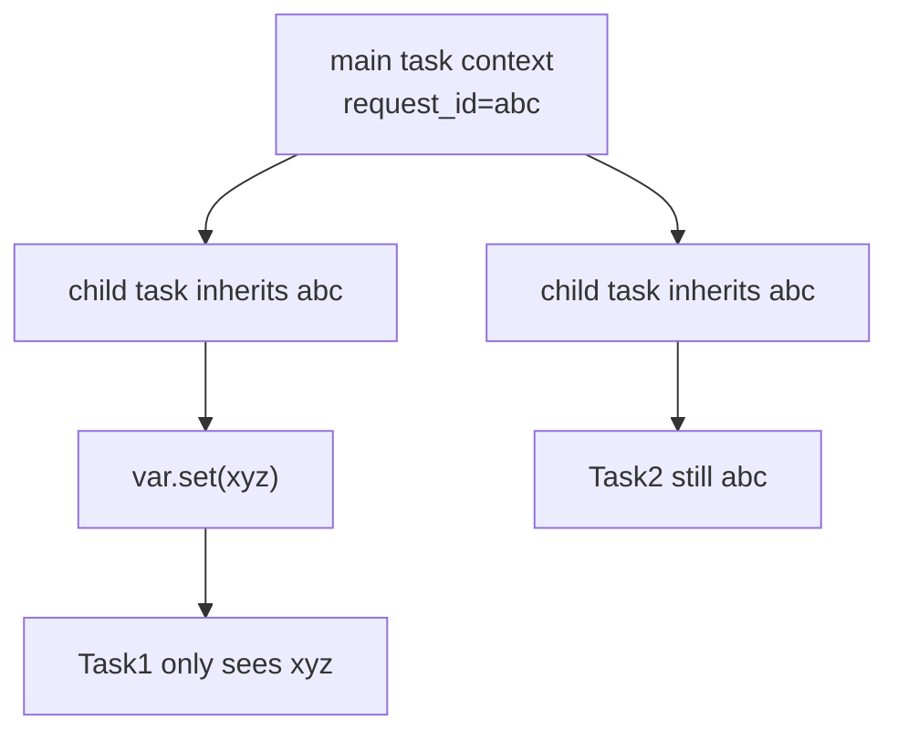
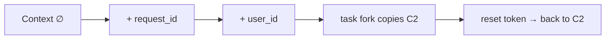
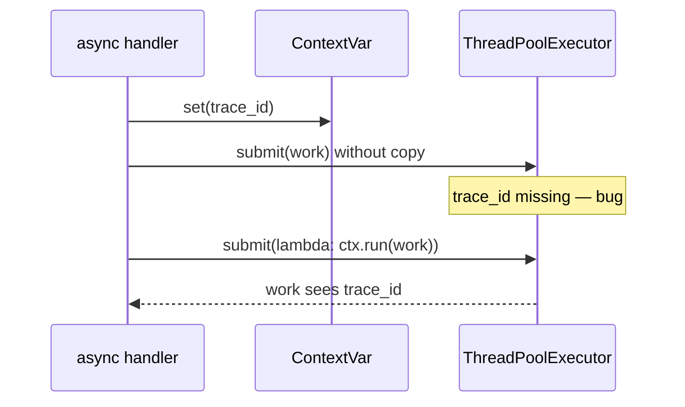

# Context Variables

## Overview

**Context variables** (`contextvars` module, Python 3.7+) provide **logical context**—key/value bindings that follow execution flow across `async` tasks, callbacks, and generators in a **single OS thread**, without thread-local globals leaking across concurrent tasks. Each `ContextVar` name holds a value in an immutable **context** object copied on `Context.run()` and updated via tokens on `set()`.

This is how asyncio propagates `current_task`, how frameworks store request IDs for structured logging, and how libraries avoid explicit parameter threading. CPython 3.14+ integrates context with the eval loop and free-threaded builds with additional synchronization—treat internals as version-specific.

## Learning Objectives

- Explain difference between `threading.local`, global state, and `ContextVar`
- Set, reset, and copy context with tokens and `copy_context()`
- Propagate context into executors and new tasks correctly
- Build request-scoped logging and authorization without parameter drilling
- Diagnose "lost trace ID" bugs from missing context copy in thread pools

## Prerequisites

- [[03-Python/04-Iteration-Exceptions-and-Context/Context Managers and contextlib|Context Managers and contextlib]]
- [[03-Python/07-Async-Concurrency-and-Free-Threading/asyncio Event Loop Internals|asyncio Event Loop Internals]]

## Difficulty

`advanced`

## Estimated Time

- Reading: 90 minutes
- Exercises: 2–3 hours
- Mini project: 3–4 hours

## History

PEP 567 introduced `contextvars` for asyncio and `decimal` context propagation. Before that, libraries abused `threading.local()`—correct for OS threads but wrong for cooperative multitasking where one thread hosts many tasks. PEP 550's ideas merged into 567. Modern observability stacks (OpenTelemetry) rely on context propagation patterns.

## Problem It Solves

In async servers, **thread-locals are insufficient**: thousands of tasks share one thread. Passing `request_id` through every function signature is brittle. Context variables give **implicit scoped state** with defined copy semantics at task boundaries—analogous to [[01-Computer-Science/05-Concurrency-Fundamentals/Asynchronous Event-Driven Models|Asynchronous Event-Driven Models]] continuation-local storage.

## Internal Implementation

### Core objects

| Object | Role |
| --- | --- |
| `ContextVar(name, default=...)` | Declares a named slot |
| `var.get()` / `var.set(value)` | Read/write in current context |
| `Token` | Opaque handle from `set`; pass to `var.reset(token)` |
| `Context` | Immutable mapping snapshot |
| `copy_context()` | Capture current context for propagation |

Setting a variable creates a **new context** linked to the previous (copy-on-write style at logical level). `Context.run(callable, *args)` runs callable with that context active.



### asyncio integration

`asyncio.create_task(coro, context=ctx)` (3.11+) accepts explicit context; default copies current context at task creation. Thread pool work **does not** auto-propagate—use `context.run` in worker wrapper.

### Free-threading note (3.13+)

Free-threaded CPython still uses contextvars but cross-thread sharing of Python objects requires different locking discipline. Prefer treating context as **thread+task scoped**; verify behavior on target build.

## Mermaid Diagrams

### Structure: context chain



### Sequence: thread pool propagation



## Examples

### Minimal Example

```python
from contextvars import ContextVar

request_id: ContextVar[str] = ContextVar("request_id", default="-")

def handle():
    token = request_id.set("req-42")
    try:
        log(f"handling {request_id.get()}")
        delegate()
    finally:
        request_id.reset(token)


def delegate():
    assert request_id.get() == "req-42"
```

### Production-Shaped Example

Structured logging filter with context propagation:

```python
from __future__ import annotations

import logging
from contextlib import contextmanager
from contextvars import ContextVar, copy_context
from concurrent.futures import ThreadPoolExecutor

trace_id: ContextVar[str] = ContextVar("trace_id")
user_id: ContextVar[str | None] = ContextVar("user_id", default=None)


class ContextFilter(logging.Filter):
    def filter(self, record: logging.LogRecord) -> bool:
        record.trace_id = trace_id.get("-")
        record.user_id = user_id.get() or "-"
        return True


@contextmanager
def request_context(*, trace: str, user: str | None):
    t1 = trace_id.set(trace)
    t2 = user_id.set(user) if user else None
    try:
        yield
    finally:
        trace_id.reset(t1)
        if t2 is not None:
            user_id.reset(t2)


def run_in_pool(fn, /, *args, executor: ThreadPoolExecutor):
    ctx = copy_context()
    return executor.submit(lambda: ctx.run(fn, *args))


# Formatter: "%(trace_id)s %(user_id)s %(message)s"
```

Lab: [[03-Python/code/README|Python code labs]] — `logging_ctx` module.

## Trade-offs

| Dimension | Upside | Downside | When it matters |
| --- | --- | --- | --- |
| Implicit propagation | Cleaner APIs | Hidden dependencies | Middleware stacks |
| vs explicit args | Less refactoring churn | Harder static analysis | Cross-cutting concerns |
| vs thread-local | asyncio-safe | Not cross-process | Web servers |
| Copy cost | Small immutable contexts | Misuse in hot loops | High QPS paths |

### When to Use

- Request/trace/auth IDs in async web services
- Decimal context, locale, timezone overrides
- Library defaults visible deep in call stack without globals

### When Not to Use

- Values that are true function inputs (keep explicit parameters)
- Cross-process propagation (use headers/message metadata)
- Replacing dependency injection containers for business services

## Exercises

1. Prove `threading.local()` fails with two asyncio tasks on one thread interleaving IDs.
2. Implement `@with_context(**vars)` decorator using `copy_context().run`.
3. Build logging filter; verify records include context across `await` boundaries.
4. Wrap `ThreadPoolExecutor.map` to propagate context into workers.
5. Extend `logging_ctx` lab with nested reset token tests.

## Mini Project

**Trace middleware for asyncio HTTP handler.** Assign UUID per connection; propagate through tasks and thread offload; assert all log lines share trace ID in integration test.

## Portfolio Project

Integrate contextvar logging into [[03-Python/projects/Python Runtime Toolkit/README|Python Runtime Toolkit]] with span start/end events.

## Interview Questions

1. Why doesn't `threading.local()` work for asyncio concurrency?
2. What does `copy_context()` return and when must you call it?
3. How do you reset a context variable without affecting sibling tasks?
4. Difference between `ContextVar` default and unset?
5. How does OpenTelemetry context relate to `contextvars`?

### Stretch / Staff-Level

1. Explain CPython `Context` C struct at high level and copy-on-write behavior.
2. Design context propagation across multiprocessing (spawn) boundaries.

## Common Mistakes

- Expecting thread pool workers to inherit asyncio context automatically
- Forgetting `reset(token)` in `finally`—leaks context to reused tasks
- Using contextvars for large mutable objects shared without copy discipline
- Global `set()` at import time polluting all subsequent tasks

## Best Practices

- Set context as high as possible (middleware) and reset in `finally`
- Use `@contextmanager` wrappers for paired set/reset
- Document ContextVars as part of public API for frameworks
- For thread offload: always `copy_context().run(...)`
- Combine with [[03-Python/04-Iteration-Exceptions-and-Context/Context Managers and contextlib|Context Managers]] for span scopes

## Summary

Context variables provide task-local storage in cooperative concurrency—correct replacement for thread-locals in asyncio. Tokens and immutable contexts make nested scopes predictable. Production observability depends on copying context into thread pools and new tasks explicitly; lost trace IDs are almost always missing `copy_context`.

## Further Reading

- PEP 567 — Context Variables
- [[03-Python/07-Async-Concurrency-and-Free-Threading/Tasks Futures and Awaitables|Tasks Futures and Awaitables]]
- [[03-Python/code/README|Python code labs]]

## Related Notes

- [[03-Python/04-Iteration-Exceptions-and-Context/Context Managers and contextlib|Context Managers and contextlib]]
- [[03-Python/07-Async-Concurrency-and-Free-Threading/asyncio Event Loop Internals|asyncio Event Loop Internals]]
- [[03-Python/09-Production-Python/Observability Logging Tracing and Metrics|Observability Logging Tracing and Metrics]]
- [[01-Computer-Science/05-Concurrency-Fundamentals/Asynchronous Event-Driven Models|Asynchronous Event-Driven Models]]
- [[03-Python/README|Python Track]]

## Progress Checklist

- [ ] Explained from first principles
- [ ] Drew at least one Mermaid diagram
- [ ] Implemented a minimal version
- [ ] Documented trade-offs and non-goals
- [ ] Completed exercises
- [ ] Practiced interview questions aloud
- [ ] Linked prerequisites and dependents
