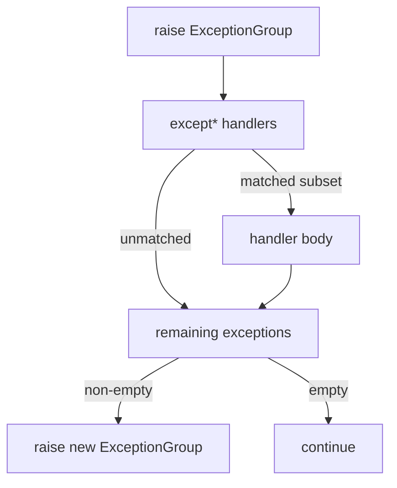
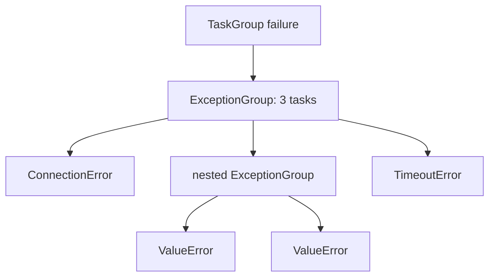
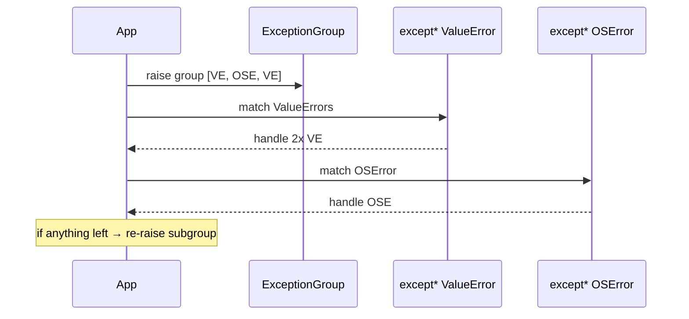

# Exception Hierarchy ExceptionGroup and except star

## Overview

Python's exception model is a **single inheritance tree** rooted at `BaseException`, with `Exception` as the catch-all for application errors. Python 3.11+ (PEP 654) adds **`ExceptionGroup`** and **`BaseExceptionGroup`** to represent **multiple concurrent failures** as one raised exception, matched by **`except*`** (except-star) clauses that partition sub-exceptions by type without silently dropping unhandled siblings.

This matters for asyncio `TaskGroup`, parallel cleanup, structured concurrency, and any "do many things; report all failures" API. CPython 3.14+ refines traceback display for nested groups; semantics are stable for library authors targeting 3.11+.

## Learning Objectives

- Navigate the `BaseException` hierarchy and know what bare `except` catches
- Construct, nest, and introspect `ExceptionGroup` instances
- Write `except*` handlers that partially handle grouped exceptions
- Explain difference between `except E`, `except (E,) as eg`, and `except* E`
- Integrate ExceptionGroup routing with cancellation and cleanup policies

## Prerequisites

- [[03-Python/02-Execution-Namespaces-and-Functions/Exceptions and Control Flow|Exceptions and Control Flow]]
- [[03-Python/04-Iteration-Exceptions-and-Context/Resource Cleanup and Cancellation Semantics|Resource Cleanup and Cancellation Semantics]]

## Difficulty

`advanced`

## Estimated Time

- Reading: 2 hours
- Exercises: 3 hours
- Mini project: 4 hours

## History

Before 3.11, libraries aggregated errors manually (`MultiError`, custom wrappers) or lost secondary failures. PEP 654 standardised exception groups for **structured concurrency** mirrors (Haskell, Erlang exit reasons). PEP 678 (`add_note`) and traceback improvements in 3.11–3.14 enhance observability alongside groups.

## Problem It Solves

Parallel task failure modes:

- First failure aborts others and hides root causes
- `raise A from B` chains only one active exception at a time
- `ExceptionGroup` preserves **all** failures with structured matching

Connect to [[01-Computer-Science/05-Concurrency-Fundamentals/Failure Modes in Concurrent Systems|Failure Modes in Concurrent Systems]]: fan-out work needs fan-in error reporting.

## Internal Implementation

### Hierarchy (simplified)

```
BaseException
├── SystemExit
├── KeyboardInterrupt
├── GeneratorExit
└── Exception
    ├── StopIteration, StopAsyncIteration
    ├── ExceptionGroup  (3.11+)
    └── ... ValueError, OSError, ...
BaseExceptionGroup (3.11+)
└── ExceptionGroup
```

**Rules**:

- `ExceptionGroup` wraps only `Exception` subclasses
- `BaseExceptionGroup` can wrap `BaseException` (rare in app code)
- Groups can nest when sub-tasks themselves fail multiply

### `except*` semantics

`except* Type` matches **zero or more** sub-exceptions of `Type`. If some siblings remain unhandled, a **new** `ExceptionGroup` of leftovers is raised after the handler runs. Unlike `except`, it can match **multiple** exceptions from one group.

```python
try:
    raise ExceptionGroup("batch", [ValueError("a"), TypeError("b"), ValueError("c")])
except* ValueError as eg:
    print("handled", len(eg.exceptions))  # 2
# TypeError re-raised as new ExceptionGroup unless caught
```



## Mermaid Diagrams

### Structure: group nesting



### Sequence: except-star partition



## Examples

### Minimal Example

```python
def fail_many():
    raise ExceptionGroup(
        "validation",
        [
            ValueError("bad id"),
            ValueError("bad name"),
            TypeError("wrong type"),
        ],
    )


try:
    fail_many()
except* ValueError as eg:
    for exc in eg.exceptions:
        log_validation(exc)
except* TypeError as eg:
    recover_type_errors(eg)
```

### Production-Shaped Example

Parallel file processor with structured error reporting:

```python
from __future__ import annotations

import concurrent.futures
from pathlib import Path


class ProcessingError(Exception):
    def __init__(self, path: Path, cause: Exception) -> None:
        super().__init__(f"{path}: {cause}")
        self.path = path
        self.cause = cause


def process_file(path: Path) -> int:
    data = path.read_text(encoding="utf-8")
    if not data.strip():
        raise ValueError("empty file")
    return len(data.splitlines())


def process_directory(dir_path: Path, *, workers: int = 8) -> dict[Path, int]:
    paths = list(dir_path.glob("*.txt"))
    errors: list[ProcessingError] = []
    results: dict[Path, int] = {}

    with concurrent.futures.ThreadPoolExecutor(max_workers=workers) as pool:
        future_map = {pool.submit(process_file, p): p for p in paths}
        for fut in concurrent.futures.as_completed(future_map):
            path = future_map[fut]
            try:
                results[path] = fut.result()
            except Exception as exc:
                errors.append(ProcessingError(path, exc))

    if errors:
        raise ExceptionGroup(
            f"failed {len(errors)} of {len(paths)} files",
            errors,
        )
    return results


try:
    process_directory(Path("./inbox"))
except* ProcessingError as eg:
    for exc in eg.exceptions:
        quarantine(exc.path)
    notify_ops(len(eg.exceptions))
```

Implement a router in [[03-Python/code/README|Python code labs]] (`exceptions` module).

## Trade-offs

| Dimension | Upside | Downside | When it matters |
| --- | --- | --- | --- |
| Structured reporting | No silent lost errors | Handler complexity | Batch jobs, TaskGroup |
| except* | Partial handling | New syntax/confusion | Library middleware |
| vs aggregate custom | Standard introspection | Migration cost | Public SDKs |
| Tracebacks | Rich nested display | Verbose logs | On-call triage |

### When to Use

- Parallel I/O or CPU tasks where **all** failures must surface
- asyncio `TaskGroup` / `ExceptionGroup` from 3.11+
- Batch validation collecting multiple field errors (domain `ExceptionGroup`)

### When Not to Use

- Single failure paths—plain `raise` stays simpler
- When callers cannot handle groups (wrap with compatibility shim for older clients)
- Catching `BaseException` groups in application code (almost never)

## Exercises

1. Raise a nested `ExceptionGroup` three levels deep; pretty-print with `traceback.format_exception`.
2. Write handlers where `except* A` and `except* B` both match overlapping groups; predict order effects.
3. Convert a loop that collects errors in a list to raising `ExceptionGroup` at end.
4. Build the `exceptions` lab router: given type tuple, partition group.
5. Explain why `except Exception as e` does **not** catch `ExceptionGroup` the same way as `except*`.

## Mini Project

**Batch importer CLI.** Process thousands of records; collect row-level failures; exit code 1 with serialized `ExceptionGroup` summary JSON for CI artifacts.

## Portfolio Project

Add **ExceptionGroup-aware logging** to [[03-Python/projects/Python Runtime Toolkit/README|Python Runtime Toolkit]] flattening groups for structured logs while preserving nesting in debug mode.

## Interview Questions

1. Difference between `Exception`, `BaseException`, and when to catch each?
2. What does `except* ValueError` do that `except ValueError` cannot?
3. Can `ExceptionGroup` contain nested groups? How does matching work?
4. How does asyncio `TaskGroup` use ExceptionGroup on failure?
5. What is `add_note()` (PEP 678) and how does it help operations?

### Stretch / Staff-Level

1. Design backward-compatible API returning either single exception or group for mixed Python versions.
2. Compare Python ExceptionGroup to Java's `SuppressedException` and Go multi-error patterns.

## Common Mistakes

- Using bare `except:` and catching `KeyboardInterrupt`
- Assuming `except Exception` handles all sub-exceptions in a group (it catches the **group object**, not auto-split)
- Losing context by wrapping group in a string-only `RuntimeError`
- Mixing `except` and `except*` in the same `try` (syntax error)

## Best Practices

- Catch narrow types with `except*`; re-raise remainder implicitly
- Attach notes: `exc.add_note("while closing shard 3")`
- Log `exceptiongroup.format_exception` output in structured fields
- Document whether APIs raise groups for 3.11+ consumers
- Pair with [[03-Python/07-Async-Concurrency-and-Free-Threading/Cancellation Timeouts and TaskGroup|Cancellation Timeouts and TaskGroup]]

## Summary

Python 3.11+ exception groups model multiple simultaneous failures as first-class values. `except*` partitions groups by type while preserving unhandled siblings—essential for structured concurrency and batch operations. Production code on 3.14+ should treat groups as normal control flow, not exotic edge cases.

## Further Reading

- PEP 654 — Exception Groups and `except*`
- PEP 678 — Enriching Exceptions
- [[03-Python/_interview/README|Python Interview Questions]]

## Related Notes

- [[03-Python/02-Execution-Namespaces-and-Functions/Exceptions and Control Flow|Exceptions and Control Flow]]
- [[03-Python/04-Iteration-Exceptions-and-Context/Resource Cleanup and Cancellation Semantics|Resource Cleanup and Cancellation Semantics]]
- [[03-Python/07-Async-Concurrency-and-Free-Threading/Cancellation Timeouts and TaskGroup|Cancellation Timeouts and TaskGroup]]
- [[01-Computer-Science/05-Concurrency-Fundamentals/Failure Modes in Concurrent Systems|Failure Modes in Concurrent Systems]]
- [[03-Python/code/README|Python code labs]]

## Progress Checklist

- [ ] Explained from first principles
- [ ] Drew at least one Mermaid diagram
- [ ] Implemented a minimal version
- [ ] Documented trade-offs and non-goals
- [ ] Completed exercises
- [ ] Practiced interview questions aloud
- [ ] Linked prerequisites and dependents
